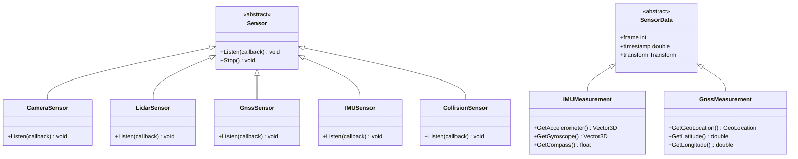

# 核心概念

> **引用文件**
> **本文档中引用的文件**

- [World.h](https://github.com/carla-simulator/carla/blob/ue5-dev/LibCarla/source/carla/client/World.h)
- [Map.h](https://github.com/carla-simulator/carla/blob/ue5-dev/LibCarla/source/carla/client/Map.h)
- [Actor.h](https://github.com/carla-simulator/carla/blob/ue5-dev/LibCarla/source/carla/client/Actor.h)
- [Vehicle.h](https://github.com/carla-simulator/carla/blob/ue5-dev/LibCarla/source/carla/client/Vehicle.h)
- [Walker.h](https://github.com/carla-simulator/carla/blob/ue5-dev/LibCarla/source/carla/client/Walker.h)
- [Sensor.h](https://github.com/carla-simulator/carla/blob/ue5-dev/LibCarla/source/carla/client/Sensor.h)
- [TrafficLight.h](https://github.com/carla-simulator/carla/blob/ue5-dev/LibCarla/source/carla/client/TrafficLight.h)
- [TrafficManager.h](https://github.com/carla-simulator/carla/blob/ue5-dev/LibCarla/source/carla/trafficmanager/TrafficManager.h)
- [Transform.h](https://github.com/carla-simulator/carla/blob/ue5-dev/LibCarla/source/carla/geom/Transform.h)
- [WorldSnapshot.h](https://github.com/carla-simulator/carla/blob/ue5-dev/LibCarla/source/carla/client/WorldSnapshot.h)
- [core_concepts.md](https://github.com/carla-simulator/carla/blob/ue5-dev/Docs/core_concepts.md)
- [core_world.md](https://github.com/carla-simulator/carla/blob/ue5-dev/Docs/core_world.md)
- [core_map.md](https://github.com/carla-simulator/carla/blob/ue5-dev/Docs/core_map.md)
- [core_sensors.md](https://github.com/carla-simulator/carla/blob/ue5-dev/Docs/core_sensors.md)
- [adv_synchrony_timestep.md](https://github.com/carla-simulator/carla/blob/ue5-dev/Docs/adv_synchrony_timestep.md)

## 目录

1. [引言](#引言)
2. [世界管理](#世界管理)
3. [地图系统](#地图系统)
4. [参与者（Actors）](#参与者actors)
5. [传感器系统](#传感器系统)
6. [交通管理](#交通管理)
7. [坐标变换与时间步进机制](#坐标变换与时间步进机制)
8. [实用示例](#实用示例)

## 引言

CARLA 是一个开源的自动驾驶仿真平台，为自动驾驶系统的研究和开发提供了高度逼真的虚拟环境。本文档旨在深入介绍 CARLA 的核心概念，重点阐述世界管理、地图系统、参与者（Actors）、传感器系统和交通管理等关键组件。这些概念共同构成了 CARLA 仿真环境的基础，理解它们对于有效使用 CARLA 至关重要。

CARLA 的架构围绕一个客户端-服务器模型构建。客户端（Client）是用户编写的脚本，用于连接到 CARLA 服务器，查询信息并控制仿真。服务器负责运行仿真，处理物理计算、渲染和 AI 逻辑。`World`对象是客户端与仿真环境交互的主要接口，它管理着所有参与者、地图、天气和仿真设置。`Map`对象则提供了对高精度城市道路网络的访问，支持路径规划和导航。`Actor`是仿真中所有实体的基类，包括车辆、行人、传感器和交通信号灯。`Sensor`作为`Actor`的子类，负责感知环境并生成数据。最后，`TrafficManager`模块负责管理所有自动驾驶车辆的行为，以模拟真实的城市交通流。

**Section sources**

- <a href="https://github.com/carla-simulator/carla/blob/ue5-dev/Docs/core_concepts.md#L1-L93" target="_blank">core_concepts.md</a>

## 世界管理

`World`类是 CARLA 仿真环境的核心管理器，它提供了对整个仿真状态的抽象访问。通过`World`实例，用户可以获取地图、生成参与者、修改天气、控制仿真时间步进，并获取世界快照。`World`对象由客户端通过`get_world()`或`load_world()`方法获取，它代表了当前正在运行的仿真实例。

`World`类提供了丰富的 API 来管理仿真环境。`GetMap()`方法返回当前地图的`Map`对象，这是访问道路网络和导航功能的入口。`SpawnActor()`方法是创建新参与者的唯一方式，它需要一个`ActorBlueprint`（定义了参与者的类型和属性）和一个`Transform`（定义了其初始位置和旋转）。`GetActors()`和`GetActor()`方法允许用户查询当前世界中的所有参与者或特定参与者。`SetWeather()`和`GetWeather()`方法用于控制和查询当前的天气状况，这对于测试传感器在不同光照和天气条件下的性能至关重要。

仿真时间的控制是`World`类的另一个关键功能。`WaitForTick()`方法会阻塞调用线程，直到收到下一个世界刻度（tick），这对于实现同步模式至关重要。`OnTick()`方法允许用户注册一个回调函数，该函数会在每次收到世界刻度时被调用，非常适合用于数据采集和实时监控。`Tick()`方法（在同步模式下）用于向服务器发送信号，指示客户端已准备好处理下一帧，从而推进仿真。`GetSnapshot()`方法返回一个`WorldSnapshot`对象，该对象包含了在某一特定帧中所有参与者的确切状态，这对于调试和精确回放仿真非常有用。

**Section sources**

- <a href="https://github.com/carla-simulator/carla/blob/ue5-dev/LibCarla/source/carla/client/World.h#L45-L239" target="_blank">World.h</a>
- <a href="https://github.com/carla-simulator/carla/blob/ue5-dev/Docs/core_world.md#L87-L258" target="_blank">core_world.md</a>

## 地图系统

`Map`类是 CARLA 中对高精度城市道路网络的表示。它基于 OpenDRIVE 1.4 标准构建，该标准是一种用于描述道路几何、车道、交通标志和信号的行业标准。`Map`对象不仅包含 3D 模型，更重要的是它包含了丰富的语义信息，使得自动驾驶车辆能够进行路径规划和导航。

`Map`的核心是`Waypoint`（路点）系统。一个`Waypoint`代表了道路上的一个 3D 有向点，对应于 OpenDRIVE 中的一个车道。`Waypoint`包含了其位置、方向、车道宽度、车道类型（如驾驶车道、人行道）以及车道变换权限等信息。通过`GetWaypoint()`方法，用户可以根据一个 3D 位置找到最近的路点。`GetTopology()`方法返回一个路点对的列表，描述了地图中所有车道的连接关系，这对于生成全局路径非常有用。`GenerateWaypoints()`方法可以生成一个覆盖整个地图的、间距均匀的路点网格，常用于可视化道路网络。

`Map`还管理着交通标志和信号。`Landmark`类代表了 OpenDRIVE 文件中定义的交通标志，如停车标志、限速标志等。用户可以通过`GetAllLandmarks()`或`GetLandmarksFromId()`等方法查询这些标志。`Map`与`World`协同工作，将这些`Landmark`转换为仿真中的`TrafficSign`或`TrafficLight`参与者。此外，`Map`提供了`GetRecommendedSpawnPoints()`方法，返回一组推荐的车辆生成点，这些点通常位于道路中心，避免了生成时的碰撞问题。


**Diagram sources **

- <a href="https://github.com/carla-simulator/carla/blob/ue5-dev/LibCarla/source/carla/client/Map.h#L27-L107" target="_blank">Map.h</a>
- <a href="https://github.com/carla-simulator/carla/blob/ue5-dev/Docs/core_map.md#L1-L206" target="_blank">core_map.md</a>

**Section sources**

- <a href="https://github.com/carla-simulator/carla/blob/ue5-dev/LibCarla/source/carla/client/Map.h#L27-L107" target="_blank">Map.h</a>
- <a href="https://github.com/carla-simulator/carla/blob/ue5-dev/Docs/core_map.md#L1-L206" target="_blank">core_map.md</a>

## 参与者（Actors）

`Actor`是 CARLA 中所有仿真实体的基类。任何在仿真中扮演角色的对象，如车辆、行人、传感器、交通灯或静态物体，都是`Actor`的实例。`Actor`类定义了所有参与者共有的属性和行为，如位置、旋转、速度、加速度以及基本的物理操作。

`Actor`的层次结构清晰地组织了不同类型的参与者。`Vehicle`和`Walker`是`Actor`的直接子类，分别代表车辆和行人。`Sensor`也是一个关键的子类，它本身是抽象的，其具体实现（如`CameraSensor`、`LidarSensor`）负责数据采集。`TrafficLight`和`TrafficSign`继承自`TrafficSign`基类，专门用于管理交通信号。

每个`Actor`都有一个`Transform`，它由`Location`（位置）和`Rotation`（旋转）组成，定义了其在世界坐标系中的姿态。`Actor`还提供了`SetTransform()`和`SetLocation()`等方法来直接改变其位置（即“传送”），以及`SetTargetVelocity()`和`AddForce()`等方法来施加物理影响。`Actor`的生命周期由`Destroy()`方法管理，该方法会通知服务器将其从仿真中移除。`Actor`的状态可以通过`GetActorState()`查询，以判断其是否存活。


**Diagram sources **

- <a href="https://github.com/carla-simulator/carla/blob/ue5-dev/LibCarla/source/carla/client/Actor.h#L18-L161" target="_blank">Actor.h</a>
- <a href="https://github.com/carla-simulator/carla/blob/ue5-dev/LibCarla/source/carla/client/Vehicle.h#L32-L153" target="_blank">Vehicle.h</a>
- <a href="https://github.com/carla-simulator/carla/blob/ue5-dev/LibCarla/source/carla/client/Walker.h#L17-L48" target="_blank">Walker.h</a>
- <a href="https://github.com/carla-simulator/carla/blob/ue5-dev/LibCarla/source/carla/client/Sensor.h#L17-L36" target="_blank">Sensor.h</a>
- <a href="https://github.com/carla-simulator/carla/blob/ue5-dev/LibCarla/source/carla/client/TrafficLight.h#L18-L82" target="_blank">TrafficLight.h</a>

**Section sources**

- <a href="https://github.com/carla-simulator/carla/blob/ue5-dev/LibCarla/source/carla/client/Actor.h#L18-L161" target="_blank">Actor.h</a>
- <a href="https://github.com/carla-simulator/carla/blob/ue5-dev/LibCarla/source/carla/client/Vehicle.h#L32-L153" target="_blank">Vehicle.h</a>
- <a href="https://github.com/carla-simulator/carla/blob/ue5-dev/LibCarla/source/carla/client/Walker.h#L17-L48" target="_blank">Walker.h</a>

## 传感器系统

`Sensor`是 CARLA 中数据采集的核心。作为`Actor`的子类，传感器可以被附加到车辆或其他参与者上，随其移动并感知周围环境。每种传感器类型都继承自`Sensor`基类，并实现了`Listen()`方法，该方法接受一个回调函数。当传感器捕获到新的数据时，它会将数据包作为参数调用这个回调函数。

CARLA 提供了多种传感器模型，涵盖了自动驾驶系统所需的主要感知模态。视觉传感器包括 RGB 相机、深度相机和语义分割相机，它们模拟了摄像头在不同光照和天气条件下的输出。激光雷达（Lidar）传感器通过发射激光束来生成点云数据，用于三维环境感知。雷达传感器则模拟了毫米波雷达，能够检测物体的距离和速度。此外，还有用于定位的 GNSS 传感器和 IMU 传感器，以及用于安全的碰撞检测器和车道入侵检测器。

传感器数据模型是统一的。每个数据包（如`IMUMeasurement`、`GnssMeasurement`）都包含一个时间戳（timestamp）、帧号（frame）和传感器自身的`Transform`。这使得用户可以精确地将来自不同传感器的数据进行时间对齐和空间配准。例如，`IMUMeasurement`包含加速度计、陀螺仪和磁力计的读数，而`GnssMeasurement`则包含经度、纬度和海拔信息。这种设计使得多传感器融合算法的开发和测试成为可能。



**Diagram sources **

- <a href="https://github.com/carla-simulator/carla/blob/ue5-dev/LibCarla/source/carla/client/Sensor.h#L17-L36" target="_blank">Sensor.h</a>
- <a href="https://github.com/carla-simulator/carla/blob/ue5-dev/LibCarla/source/carla/sensor/data/IMUMeasurement.h#L17-L52" target="_blank">IMUMeasurement.h</a>
- <a href="https://github.com/carla-simulator/carla/blob/ue5-dev/LibCarla/source/carla/sensor/data/GnssMeasurement.h#L18-L57" target="_blank">GnssMeasurement.h</a>
- <a href="https://github.com/carla-simulator/carla/blob/ue5-dev/Docs/core_sensors.md#L82-L95" target="_blank">core_sensors.md</a>

**Section sources**

- <a href="https://github.com/carla-simulator/carla/blob/ue5-dev/LibCarla/source/carla/client/Sensor.h#L17-L36" target="_blank">Sensor.h</a>
- <a href="https://github.com/carla-simulator/carla/blob/ue5-dev/LibCarla/source/carla/sensor/data/IMUMeasurement.h#L17-L52" target="_blank">IMUMeasurement.h</a>
- <a href="https://github.com/carla-simulator/carla/blob/ue5-dev/LibCarla/source/carla/sensor/data/GnssMeasurement.h#L18-L57" target="_blank">GnssMeasurement.h</a>

## 交通管理

`TrafficManager`模块负责管理所有设置为自动驾驶模式的车辆，使其行为符合真实的交通规则和驾驶习惯，从而在仿真中创造出逼真的城市交通流。它通过一个独立的服务器-客户端架构运行，与主 CARLA 服务器并行工作。

`TrafficManager`的核心功能是为自动驾驶车辆规划路径和控制行为。用户可以通过`RegisterVehicles()`将车辆注册到`TrafficManager`。注册后，`TrafficManager`会为车辆生成一条从起点到终点的路径，并根据交通规则（如红绿灯、停车标志、车道变换）和驾驶策略（如跟车距离、速度控制）来控制车辆的运动。`SetPercentageSpeedDifference()`和`SetDesiredSpeed()`等方法允许用户调整车辆的速度行为。

`TrafficManager`还提供了高级的交通控制功能。`SetCollisionDetection()`可以配置车辆之间是否会发生碰撞，这对于创建特定的测试场景非常有用。`SetPercentageRunningLight()`和`SetPercentageRunningSign()`可以模拟不遵守交通规则的“激进”驾驶行为。`SetSynchronousMode()`方法可以将`TrafficManager`置于同步模式，使其与主仿真步进同步，这对于确保行为的可重复性至关重要。`TrafficManager`还支持混合物理模式，即只对靠近主车辆的交通车辆进行精确的物理模拟，以优化性能。

**Section sources**

- <a href="https://github.com/carla-simulator/carla/blob/ue5-dev/LibCarla/source/carla/trafficmanager/TrafficManager.h#L26-L406" target="_blank">TrafficManager.h</a>
- <a href="https://github.com/carla-simulator/carla/blob/ue5-dev/Docs/core_concepts.md#L72-L72" target="_blank">core_concepts.md</a>

## 坐标变换与时间步进机制

CARLA 中的坐标变换和时间步进机制是确保仿真精确性和可重复性的基础。`Transform`类是坐标变换的核心，它封装了一个`Location`（三维坐标）和一个`Rotation`（欧拉角，以度为单位）。`Transform`类提供了`GetMatrix()`和`GetInverseMatrix()`方法，用于计算其 4x4 变换矩阵和逆矩阵，这对于将点从一个坐标系转换到另一个坐标系（例如，从世界坐标系转换到传感器坐标系）至关重要。`TransformPoint()`和`InverseTransformPoint()`方法可以直接对一个`Vector3D`应用变换。

时间步进机制决定了仿真的推进方式。CARLA 支持同步和异步两种模式。在异步模式下（默认），服务器以尽可能快的速度运行，仿真时间与真实时间大致同步。在同步模式下，服务器会等待客户端的明确指令（`Tick()`）才会推进到下一帧。这确保了客户端有足够的时间处理上一帧的数据，避免了数据丢失或积压，特别适用于处理来自多个传感器的大量数据。

`WorldSnapshot`是时间步进机制的关键。每次仿真推进一帧，服务器都会生成一个`WorldSnapshot`，其中包含了该帧所有参与者的确切状态（位置、速度等）和一个精确的`Timestamp`。`Timestamp`包含帧号、绝对时间戳和自上一帧以来经过的秒数（`delta_seconds`）。通过`WaitForTick()`或`OnTick()`，客户端可以获取这个快照，从而确保所有数据都来自同一时刻的仿真状态，这对于实现精确的传感器融合和算法测试至关重要。


**Diagram sources **

- <a href="https://github.com/carla-simulator/carla/blob/ue5-dev/LibCarla/source/carla/geom/Transform.h#L23-L168" target="_blank">Transform.h</a>
- <a href="https://github.com/carla-simulator/carla/blob/ue5-dev/LibCarla/source/carla/client/WorldSnapshot.h#L18-L77" target="_blank">WorldSnapshot.h</a>
- <a href="https://github.com/carla-simulator/carla/blob/ue5-dev/Docs/adv_synchrony_timestep.md#L139-L203" target="_blank">adv_synchrony_timestep.md</a>

**Section sources**

- <a href="https://github.com/carla-simulator/carla/blob/ue5-dev/LibCarla/source/carla/geom/Transform.h#L23-L168" target="_blank">Transform.h</a>
- <a href="https://github.com/carla-simulator/carla/blob/ue5-dev/LibCarla/source/carla/client/WorldSnapshot.h#L18-L77" target="_blank">WorldSnapshot.h</a>

## 实用示例

以下是一些基于 CARLA API 的实用代码示例，展示了如何应用上述核心概念。

**获取世界实例和加载地图**：这是与 CARLA 仿真交互的第一步。首先创建一个客户端，然后连接到服务器并获取世界对象。可以使用`get_available_maps()`列出所有可用地图，并使用`load_world()`加载指定的地图。

```python
client = carla.Client('localhost', 2000)
client.set_timeout(10.0)
world = client.get_world()
print(client.get_available_maps())
world = client.load_world('Town01')
```

**查询交通信号灯状态**：要获取特定交通灯的状态，首先需要获取世界中的所有交通灯，然后遍历它们以找到目标灯。`TrafficLight`对象的`GetState()`方法返回其当前状态（红、黄、绿等）。

```python
traffic_lights = world.get_actors().filter('traffic.traffic_light*')
for light in traffic_lights:
    if light.id == target_light_id:
        current_state = light.get_state()
        print(f"交通灯 {light.id} 状态: {current_state}")
        break
```

**使用同步模式**：为了确保传感器数据的同步，应启用同步模式。这需要将世界设置为同步模式，为每个传感器设置一个队列来存储数据，然后在主循环中调用`world.tick()`来推进仿真，并从队列中获取对应的数据。

```python
settings = world.get_settings()
settings.synchronous_mode = True
world.apply_settings(settings)

camera.listen(image_queue.put)
lidar.listen(lidar_queue.put)

for frame in range(num_frames):
    world.tick()
    image = image_queue.get()
    lidar_data = lidar_queue.get()
    # 在同一仿真时刻处理图像和激光雷达数据
```

**Section sources**

- <a href="https://github.com/carla-simulator/carla/blob/ue5-dev/Docs/core_world.md#L54-L62" target="_blank">core_world.md</a>
- <a href="https://github.com/carla-simulator/carla/blob/ue5-dev/Docs/core_world.md#L167-L168" target="_blank">core_world.md</a>
- <a href="https://github.com/carla-simulator/carla/blob/ue5-dev/Docs/adv_synchrony_timestep.md#L146-L157" target="_blank">adv_synchrony_timestep.md</a>
