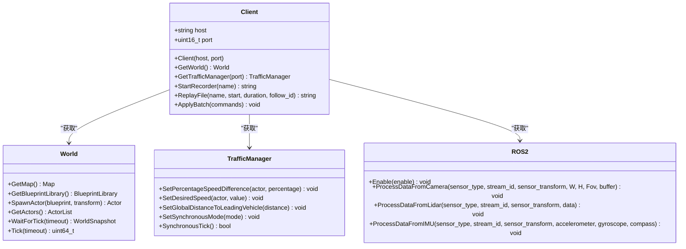
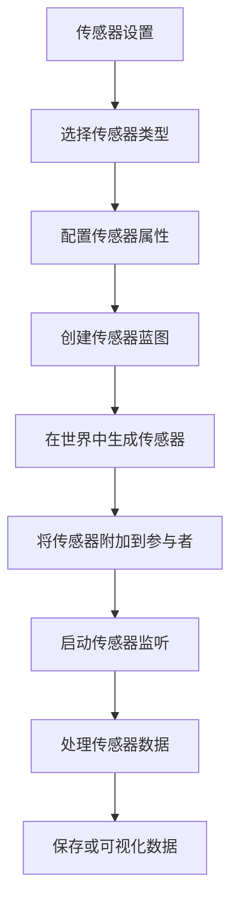
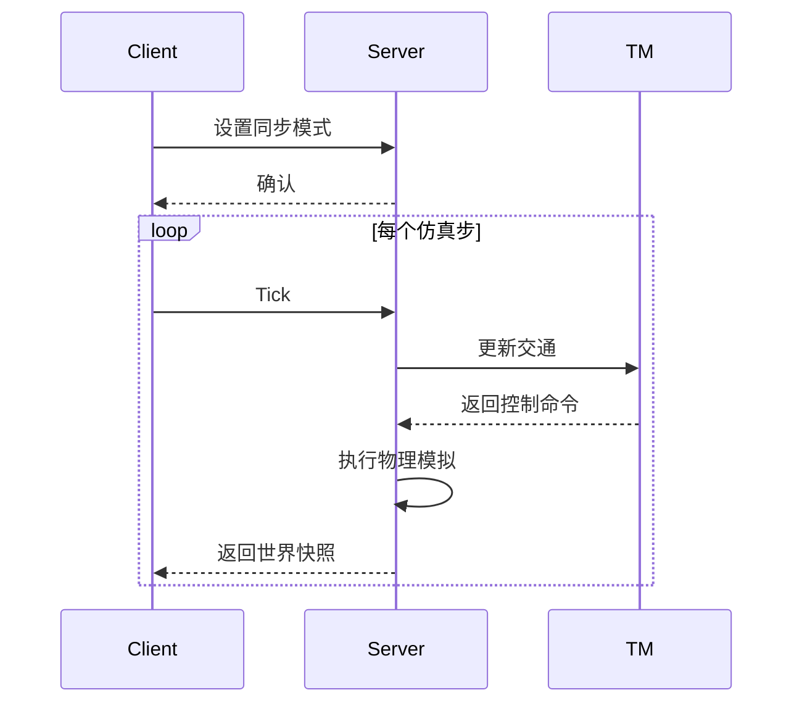
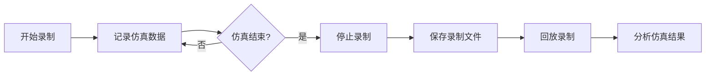
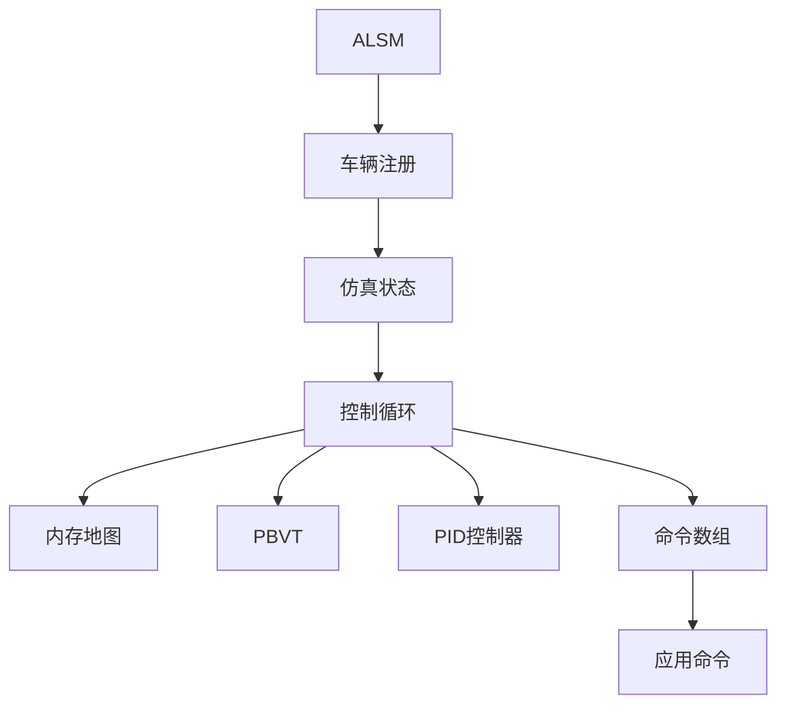

# 项目概述


**本文档引用的文件**  
- [README.md](https://github.com/carla-simulator/carla/blob/ue5-dev/README.md)
- [index.md](https://github.com/carla-simulator/carla/blob/ue5-dev/Docs/index.md)
- [start_introduction.md](https://github.com/carla-simulator/carla/blob/ue5-dev/Docs/start_introduction.md)
- [Client.h](https://github.com/carla-simulator/carla/blob/ue5-dev/LibCarla/source/carla/client/Client.h)
- [World.h](https://github.com/carla-simulator/carla/blob/ue5-dev/LibCarla/source/carla/client/World.h)
- [TrafficManager.h](https://github.com/carla-simulator/carla/blob/ue5-dev/LibCarla/source/carla/trafficmanager/TrafficManager.h)
- [ROS2.h](https://github.com/carla-simulator/carla/blob/ue5-dev/LibCarla/source/carla/ros2/ROS2.h)
- [adv_recorder.md](https://github.com/carla-simulator/carla/blob/ue5-dev/Docs/adv_recorder.md)
- [adv_traffic_manager.md](https://github.com/carla-simulator/carla/blob/ue5-dev/Docs/adv_traffic_manager.md)
- [python_api.md](https://github.com/carla-simulator/carla/blob/ue5-dev/Docs/python_api.md)
- [core_sensors.md](https://github.com/carla-simulator/carla/blob/ue5-dev/Docs/core_sensors.md)


## 目录
1. [引言](#引言)
2. [核心架构](#核心架构)
3. [主要组件](#主要组件)
4. [系统功能](#系统功能)
5. [使用场景](#使用场景)
6. [技术细节](#技术细节)
7. [结论](#结论)

## 引言

CARLA是一个开源的自动驾驶仿真平台，专为自动驾驶研究而设计。该平台基于Unreal Engine 5.5构建，提供高保真的城市环境模拟，支持灵活的传感器配置和环境条件设置。CARLA的核心目标是为自动驾驶系统的开发、训练和验证提供一个开放、可定制的工具。

CARLA采用客户端-服务器架构，服务器负责处理仿真本身的所有计算，包括物理计算、传感器渲染和世界状态更新。客户端则通过Python或C++ API控制仿真中的参与者（actors）和环境状态。这种架构使得CARLA能够支持大规模的分布式仿真和测试。

CARLA不仅提供了一个强大的仿真引擎，还构建了一个围绕主平台的生态系统，包括场景生成、交通模拟、ROS2集成等工具。这些工具共同构成了一个完整的自动驾驶研发环境。

**Section sources**
- [README.md](https://github.com/carla-simulator/carla/blob/ue5-dev/README.md#L1-L215)
- [start_introduction.md](https://github.com/carla-simulator/carla/blob/ue5-dev/Docs/start_introduction.md#L1-L49)

## 核心架构

CARLA的架构基于客户端-服务器模型，其中服务器运行在Unreal Engine 5.5之上，负责所有仿真相关的计算。客户端通过API与服务器通信，控制仿真过程。这种分离的设计允许客户端在不同的机器上运行，而服务器则可以在高性能GPU上运行以处理复杂的图形和物理计算。

```mermaid
graph TB
subgraph "服务器端"
UE[Unreal Engine 5.5]
Sim[仿真核心]
Physics[物理引擎]
Rendering[渲染系统]
end
subgraph "客户端"
PythonAPI[Python API]
CppAPI[C++ API]
ROS2[ROS2接口]
end
Client[客户端应用] --> PythonAPI
PythonAPI --> LibCarla[LibCarla通信库]
LibCarla < --> Server[CARLA服务器]
Server --> UE
UE --> Physics
UE --> Rendering
Sim --> Physics
Sim --> Rendering
```

**Diagram sources**
- [start_introduction.md](https://github.com/carla-simulator/carla/blob/ue5-dev/Docs/start_introduction.md#L14-L18)
- [Client.h](https://github.com/carla-simulator/carla/blob/ue5-dev/LibCarla/source/carla/client/Client.h#L20-L193)

**Section sources**
- [start_introduction.md](https://github.com/carla-simulator/carla/blob/ue5-dev/Docs/start_introduction.md#L12-L18)
- [Client.h](https://github.com/carla-simulator/carla/blob/ue5-dev/LibCarla/source/carla/client/Client.h#L1-L193)

## 主要组件

### LibCarla通信库

LibCarla是CARLA的核心通信库，它实现了客户端与服务器之间的RPC通信。该库提供了C++和Python接口，封装了底层的网络通信细节，使开发者能够专注于仿真逻辑的实现。



**Diagram sources**
- [Client.h](https://github.com/carla-simulator/carla/blob/ue5-dev/LibCarla/source/carla/client/Client.h#L20-L193)
- [World.h](https://github.com/carla-simulator/carla/blob/ue5-dev/LibCarla/source/carla/client/World.h#L45-L243)
- [TrafficManager.h](https://github.com/carla-simulator/carla/blob/ue5-dev/LibCarla/source/carla/trafficmanager/TrafficManager.h#L26-L407)
- [ROS2.h](https://github.com/carla-simulator/carla/blob/ue5-dev/LibCarla/source/carla/ros2/ROS2.h#L47-L177)

**Section sources**
- [Client.h](https://github.com/carla-simulator/carla/blob/ue5-dev/LibCarla/source/carla/client/Client.h#L1-L193)
- [World.h](https://github.com/carla-simulator/carla/blob/ue5-dev/LibCarla/source/carla/client/World.h#L1-L243)
- [TrafficManager.h](https://github.com/carla-simulator/carla/blob/ue5-dev/LibCarla/source/carla/trafficmanager/TrafficManager.h#L1-L407)
- [ROS2.h](https://github.com/carla-simulator/carla/blob/ue5-dev/LibCarla/source/carla/ros2/ROS2.h#L1-L177)

### Python/C++ API接口

CARLA提供了Python和C++两种API接口，使开发者能够以编程方式控制仿真。Python API特别适合快速原型开发和机器学习应用，而C++ API则提供了更高的性能和更直接的底层访问。

API的主要功能包括：
- 连接到CARLA服务器
- 加载和切换地图
- 生成和控制参与者（车辆、行人等）
- 配置和使用传感器
- 控制交通管理器
- 录制和回放仿真

### ROS2集成模块

CARLA原生支持ROS2，这使得它能够无缝集成到基于ROS2的自动驾驶系统中。ROS2模块负责将CARLA的传感器数据转换为ROS2消息，并将控制命令从ROS2节点传递到CARLA中的车辆。

### Unreal引擎仿真环境

CARLA的仿真环境基于Unreal Engine 5.5构建，利用其先进的图形渲染能力提供高保真的视觉效果。Unreal Engine负责处理所有的3D渲染、物理模拟和场景管理。

## 系统功能

### 多传感器系统

CARLA支持多种类型的传感器，包括摄像头、激光雷达、雷达、IMU、GNSS等。每种传感器都可以配置不同的参数，如分辨率、视场角、更新频率等。



**Diagram sources**
- [core_sensors.md](https://github.com/carla-simulator/carla/blob/ue5-dev/Docs/core_sensors.md#L19-L102)

**Section sources**
- [core_sensors.md](https://github.com/carla-simulator/carla/blob/ue5-dev/Docs/core_sensors.md#L1-L198)

### 动态交通参与者模拟

CARLA的交通管理器（Traffic Manager）能够控制大量自动驾驶车辆，创建逼真的城市交通环境。交通管理器可以配置各种行为参数，如速度、车距、车道变换等。

### 同步/异步模式

CARLA支持同步和异步两种仿真模式。在同步模式下，仿真步进由客户端控制，确保了仿真的确定性和可重复性。在异步模式下，仿真以最大速度运行，适合性能测试。



**Diagram sources**
- [adv_traffic_manager.md](https://github.com/carla-simulator/carla/blob/ue5-dev/Docs/adv_traffic_manager.md#L492-L518)

### 录制回放功能

CARLA的录制功能可以记录整个仿真过程，包括所有参与者的状态、传感器数据和事件。录制的文件可以用于回放、分析和调试。



**Diagram sources**
- [adv_recorder.md](https://github.com/carla-simulator/carla/blob/ue5-dev/Docs/adv_recorder.md#L1-L318)

**Section sources**
- [adv_recorder.md](https://github.com/carla-simulator/carla/blob/ue5-dev/Docs/adv_recorder.md#L1-L318)

### 交通管理器

交通管理器是CARLA的核心组件之一，负责管理仿真中的交通流。它实现了多个控制阶段，包括定位、碰撞检测、交通灯处理、运动规划等。



**Diagram sources**
- [adv_traffic_manager.md](https://github.com/carla-simulator/carla/blob/ue5-dev/Docs/adv_traffic_manager.md#L48-L58)

**Section sources**
- [adv_traffic_manager.md](https://github.com/carla-simulator/carla/blob/ue5-dev/Docs/adv_traffic_manager.md#L1-L548)

## 使用场景

### 感知算法训练

CARLA可以生成大量带标注的传感器数据，用于训练感知算法。通过配置不同的传感器和环境条件，可以创建多样化的训练数据集。

### 决策规划验证

在CARLA中可以测试和验证自动驾驶的决策规划算法。通过创建复杂的交通场景，可以评估算法在各种情况下的表现。

### 传感器仿真测试

CARLA的高保真传感器模型可以用于测试传感器融合算法和感知系统。通过调整传感器参数，可以模拟不同类型的传感器和故障情况。

## 技术细节

### 客户端-服务器通信

CARLA使用高效的RPC机制进行客户端-服务器通信。LibCarla库处理所有的网络通信，提供简洁的API接口。

### 数据流管理

CARLA通过流式传输机制高效地传输传感器数据。不同类型的数据使用不同的传输通道，确保实时性和可靠性。

### 性能优化

CARLA实现了多种性能优化技术，包括混合物理模式、异步传感器处理和批处理命令。

## 结论

CARLA作为一个开源的自动驾驶仿真平台，提供了完整的工具链和生态系统。其基于Unreal Engine 5.5的高保真仿真能力，结合灵活的API和丰富的功能，使其成为自动驾驶研究的理想选择。通过本文档的介绍，开发者可以快速了解CARLA的核心功能和架构，开始使用该平台进行自动驾驶系统的开发和测试。