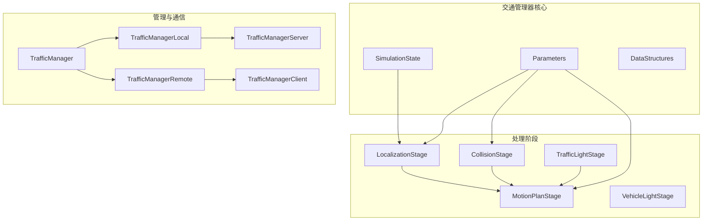
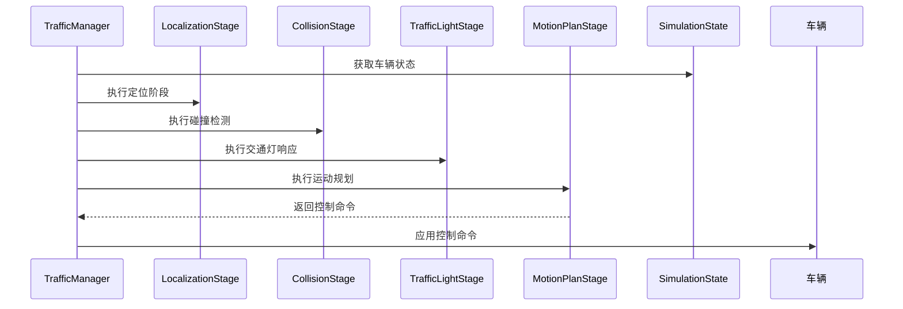
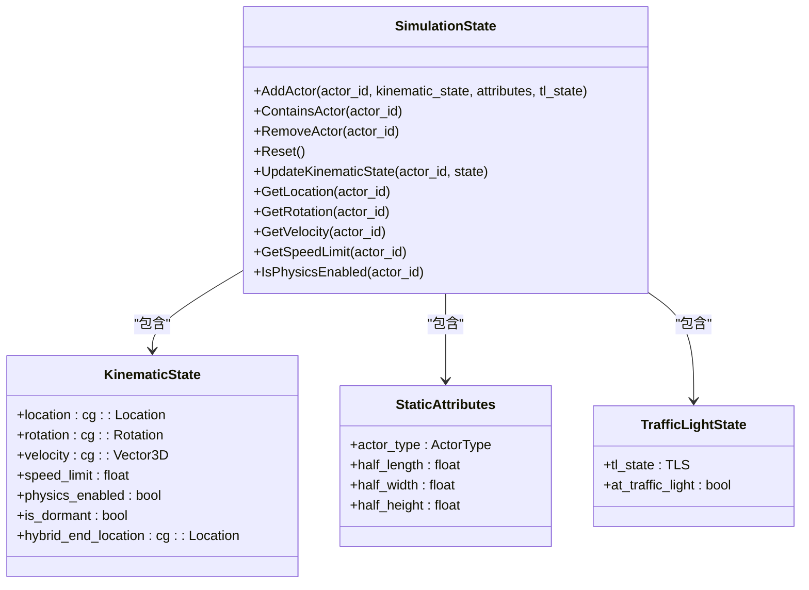
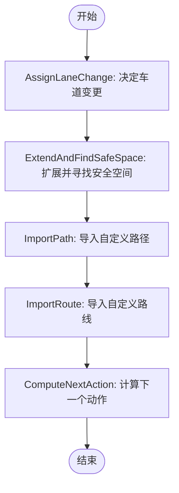
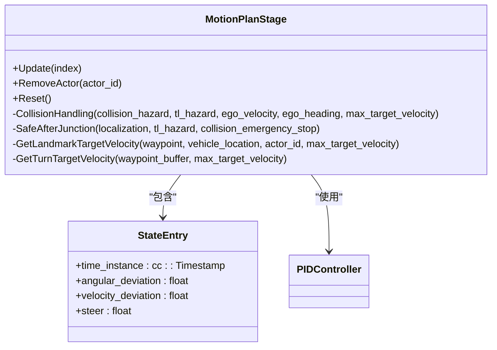
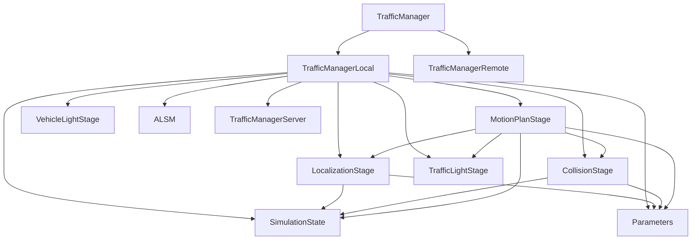

# 交通管理器

**本文档中引用的文件**  
- [TrafficManager.h](https://github.com/carla-simulator/carla/blob/ue5-dev/LibCarla/source/carla/trafficmanager/TrafficManager.h)
- [TrafficManager.cpp](https://github.com/carla-simulator/carla/blob/ue5-dev/LibCarla/source/carla/trafficmanager/TrafficManager.cpp)
- [SimulationState.h](https://github.com/carla-simulator/carla/blob/ue5-dev/LibCarla/source/carla/trafficmanager/SimulationState.h)
- [SimulationState.cpp](https://github.com/carla-simulator/carla/blob/ue5-dev/LibCarla/source/carla/trafficmanager/SimulationState.cpp)
- [LocalizationStage.h](https://github.com/carla-simulator/carla/blob/ue5-dev/LibCarla/source/carla/trafficmanager/LocalizationStage.h)
- [MotionPlanStage.h](https://github.com/carla-simulator/carla/blob/ue5-dev/LibCarla/source/carla/trafficmanager/MotionPlanStage.h)
- [Parameters.h](https://github.com/carla-simulator/carla/blob/ue5-dev/LibCarla/source/carla/trafficmanager/Parameters.h)
- [Constants.h](https://github.com/carla-simulator/carla/blob/ue5-dev/LibCarla/source/carla/trafficmanager/Constants.h)
- [DataStructures.h](https://github.com/carla-simulator/carla/blob/ue5-dev/LibCarla/source/carla/trafficmanager/DataStructures.h)
- [TrafficManagerLocal.h](https://github.com/carla-simulator/carla/blob/ue5-dev/LibCarla/source/carla/trafficmanager/TrafficManagerLocal.h)
- [TrafficManagerRemote.h](https://github.com/carla-simulator/carla/blob/ue5-dev/LibCarla/source/carla/trafficmanager/TrafficManagerRemote.h)
- [CollisionStage.h](https://github.com/carla-simulator/carla/blob/ue5-dev/LibCarla/source/carla/trafficmanager/CollisionStage.h)
- [TrafficManager.cpp](https://github.com/carla-simulator/carla/blob/ue5-dev/PythonAPI/carla/src/TrafficManager.cpp)
- [tuto_G_traffic_manager.md](https://github.com/carla-simulator/carla/blob/ue5-dev/Docs/tuto_G_traffic_manager.md)
- [adv_traffic_manager.md](https://github.com/carla-simulator/carla/blob/ue5-dev/Docs/adv_traffic_manager.md)

## 目录
1. [简介](#简介)
2. [项目结构](#项目结构)
3. [核心组件](#核心组件)
4. [架构概述](#架构概述)
5. [详细组件分析](#详细组件分析)
6. [依赖分析](#依赖分析)
7. [性能考虑](#性能考虑)
8. [故障排除指南](#故障排除指南)
9. [结论](#结论)

## 简介
CARLA交通管理器是一个先进的多线程系统，用于在复杂交通场景中控制车辆行为和避免碰撞。它通过集成多个处理阶段来实现逼真的交通模拟，包括车辆定位、碰撞检测、交通灯响应和运动规划。交通管理器采用客户端-服务器架构，支持本地和远程操作模式，允许在分布式仿真环境中进行远程控制。该系统提供了丰富的参数配置选项，可以精细控制车辆间距、速度限制、碰撞检测阈值等关键行为。通过Python和C++ API，用户可以创建多个交通管理器实例，配置不同的交通组，并精确控制特定车辆的行为模式。

## 项目结构
CARLA交通管理器的代码组织在`LibCarla/source/carla/trafficmanager/`目录下，采用模块化设计，每个核心功能都有独立的头文件和实现文件。系统通过清晰的层次结构组织，从基础数据结构到高级控制逻辑，形成了完整的交通管理解决方案。

**图源**  
- [TrafficManager.h](https://github.com/carla-simulator/carla/blob/ue5-dev/LibCarla/source/carla/trafficmanager/TrafficManager.h)
- [TrafficManagerLocal.h](https://github.com/carla-simulator/carla/blob/ue5-dev/LibCarla/source/carla/trafficmanager/TrafficManagerLocal.h)
- [TrafficManagerRemote.h](https://github.com/carla-simulator/carla/blob/ue5-dev/LibCarla/source/carla/trafficmanager/TrafficManagerRemote.h)

**节源**  
- [TrafficManager.h](https://github.com/carla-simulator/carla/blob/ue5-dev/LibCarla/source/carla/trafficmanager/TrafficManager.h#L1-L407)
- [TrafficManager.cpp](https://github.com/carla-simulator/carla/blob/ue5-dev/LibCarla/source/carla/trafficmanager/TrafficManager.cpp#L1-L237)

## 核心组件
CARLA交通管理器的核心组件包括SimulationState、LocalizationStage、CollisionStage、TrafficLightStage和MotionPlanStage。SimulationState类负责维护仿真中所有车辆的当前状态，包括位置、速度、旋转和交通灯状态。LocalizationStage处理车辆的路径规划和车道变更决策，为车辆生成前方的航点序列。CollisionStage检测潜在的碰撞风险，计算安全距离并提供避障建议。TrafficLightStage管理车辆对交通信号灯的响应，确保遵守交通规则。MotionPlanStage是最终的决策中心，综合来自其他阶段的信息，生成车辆的控制命令（油门、刹车、转向）。这些组件通过共享数据结构和参数系统协同工作，形成一个完整的闭环控制系统。

**节源**  
- [SimulationState.h](https://github.com/carla-simulator/carla/blob/ue5-dev/LibCarla/source/carla/trafficmanager/SimulationState.h#L1-L107)
- [LocalizationStage.h](https://github.com/carla-simulator/carla/blob/ue5-dev/LibCarla/source/carla/trafficmanager/LocalizationStage.h#L1-L93)
- [MotionPlanStage.h](https://github.com/carla-simulator/carla/blob/ue5-dev/LibCarla/source/carla/trafficmanager/MotionPlanStage.h#L1-L97)
- [Parameters.h](https://github.com/carla-simulator/carla/blob/ue5-dev/LibCarla/source/carla/trafficmanager/Parameters.h#L1-L300)

## 架构概述
CARLA交通管理器采用多线程架构，通过一系列有序的处理阶段来控制交通流。系统从SimulationState获取当前仿真状态，然后依次通过LocalizationStage、CollisionStage、TrafficLightStage进行分析，最后由MotionPlanStage生成控制指令。整个流程在TrafficManagerLocal或TrafficManagerRemote的控制下执行，支持同步和异步模式。

**图源**  
- [TrafficManagerLocal.h](https://github.com/carla-simulator/carla/blob/ue5-dev/LibCarla/source/carla/trafficmanager/TrafficManagerLocal.h#L50-L286)
- [MotionPlanStage.h](https://github.com/carla-simulator/carla/blob/ue5-dev/LibCarla/source/carla/trafficmanager/MotionPlanStage.h#L22-L97)

**节源**  
- [TrafficManager.cpp](https://github.com/carla-simulator/carla/blob/ue5-dev/LibCarla/source/carla/trafficmanager/TrafficManager.cpp#L31-L80)
- [TrafficManagerLocal.h](https://github.com/carla-simulator/carla/blob/ue5-dev/LibCarla/source/carla/trafficmanager/TrafficManagerLocal.h#L125-L131)

## 详细组件分析

### SimulationState分析
SimulationState类是交通管理器的感知基础，负责维护仿真中所有参与者的状态信息。它使用多个哈希表来高效存储和检索数据，包括车辆的位置、速度、旋转、速度限制和静态属性。

**图源**  
- [SimulationState.h](https://github.com/carla-simulator/carla/blob/ue5-dev/LibCarla/source/carla/trafficmanager/SimulationState.h#L43-L107)
- [SimulationState.cpp](https://github.com/carla-simulator/carla/blob/ue5-dev/LibCarla/source/carla/trafficmanager/SimulationState.cpp#L7-L104)

**节源**  
- [SimulationState.h](https://github.com/carla-simulator/carla/blob/ue5-dev/LibCarla/source/carla/trafficmanager/SimulationState.h#L43-L107)
- [SimulationState.cpp](https://github.com/carla-simulator/carla/blob/ue5-dev/LibCarla/source/carla/trafficmanager/SimulationState.cpp#L7-L104)

### LocalizationStage分析
LocalizationStage负责为车辆生成和维护前方的航点序列，是路径规划的核心组件。它处理车道变更决策，根据交通状况和车辆参数调整航点轨迹。

**图源**  
- [LocalizationStage.h](https://github.com/carla-simulator/carla/blob/ue5-dev/LibCarla/source/carla/trafficmanager/LocalizationStage.h#L32-L93)

**节源**  
- [LocalizationStage.h](https://github.com/carla-simulator/carla/blob/ue5-dev/LibCarla/source/carla/trafficmanager/LocalizationStage.h#L32-L93)

### MotionPlanStage分析
MotionPlanStage是交通管理器的决策中心，综合来自定位、碰撞检测和交通灯阶段的信息，生成最终的车辆控制命令。它使用PID控制器来调节车辆的速度和方向。

**图源**  
- [MotionPlanStage.h](https://github.com/carla-simulator/carla/blob/ue5-dev/LibCarla/source/carla/trafficmanager/MotionPlanStage.h#L22-L97)

**节源**  
- [MotionPlanStage.h](https://github.com/carla-simulator/carla/blob/ue5-dev/LibCarla/source/carla/trafficmanager/MotionPlanStage.h#L22-L97)

## 依赖分析
CARLA交通管理器的组件之间存在复杂的依赖关系，形成了一个紧密耦合的系统。核心依赖包括SimulationState提供车辆状态，Parameters提供配置参数，以及各种数据结构定义。

**图源**  
- [TrafficManager.h](https://github.com/carla-simulator/carla/blob/ue5-dev/LibCarla/source/carla/trafficmanager/TrafficManager.h#L26-L407)
- [TrafficManagerLocal.h](https://github.com/carla-simulator/carla/blob/ue5-dev/LibCarla/source/carla/trafficmanager/TrafficManagerLocal.h#L50-L286)

**节源**  
- [TrafficManager.h](https://github.com/carla-simulator/carla/blob/ue5-dev/LibCarla/source/carla/trafficmanager/TrafficManager.h#L26-L407)
- [TrafficManagerLocal.h](https://github.com/carla-simulator/carla/blob/ue5-dev/LibCarla/source/carla/trafficmanager/TrafficManagerLocal.h#L50-L286)

## 性能考虑
CARLA交通管理器在设计时考虑了性能优化，使用了多种技术来确保实时仿真。系统采用原子操作和线程安全的数据结构来支持多线程操作。SimulationState使用哈希表实现O(1)时间复杂度的状态查询。LocalizationStage和CollisionStage使用缓存机制避免重复计算。MotionPlanStage使用预定义的PID参数来快速响应控制需求。对于大规模交通仿真，建议使用分布式架构，将交通管理器部署在独立的服务器上，以减轻主仿真器的计算负担。此外，合理配置车辆数量和更新频率可以显著提高系统性能。

## 故障排除指南
在使用CARLA交通管理器时，可能会遇到交通拥堵、车辆卡顿等问题。对于交通拥堵，可以调整车辆间距参数（SetDistanceToLeadingVehicle）或速度差异参数（SetPercentageSpeedDifference）。车辆卡顿通常是由于碰撞检测过于敏感或路径规划问题导致，可以调整碰撞检测阈值或检查地图数据完整性。参数调优策略包括：逐步调整参数值，观察系统响应；使用不同的随机种子测试系统稳定性；在简单场景中验证参数效果后再应用于复杂场景。对于同步模式下的超时问题，可以使用SetSynchronousModeTimeOutInMiliSecond方法增加超时时间。

**节源**  
- [Parameters.h](https://github.com/carla-simulator/carla/blob/ue5-dev/LibCarla/source/carla/trafficmanager/Parameters.h#L37-L300)
- [Constants.h](https://github.com/carla-simulator/carla/blob/ue5-dev/LibCarla/source/carla/trafficmanager/Constants.h#L20-L166)

## 结论
CARLA交通管理器是一个功能强大且高度可配置的交通仿真系统，能够有效控制复杂场景中的车辆行为并避免碰撞。其多线程架构和模块化设计使得系统既灵活又高效。通过深入理解SimulationState、LocalizationStage和MotionPlanStage等核心组件的协作机制，用户可以充分利用交通管理器的功能。参数配置系统提供了精细的控制能力，而Python API使得集成和使用变得简单。对于分布式仿真，远程控制机制确保了系统的可扩展性。通过合理的参数调优和故障排除，可以创建逼真且稳定的交通仿真环境。