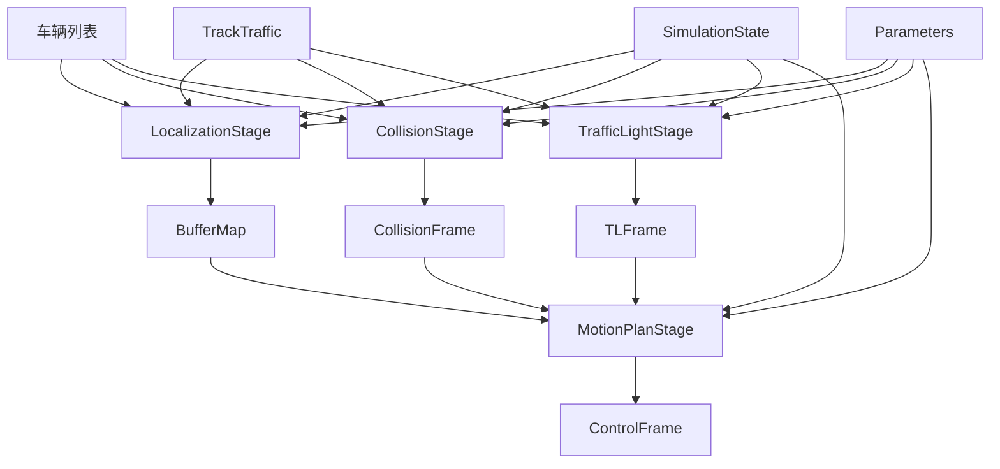
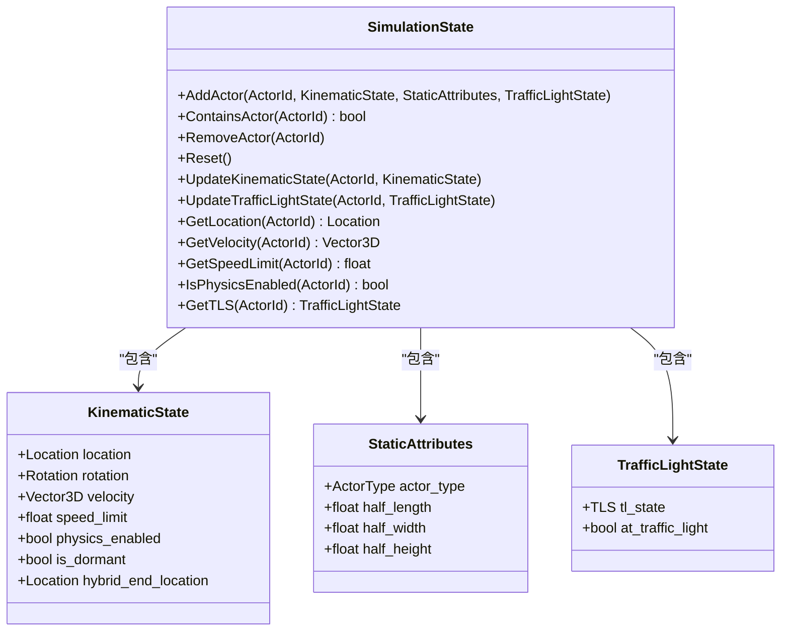
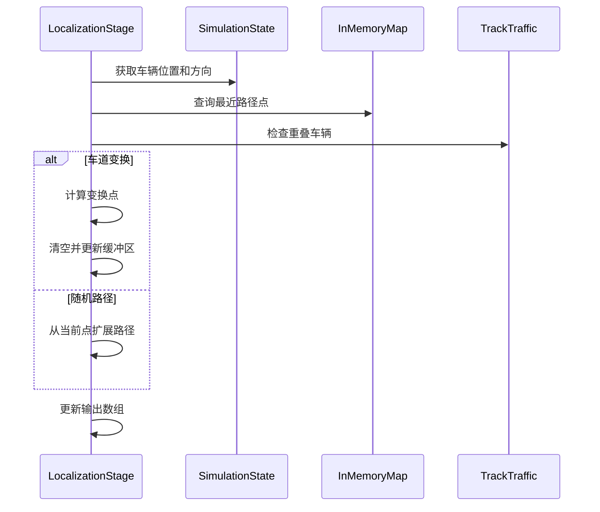
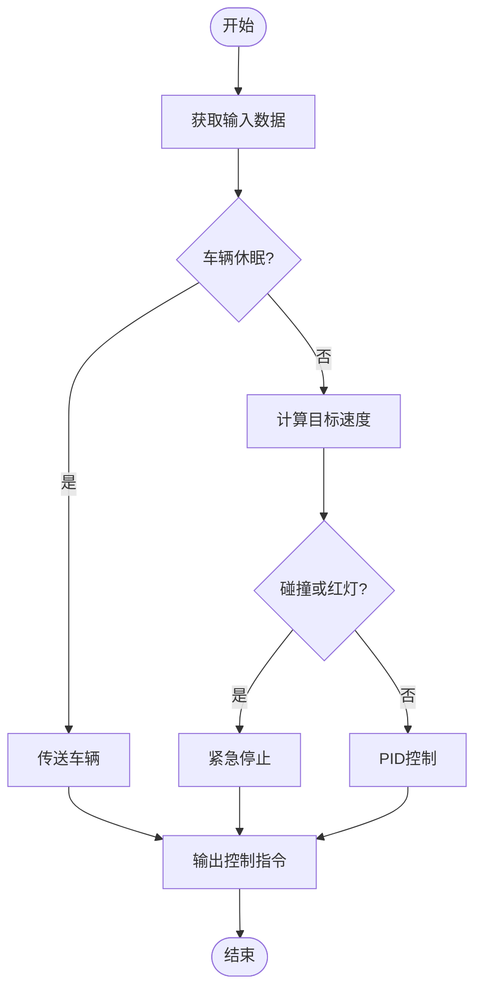
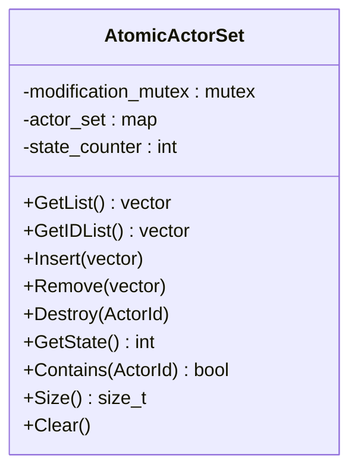
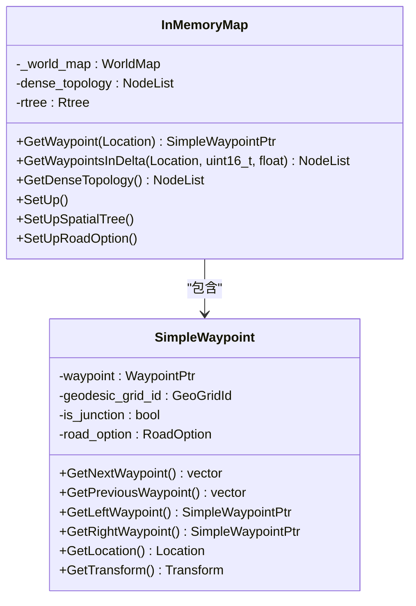
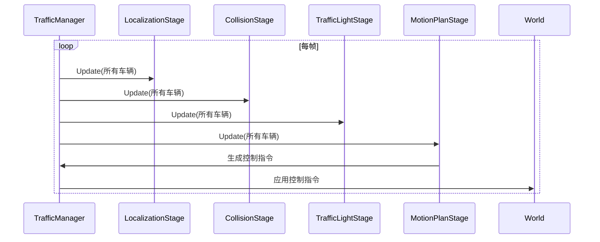
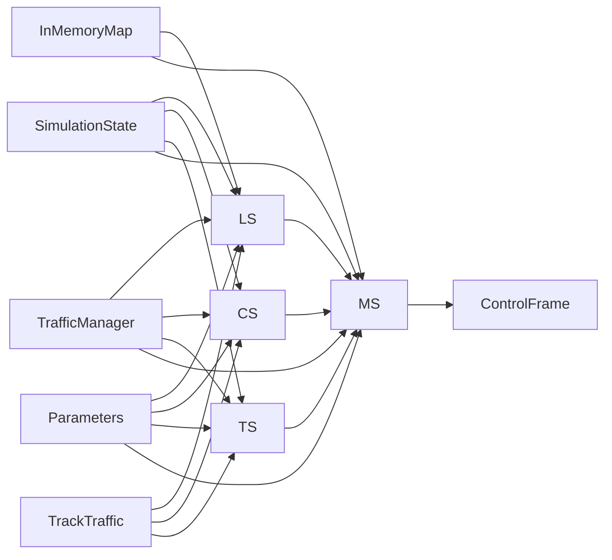

# 交通管理器架构设计

**本文档引用的文件**   
- [TrafficManager.cpp](https://github.com/carla-simulator/carla/blob/ue5-dev/LibCarla/source/carla/trafficmanager/TrafficManager.cpp)
- [SimulationState.cpp](https://github.com/carla-simulator/carla/blob/ue5-dev/LibCarla/source/carla/trafficmanager/SimulationState.cpp)
- [LocalizationStage.cpp](https://github.com/carla-simulator/carla/blob/ue5-dev/LibCarla/source/carla/trafficmanager/LocalizationStage.cpp)
- [MotionPlanStage.cpp](https://github.com/carla-simulator/carla/blob/ue5-dev/LibCarla/source/carla/trafficmanager/MotionPlanStage.cpp)
- [AtomicActorSet.h](https://github.com/carla-simulator/carla/blob/ue5-dev/LibCarla/source/carla/trafficmanager/AtomicActorSet.h)
- [InMemoryMap.cpp](https://github.com/carla-simulator/carla/blob/ue5-dev/LibCarla/source/carla/trafficmanager/InMemoryMap.cpp)
- [SimulationState.h](https://github.com/carla-simulator/carla/blob/ue5-dev/LibCarla/source/carla/trafficmanager/SimulationState.h)
- [LocalizationStage.h](https://github.com/carla-simulator/carla/blob/ue5-dev/LibCarla/source/carla/trafficmanager/LocalizationStage.h)
- [MotionPlanStage.h](https://github.com/carla-simulator/carla/blob/ue5-dev/LibCarla/source/carla/trafficmanager/MotionPlanStage.h)
- [Constants.h](https://github.com/carla-simulator/carla/blob/ue5-dev/LibCarla/source/carla/trafficmanager/Constants.h)
- [DataStructures.h](https://github.com/carla-simulator/carla/blob/ue5-dev/LibCarla/source/carla/trafficmanager/DataStructures.h)
- [TrackTraffic.cpp](https://github.com/carla-simulator/carla/blob/ue5-dev/LibCarla/source/carla/trafficmanager/TrackTraffic.cpp)
- [CollisionStage.cpp](https://github.com/carla-simulator/carla/blob/ue5-dev/LibCarla/source/carla/trafficmanager/CollisionStage.cpp)
- [TrafficLightStage.cpp](https://github.com/carla-simulator/carla/blob/ue5-dev/LibCarla/source/carla/trafficmanager/TrafficLightStage.cpp)
- [Parameters.cpp](https://github.com/carla-simulator/carla/blob/ue5-dev/LibCarla/source/carla/trafficmanager/Parameters.cpp)

## 目录
1. [引言](#引言)
2. [系统架构概述](#系统架构概述)
3. [核心组件分析](#核心组件分析)
4. [SimulationState 全局状态管理](#simulationstate-全局状态管理)
5. [LocalizationStage 定位与路径规划](#localizationstage-定位与路径规划)
6. [MotionPlanStage 运动指令生成](#motionplanstage-运动指令生成)
7. [数据流与同步机制](#数据流与同步机制)
8. [关键数据结构](#关键数据结构)
9. [高并发与性能优化](#高并发与性能优化)
10. [系统时序图](#系统时序图)
11. [组件交互图](#组件交互图)
12. [结论](#结论)

## 引言
CARLA交通管理器（Traffic Manager）是一个复杂的多线程、分阶段系统，旨在为自动驾驶仿真提供逼真的交通行为。该系统通过维护全局交通状态、处理车辆定位和路径规划，并生成运动指令来管理大量车辆的协同行为。本文档深入分析其架构设计，重点介绍其多线程、分阶段的系统架构，以及各组件之间的数据流和同步机制。

## 系统架构概述
CARLA交通管理器采用分阶段（Stage-based）的架构设计，将复杂的交通管理任务分解为多个独立的处理阶段。每个阶段负责特定的功能，如定位、碰撞检测、交通灯响应和运动规划。这种设计模式提高了系统的模块化和可维护性。系统通过多线程并行处理不同车辆的计算任务，以支持高并发的车辆管理。各阶段之间通过共享数据结构和同步机制进行通信，确保了数据的一致性和实时性。

**Diagram sources**
- [TrafficManager.cpp](https://github.com/carla-simulator/carla/blob/ue5-dev/LibCarla/source/carla/trafficmanager/TrafficManager.cpp)
- [LocalizationStage.h](https://github.com/carla-simulator/carla/blob/ue5-dev/LibCarla/source/carla/trafficmanager/LocalizationStage.h)
- [MotionPlanStage.h](https://github.com/carla-simulator/carla/blob/ue5-dev/LibCarla/source/carla/trafficmanager/MotionPlanStage.h)

## 核心组件分析
交通管理器的核心组件包括SimulationState、LocalizationStage、MotionPlanStage、CollisionStage、TrafficLightStage和TrackTraffic。这些组件协同工作，共同实现交通管理功能。SimulationState负责维护全局交通状态，LocalizationStage处理车辆定位和路径规划，MotionPlanStage生成运动指令，CollisionStage和TrafficLightStage分别处理碰撞和交通灯相关的决策，TrackTraffic则负责跟踪车辆之间的空间关系。

**Section sources**
- [TrafficManager.cpp](https://github.com/carla-simulator/carla/blob/ue5-dev/LibCarla/source/carla/trafficmanager/TrafficManager.cpp)
- [SimulationState.h](https://github.com/carla-simulator/carla/blob/ue5-dev/LibCarla/source/carla/trafficmanager/SimulationState.h)
- [LocalizationStage.h](https://github.com/carla-simulator/carla/blob/ue5-dev/LibCarla/source/carla/trafficmanager/LocalizationStage.h)
- [MotionPlanStage.h](https://github.com/carla-simulator/carla/blob/ue5-dev/LibCarla/source/carla/trafficmanager/MotionPlanStage.h)

## SimulationState 全局状态管理
SimulationState是交通管理器的核心数据结构，负责维护所有车辆的全局状态。它通过多个哈希表存储车辆的动态和静态属性，包括位置、速度、旋转、速度限制、物理状态和交通灯状态。该类提供了线程安全的接口来添加、移除和更新车辆状态，确保了在多线程环境下的数据一致性。

**Diagram sources**
- [SimulationState.h](https://github.com/carla-simulator/carla/blob/ue5-dev/LibCarla/source/carla/trafficmanager/SimulationState.h)
- [SimulationState.cpp](https://github.com/carla-simulator/carla/blob/ue5-dev/LibCarla/source/carla/trafficmanager/SimulationState.cpp)

## LocalizationStage 定位与路径规划
LocalizationStage负责为每辆车维护一个前方路径点的缓冲区（waypoint buffer），并处理车道变换决策。该阶段根据车辆当前位置和方向，从InMemoryMap中获取最近的路径点，并逐步扩展缓冲区以形成一条前方路径。它还实现了车道变换逻辑，根据参数设置和周围车辆情况决定是否进行车道变换。

**Diagram sources**
- [LocalizationStage.cpp](https://github.com/carla-simulator/carla/blob/ue5-dev/LibCarla/source/carla/trafficmanager/LocalizationStage.cpp)
- [LocalizationStage.h](https://github.com/carla-simulator/carla/blob/ue5-dev/LibCarla/source/carla/trafficmanager/LocalizationStage.h)

## MotionPlanStage 运动指令生成
MotionPlanStage是交通管理器的最终决策阶段，负责根据前几个阶段的输出生成车辆的控制指令。该阶段综合了定位、碰撞和交通灯信息，使用PID控制器计算油门、刹车和转向指令。对于启用物理的车辆，使用PID控制器进行精确控制；对于未启用物理的车辆，则通过周期性地传送车辆位置来模拟运动。

**Diagram sources**
- [MotionPlanStage.cpp](https://github.com/carla-simulator/carla/blob/ue5-dev/LibCarla/source/carla/trafficmanager/MotionPlanStage.cpp)
- [MotionPlanStage.h](https://github.com/carla-simulator/carla/blob/ue5-dev/LibCarla/source/carla/trafficmanager/MotionPlanStage.h)

## 数据流与同步机制
交通管理器的数据流遵循严格的阶段顺序。首先，SimulationState提供车辆的当前状态。然后，LocalizationStage、CollisionStage和TrafficLightStage并行处理各自的任务，并将结果写入共享的输出数组。最后，MotionPlanStage读取所有阶段的输出，生成最终的控制指令。系统使用std::scoped_lock等同步原语确保对共享数据结构的线程安全访问。

**Section sources**
- [TrafficManager.cpp](https://github.com/carla-simulator/carla/blob/ue5-dev/LibCarla/source/carla/trafficmanager/TrafficManager.cpp)
- [DataStructures.h](https://github.com/carla-simulator/carla/blob/ue5-dev/LibCarla/source/carla/trafficmanager/DataStructures.h)

## 关键数据结构
### AtomicActorSet
AtomicActorSet是一个线程安全的演员集合，用于管理交通管理器中的车辆。它使用互斥锁保护内部的std::map，确保对演员集合的插入、删除和查询操作是原子的。该结构还维护一个状态计数器，用于跟踪集合的修改次数。

**Diagram sources**
- [AtomicActorSet.h](https://github.com/carla-simulator/carla/blob/ue5-dev/LibCarla/source/carla/trafficmanager/AtomicActorSet.h)

### InMemoryMap
InMemoryMap是CARLA地图的内存表示，用于快速路径规划。它将原始地图数据转换为一个密集的路径点拓扑结构，并建立空间索引（R-tree）以加速最近邻查询。该结构还预计算了路径点之间的连接关系和车道变换信息，显著提高了路径规划的效率。

**Diagram sources**
- [InMemoryMap.cpp](https://github.com/carla-simulator/carla/blob/ue5-dev/LibCarla/source/carla/trafficmanager/InMemoryMap.cpp)
- [InMemoryMap.h](https://github.com/carla-simulator/carla/blob/ue5-dev/LibCarla/source/carla/trafficmanager/InMemoryMap.h)

## 高并发与性能优化
交通管理器通过多种机制支持高并发车辆管理。首先，它采用分阶段架构，允许不同阶段并行处理多辆车。其次，关键数据结构如AtomicActorSet和SimulationState都设计为线程安全，避免了数据竞争。此外，系统使用预计算的InMemoryMap和空间索引，大大减少了路径规划的计算开销。对于大量车辆，系统还实现了混合物理模式，只对关键车辆启用完整物理模拟，其余车辆通过位置传送来模拟运动，从而平衡了真实性和性能。

**Section sources**
- [Constants.h](https://github.com/carla-simulator/carla/blob/ue5-dev/LibCarla/source/carla/trafficmanager/Constants.h)
- [Parameters.cpp](https://github.com/carla-simulator/carla/blob/ue5-dev/LibCarla/source/carla/trafficmanager/Parameters.cpp)

## 系统时序图

**Diagram sources**
- [TrafficManager.cpp](https://github.com/carla-simulator/carla/blob/ue5-dev/LibCarla/source/carla/trafficmanager/TrafficManager.cpp)
- [MotionPlanStage.cpp](https://github.com/carla-simulator/carla/blob/ue5-dev/LibCarla/source/carla/trafficmanager/MotionPlanStage.cpp)

## 组件交互图

**Diagram sources**
- [TrafficManager.cpp](https://github.com/carla-simulator/carla/blob/ue5-dev/LibCarla/source/carla/trafficmanager/TrafficManager.cpp)
- [LocalizationStage.h](https://github.com/carla-simulator/carla/blob/ue5-dev/LibCarla/source/carla/trafficmanager/LocalizationStage.h)
- [MotionPlanStage.h](https://github.com/carla-simulator/carla/blob/ue5-dev/LibCarla/source/carla/trafficmanager/MotionPlanStage.h)

## 结论
CARLA交通管理器通过其精心设计的多线程、分阶段架构，成功实现了对大规模交通场景的高效管理。其核心在于SimulationState对全局状态的维护，以及LocalizationStage和MotionPlanStage对车辆行为的精确控制。通过AtomicActorSet和InMemoryMap等关键数据结构，系统在保证线程安全的同时实现了高性能。这种架构设计不仅支持高并发车辆管理，还为未来的功能扩展提供了良好的基础。