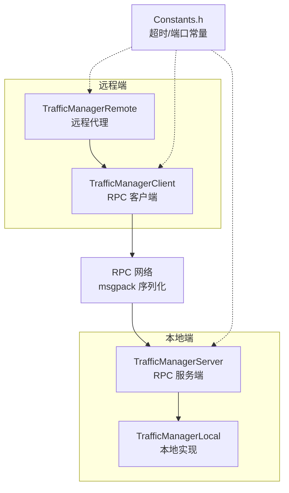
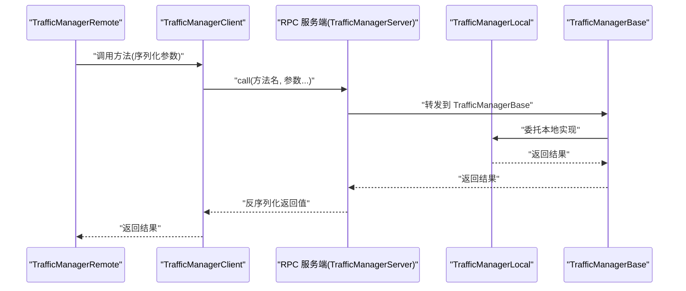
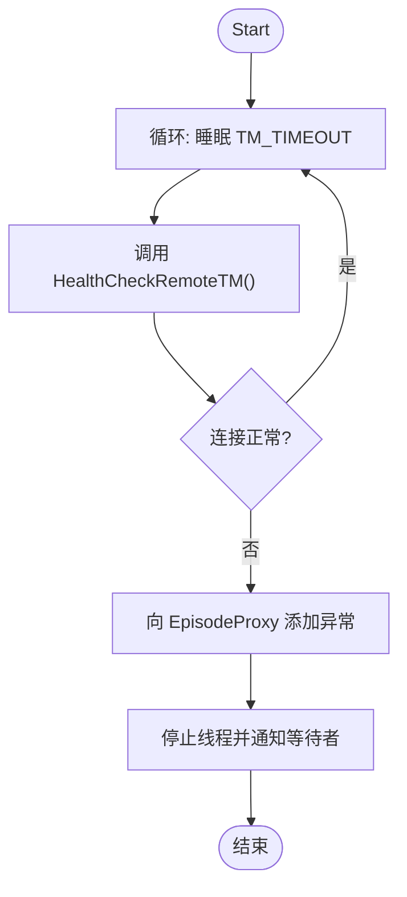
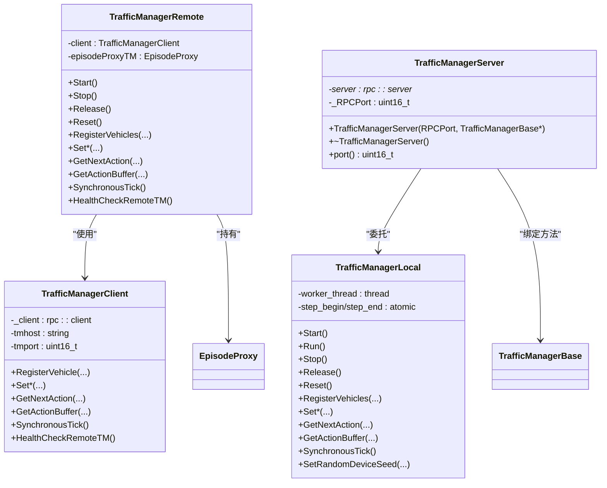

# 分布式管理

**本文引用的文件列表**
- [TrafficManagerRemote.h](https://github.com/carla-simulator/carla/blob/ue5-dev/LibCarla/source/carla/trafficmanager/TrafficManagerRemote.h)
- [TrafficManagerRemote.cpp](https://github.com/carla-simulator/carla/blob/ue5-dev/LibCarla/source/carla/trafficmanager/TrafficManagerRemote.cpp)
- [TrafficManagerClient.h](https://github.com/carla-simulator/carla/blob/ue5-dev/LibCarla/source/carla/trafficmanager/TrafficManagerClient.h)
- [TrafficManagerServer.h](https://github.com/carla-simulator/carla/blob/ue5-dev/LibCarla/source/carla/trafficmanager/TrafficManagerServer.h)
- [TrafficManagerLocal.h](https://github.com/carla-simulator/carla/blob/ue5-dev/LibCarla/source/carla/trafficmanager/TrafficManagerLocal.h)
- [Constants.h](https://github.com/carla-simulator/carla/blob/ue5-dev/LibCarla/source/carla/trafficmanager/Constants.h)
- [Client.cpp](https://github.com/carla-simulator/carla/blob/ue5-dev/LibCarla/source/carla/client/detail/Client.cpp)
- [TrafficManager.cpp](https://github.com/carla-simulator/carla/blob/ue5-dev/PythonAPI/carla/src/TrafficManager.cpp)
- [adv_traffic_manager.md](https://github.com/carla-simulator/carla/blob/ue5-dev/Docs/adv_traffic_manager.md)
- [tuto_G_traffic_manager.md](https://github.com/carla-simulator/carla/blob/ue5-dev/Docs/tuto_G_traffic_manager.md)

## 目录
1. [引言](#引言)
2. [项目结构](#项目结构)
3. [核心组件](#核心组件)
4. [架构总览](#架构总览)
5. [详细组件分析](#详细组件分析)
6. [依赖关系分析](#依赖关系分析)
7. [性能考量](#性能考量)
8. [故障排查指南](#故障排查指南)
9. [结论](#结论)
10. [附录](#附录)

## 引言
本文件围绕 CARLA 交通管理器的分布式能力展开，重点解释远程交通管理器（TrafficManagerRemote）如何通过 RPC 与本地服务器（TrafficManagerServer）通信，涵盖消息序列化/反序列化、状态同步与故障恢复、跨进程/跨机协同、性能开销与优化、以及安全与一致性保障。文档同时提供可操作的配置与使用建议，帮助读者在多客户端或多实例场景下稳定地运行分布式仿真。

## 项目结构
分布式交通管理器由以下模块组成：
- 远程端：TrafficManagerRemote 负责对外暴露与本地 TrafficManagerBase 一致的接口，内部通过 TrafficManagerClient 发起 RPC 调用。
- 客户端 RPC：TrafficManagerClient 封装 RPC 客户端，负责连接远端 TrafficManagerServer 并调用对应方法。
- 服务端 RPC：TrafficManagerServer 在本地启动 RPC 服务，绑定大量方法名，将请求转发给 TrafficManagerBase 实现。
- 本地实现：TrafficManagerLocal 提供完整的交通管理逻辑，作为 TrafficManagerServer 的后端执行体。
- 常量与网络参数：Constants.h 中定义超时、默认端口等网络相关常量。
- 客户端工具：Client.cpp 提供查询/注册/销毁 TrafficManager 的 RPC 接口，辅助多客户端场景。
- Python 绑定：TrafficManager.cpp 暴露 Python API，便于脚本层控制与路径/路由设置。

图表来源
- [TrafficManagerRemote.h](https://github.com/carla-simulator/carla/blob/ue5-dev/LibCarla/source/carla/trafficmanager/TrafficManagerRemote.h#L1-L196)
- [TrafficManagerRemote.cpp](https://github.com/carla-simulator/carla/blob/ue5-dev/LibCarla/source/carla/trafficmanager/TrafficManagerRemote.cpp#L1-L302)
- [TrafficManagerClient.h](https://github.com/carla-simulator/carla/blob/ue5-dev/LibCarla/source/carla/trafficmanager/TrafficManagerClient.h#L1-L325)
- [TrafficManagerServer.h](https://github.com/carla-simulator/carla/blob/ue5-dev/LibCarla/source/carla/trafficmanager/TrafficManagerServer.h#L1-L315)
- [TrafficManagerLocal.h](https://github.com/carla-simulator/carla/blob/ue5-dev/LibCarla/source/carla/trafficmanager/TrafficManagerLocal.h#L1-L286)
- [Constants.h](https://github.com/carla-simulator/carla/blob/ue5-dev/LibCarla/source/carla/trafficmanager/Constants.h#L1-L166)

章节来源
- [TrafficManagerRemote.h](https://github.com/carla-simulator/carla/blob/ue5-dev/LibCarla/source/carla/trafficmanager/TrafficManagerRemote.h#L1-L196)
- [TrafficManagerClient.h](https://github.com/carla-simulator/carla/blob/ue5-dev/LibCarla/source/carla/trafficmanager/TrafficManagerClient.h#L1-L325)
- [TrafficManagerServer.h](https://github.com/carla-simulator/carla/blob/ue5-dev/LibCarla/source/carla/trafficmanager/TrafficManagerServer.h#L1-L315)
- [TrafficManagerLocal.h](https://github.com/carla-simulator/carla/blob/ue5-dev/LibCarla/source/carla/trafficmanager/TrafficManagerLocal.h#L1-L286)
- [Constants.h](https://github.com/carla-simulator/carla/blob/ue5-dev/LibCarla/source/carla/trafficmanager/Constants.h#L1-L166)

## 核心组件
- TrafficManagerRemote：远程代理，封装所有 TrafficManagerBase 方法，内部通过 TrafficManagerClient 发送 RPC 请求；维护健康检查线程与生命周期。
- TrafficManagerClient：RPC 客户端，持有远端主机与端口，统一调用“方法名+参数”的 RPC 调用，参数通过 msgpack 序列化传输。
- TrafficManagerServer：RPC 服务端，绑定大量方法名到 TrafficManagerBase 的具体实现，异步运行，支持健康检查与同步模式。
- TrafficManagerLocal：本地完整实现，包含各阶段（定位、避撞、信号灯、运动规划、灯光）与同步/异步执行框架。
- Constants：网络超时、默认端口、混合物理步长等常量。
- Client 工具：提供查询/注册/销毁 TrafficManager 的 RPC 接口，支持多客户端场景。
- Python 绑定：提供路径/路由设置、动作查询等 API，便于脚本层使用。

章节来源
- [TrafficManagerRemote.h](https://github.com/carla-simulator/carla/blob/ue5-dev/LibCarla/source/carla/trafficmanager/TrafficManagerRemote.h#L1-L196)
- [TrafficManagerRemote.cpp](https://github.com/carla-simulator/carla/blob/ue5-dev/LibCarla/source/carla/trafficmanager/TrafficManagerRemote.cpp#L1-L302)
- [TrafficManagerClient.h](https://github.com/carla-simulator/carla/blob/ue5-dev/LibCarla/source/carla/trafficmanager/TrafficManagerClient.h#L1-L325)
- [TrafficManagerServer.h](https://github.com/carla-simulator/carla/blob/ue5-dev/LibCarla/source/carla/trafficmanager/TrafficManagerServer.h#L1-L315)
- [TrafficManagerLocal.h](https://github.com/carla-simulator/carla/blob/ue5-dev/LibCarla/source/carla/trafficmanager/TrafficManagerLocal.h#L1-L286)
- [Constants.h](https://github.com/carla-simulator/carla/blob/ue5-dev/LibCarla/source/carla/trafficmanager/Constants.h#L1-L166)
- [Client.cpp](https://github.com/carla-simulator/carla/blob/ue5-dev/LibCarla/source/carla/client/detail/Client.cpp#L86-L125)
- [TrafficManager.cpp](https://github.com/carla-simulator/carla/blob/ue5-dev/PythonAPI/carla/src/TrafficManager.cpp#L1-L114)

## 架构总览
分布式架构以 RPC 为纽带，远程端仅负责转发请求，本地端承载计算与状态。关键流程如下：
- 远程端构造时传入远端主机与端口，内部创建 TrafficManagerClient。
- 远程端启动健康检查线程，周期性调用远端 health_check_remote_TM，失败则记录异常并等待停止。
- 远程端将所有 TrafficManagerBase 方法映射为 RPC 调用，参数经 msgpack 序列化传输。
- 本地端 RPC 服务绑定方法名，将请求转换为 TrafficManagerBase 的调用，返回结果。
- 同步模式下，远端 SynchronousTick 返回 false，本地端由 TrafficManagerLocal 控制 tick 流程。

图表来源
- [TrafficManagerRemote.cpp](https://github.com/carla-simulator/carla/blob/ue5-dev/LibCarla/source/carla/trafficmanager/TrafficManagerRemote.cpp#L92-L118)
- [TrafficManagerClient.h](https://github.com/carla-simulator/carla/blob/ue5-dev/LibCarla/source/carla/trafficmanager/TrafficManagerClient.h#L65-L120)
- [TrafficManagerServer.h](https://github.com/carla-simulator/carla/blob/ue5-dev/LibCarla/source/carla/trafficmanager/TrafficManagerServer.h#L73-L110)
- [TrafficManagerLocal.h](https://github.com/carla-simulator/carla/blob/ue5-dev/LibCarla/source/carla/trafficmanager/TrafficManagerLocal.h#L140-L160)

## 详细组件分析

### TrafficManagerRemote：远程代理
- 生命周期与健康检查
  - Start 启动后台线程，周期性调用 HealthCheckRemoteTM，若异常则向 EpisodeProxy 添加待处理异常并等待停止。
  - Stop/Release/Reset 控制线程生命周期与重置。
- 方法映射
  - 所有 TrafficManagerBase 方法均通过 TrafficManagerClient 转发，如注册/注销车辆、速度/车道偏移、碰撞规则、强制/自动变道、跟车距离、忽略行人/车辆/红绿灯概率、同步模式、混合物理模式、OSM 模式、自定义路径/路线、重生边界、随机种子等。
  - 动作查询：GetNextAction、GetActionBuffer、SynchronousTick（远端返回 false，由本地端控制）。
- 与 EpisodeProxy 的交互
  - 保存 EpisodeProxy 引用，用于异常上报与重置时刷新代理。

图表来源
- [TrafficManagerRemote.cpp](https://github.com/carla-simulator/carla/blob/ue5-dev/LibCarla/source/carla/trafficmanager/TrafficManagerRemote.cpp#L31-L68)
- [TrafficManagerRemote.cpp](https://github.com/carla-simulator/carla/blob/ue5-dev/LibCarla/source/carla/trafficmanager/TrafficManagerRemote.cpp#L58-L65)

章节来源
- [TrafficManagerRemote.h](https://github.com/carla-simulator/carla/blob/ue5-dev/LibCarla/source/carla/trafficmanager/TrafficManagerRemote.h#L1-L196)
- [TrafficManagerRemote.cpp](https://github.com/carla-simulator/carla/blob/ue5-dev/LibCarla/source/carla/trafficmanager/TrafficManagerRemote.cpp#L1-L302)

### TrafficManagerClient：RPC 客户端
- 连接与超时
  - 构造时创建 RPC 客户端并设置超时（来自 Constants），随后通过方法名调用远端服务。
- 方法覆盖
  - 包含注册/注销车辆、速度/车道偏移、灯光更新、碰撞规则、强制/自动变道、跟车距离、忽略行为概率、同步模式、混合物理、OSM 模式、自定义路径/路线、重生边界、动作查询、关闭等。
- 注意
  - 多数方法直接 call(方法名, 参数...)，部分返回值需要反序列化（例如布尔型）。

章节来源
- [TrafficManagerClient.h](https://github.com/carla-simulator/carla/blob/ue5-dev/LibCarla/source/carla/trafficmanager/TrafficManagerClient.h#L1-L325)
- [Constants.h](https://github.com/carla-simulator/carla/blob/ue5-dev/LibCarla/source/carla/trafficmanager/Constants.h#L1-L166)

### TrafficManagerServer：RPC 服务端
- 启动与绑定
  - 在指定端口启动 RPC 服务，绑定大量方法名到 TrafficManagerBase 的实现；异步运行 async_run。
- 绑定方法
  - 注册/注销车辆、速度/车道偏移、灯光更新、全局设置、碰撞规则、强制/自动变道、跟车距离、忽略行为概率、同步模式、混合物理、OSM 模式、自定义路径/路线、重生边界、动作查询、关闭、健康检查等。
- 异常处理
  - 通过 try/catch 重试端口绑定，失败抛出运行时异常；析构时停止并释放资源。

章节来源
- [TrafficManagerServer.h](https://github.com/carla-simulator/carla/blob/ue5-dev/LibCarla/source/carla/trafficmanager/TrafficManagerServer.h#L1-L315)

### TrafficManagerLocal：本地实现
- 结构与职责
  - 包含定位、避撞、信号灯、运动规划、灯光等阶段，以及同步/异步执行框架、帧内存管理、随机数生成器、注册车辆集合等。
- 同步模式
  - 通过条件变量与互斥锁协调 step_begin/step_end，Run/Start/Stop/Release/Reset 控制生命周期。
- 动作与路径
  - 提供 GetNextAction/GetActionBuffer/SetCustomPath/SetImportedRoute 等完整接口，供远端通过 RPC 调用。

章节来源
- [TrafficManagerLocal.h](https://github.com/carla-simulator/carla/blob/ue5-dev/LibCarla/source/carla/trafficmanager/TrafficManagerLocal.h#L1-L286)

### 消息序列化与反序列化
- 序列化方式
  - 使用 msgpack 对参数进行序列化，方法名作为 RPC 调用标识，返回值按类型反序列化。
- 数据类型
  - 基本类型（整数、浮点、布尔）、字符串、数组（路径 Path、路线 Route）、Actor 序列化对象等。
- 反序列化
  - 客户端侧对返回值进行 as\<T\>() 类型转换，确保类型安全。

章节来源
- [TrafficManagerClient.h](https://github.com/carla-simulator/carla/blob/ue5-dev/LibCarla/source/carla/trafficmanager/TrafficManagerClient.h#L65-L120)
- [TrafficManagerServer.h](https://github.com/carla-simulator/carla/blob/ue5-dev/LibCarla/source/carla/trafficmanager/TrafficManagerServer.h#L73-L110)

### 状态同步与故障恢复
- 同步模式
  - 远端 SynchronousTick 返回 false，由本地端 TrafficManagerLocal 控制 tick 流程；本地端通过条件变量推进同步步骤。
- 健康检查
  - 远端周期性调用 health_check_remote_TM，失败时记录异常并触发停止流程。
- 故障恢复
  - Stop/Reset 会重置 EpisodeProxy 并重新 Start，确保在连接中断后能尽快恢复。

章节来源
- [TrafficManagerRemote.cpp](https://github.com/carla-simulator/carla/blob/ue5-dev/LibCarla/source/carla/trafficmanager/TrafficManagerRemote.cpp#L284-L286)
- [TrafficManagerRemote.cpp](https://github.com/carla-simulator/carla/blob/ue5-dev/LibCarla/source/carla/trafficmanager/TrafficManagerRemote.cpp#L31-L68)
- [TrafficManagerRemote.cpp](https://github.com/carla-simulator/carla/blob/ue5-dev/LibCarla/source/carla/trafficmanager/TrafficManagerRemote.cpp#L83-L90)
- [TrafficManagerServer.h](https://github.com/carla-simulator/carla/blob/ue5-dev/LibCarla/source/carla/trafficmanager/TrafficManagerServer.h#L281-L283)

### 配置与使用示例（跨进程/跨机）
- 多客户端/多 TM 场景
  - 文档说明了在同一端口上创建多个 TM 实例：第一个为 TM-Server，其余为 TM-Clients；Server 决定行为。
  - 示例命令展示了在不同终端中分别启动 TM-Server 与 TM-Client 的方式。
- Python 层使用
  - 通过 client.get_trafficmanager(port) 获取 TM 实例，设置同步模式、随机种子、路径/路由、动作查询等。
  - 可通过 set_autopilot(True, tm_port) 将车辆交由指定端口的 TM 管理。

章节来源
- [adv_traffic_manager.md](https://github.com/carla-simulator/carla/blob/ue5-dev/Docs/adv_traffic_manager.md#L431-L464)
- [tuto_G_traffic_manager.md](https://github.com/carla-simulator/carla/blob/ue5-dev/Docs/tuto_G_traffic_manager.md#L1-L227)
- [Client.cpp](https://github.com/carla-simulator/carla/blob/ue5-dev/LibCarla/source/carla/client/detail/Client.cpp#L109-L121)
- [TrafficManager.cpp](https://github.com/carla-simulator/carla/blob/ue5-dev/PythonAPI/carla/src/TrafficManager.cpp#L76-L113)

## 依赖关系分析
- 组件耦合
  - TrafficManagerRemote 依赖 TrafficManagerClient 与 EpisodeProxy；TrafficManagerClient 依赖 RPC 客户端库。
  - TrafficManagerServer 依赖 TrafficManagerBase 指针，将请求转发至本地实现。
  - TrafficManagerLocal 作为 TrafficManagerServer 的后端，承担完整逻辑。
- 外部依赖
  - RPC 服务端/客户端库（librpc）；msgpack 序列化；网络超时与端口常量。
- 循环依赖
  - 无直接循环依赖；通过指针与方法名绑定实现解耦。

图表来源
- [TrafficManagerRemote.h](https://github.com/carla-simulator/carla/blob/ue5-dev/LibCarla/source/carla/trafficmanager/TrafficManagerRemote.h#L1-L196)
- [TrafficManagerClient.h](https://github.com/carla-simulator/carla/blob/ue5-dev/LibCarla/source/carla/trafficmanager/TrafficManagerClient.h#L1-L325)
- [TrafficManagerServer.h](https://github.com/carla-simulator/carla/blob/ue5-dev/LibCarla/source/carla/trafficmanager/TrafficManagerServer.h#L1-L315)
- [TrafficManagerLocal.h](https://github.com/carla-simulator/carla/blob/ue5-dev/LibCarla/source/carla/trafficmanager/TrafficManagerLocal.h#L1-L286)

## 性能考量
- 网络延迟与吞吐
  - RPC 调用存在网络往返时间，频繁调用（如每帧多次设置参数）会放大延迟；建议批量设置或降低调用频率。
- 序列化开销
  - 路径/路线等大数组参数序列化成本较高；尽量减少不必要的大数据传输。
- 同步模式
  - 同步模式下远端 SynchronousTick 返回 false，由本地端推进；避免远端阻塞，提高整体吞吐。
- 超时与重试
  - Constants 中定义 TM_TIMEOUT，合理设置超时避免长时间阻塞；健康检查线程在异常时及时终止。
- 混合物理与步长
  - 混合物理模式步长（HYBRID_MODE_DT）影响本地端计算频率，需与仿真步长匹配，避免过高的 CPU 占用。

章节来源
- [Constants.h](https://github.com/carla-simulator/carla/blob/ue5-dev/LibCarla/source/carla/trafficmanager/Constants.h#L1-L166)
- [TrafficManagerRemote.cpp](https://github.com/carla-simulator/carla/blob/ue5-dev/LibCarla/source/carla/trafficmanager/TrafficManagerRemote.cpp#L284-L286)
- [TrafficManagerServer.h](https://github.com/carla-simulator/carla/blob/ue5-dev/LibCarla/source/carla/trafficmanager/TrafficManagerServer.h#L281-L283)

## 故障排查指南
- 连接失败
  - 远端健康检查线程捕获异常并向 EpisodeProxy 添加异常信息；检查主机/端口是否正确、防火墙/网络策略是否放行。
- 超时问题
  - TM_TIMEOUT 默认值可能过短；根据网络状况适当增大；确认远端 RPC 服务已启动且未崩溃。
- 多客户端冲突
  - 同一端口上的多个 TM 实例由首个作为 Server，其余为 Clients；确保 Server 先启动，Clients 再连接。
- 动作查询无效
  - 远端 GetNextAction/GetActionBuffer 当前实现返回空占位，实际由本地端 TrafficManagerLocal 提供；确认本地端已正确初始化并运行。

章节来源
- [TrafficManagerRemote.cpp](https://github.com/carla-simulator/carla/blob/ue5-dev/LibCarla/source/carla/trafficmanager/TrafficManagerRemote.cpp#L31-L68)
- [TrafficManagerRemote.cpp](https://github.com/carla-simulator/carla/blob/ue5-dev/LibCarla/source/carla/trafficmanager/TrafficManagerRemote.cpp#L276-L282)
- [TrafficManagerClient.h](https://github.com/carla-simulator/carla/blob/ue5-dev/LibCarla/source/carla/trafficmanager/TrafficManagerClient.h#L295-L306)
- [adv_traffic_manager.md](https://github.com/carla-simulator/carla/blob/ue5-dev/Docs/adv_traffic_manager.md#L431-L464)

## 结论
分布式交通管理器通过 RPC 将远程代理与本地实现解耦，既支持跨进程也支持跨机协同。其设计强调：
- 明确的职责分离：远端只做转发，本地负责计算与状态。
- 稳健的健康检查与故障恢复：周期性健康检查与异常上报，保证系统可用性。
- 可扩展的接口：通过方法名绑定实现丰富的参数设置与查询能力。
- 性能与安全兼顾：合理的超时、批量调用与序列化策略，结合多客户端场景下的 Server/Client 角色划分，提升整体稳定性与一致性。

## 附录
- 关键 API 路径参考
  - 远程代理接口：[TrafficManagerRemote.h](https://github.com/carla-simulator/carla/blob/ue5-dev/LibCarla/source/carla/trafficmanager/TrafficManagerRemote.h#L1-L196)
  - RPC 客户端接口：[TrafficManagerClient.h](https://github.com/carla-simulator/carla/blob/ue5-dev/LibCarla/source/carla/trafficmanager/TrafficManagerClient.h#L1-L325)
  - RPC 服务端绑定：[TrafficManagerServer.h](https://github.com/carla-simulator/carla/blob/ue5-dev/LibCarla/source/carla/trafficmanager/TrafficManagerServer.h#L73-L283)
  - 本地实现接口：[TrafficManagerLocal.h](https://github.com/carla-simulator/carla/blob/ue5-dev/LibCarla/source/carla/trafficmanager/TrafficManagerLocal.h#L140-L282)
  - 网络常量：[Constants.h](https://github.com/carla-simulator/carla/blob/ue5-dev/LibCarla/source/carla/trafficmanager/Constants.h#L1-L166)
  - 客户端工具（查询/注册/销毁）：[Client.cpp](https://github.com/carla-simulator/carla/blob/ue5-dev/LibCarla/source/carla/client/detail/Client.cpp#L109-L121)
  - Python 绑定（路径/路由/动作）：[TrafficManager.cpp](https://github.com/carla-simulator/carla/blob/ue5-dev/PythonAPI/carla/src/TrafficManager.cpp#L47-L113)
  - 多客户端/多 TM 使用示例：[adv_traffic_manager.md](https://github.com/carla-simulator/carla/blob/ue5-dev/Docs/adv_traffic_manager.md#L431-L464)