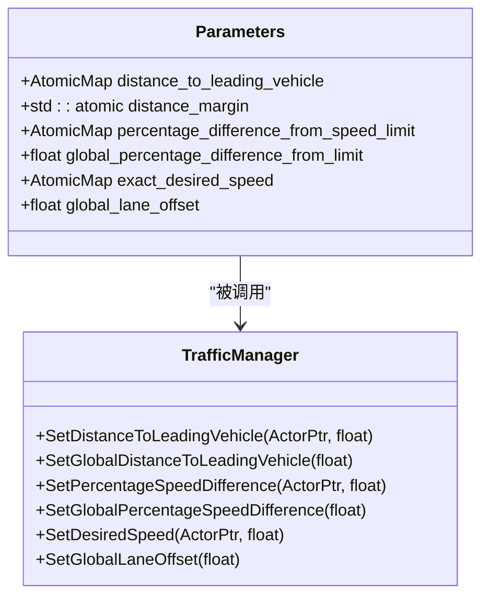
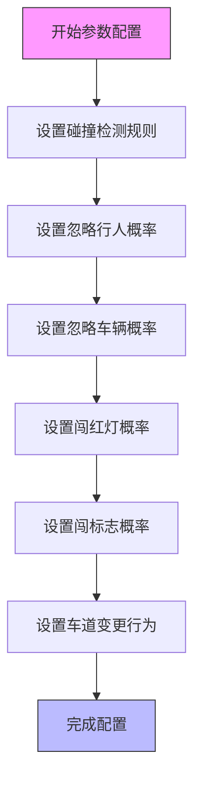
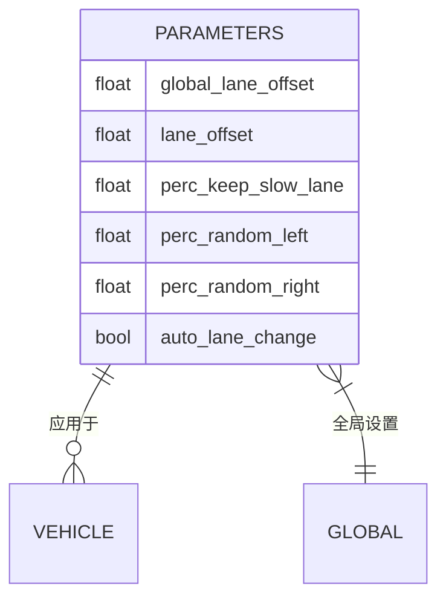
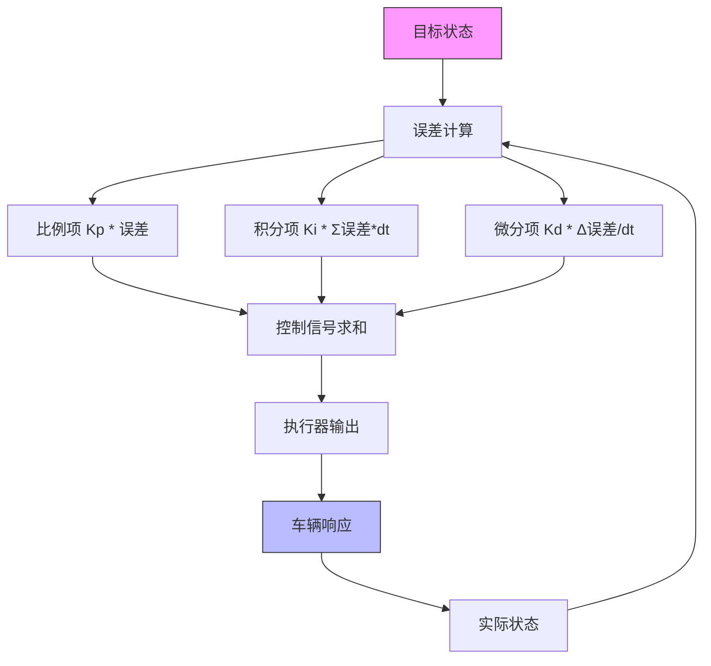
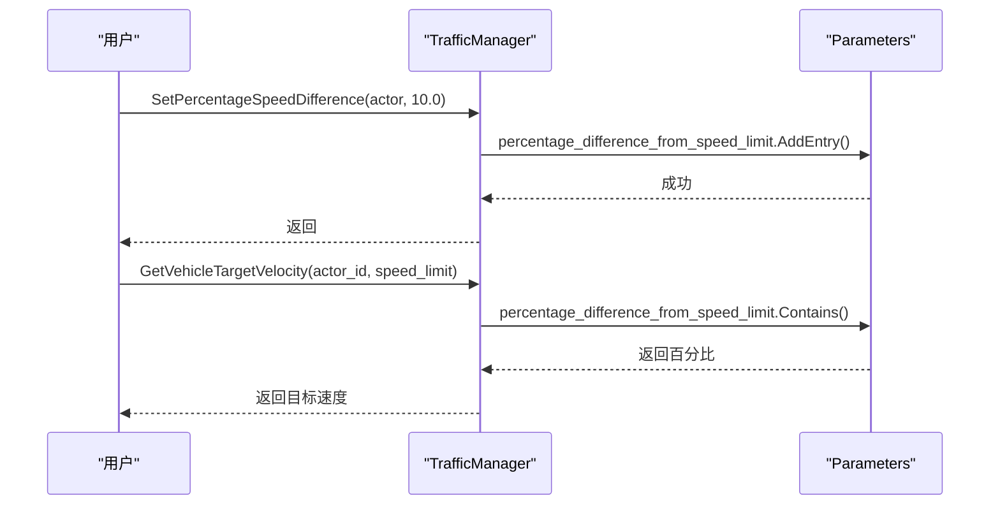
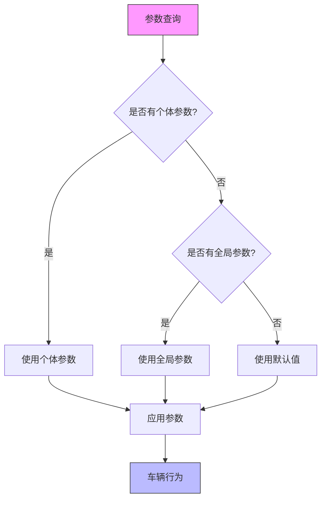
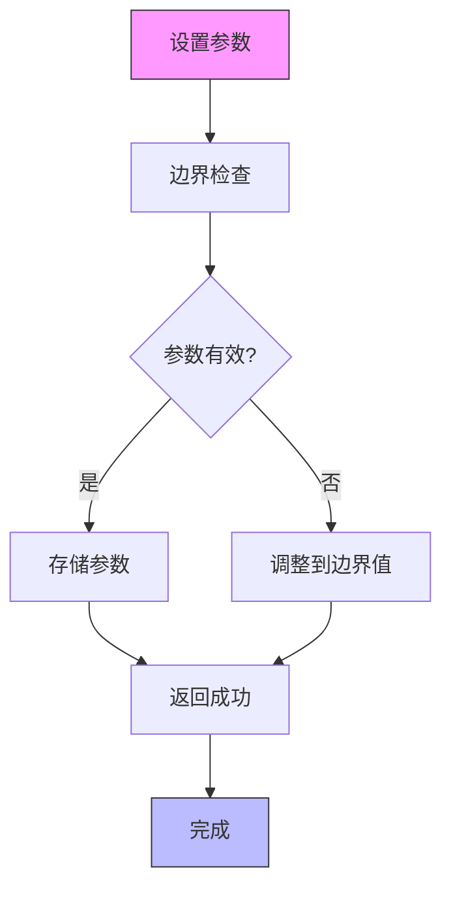
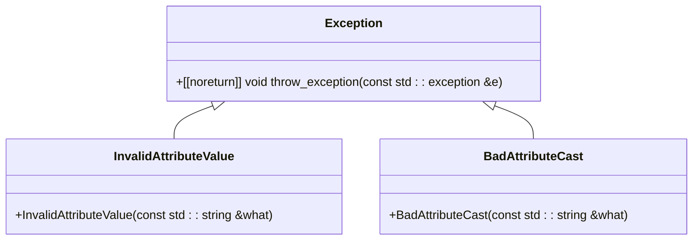
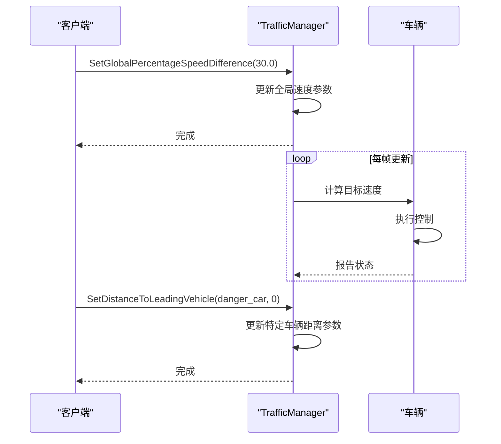

# 参数配置系统

> **引用文件**
> **本文档中引用的文件**

- [Parameters.h](https://github.com/carla-simulator/carla/blob/ue5-dev/LibCarla/source/carla/trafficmanager/Parameters.h)
- [Parameters.cpp](https://github.com/carla-simulator/carla/blob/ue5-dev/LibCarla/source/carla/trafficmanager/Parameters.cpp)
- [Constants.h](https://github.com/carla-simulator/carla/blob/ue5-dev/LibCarla/source/carla/trafficmanager/Constants.h)
- [PIDController.h](https://github.com/carla-simulator/carla/blob/ue5-dev/LibCarla/source/carla/trafficmanager/PIDController.h)
- [TrafficManager.cpp](https://github.com/carla-simulator/carla/blob/ue5-dev/PythonAPI/carla/src/TrafficManager.cpp)
- [generate_traffic.py](https://github.com/carla-simulator/carla/blob/ue5-dev/PythonAPI/examples/generate_traffic.py)
- [adv_traffic_manager.md](https://github.com/carla-simulator/carla/blob/ue5-dev/Docs/adv_traffic_manager.md)
- [tuto_G_traffic_manager.md](https://github.com/carla-simulator/carla/blob/ue5-dev/Docs/tuto_G_traffic_manager.md)

## 目录

1. [引言](#引言)
2. [核心参数配置](#核心参数配置)
3. [PID 控制器参数](#pid控制器参数)
4. [参数持久化与多组管理](#参数持久化与多组管理)
5. [参数边界检查与异常处理](#参数边界检查与异常处理)
6. [实际应用示例](#实际应用示例)
7. [参数调优指南](#参数调优指南)
8. [结论](#结论)

## 引言

CARLA 交通管理器（Traffic Manager）提供了一套全面的参数配置系统，用于精确控制模拟环境中车辆的行为。该系统允许用户配置车辆间距、速度限制、碰撞检测阈值、偏离车道容忍度等关键参数，从而创建各种交通场景以测试自动驾驶系统。参数配置系统支持全局设置和个体车辆设置，提供了灵活的控制机制。

**Section sources**

- <a href="https://github.com/carla-simulator/carla/blob/ue5-dev/Docs/tuto_G_traffic_manager.md#L1-L227" target="_blank">tuto_G_traffic_manager.md</a>
- <a href="https://github.com/carla-simulator/carla/blob/ue5-dev/Docs/adv_traffic_manager.md#L314-L351" target="_blank">adv_traffic_manager.md</a>

## 核心参数配置

### 车辆间距与速度控制

交通管理器提供了多种参数来控制车辆之间的间距和速度行为。车辆间距参数定义了车辆与前车应保持的安全距离，而速度控制参数则决定了车辆相对于道路限速的行驶速度。



**Diagram sources **

- <a href="https://github.com/carla-simulator/carla/blob/ue5-dev/LibCarla/source/carla/trafficmanager/Parameters.h#L53-L54" target="_blank">Parameters.h</a>
- <a href="https://github.com/carla-simulator/carla/blob/ue5-dev/LibCarla/source/carla/trafficmanager/Parameters.h#L41-L47" target="_blank">Parameters.h</a>
- <a href="https://github.com/carla-simulator/carla/blob/ue5-dev/PythonAPI/carla/src/TrafficManager.cpp#L92-L97" target="_blank">TrafficManager.cpp</a>

**Section sources**

- <a href="https://github.com/carla-simulator/carla/blob/ue5-dev/LibCarla/source/carla/trafficmanager/Parameters.h#L37-L300" target="_blank">Parameters.h</a>
- <a href="https://github.com/carla-simulator/carla/blob/ue5-dev/LibCarla/source/carla/trafficmanager/Parameters.cpp#L1-L486" target="_blank">Parameters.cpp</a>

### 碰撞检测与交通规则

交通管理器允许配置碰撞检测规则和交通规则遵守程度。用户可以设置车辆忽略行人、其他车辆、交通信号灯和交通标志的概率，从而创建不同风险级别的驾驶行为。



**Diagram sources **

- <a href="https://github.com/carla-simulator/carla/blob/ue5-dev/LibCarla/source/carla/trafficmanager/Parameters.h#L51-L65" target="_blank">Parameters.h</a>
- <a href="https://github.com/carla-simulator/carla/blob/ue5-dev/LibCarla/source/carla/trafficmanager/Parameters.h#L58-L61" target="_blank">Parameters.h</a>

**Section sources**

- <a href="https://github.com/carla-simulator/carla/blob/ue5-dev/LibCarla/source/carla/trafficmanager/Parameters.h#L37-L300" target="_blank">Parameters.h</a>
- <a href="https://github.com/carla-simulator/carla/blob/ue5-dev/Docs/adv_traffic_manager.md#L314-L351" target="_blank">adv_traffic_manager.md</a>

### 偏离车道容忍度

偏离车道容忍度参数控制车辆在车道内的行驶行为。通过设置车道偏移量，可以模拟车辆在车道内的不同行驶位置，如靠左或靠右行驶。此外，还可以配置车辆保持慢车道、随机变道等行为。



**Diagram sources **

- <a href="https://github.com/carla-simulator/carla/blob/ue5-dev/LibCarla/source/carla/trafficmanager/Parameters.h#L43-L49" target="_blank">Parameters.h</a>
- <a href="https://github.com/carla-simulator/carla/blob/ue5-dev/LibCarla/source/carla/trafficmanager/Parameters.h#L66-L71" target="_blank">Parameters.h</a>

**Section sources**

- <a href="https://github.com/carla-simulator/carla/blob/ue5-dev/LibCarla/source/carla/trafficmanager/Parameters.h#L37-L300" target="_blank">Parameters.h</a>
- <a href="https://github.com/carla-simulator/carla/blob/ue5-dev/Docs/tuto_G_traffic_manager.md#L199-L204" target="_blank">tuto_G_traffic_manager.md</a>

## PID 控制器参数

### PID 参数数学模型

交通管理器使用 PID 控制器来控制车辆的加速度和转向。PID 控制器通过比例（P）、积分（I）和微分（D）三个参数来调节车辆的响应。纵向 PID 控制车辆的加速度和制动，横向 PID 控制车辆的转向。



**Diagram sources **

- <a href="https://github.com/carla-simulator/carla/blob/ue5-dev/LibCarla/source/carla/trafficmanager/PIDController.h#L27-L58" target="_blank">PIDController.h</a>
- <a href="https://github.com/carla-simulator/carla/blob/ue5-dev/LibCarla/source/carla/trafficmanager/Constants.h#L145-L155" target="_blank">Constants.h</a>

**Section sources**

- <a href="https://github.com/carla-simulator/carla/blob/ue5-dev/LibCarla/source/carla/trafficmanager/PIDController.h#L1-L63" target="_blank">PIDController.h</a>
- <a href="https://github.com/carla-simulator/carla/blob/ue5-dev/LibCarla/source/carla/trafficmanager/Constants.h#L145-L165" target="_blank">Constants.h</a>

### 参数影响分析

PID 控制器的三个参数对车辆控制的稳定性和响应性有重要影响。比例增益（Kp）决定了系统对当前误差的响应强度，积分增益（Ki）消除稳态误差，微分增益（Kd）预测未来误差变化趋势。

```mermaid
classDiagram
class PIDController {
+static const float MAX_THROTTLE = 0.85f
+static const float MAX_BRAKE = 0.7f
+static const float MAX_STEERING = 0.8f
+static const std : : vector<float> LONGITUDIAL_PARAM = {12.0f, 0.05f, 0.02f}
+static const std : : vector<float> LONGITUDIAL_HIGHWAY_PARAM = {20.0f, 0.05f, 0.01f}
+static const std : : vector<float> LATERAL_PARAM = {8.0f, 0.04f, 0.16f}
+static const std : : vector<float> LATERAL_HIGHWAY_PARAM = {4.0f, 0.04f, 0.08f}
}
class MotionPlanStage {
+std : : vector<float> urban_longitudinal_parameters
+std : : vector<float> urban_lateral_parameters
+std : : vector<float> highway_longitudinal_parameters
+std : : vector<float> highway_lateral_parameters
}
PIDController --> MotionPlanStage : "提供参数"
```

**Diagram sources **

- <a href="https://github.com/carla-simulator/carla/blob/ue5-dev/LibCarla/source/carla/trafficmanager/Constants.h#L145-L155" target="_blank">Constants.h</a>
- <a href="https://github.com/carla-simulator/carla/blob/ue5-dev/LibCarla/source/carla/trafficmanager/MotionPlanStage.cpp#L186-L194" target="_blank">MotionPlanStage.cpp</a>

**Section sources**

- <a href="https://github.com/carla-simulator/carla/blob/ue5-dev/LibCarla/source/carla/trafficmanager/PIDController.h#L1-L63" target="_blank">PIDController.h</a>
- <a href="https://github.com/carla-simulator/carla/blob/ue5-dev/LibCarla/source/carla/trafficmanager/Constants.h#L145-L165" target="_blank">Constants.h</a>

## 参数持久化与多组管理

### 参数持久化机制

交通管理器的参数配置具有持久化特性，参数值在车辆生命周期内保持有效。参数存储在 AtomicMap 等线程安全的数据结构中，确保在多线程环境下的数据一致性。



**Diagram sources **

- <a href="https://github.com/carla-simulator/carla/blob/ue5-dev/LibCarla/source/carla/trafficmanager/Parameters.cpp#L43-L50" target="_blank">Parameters.cpp</a>
- <a href="https://github.com/carla-simulator/carla/blob/ue5-dev/LibCarla/source/carla/trafficmanager/Parameters.cpp#L254-L264" target="_blank">Parameters.cpp</a>

**Section sources**

- <a href="https://github.com/carla-simulator/carla/blob/ue5-dev/LibCarla/source/carla/trafficmanager/Parameters.h#L37-L300" target="_blank">Parameters.h</a>
- <a href="https://github.com/carla-simulator/carla/blob/ue5-dev/LibCarla/source/carla/trafficmanager/Parameters.cpp#L1-L486" target="_blank">Parameters.cpp</a>

### 多组参数管理策略

交通管理器支持多组参数管理，允许为不同车辆设置不同的行为参数。系统区分全局参数和个体参数，个体参数优先级高于全局参数。



**Diagram sources **

- <a href="https://github.com/carla-simulator/carla/blob/ue5-dev/LibCarla/source/carla/trafficmanager/Parameters.cpp#L254-L264" target="_blank">Parameters.cpp</a>
- <a href="https://github.com/carla-simulator/carla/blob/ue5-dev/LibCarla/source/carla/trafficmanager/Parameters.cpp#L267-L274" target="_blank">Parameters.cpp</a>

**Section sources**

- <a href="https://github.com/carla-simulator/carla/blob/ue5-dev/LibCarla/source/carla/trafficmanager/Parameters.h#L37-L300" target="_blank">Parameters.h</a>
- <a href="https://github.com/carla-simulator/carla/blob/ue5-dev/LibCarla/source/carla/trafficmanager/Parameters.cpp#L1-L486" target="_blank">Parameters.cpp</a>

## 参数边界检查与异常处理

### 边界检查机制

交通管理器在设置参数时实施严格的边界检查，确保参数值在合理范围内。例如，速度百分比差异被限制在 0-100%之间，距离参数被限制为非负值。



**Diagram sources **

- <a href="https://github.com/carla-simulator/carla/blob/ue5-dev/LibCarla/source/carla/trafficmanager/Parameters.cpp#L45-L46" target="_blank">Parameters.cpp</a>
- <a href="https://github.com/carla-simulator/carla/blob/ue5-dev/LibCarla/source/carla/trafficmanager/Parameters.cpp#L59-L60" target="_blank">Parameters.cpp</a>
- <a href="https://github.com/carla-simulator/carla/blob/ue5-dev/LibCarla/source/carla/trafficmanager/Parameters.cpp#L142-L143" target="_blank">Parameters.cpp</a>

**Section sources**

- <a href="https://github.com/carla-simulator/carla/blob/ue5-dev/LibCarla/source/carla/trafficmanager/Parameters.cpp#L1-L486" target="_blank">Parameters.cpp</a>
- <a href="https://github.com/carla-simulator/carla/blob/ue5-dev/LibCarla/source/carla/Exception.h#L1-L90" target="_blank">Exception.h</a>

### 异常处理策略

系统采用分层异常处理策略，捕获并处理各种可能的异常情况。异常处理机制确保系统在遇到无效参数或操作时能够优雅降级而非崩溃。



**Diagram sources **

- <a href="https://github.com/carla-simulator/carla/blob/ue5-dev/LibCarla/source/carla/Exception.h#L25-L32" target="_blank">Exception.h</a>
- <a href="https://github.com/carla-simulator/carla/blob/ue5-dev/LibCarla/source/carla/client/ActorAttribute.h#L25-L29" target="_blank">ActorAttribute.h</a>
- <a href="https://github.com/carla-simulator/carla/blob/ue5-dev/LibCarla/source/carla/client/ActorAttribute.h#L37-L40" target="_blank">ActorAttribute.h</a>

**Section sources**

- <a href="https://github.com/carla-simulator/carla/blob/ue5-dev/LibCarla/source/carla/Exception.h#L1-L90" target="_blank">Exception.h</a>
- <a href="https://github.com/carla-simulator/carla/blob/ue5-dev/LibCarla/source/carla/client/ActorAttribute.h#L1-L41" target="_blank">ActorAttribute.h</a>

## 实际应用示例

### 动态参数调整

以下示例展示了如何通过 API 动态调整交通管理器参数并观察交通流变化。



**Diagram sources **

- <a href="https://github.com/carla-simulator/carla/blob/ue5-dev/PythonAPI/examples/generate_traffic.py#L289-L291" target="_blank">generate_traffic.py</a>
- <a href="https://github.com/carla-simulator/carla/blob/ue5-dev/Docs/adv_traffic_manager.md#L317-L324" target="_blank">adv_traffic_manager.md</a>

**Section sources**

- <a href="https://github.com/carla-simulator/carla/blob/ue5-dev/PythonAPI/examples/generate_traffic.py#L1-L327" target="_blank">generate_traffic.py</a>
- <a href="https://github.com/carla-simulator/carla/blob/ue5-dev/Docs/adv_traffic_manager.md#L314-L351" target="_blank">adv_traffic_manager.md</a>

## 参数调优指南

### 不同交通密度场景

针对不同交通密度场景，推荐以下参数配置：

```mermaid
erDiagram
SCENARIO {
string name
float vehicle_density
float speed_limit_percentage
float distance_to_leading_vehicle
float ignore_lights_percentage
float ignore_walkers_percentage
}
SCENARIO ||--o{ LOW_DENSITY : "低密度"
SCENARIO ||--o{ MEDIUM_DENSITY : "中密度"
SCENARIO ||--o{ HIGH_DENSITY : "高密度"
LOW_DENSITY {
float speed_limit_percentage = 80
float distance_to_leading_vehicle = 5.0
float ignore_lights_percentage = 0
float ignore_walkers_percentage = 0
}
MEDIUM_DENSITY {
float speed_limit_percentage = 60
float distance_to_leading_vehicle = 3.0
float ignore_lights_percentage = 10
float ignore_walkers_percentage = 5
}
HIGH_DENSITY {
float speed_limit_percentage = 40
float distance_to_leading_vehicle = 1.5
float ignore_lights_percentage = 30
float ignore_walkers_percentage = 20
}
```

**Diagram sources **

- <a href="https://github.com/carla-simulator/carla/blob/ue5-dev/Docs/adv_traffic_manager.md#L327-L339" target="_blank">adv_traffic_manager.md</a>
- <a href="https://github.com/carla-simulator/carla/blob/ue5-dev/PythonAPI/examples/generate_traffic.py#L116-L117" target="_blank">generate_traffic.py</a>

**Section sources**

- <a href="https://github.com/carla-simulator/carla/blob/ue5-dev/Docs/adv_traffic_manager.md#L314-L351" target="_blank">adv_traffic_manager.md</a>
- <a href="https://github.com/carla-simulator/carla/blob/ue5-dev/PythonAPI/examples/generate_traffic.py#L1-L327" target="_blank">generate_traffic.py</a>

## 结论

CARLA 交通管理器的参数配置系统提供了一套强大而灵活的工具，用于精确控制模拟环境中车辆的行为。通过合理配置各种参数，可以创建从简单到复杂的各种交通场景，为自动驾驶系统的测试和验证提供支持。系统设计考虑了参数的持久化、多组管理、边界检查和异常处理，确保了配置的可靠性和稳定性。
