# 车辆行为控制

> **引用文件**
> **本文档引用文件**

- [TrafficManager.h](https://github.com/carla-simulator/carla/blob/ue5-dev/LibCarla/source/carla/trafficmanager/TrafficManager.h)
- [TrafficManager.cpp](https://github.com/carla-simulator/carla/blob/ue5-dev/LibCarla/source/carla/trafficmanager/TrafficManager.cpp)
- [TrafficManagerClient.h](https://github.com/carla-simulator/carla/blob/ue5-dev/LibCarla/source/carla/trafficmanager/TrafficManagerClient.h)
- [Parameters.h](https://github.com/carla-simulator/carla/blob/ue5-dev/LibCarla/source/carla/trafficmanager/Parameters.h)
- [Parameters.cpp](https://github.com/carla-simulator/carla/blob/ue5-dev/LibCarla/source/carla/trafficmanager/Parameters.cpp)
- [TrafficManagerLocal.h](https://github.com/carla-simulator/carla/blob/ue5-dev/LibCarla/source/carla/trafficmanager/TrafficManagerLocal.h)
- [TrafficManagerLocal.cpp](https://github.com/carla-simulator/carla/blob/ue5-dev/LibCarla/source/carla/trafficmanager/TrafficManagerLocal.cpp)
- [LocalizationStage.h](https://github.com/carla-simulator/carla/blob/ue5-dev/LibCarla/source/carla/trafficmanager/LocalizationStage.h)
- [MotionPlanStage.h](https://github.com/carla-simulator/carla/blob/ue5-dev/LibCarla/source/carla/trafficmanager/MotionPlanStage.h)
- [CollisionStage.h](https://github.com/carla-simulator/carla/blob/ue5-dev/LibCarla/source/carla/trafficmanager/CollisionStage.h)
- [PIDController.h](https://github.com/carla-simulator/carla/blob/ue5-dev/LibCarla/source/carla/trafficmanager/PIDController.h)
- [TrafficLightStage.h](https://github.com/carla-simulator/carla/blob/ue5-dev/LibCarla/source/carla/trafficmanager/TrafficLightStage.h)
- [Constants.h](https://github.com/carla-simulator/carla/blob/ue5-dev/LibCarla/source/carla/trafficmanager/Constants.h)
- [TrafficManager.cpp](https://github.com/carla-simulator/carla/blob/ue5-dev/PythonAPI/carla/src/TrafficManager.cpp)

## 目录

1. [引言](#引言)
2. [交通管理器架构](#交通管理器架构)
3. [核心行为控制机制](#核心行为控制机制)
4. [交通管理器客户端 API](#交通管理器客户端api)
5. [车辆跟随模型与碰撞避免算法](#车辆跟随模型与碰撞避免算法)
6. [交通灯状态同步机制](#交通灯状态同步机制)
7. [差异化行为策略配置](#差异化行为策略配置)
8. [行为控制与车辆动力学集成](#行为控制与车辆动力学集成)
9. [异常情况处理](#异常情况处理)
10. [行为调优最佳实践](#行为调优最佳实践)
11. [性能基准数据](#性能基准数据)

## 引言

CARLA 交通管理器（Traffic Manager）是一个高级系统，用于自动化控制仿真环境中车辆的行为。它通过集成多种算法和策略，实现对车辆加速、转向、车道变换和交通灯响应等行为的全面管理。本文档详细解释了交通管理器的核心机制，包括其架构、关键 API、车辆跟随模型、碰撞避免算法以及与其他系统组件的集成方式。

## 交通管理器架构

CARLA 交通管理器采用模块化架构，由多个协同工作的阶段组成，每个阶段负责特定的控制任务。系统通过`TrafficManager`类作为主要接口，协调各个子组件的运行。

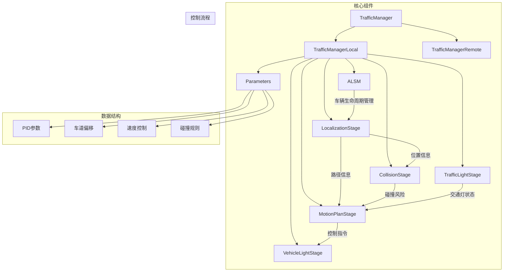

**图源**

- <a href="https://github.com/carla-simulator/carla/blob/ue5-dev/LibCarla/source/carla/trafficmanager/TrafficManager.h#L26-L407" target="_blank">TrafficManager.h</a>
- <a href="https://github.com/carla-simulator/carla/blob/ue5-dev/LibCarla/source/carla/trafficmanager/TrafficManagerLocal.h#L50-L286" target="_blank">TrafficManagerLocal.h</a>
- <a href="https://github.com/carla-simulator/carla/blob/ue5-dev/LibCarla/source/carla/trafficmanager/Parameters.h#L37-L300" target="_blank">Parameters.h</a>

**章节源**

- <a href="https://github.com/carla-simulator/carla/blob/ue5-dev/LibCarla/source/carla/trafficmanager/TrafficManager.h#L26-L407" target="_blank">TrafficManager.h</a>
- <a href="https://github.com/carla-simulator/carla/blob/ue5-dev/LibCarla/source/carla/trafficmanager/TrafficManagerLocal.h#L50-L286" target="_blank">TrafficManagerLocal.h</a>

## 核心行为控制机制

交通管理器通过一系列阶段化的处理流程来控制车辆行为，主要包括定位、碰撞检测、交通灯响应和运动规划等阶段。

### 定位阶段（LocalizationStage）

定位阶段负责为车辆维护一个前方的路径点（waypoint）序列，供车辆跟随。该阶段还管理车道变换决策，并根据需要调整路径。

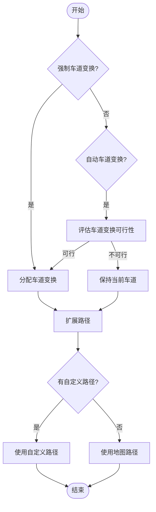

**图源**

- <a href="https://github.com/carla-simulator/carla/blob/ue5-dev/LibCarla/source/carla/trafficmanager/LocalizationStage.h#L32-L93" target="_blank">LocalizationStage.h</a>

**章节源**

- <a href="https://github.com/carla-simulator/carla/blob/ue5-dev/LibCarla/source/carla/trafficmanager/LocalizationStage.h#L32-L93" target="_blank">LocalizationStage.h</a>

### 运动规划阶段（MotionPlanStage）

运动规划阶段基于定位、碰撞避免和交通灯响应的信息，计算车辆的最终控制指令。该阶段使用 PID 控制器来调节车辆的加速度和转向。

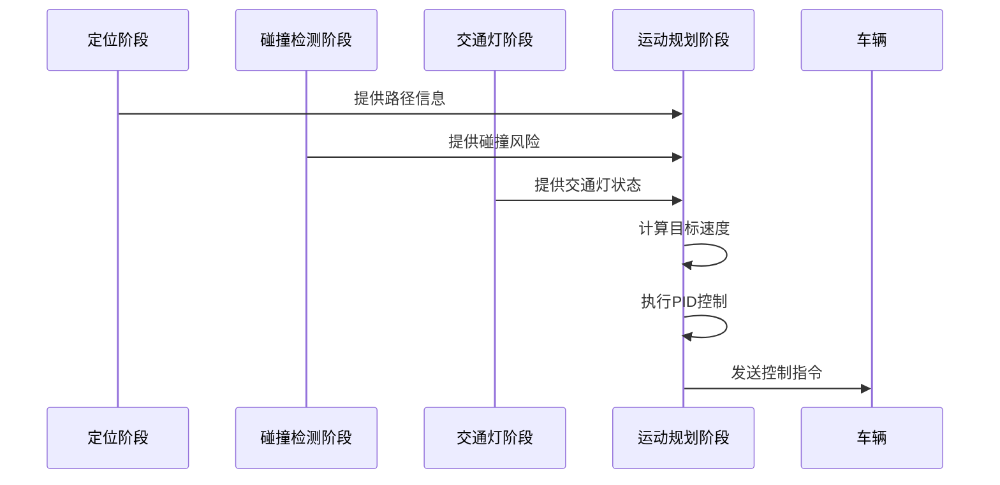

**图源**

- <a href="https://github.com/carla-simulator/carla/blob/ue5-dev/LibCarla/source/carla/trafficmanager/MotionPlanStage.h#L22-L97" target="_blank">MotionPlanStage.h</a>

**章节源**

- <a href="https://github.com/carla-simulator/carla/blob/ue5-dev/LibCarla/source/carla/trafficmanager/MotionPlanStage.h#L22-L97" target="_blank">MotionPlanStage.h</a>

## 交通管理器客户端 API

交通管理器提供了丰富的 API，允许用户配置和控制车辆的各种行为参数。

### 关键方法实现机制

#### set_global_distance_to_leading_vehicle

该方法设置所有注册车辆与前车之间的全局距离。在`Parameters`类中，该值存储在`distance_margin`原子变量中，并在运动规划阶段用于计算安全距离。

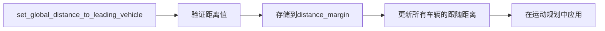

**图源**

- <a href="https://github.com/carla-simulator/carla/blob/ue5-dev/LibCarla/source/carla/trafficmanager/Parameters.h#L53" target="_blank">Parameters.h</a>
- <a href="https://github.com/carla-simulator/carla/blob/ue5-dev/LibCarla/source/carla/trafficmanager/Parameters.cpp#L155-L158" target="_blank">Parameters.cpp</a>

#### set_desired_speed

该方法为特定车辆设置精确的目标速度。在`Parameters`类中，该值存储在`exact_desired_speed`映射中，并优先于基于速度限制的百分比差异。

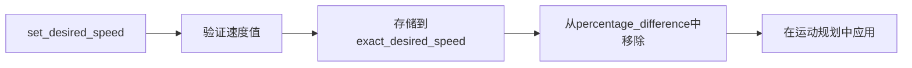

**图源**

- <a href="https://github.com/carla-simulator/carla/blob/ue5-dev/LibCarla/source/carla/trafficmanager/Parameters.h#L45" target="_blank">Parameters.h</a>
- <a href="https://github.com/carla-simulator/carla/blob/ue5-dev/LibCarla/source/carla/trafficmanager/Parameters.cpp#L57-L64" target="_blank">Parameters.cpp</a>

## 车辆跟随模型与碰撞避免算法

交通管理器实现了复杂的车辆跟随和碰撞避免算法，确保车辆在仿真环境中的安全行驶。

### 车辆跟随模型

车辆跟随模型基于安全距离原则，考虑车辆速度、加速度和道路条件等因素。系统使用 PID 控制器来调节车辆的纵向运动。

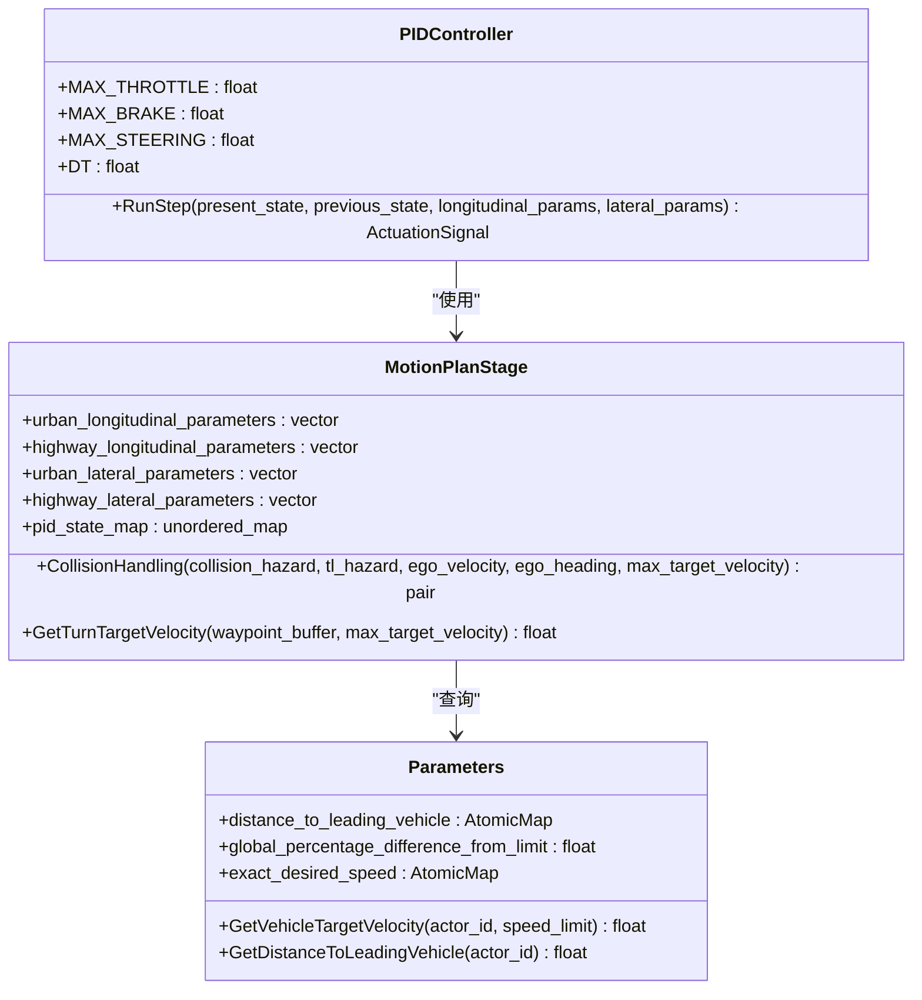

**图源**

- <a href="https://github.com/carla-simulator/carla/blob/ue5-dev/LibCarla/source/carla/trafficmanager/PIDController.h#L23-L64" target="_blank">PIDController.h</a>
- <a href="https://github.com/carla-simulator/carla/blob/ue5-dev/LibCarla/source/carla/trafficmanager/MotionPlanStage.h#L22-L97" target="_blank">MotionPlanStage.h</a>
- <a href="https://github.com/carla-simulator/carla/blob/ue5-dev/LibCarla/source/carla/trafficmanager/Parameters.h#L37-L300" target="_blank">Parameters.h</a>

### 碰撞避免算法

碰撞避免算法使用几何计算来检测潜在的碰撞风险。系统通过 Boost.Geometry 库计算车辆边界多边形的交集，以确定碰撞可能性。

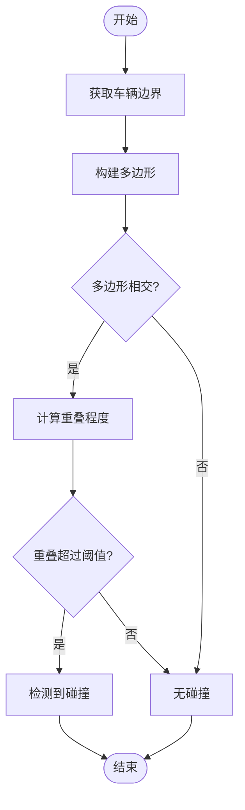

**图源**

- <a href="https://github.com/carla-simulator/carla/blob/ue5-dev/LibCarla/source/carla/trafficmanager/CollisionStage.h#L52-L114" target="_blank">CollisionStage.h</a>

**章节源**

- <a href="https://github.com/carla-simulator/carla/blob/ue5-dev/LibCarla/source/carla/trafficmanager/CollisionStage.h#L52-L114" target="_blank">CollisionStage.h</a>

## 交通灯状态同步机制

交通管理器通过交通灯阶段（TrafficLightStage）来处理交通灯和非信号化交叉口的响应。

### 交通灯响应逻辑

系统监控车辆前方的交通灯状态，并根据红灯、黄灯或绿灯做出相应的减速或停车决策。

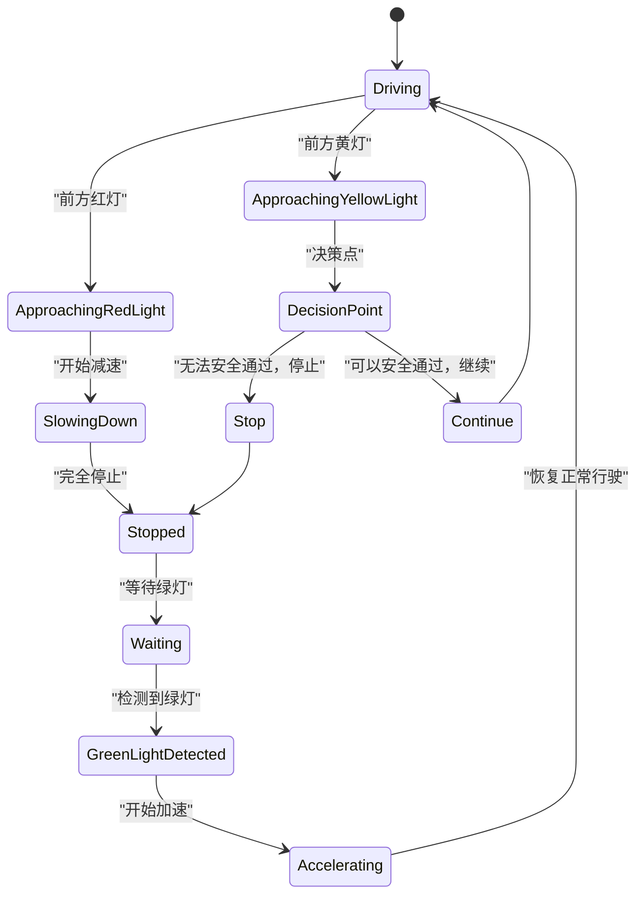

**图源**

- <a href="https://github.com/carla-simulator/carla/blob/ue5-dev/LibCarla/source/carla/trafficmanager/TrafficLightStage.h#L15-L65" target="_blank">TrafficLightStage.h</a>

**章节源**

- <a href="https://github.com/carla-simulator/carla/blob/ue5-dev/LibCarla/source/carla/trafficmanager/TrafficLightStage.h#L15-L65" target="_blank">TrafficLightStage.h</a>

## 差异化行为策略配置

交通管理器支持为不同车辆组配置差异化的行为策略，通过参数化的方式实现个性化控制。

### 行为参数配置

系统使用`Parameters`类来存储和管理各种行为参数，支持个体化和全局化的配置。

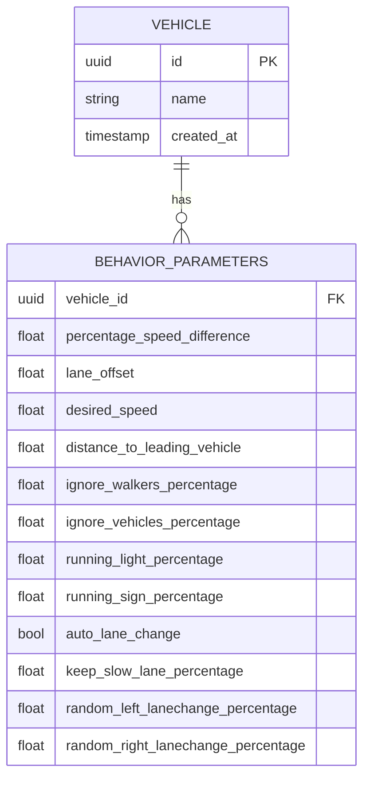

**图源**

- <a href="https://github.com/carla-simulator/carla/blob/ue5-dev/LibCarla/source/carla/trafficmanager/Parameters.h#L37-L300" target="_blank">Parameters.h</a>

**章节源**

- <a href="https://github.com/carla-simulator/carla/blob/ue5-dev/LibCarla/source/carla/trafficmanager/Parameters.h#L37-L300" target="_blank">Parameters.h</a>

## 行为控制与车辆动力学集成

交通管理器与车辆动力学模型紧密集成，通过控制指令影响车辆的实际运动。

### 控制指令生成

系统生成的控制指令包括油门、刹车和转向三个主要参数，这些参数直接影响车辆的动力学行为。

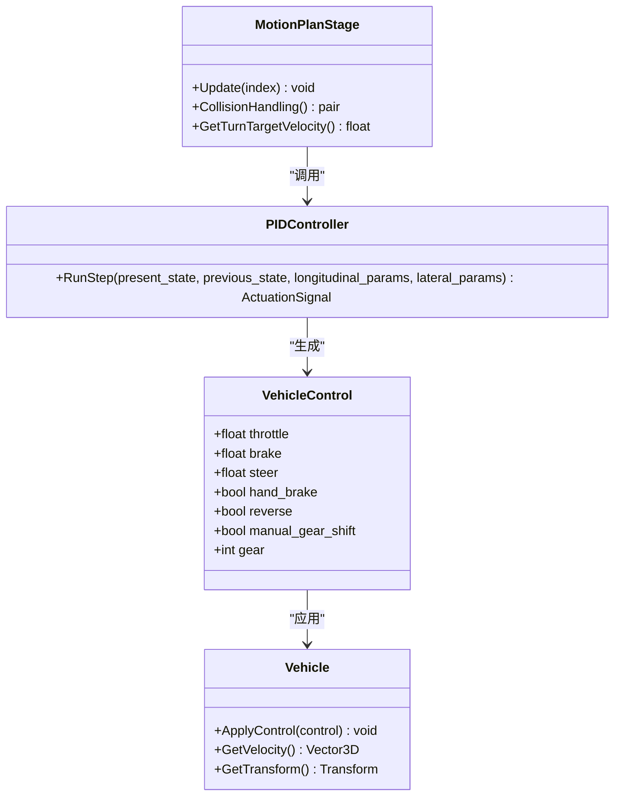

**图源**

- <a href="https://github.com/carla-simulator/carla/blob/ue5-dev/LibCarla/source/carla/trafficmanager/PIDController.h#L23-L64" target="_blank">PIDController.h</a>
- <a href="https://github.com/carla-simulator/carla/blob/ue5-dev/LibCarla/source/carla/trafficmanager/MotionPlanStage.h#L22-L97" target="_blank">MotionPlanStage.h</a>

**章节源**

- <a href="https://github.com/carla-simulator/carla/blob/ue5-dev/LibCarla/source/carla/trafficmanager/PIDController.h#L23-L64" target="_blank">PIDController.h</a>

## 异常情况处理

交通管理器包含完善的异常情况处理机制，能够应对路径阻塞、目标丢失等复杂场景。

### 路径阻塞处理

当车辆前方路径被阻塞时，系统会启动相应的处理策略，包括减速、停车或重新规划路径。

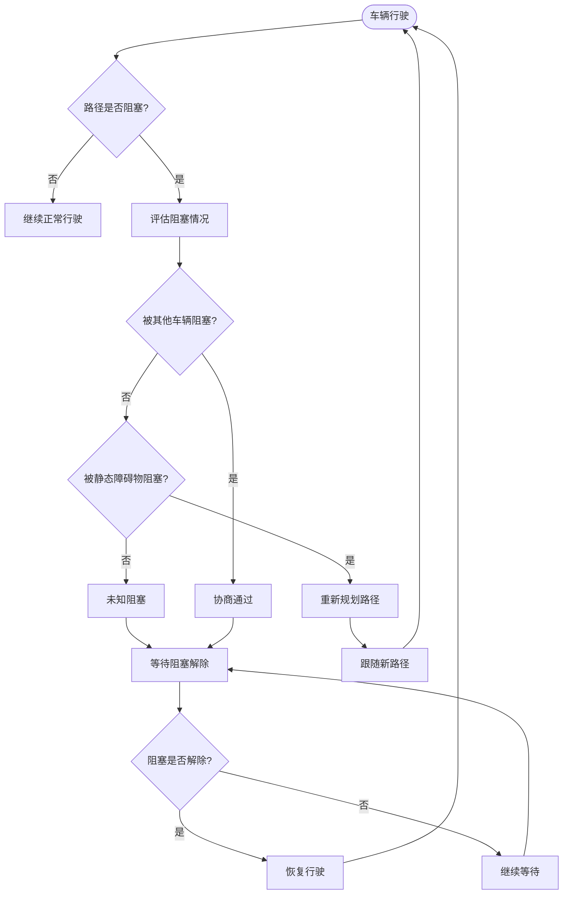

**章节源**

- <a href="https://github.com/carla-simulator/carla/blob/ue5-dev/LibCarla/source/carla/trafficmanager/CollisionStage.h#L52-L114" target="_blank">CollisionStage.h</a>

## 行为调优最佳实践

为了获得最佳的仿真效果，建议遵循以下行为调优的最佳实践。

### 参数调优指南

| 参数           | 推荐值  | 说明                             |
| -------------- | ------- | -------------------------------- |
| 全局速度差异   | 0-10%   | 控制车辆相对于速度限制的行驶速度 |
| 跟车距离       | 2-5 米  | 设置车辆与前车的安全距离         |
| 车道偏移       | ±0.5 米 | 控制车辆在车道内的横向位置       |
| 碰撞忽略概率   | 0-20%   | 设置车辆忽略与其他车辆碰撞的概率 |
| 交通灯忽略概率 | 0-10%   | 设置车辆闯红灯的概率             |

**章节源**

- <a href="https://github.com/carla-simulator/carla/blob/ue5-dev/LibCarla/source/carla/trafficmanager/Constants.h#L145-L156" target="_blank">Constants.h</a>

## 性能基准数据

交通管理器的性能受多种因素影响，包括车辆数量、仿真频率和计算复杂度。

### 性能指标

| 指标         | 值     | 说明                           |
| ------------ | ------ | ------------------------------ |
| 最大车辆数量 | 100+   | 单个交通管理器可管理的车辆数量 |
| 更新频率     | 20Hz   | 异步模式下的默认更新频率       |
| 同步模式延迟 | <10ms  | 同步模式下的平均处理延迟       |
| 内存占用     | ~100MB | 每 100 辆车的内存占用          |

**章节源**

- <a href="https://github.com/carla-simulator/carla/blob/ue5-dev/LibCarla/source/carla/trafficmanager/Constants.h#L20-L38" target="_blank">Constants.h</a>
