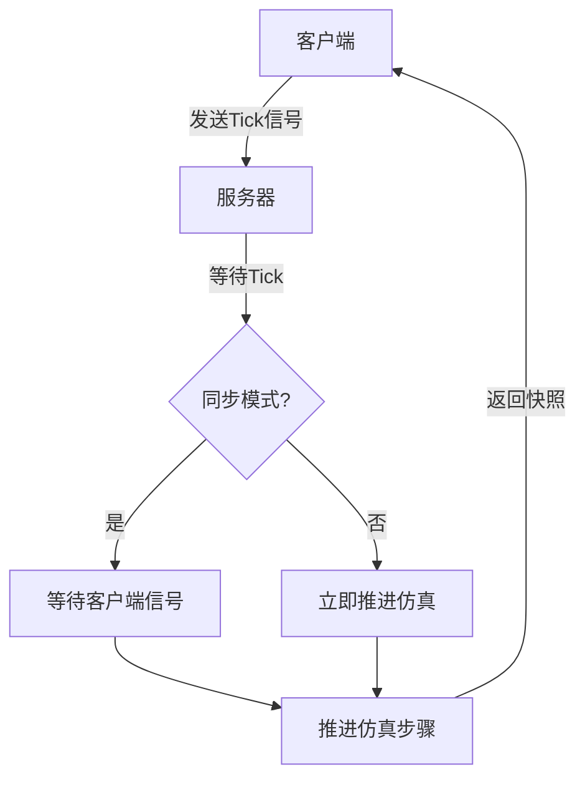
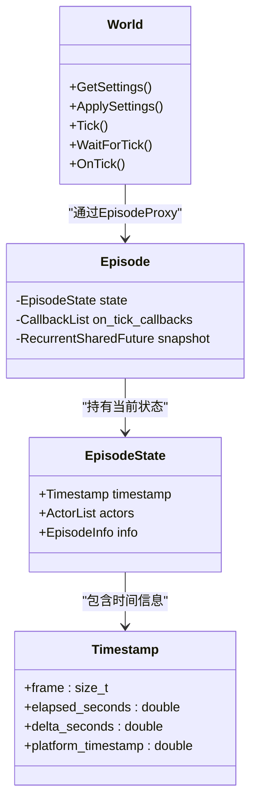
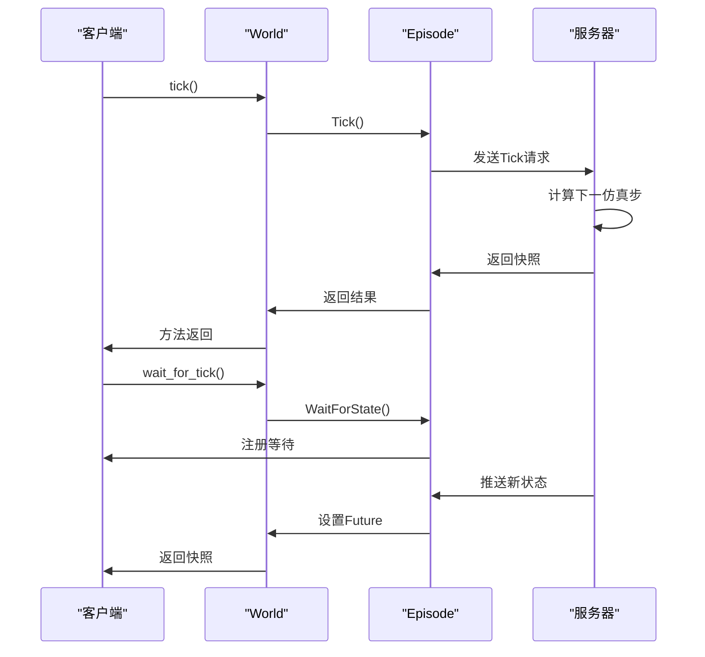
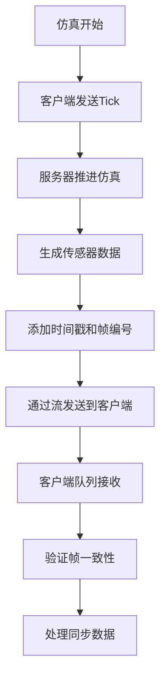

# 同步模式

> **引用文件**
> **本文档引用的文件**

- [adv_synchrony_timestep.md](https://github.com/carla-simulator/carla/blob/ue5-dev/Docs/adv_synchrony_timestep.md)
- [World.cpp](https://github.com/carla-simulator/carla/blob/ue5-dev/LibCarla/source/carla/client/World.cpp)
- [World.h](https://github.com/carla-simulator/carla/blob/ue5-dev/LibCarla/source/carla/client/World.h)
- [Episode.h](https://github.com/carla-simulator/carla/blob/ue5-dev/LibCarla/source/carla/client/detail/Episode.h)
- [sensor_synchronization.py](https://github.com/carla-simulator/carla/blob/ue5-dev/PythonAPI/examples/sensor_synchronization.py)
- [test_sync.py](https://github.com/carla-simulator/carla/blob/ue5-dev/PythonAPI/test/smoke/test_sync.py)
- [Timestamp.h](https://github.com/carla-simulator/carla/blob/ue5-dev/LibCarla/source/carla/client/Timestamp.h)
- [WorldSnapshot.h](https://github.com/carla-simulator/carla/blob/ue5-dev/LibCarla/source/carla/client/WorldSnapshot.h)
- [SensorHeaderSerializer.h](https://github.com/carla-simulator/carla/blob/ue5-dev/LibCarla/source/carla/sensor/s11n/SensorHeaderSerializer.h)

## 目录

1. [简介](#简介)
2. [同步模式与时间步长](#同步模式与时间步长)
3. [同步模式的实现原理](#同步模式的实现原理)
4. [World.tick()与 World.wait_for_tick()方法](#worldtick与worldwait_for_tick方法)
5. [传感器数据同步机制](#传感器数据同步机制)
6. [同步模式配置与代码示例](#同步模式配置与代码示例)
7. [同步模式与异步模式性能对比](#同步模式与异步模式性能对比)
8. [常见问题与优化技巧](#常见问题与优化技巧)
9. [结论](#结论)

## 简介

同步模式是 CARLA 自动驾驶仿真中的核心机制，它通过客户端-服务器架构的精确协调，确保仿真的可重复性和确定性行为。在自动驾驶系统开发中，特别是在传感器融合、算法验证和数据采集等场景下，同步模式能够保证所有传感器数据在同一仿真时刻被捕获，从而避免因时间不同步导致的数据错位问题。

CARLA 的同步模式结合固定时间步长机制，使客户端能够完全控制仿真进度。服务器在每个时间步等待客户端的"tick"信号后才推进仿真，这种机制特别适用于处理速度较慢的客户端应用或需要多传感器数据精确对齐的复杂场景。本文档将深入探讨同步模式的实现原理、关键 API 使用方法、传感器数据同步策略以及实际应用中的最佳实践。

**Section sources**

- <a href="https://github.com/carla-simulator/carla/blob/ue5-dev/Docs/adv_synchrony_timestep.md#L3-L282" target="_blank">adv_synchrony_timestep.md</a>

## 同步模式与时间步长

CARLA 仿真中的时间管理由两个关键概念构成：时间步长（time-step）和客户端-服务器同步（client-server synchrony）。这两个概念共同决定了仿真时间的推进方式和客户端与服务器之间的交互模式。

### 时间步长

时间步长定义了仿真中连续两个状态之间的时间间隔。CARLA 支持两种时间步长模式：

**可变时间步长**：这是 CARLA 的默认模式。仿真时间步长等于服务器计算两个仿真步骤所花费的真实时间。在这种模式下，仿真时间与真实时间保持同步，但可能导致物理模拟的不稳定性，特别是在服务器负载波动时。

**固定时间步长**：仿真时间步长保持恒定，无论服务器计算所需的真实时间如何。例如，设置为 0.05 秒的固定时间步长意味着每秒进行 20 个仿真步骤。固定时间步长是实现可重复仿真和精确物理模拟的关键。

### 客户端-服务器同步

CARLA 采用客户端-服务器架构，其中服务器运行仿真，客户端负责获取信息和请求世界变更。同步模式决定了服务器如何响应客户端的请求：

**异步模式**：服务器以最快速度运行仿真，不等待客户端。这是默认模式，适合实时性要求高但对数据同步精度要求不高的场景。

**同步模式**：服务器在每个仿真步骤前等待客户端的"tick"信号。只有收到客户端的推进信号后，服务器才会计算下一个仿真状态。这种模式确保了客户端有足够时间处理当前步骤的数据，避免了数据溢出和丢失。



**Diagram sources**

- <a href="https://github.com/carla-simulator/carla/blob/ue5-dev/Docs/adv_synchrony_timestep.md#L113-L184" target="_blank">adv_synchrony_timestep.md</a>

## 同步模式的实现原理

CARLA 的同步模式基于客户端-服务器架构的精确协调机制，其核心是 Episode（剧集）概念，代表一个完整的仿真会话。每个 Episode 包含当前仿真状态、时间戳信息和所有参与者（actors）的快照。

### Episode 与 World 的关系

在 CARLA 架构中，World 类是客户端访问仿真环境的主要接口，而 Episode 类则管理着仿真的核心状态。World 通过 EpisodeProxy 与底层的 Episode 实例进行通信。当客户端调用 World.tick()时，实际上是向 Episode 发送推进信号。

Episode 类维护着一个原子共享指针（AtomicSharedPtr）指向当前的 EpisodeState，该状态包含时间戳、参与者列表和世界变换等信息。这种设计确保了多线程环境下的数据一致性。

### 时间同步机制

同步模式的时间控制依赖于 EpisodeState 中的时间戳系统。每个仿真步骤都有一个唯一的帧编号（frame number），该编号在每次 tick 时递增。时间戳包含四个关键字段：

- **帧编号**：自仿真启动以来经过的帧数
- **已过时间**：当前场景开始以来经过的模拟秒数
- **时间增量**：与前一帧之间经过的模拟秒数
- **平台时间戳**：操作系统提供的实际时间戳

这种多维度时间表示确保了仿真时间与真实时间的精确对应，即使在不同硬件平台上也能实现可重复的仿真结果。



**Diagram sources**

- <a href="https://github.com/carla-simulator/carla/blob/ue5-dev/LibCarla/source/carla/client/World.h#L44-L238" target="_blank">World.h</a>
- <a href="https://github.com/carla-simulator/carla/blob/ue5-dev/LibCarla/source/carla/client/detail/Episode.h#L33-L136" target="_blank">Episode.h</a>
- <a href="https://github.com/carla-simulator/carla/blob/ue5-dev/LibCarla/source/carla/client/Timestamp.h#L14-L48" target="_blank">Timestamp.h</a>

## World.tick()与 World.wait_for_tick()方法

在同步模式下，World.tick()和 World.wait_for_tick()是控制仿真进度的两个核心方法，它们提供了不同的时间控制策略来满足各种应用场景的需求。

### World.tick()方法

World.tick()是同步模式下的主动推进机制。当客户端调用此方法时，它向服务器发送一个"tick"信号，指示服务器计算下一个仿真步骤。该方法会阻塞直到服务器完成计算并返回结果。

在实现层面，World.tick()通过 EpisodeProxy 调用底层 Episode 的 Tick 方法。该方法首先设置本地超时时间，然后调用 Episode 的 Tick 方法。如果在指定超时时间内没有收到服务器响应，将抛出超时异常。

```python
# 同步模式下的基本使用模式
settings = world.get_settings()
settings.synchronous_mode = True
settings.fixed_delta_seconds = 0.05
world.apply_settings(settings)

while True:
    world.tick()  # 主动推进仿真
    # 处理当前步骤的数据
```

### World.wait_for_tick()方法

World.wait_for_tick()提供了一种被动等待机制。客户端调用此方法后会阻塞，直到服务器主动推送下一个仿真步骤的快照。这种方法适用于客户端处理时间不确定的场景，确保客户端在处理完当前数据后再接收新数据。

该方法的实现基于 Episode 的 WaitForState 机制，使用 RecurrentSharedFuture 模式来管理异步结果。客户端注册一个等待条件，当新的 EpisodeState 可用时，Future 对象会被设置，从而唤醒等待的客户端线程。

```python
# 使用wait_for_tick的模式
world_snapshot = world.wait_for_tick()  # 等待服务器推送
# 处理接收到的数据
```

### 方法选择策略

选择使用 tick()还是 wait_for_tick()取决于具体的应用需求：

- **使用 tick()**：当客户端需要完全控制仿真节奏，或在处理完数据后立即推进仿真时
- **使用 wait_for_tick()**：当客户端处理时间不确定，需要确保有足够时间处理每帧数据时
- **混合使用**：在复杂场景中，可以结合使用两种方法，例如在初始化阶段使用 wait_for_tick，然后切换到 tick()进行主动控制



**Diagram sources**

- <a href="https://github.com/carla-simulator/carla/blob/ue5-dev/LibCarla/source/carla/client/World.cpp#L157-L160" target="_blank">World.cpp</a>
- <a href="https://github.com/carla-simulator/carla/blob/ue5-dev/LibCarla/source/carla/client/detail/Episode.h#L63-L65" target="_blank">Episode.h</a>

## 传感器数据同步机制

在自动驾驶仿真中，多传感器数据的精确同步是确保感知算法准确性的关键。CARLA 的同步模式通过帧对齐和时间戳对齐机制，确保所有传感器数据在相同仿真时刻被捕获。

### 传感器数据头结构

每个传感器数据包都包含一个标准化的头部信息，该头部由 SensorHeaderSerializer 类生成。头部包含以下关键字段：

- **传感器类型**：标识传感器的类别
- **帧编号**：数据对应的仿真帧编号
- **时间戳**：数据采集的精确时间
- **传感器变换**：传感器在世界坐标系中的位置和方向

这种统一的头部结构确保了所有传感器数据具有相同的时间参考系，便于后续的数据对齐和融合处理。

### 多传感器同步策略

在多传感器场景下，CARLA 采用队列同步机制来确保所有传感器数据的完整性。客户端为每个传感器创建一个独立的数据队列，当所有传感器都在当前帧提供了数据后，才进行整体处理。

```python
# 多传感器同步示例
sensor_queue = Queue()
sensor_list = []

# 为每个传感器设置回调
def sensor_callback(sensor_data, sensor_queue, sensor_name):
    sensor_queue.put((sensor_data.frame, sensor_name))

# 主循环
while True:
    world.tick()
    w_frame = world.get_snapshot().frame

    # 等待所有传感器数据
    try:
        for _ in range(len(sensor_list)):
            s_frame = sensor_queue.get(True, 1.0)
            # 验证帧编号一致性
            assert s_frame[0] == w_frame
    except Empty:
        print("部分传感器数据丢失")
```

### 时间戳对齐

CARLA 通过统一的时间戳系统实现精确的时间对齐。所有传感器数据的时间戳都基于相同的仿真时钟，确保了微秒级的时间精度。对于 GPU-based 传感器（如摄像头），由于渲染延迟，数据可能滞后 1-2 帧，因此需要在数据处理时进行适当的帧对齐补偿。



**Diagram sources**

- <a href="https://github.com/carla-simulator/carla/blob/ue5-dev/LibCarla/source/carla/sensor/s11n/SensorHeaderSerializer.h#L16-L40" target="_blank">SensorHeaderSerializer.h</a>
- <a href="https://github.com/carla-simulator/carla/blob/ue5-dev/PythonAPI/examples/sensor_synchronization.py#L34-L37" target="_blank">sensor_synchronization.py</a>

## 同步模式配置与代码示例

正确配置同步模式是确保仿真稳定性和数据质量的关键。以下提供了完整的配置指南和实际代码示例，展示如何在不同场景下使用同步模式。

### 基本配置

同步模式的配置主要通过 WorldSettings 对象完成。必须同时启用同步模式和固定时间步长，这是确保仿真可靠性的基本要求。

```python
# 基本同步模式配置
settings = world.get_settings()
settings.synchronous_mode = True  # 启用同步模式
settings.fixed_delta_seconds = 0.05  # 设置固定时间步长
settings.no_rendering_mode = False  # 是否禁用渲染
world.apply_settings(settings)
```

### 物理子步进配置

为了提高物理模拟的精度，CARLA 支持物理子步进（physics substepping）。这允许在每个仿真步骤内进行多次物理计算，从而提高模拟的稳定性。

```python
# 物理子步进配置
settings.substepping = True
settings.max_substep_delta_time = 0.01  # 最大物理子步时间
settings.max_substeps = 10  # 最大子步数
# 必须满足: fixed_delta_seconds <= max_substep_delta_time * max_substeps
```

### 完整代码示例

以下是一个完整的多传感器同步采集示例：

```python
def main():
    client = carla.Client('localhost', 2000)
    client.set_timeout(2.0)
    world = client.get_world()

    try:
        # 保存原始设置
        original_settings = world.get_settings()

        # 配置同步模式
        settings = world.get_settings()
        settings.fixed_delta_seconds = 0.2
        settings.synchronous_mode = True
        world.apply_settings(settings)

        # 创建传感器队列
        sensor_queue = Queue()

        # 创建多种传感器
        blueprint_library = world.get_blueprint_library()
        sensor_list = []

        # 摄像头
        cam_bp = blueprint_library.find('sensor.camera.rgb')
        camera = world.spawn_actor(cam_bp, carla.Transform())
        camera.listen(lambda data: sensor_callback(data, sensor_queue, "camera"))
        sensor_list.append(camera)

        # 激光雷达
        lidar_bp = blueprint_library.find('sensor.lidar.ray_cast')
        lidar = world.spawn_actor(lidar_bp, carla.Transform())
        lidar.listen(lambda data: sensor_callback(data, sensor_queue, "lidar"))
        sensor_list.append(lidar)

        # 主循环
        while True:
            world.tick()
            w_frame = world.get_snapshot().frame
            print(f"世界帧: {w_frame}")

            # 等待所有传感器数据
            try:
                for _ in range(len(sensor_list)):
                    s_frame = sensor_queue.get(True, 1.0)
                    print(f"    帧: {s_frame[0]}   传感器: {s_frame[1]}")
            except Empty:
                print("    部分传感器数据丢失")

    finally:
        # 恢复原始设置
        world.apply_settings(original_settings)
        for sensor in sensor_list:
            sensor.destroy()
```

**Section sources**

- <a href="https://github.com/carla-simulator/carla/blob/ue5-dev/Docs/adv_synchrony_timestep.md#L146-L157" target="_blank">adv_synchrony_timestep.md</a>
- <a href="https://github.com/carla-simulator/carla/blob/ue5-dev/PythonAPI/examples/sensor_synchronization.py#L40-L124" target="_blank">sensor_synchronization.py</a>

## 同步模式与异步模式性能对比

同步模式和异步模式在性能特征上有显著差异，选择合适的模式对仿真效率和数据质量至关重要。

### 性能特征对比

| 特性           | 同步模式             | 异步模式           |
| -------------- | -------------------- | ------------------ |
| **仿真速度**   | 受客户端处理速度限制 | 服务器最大速度     |
| **数据同步**   | 精确帧对齐           | 可能存在时间偏移   |
| **可重复性**   | 高                   | 中等               |
| **资源利用率** | 可能存在空闲周期     | 高                 |
| **适用场景**   | 数据采集、算法验证   | 实时控制、快速测试 |

### 高频率仿真优化

在高频率仿真场景下，同步模式可能成为性能瓶颈。以下优化技巧可以提高仿真效率：

1. **批量处理命令**：使用 apply_batch_sync()方法批量发送控制命令，减少网络开销
2. **合理设置时间步长**：根据应用需求选择合适的时间步长，平衡精度和性能
3. **禁用渲染**：在不需要可视化时启用 no_rendering_mode
4. **优化传感器配置**：调整传感器分辨率和频率以匹配处理能力

```python
# 批量命令示例
commands = []
for vehicle in vehicles:
    commands.append(carla.command.ApplyVehicleControl(vehicle, control))
responses = client.apply_batch_sync(commands)
```

### 多客户端同步挑战

在多客户端架构中，同步模式面临特殊挑战。根据 CARLA 的设计，只有一个客户端应该发送 tick 信号，否则会导致服务器状态混乱。解决方案包括：

- **主从架构**：指定一个主客户端负责发送 tick，其他客户端只接收数据
- **协调机制**：通过外部协调服务管理 tick 的发送
- **时间分片**：不同客户端在不同时间片内轮流控制仿真

**Section sources**

- <a href="https://github.com/carla-simulator/carla/blob/ue5-dev/Docs/adv_synchrony_timestep.md#L180-L194" target="_blank">adv_synchrony_timestep.md</a>

## 常见问题与优化技巧

在使用同步模式时，开发者常遇到一些典型问题。以下列出常见问题及其解决方案，以及性能优化的最佳实践。

### 时间步长配置不当

**问题**：时间步长设置过大导致物理模拟不稳定，或过小导致性能下降。

**解决方案**：

- 物理模拟推荐时间步长：0.01-0.05 秒
- 确保满足物理子步进约束：`fixed_delta_seconds <= max_substep_delta_time * max_substeps`
- 根据传感器需求调整：摄像头通常需要 0.033-0.1 秒，激光雷达可更短

### 仿真卡顿

**问题**：客户端处理速度跟不上仿真节奏，导致数据积压和卡顿。

**解决方案**：

- 增加客户端处理线程
- 优化数据处理算法
- 使用 wait_for_tick()而非忙等待
- 适当增加时间步长

### 多传感器数据丢失

**问题**：某些传感器数据未能及时到达，导致数据不完整。

**解决方案**：

- 增加队列超时时间
- 实现数据重传机制
- 监控各传感器的延迟特性
- 对 GPU-based 传感器进行延迟补偿

### 优化技巧

1. **预热期**：在正式采集前运行几个仿真步骤，让系统达到稳定状态
2. **资源管理**：及时销毁不再需要的传感器和参与者
3. **错误处理**：实现健壮的异常处理机制
4. **性能监控**：记录各阶段的处理时间，识别瓶颈

```python
# 健壮的错误处理示例
try:
    world.tick()
    data = sensor_queue.get(timeout=1.0)
except carla.TimeoutException:
    print("Tick超时")
except Empty:
    print("传感器数据超时")
```

**Section sources**

- <a href="https://github.com/carla-simulator/carla/blob/ue5-dev/Docs/adv_synchrony_timestep.md#L196-L197" target="_blank">adv_synchrony_timestep.md</a>
- <a href="https://github.com/carla-simulator/carla/blob/ue5-dev/PythonAPI/test/smoke/test_sync.py#L104-L121" target="_blank">test_sync.py</a>

## 结论

同步模式是 CARLA 自动驾驶仿真中确保数据质量和实验可重复性的关键技术。通过固定时间步长和客户端-服务器同步机制，CARLA 能够提供精确可控的仿真环境，满足自动驾驶系统开发中对数据同步和确定性行为的严格要求。

正确使用同步模式需要理解其核心原理，包括 World.tick()和 World.wait_for_tick()方法的差异、传感器数据同步机制以及性能优化策略。在实际应用中，应根据具体需求选择合适的配置参数，并注意避免常见问题如时间步长不当和多客户端冲突。

对于需要高精度数据采集和算法验证的场景，同步模式是首选方案。而对于实时控制和快速迭代测试，可以考虑异步模式或其他优化策略。无论选择何种模式，理解其底层机制都是确保仿真质量和效率的关键。

**Section sources**

- <a href="https://github.com/carla-simulator/carla/blob/ue5-dev/Docs/adv_synchrony_timestep.md#L270-L272" target="_blank">adv_synchrony_timestep.md</a>
