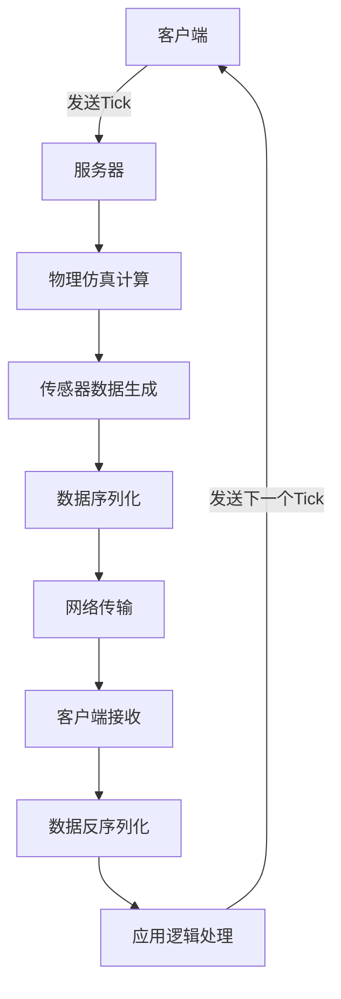
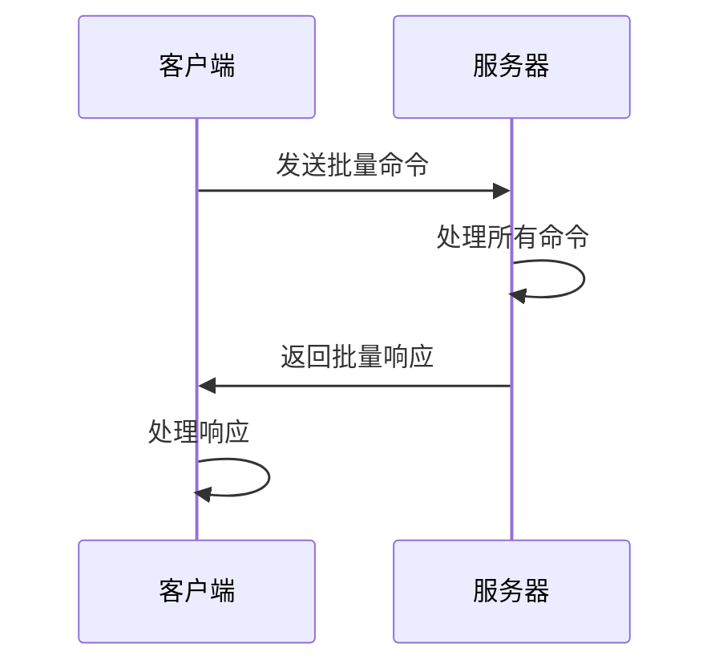
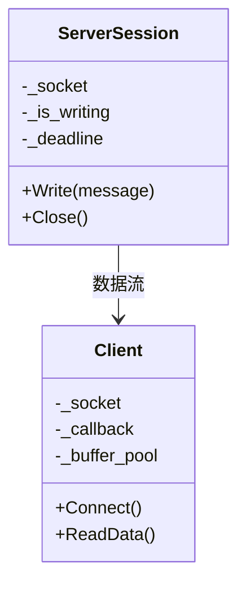
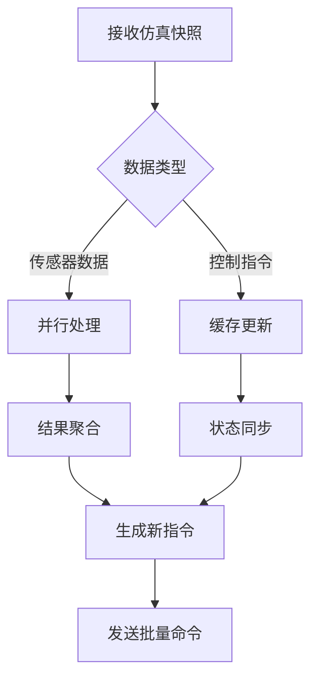
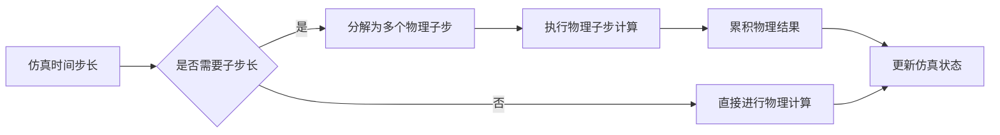
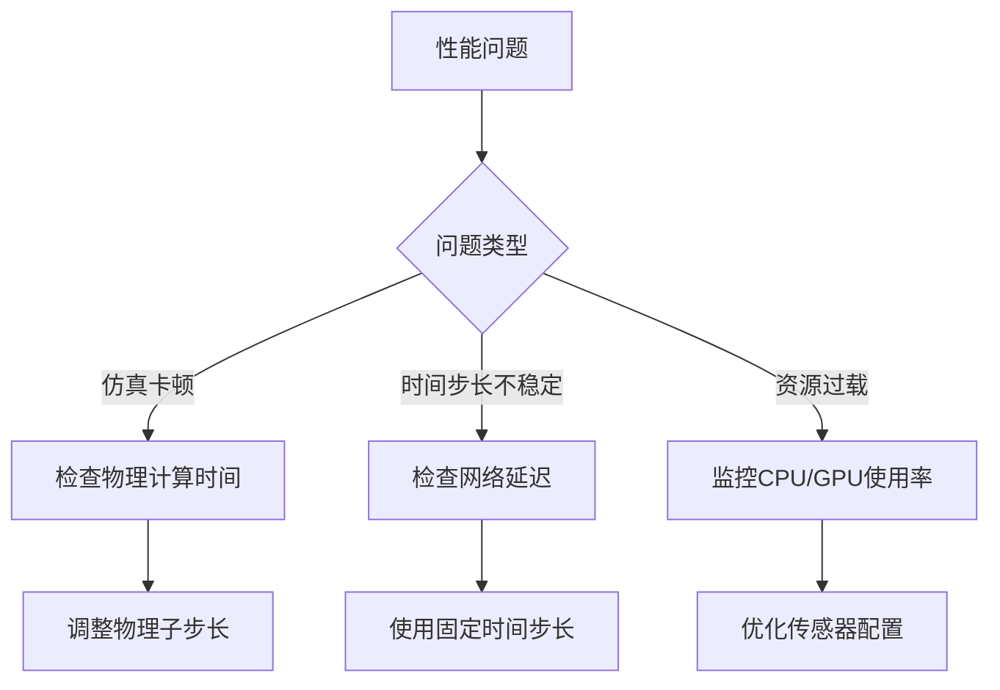
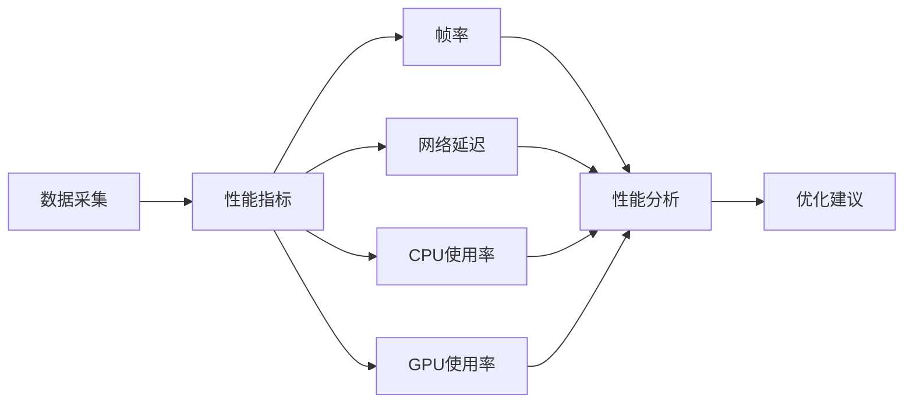

# 性能优化

> **引用文件**
> **本文档中引用的文件**

- [adv_synchrony_timestep.md](https://github.com/carla-simulator/carla/blob/ue5-dev/Docs/adv_synchrony_timestep.md)
- [Client.cpp](https://github.com/carla-simulator/carla/blob/ue5-dev/LibCarla/source/carla/client/detail/Client.cpp)
- [Client.h](https://github.com/carla-simulator/carla/blob/ue5-dev/LibCarla/source/carla/streaming/detail/tcp/Client.h)
- [ServerSession.cpp](https://github.com/carla-simulator/carla/blob/ue5-dev/LibCarla/source/carla/streaming/detail/tcp/ServerSession.cpp)
- [Server.h](https://github.com/carla-simulator/carla/blob/ue5-dev/LibCarla/source/carla/streaming/detail/tcp/Server.h)
- [Stream.h](https://github.com/carla-simulator/carla/blob/ue5-dev/LibCarla/source/carla/streaming/detail/Stream.h)
- [test_streaming.cpp](https://github.com/carla-simulator/carla/blob/ue5-dev/LibCarla/source/test/common/test_streaming.cpp)
- [test_sync.py](https://github.com/carla-simulator/carla/blob/ue5-dev/PythonAPI/test/smoke/test_sync.py)
- [ChronoMovementComponent.cpp](https://github.com/carla-simulator/carla/blob/ue5-dev/Unreal/CarlaUnreal/Plugins/Carla/Source/Carla/Vehicle/MovementComponents/ChronoMovementComponent.cpp)
- [CustomTerrainPhysicsComponent.cpp](https://github.com/carla-simulator/carla/blob/ue5-dev/Unreal/CarlaUnreal/Plugins/Carla/Source/Carla/Vehicle/CustomTerrainPhysicsComponent.cpp)
- [CarlaEngine.cpp](https://github.com/carla-simulator/carla/blob/ue5-dev/Unreal/CarlaUnreal/Plugins/Carla/Source/Carla/Game/CarlaEngine.cpp)
- [Simulator.cpp](https://github.com/carla-simulator/carla/blob/ue5-dev/LibCarla/source/carla/client/detail/Simulator.cpp)

## 目录

1. [引言](#引言)
2. [同步模式下的性能瓶颈](#同步模式下的性能瓶颈)
3. [批量操作优化](#批量操作优化)
4. [流式传输机制](#流式传输机制)
5. [网络通信优化](#网络通信优化)
6. [客户端性能优化策略](#客户端性能优化策略)
7. [物理仿真计算优化](#物理仿真计算优化)
8. [常见性能问题与解决方案](#常见性能问题与解决方案)
9. [性能监控与分析](#性能监控与分析)
10. [结论](#结论)

## 引言

CARLA 仿真器在自动驾驶研究和开发中扮演着关键角色，其同步模式为精确控制仿真流程提供了基础。然而，在高频率仿真场景下，系统性能面临多重挑战，包括网络通信开销、序列化成本和物理仿真计算时间等。本文档详细探讨了这些性能瓶颈及其优化策略，重点介绍如何通过批量操作、流式传输机制和网络配置优化来提升仿真效率。同时，文档还提供了实际代码示例，展示如何通过异步预取、数据缓存和并行处理来优化客户端性能，并针对仿真卡顿、时间步长不稳定和资源过载等常见问题提供解决方案。

## 同步模式下的性能瓶颈

在 CARLA 的同步模式下，服务器在更新到下一个仿真步骤前会等待客户端的"tick"信号。这种机制虽然确保了客户端与服务器之间的精确同步，但也引入了显著的性能瓶颈。主要瓶颈包括网络通信延迟、序列化开销和物理仿真计算时间。

网络通信延迟是影响同步模式性能的主要因素之一。每次客户端与服务器之间的通信都需要经过 TCP/IP 协议栈，这会引入额外的延迟。特别是在高频率仿真中，频繁的网络往返会导致显著的性能下降。序列化成本也是一个重要瓶颈，因为所有在客户端和服务器之间传输的数据都需要进行序列化和反序列化操作，这会消耗大量的 CPU 资源。

物理仿真计算时间直接影响最大仿真频率。复杂的物理计算，如车辆动力学、碰撞检测和传感器模拟，都需要大量的计算资源。在固定时间步长的同步模式下，如果物理计算时间超过预定的时间步长，就会导致仿真卡顿或时间步长不稳定。

**图示来源**

- [adv_synchrony_timestep.md](https://github.com/carla-simulator/carla/blob/ue5-dev/Docs/adv_synchrony_timestep.md#client-server-synchrony)
- <a href="https://github.com/carla-simulator/carla/blob/ue5-dev/LibCarla/source/carla/client/detail/Client.cpp#L670-L702" target="_blank">Client.cpp</a>

**本节来源**

- [adv_synchrony_timestep.md](https://github.com/carla-simulator/carla/blob/ue5-dev/Docs/adv_synchrony_timestep.md)
- <a href="https://github.com/carla-simulator/carla/blob/ue5-dev/LibCarla/source/carla/client/detail/Client.cpp#L670-L702" target="_blank">Client.cpp</a>

## 批量操作优化

批量操作是优化 CARLA 同步模式性能的关键策略之一。通过使用`Client.apply_batch_sync()`方法，可以将多个命令打包成一个批次发送，从而显著减少网络往返延迟。这种方法特别适用于需要同时控制多个车辆或执行多个场景修改的场景。

`Client.apply_batch_sync()`方法允许客户端将多个 RPC 命令组合成一个批次，并在一次网络通信中发送到服务器。这不仅减少了网络往返次数，还降低了序列化和反序列化的开销。当`do_tick_cue`参数设置为 true 时，服务器会在处理完所有命令后自动推进仿真时间步长，确保了操作的原子性和时间一致性。

批量操作的优势在于它能够将多个独立的网络请求合并为一个，从而减少了网络延迟的影响。在高频率仿真中，这种优化可以显著提高仿真效率。例如，在需要同时生成多个车辆的场景中，使用批量操作可以将数十次独立的网络请求减少为一次，大大降低了通信开销。

**图示来源**

- <a href="https://github.com/carla-simulator/carla/blob/ue5-dev/LibCarla/source/carla/client/detail/Client.cpp#L670-L702" target="_blank">Client.cpp</a>
- <a href="https://github.com/carla-simulator/carla/blob/ue5-dev/PythonAPI/test/smoke/test_sync.py#L150-L179" target="_blank">test_sync.py</a>

**本节来源**

- <a href="https://github.com/carla-simulator/carla/blob/ue5-dev/LibCarla/source/carla/client/detail/Client.cpp#L670-L702" target="_blank">Client.cpp</a>
- <a href="https://github.com/carla-simulator/carla/blob/ue5-dev/PythonAPI/test/smoke/test_sync.py#L150-L179" target="_blank">test_sync.py</a>

## 流式传输机制

流式传输机制在 CARLA 同步模式下发挥着重要的优化作用。通过建立持久的 TCP 连接，流式传输能够持续地将数据从服务器推送到客户端，避免了传统请求-响应模式中的频繁连接建立和断开开销。

CARLA 的流式传输实现基于 Boost.Asio 库，使用了非阻塞 I/O 和事件驱动架构。服务器端的`ServerSession`类负责管理客户端连接，并通过`Write`方法将数据写入网络流。客户端的`Client`类则通过异步读取机制接收数据。这种设计确保了数据传输的高效性和实时性。

流式传输的一个关键优化是禁用 Nagle 算法。在`Client.cpp`和`ServerSession.cpp`中，通过设置`tcp::no_delay(true)`选项，强制不使用 Nagle 算法，这在 Linux 系统上可以将同步模式的性能提升约 3 倍。Nagle 算法通常用于减少小数据包的数量，但在实时仿真场景中，它会引入不必要的延迟。

**图示来源**

- <a href="https://github.com/carla-simulator/carla/blob/ue5-dev/LibCarla/source/carla/streaming/detail/tcp/ServerSession.cpp#L78-L119" target="_blank">ServerSession.cpp</a>
- <a href="https://github.com/carla-simulator/carla/blob/ue5-dev/LibCarla/source/carla/streaming/detail/tcp/Client.cpp#L102-L186" target="_blank">Client.cpp</a>

**本节来源**

- <a href="https://github.com/carla-simulator/carla/blob/ue5-dev/LibCarla/source/carla/streaming/detail/tcp/ServerSession.cpp#L78-L119" target="_blank">ServerSession.cpp</a>
- <a href="https://github.com/carla-simulator/carla/blob/ue5-dev/LibCarla/source/carla/streaming/detail/tcp/Client.cpp#L102-L186" target="_blank">Client.cpp</a>

## 网络通信优化

网络通信优化是提升 CARLA 同步模式性能的核心。除了流式传输和批量操作外，还可以通过配置 TCP 缓冲区大小和启用消息压缩来进一步提高数据传输效率。

TCP 缓冲区大小的配置直接影响网络吞吐量和延迟。较大的缓冲区可以容纳更多的数据，减少网络拥塞的可能性，但也会增加内存使用和延迟。在 CARLA 中，可以通过调整 Boost.Asio 的缓冲区参数来优化这一设置。对于高带宽、低延迟的网络环境，适当增加缓冲区大小可以显著提高数据传输效率。

消息压缩是另一种有效的优化手段。虽然 CARLA 目前主要使用 MessagePack 进行序列化，但可以考虑在传输层启用压缩算法（如 gzip 或 zstd）来减少网络带宽占用。这对于传输大量传感器数据（如点云或图像）的场景尤其重要。压缩可以显著减少数据量，但需要权衡压缩/解压缩带来的 CPU 开销。

**图示来源**

- <a href="https://github.com/carla-simulator/carla/blob/ue5-dev/LibCarla/source/carla/streaming/detail/Stream.h#L50-L63" target="_blank">Stream.h</a>
- <a href="https://github.com/carla-simulator/carla/blob/ue5-dev/LibCarla/source/test/common/test_streaming.cpp#L178-L213" target="_blank">test_streaming.cpp</a>

**本节来源**

- <a href="https://github.com/carla-simulator/carla/blob/ue5-dev/LibCarla/source/carla/streaming/detail/Stream.h#L50-L63" target="_blank">Stream.h</a>
- <a href="https://github.com/carla-simulator/carla/blob/ue5-dev/LibCarla/source/test/common/test_streaming.cpp#L178-L213" target="_blank">test_streaming.cpp</a>

## 客户端性能优化策略

客户端性能优化是确保高频率仿真的关键环节。通过异步预取、数据缓存和并行处理等策略，可以显著提升客户端的响应速度和处理能力。

异步预取是一种有效的优化技术，它允许客户端在等待当前仿真步长完成的同时，预先请求下一个时间步的数据。这种重叠 I/O 和计算的方法可以最大限度地利用网络带宽和 CPU 资源。在 CARLA 中，可以通过注册`on_tick`回调函数来实现异步预取，确保在接收到新的仿真快照时立即开始处理。

数据缓存是另一种重要的优化策略。对于频繁访问且变化缓慢的数据（如地图信息或静态环境对象），可以将其缓存在客户端本地，避免重复的网络请求。CARLA 的`Client`类提供了`GetLevelBBs`和`GetEnvironmentObjects`等方法，支持批量获取这些静态数据，便于客户端实现高效的缓存机制。

并行处理可以充分利用多核 CPU 的计算能力。对于计算密集型任务（如传感器数据处理或机器学习推理），可以使用多线程或多进程来并行处理。在 Python 客户端中，可以结合`concurrent.futures`模块实现任务的并行执行，显著提高数据处理速度。

**本节来源**

- <a href="https://github.com/carla-simulator/carla/blob/ue5-dev/LibCarla/source/carla/client/detail/Client.cpp#L694-L702" target="_blank">Client.cpp</a>
- <a href="https://github.com/carla-simulator/carla/blob/ue5-dev/PythonAPI/test/smoke/test_sync.py#L150-L179" target="_blank">test_sync.py</a>

## 物理仿真计算优化

物理仿真计算是 CARLA 性能的关键决定因素。通过合理配置物理子步长和优化物理引擎参数，可以显著提高仿真效率和精度。

物理子步长（substepping）是 CARLA 中一个重要的优化特性。它允许将一个仿真时间步长分解为多个更小的物理计算步长，从而提高物理仿真的精度。默认情况下，CARLA 启用物理子步长，最大子步数为 10，最大物理时间步长为 0.01 秒。这种配置确保了即使在较大的仿真时间步长下，物理计算也能保持足够的精度。

在同步模式下，物理子步长的配置需要与固定时间步长相协调。必须满足`fixed_delta_seconds <= max_substep_delta_time * max_substeps`的条件，以确保物理计算能够在规定的时间内完成。为了获得最佳的物理仿真效果，建议将物理时间步长保持在 0.01666 秒以下，理想情况下低于 0.01 秒。

**图示来源**

- [adv_synchrony_timestep.md](https://github.com/carla-simulator/carla/blob/ue5-dev/Docs/adv_synchrony_timestep.md#physics-substepping)
- <a href="https://github.com/carla-simulator/carla/blob/ue5-dev/LibCarla/source/carla/client/detail/Simulator.cpp#L251-L282" target="_blank">Simulator.cpp</a>

**本节来源**

- [adv_synchrony_timestep.md](https://github.com/carla-simulator/carla/blob/ue5-dev/Docs/adv_synchrony_timestep.md#physics-substepping)
- <a href="https://github.com/carla-simulator/carla/blob/ue5-dev/LibCarla/source/carla/client/detail/Simulator.cpp#L251-L282" target="_blank">Simulator.cpp</a>

## 常见性能问题与解决方案

在 CARLA 同步模式下，常见的性能问题包括仿真卡顿、时间步长不稳定和 CPU/GPU 资源过载。这些问题通常由不合理的配置或资源竞争引起，需要针对性的解决方案。

仿真卡顿通常是由于物理计算时间超过仿真时间步长引起的。解决方案包括降低仿真频率、优化物理模型复杂度或增加物理子步数。时间步长不稳定可能源于网络延迟波动或客户端处理速度不一致。通过使用固定时间步长和批量操作，可以有效缓解这一问题。

CPU/GPU 资源过载是另一个常见问题，特别是在运行复杂传感器或高分辨率渲染时。优化策略包括降低传感器分辨率、减少同时激活的传感器数量、使用轻量级渲染模式或分布式计算。对于 GPU 资源紧张的情况，可以考虑使用 CARLA 的无渲染模式（no_rendering_mode），仅运行物理仿真和逻辑计算。

**本节来源**

- [adv_synchrony_timestep.md](https://github.com/carla-simulator/carla/blob/ue5-dev/Docs/adv_synchrony_timestep.md)
- <a href="https://github.com/carla-simulator/carla/blob/ue5-dev/Unreal/CarlaUnreal/Plugins/Carla/Source/Carla/Vehicle/MovementComponents/ChronoMovementComponent.cpp#L218-L268" target="_blank">ChronoMovementComponent.cpp</a>

## 性能监控与分析

有效的性能监控与分析是优化 CARLA 仿真的基础。通过内置的性能分析工具和自定义监控指标，可以全面了解系统性能瓶颈并指导优化工作。

CARLA 提供了多种性能监控机制。在 C++层面，`Profiler`类提供了详细的性能分析功能，可以测量特定代码段的执行时间和频率。`LifetimeProfiled`类则用于跟踪对象的生命周期性能。这些工具可以帮助开发者识别性能热点并进行针对性优化。

在客户端层面，可以通过记录仿真帧率、网络延迟和 CPU/GPU 使用率等指标来监控系统性能。Python 客户端可以结合`time`模块和系统监控工具（如 psutil）来收集这些数据。对于复杂的性能分析，可以使用专门的性能分析工具（如 cProfile）来深入分析代码执行情况。

**本节来源**

- [Profiler.h](https://github.com/carla-simulator/carla/blob/ue5-dev/LibCarla/source/carla/profiler/Profiler.h)
- [Profiler.cpp](https://github.com/carla-simulator/carla/blob/ue5-dev/LibCarla/source/carla/profiler/Profiler.cpp)

## 结论

CARLA 同步模式的性能优化是一个多维度的系统工程，涉及网络通信、数据处理、物理仿真和资源管理等多个方面。通过综合运用批量操作、流式传输、物理子步长优化和客户端并行处理等策略，可以显著提升仿真效率和稳定性。关键是要根据具体的应用场景和硬件条件，合理配置各项参数，平衡性能与精度的需求。持续的性能监控和分析是确保优化效果的基础，开发者应该建立完善的性能评估体系，不断迭代优化方案，以实现最佳的仿真性能。
