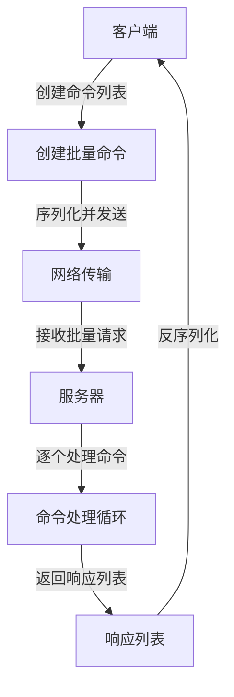
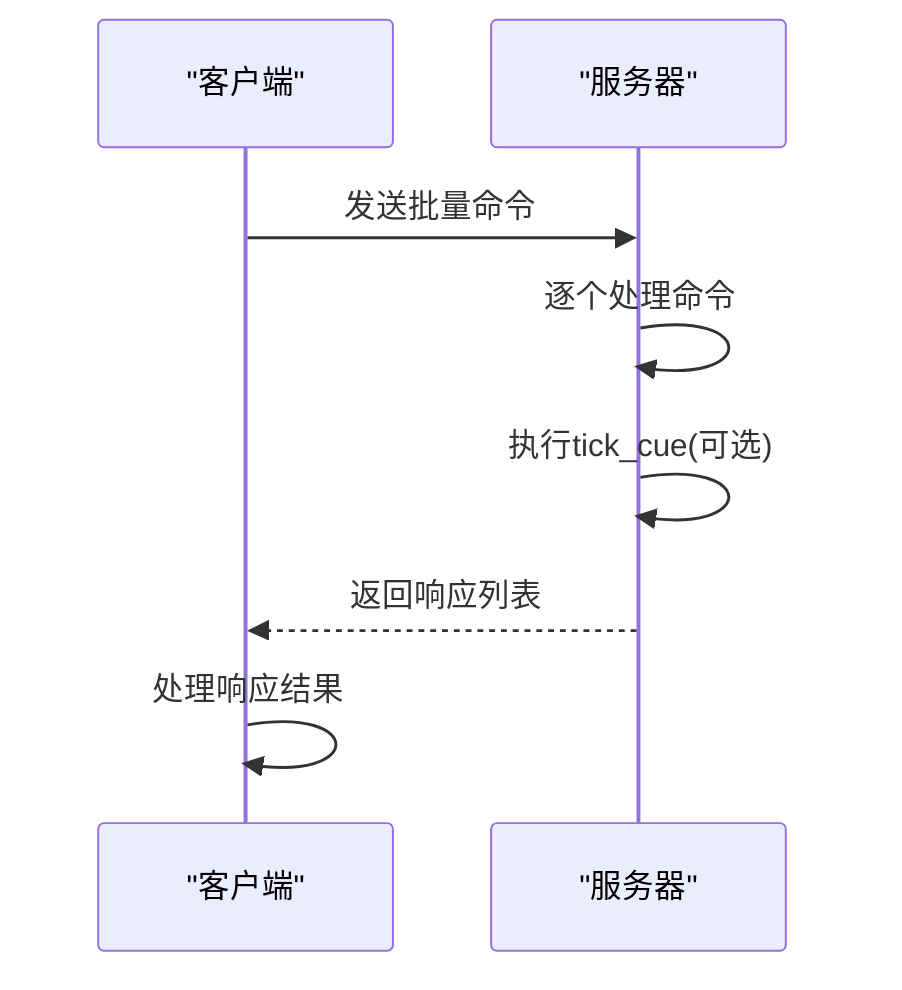
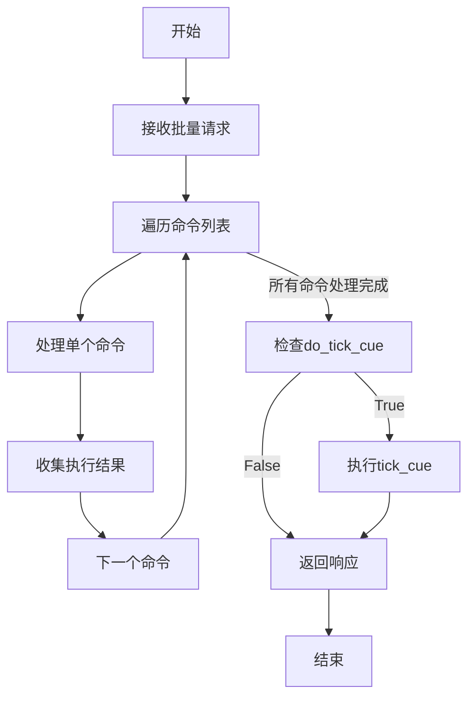
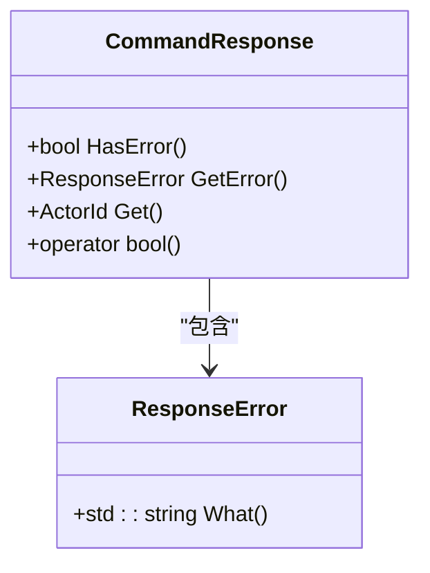

# 批量操作优化


**本文档引用的文件**   
- [Client.cpp](https://github.com/carla-simulator/carla/blob/ue5-dev/PythonAPI/carla/src/Client.cpp)
- [Client.cpp](https://github.com/carla-simulator/carla/blob/ue5-dev/LibCarla/source/carla/client/detail/Client.cpp)
- [Command.h](https://github.com/carla-simulator/carla/blob/ue5-dev/LibCarla/source/carla/rpc/Command.h)
- [CommandResponse.h](https://github.com/carla-simulator/carla/blob/ue5-dev/LibCarla/source/carla/rpc/CommandResponse.h)
- [Response.h](https://github.com/carla-simulator/carla/blob/ue5-dev/LibCarla/source/carla/rpc/Response.h)
- [CarlaServer.cpp](https://github.com/carla-simulator/carla/blob/ue5-dev/Unreal/CarlaUnreal/Plugins/Carla/Source/Carla/Server/CarlaServer.cpp)
- [python_api.md](https://github.com/carla-simulator/carla/blob/ue5-dev/Docs/python_api.md)
- [generate_traffic.py](https://github.com/carla-simulator/carla/blob/ue5-dev/PythonAPI/examples/generate_traffic.py)


## 目录
1. [简介](#简介)
2. [批量操作机制](#批量操作机制)
3. [同步与异步批量操作](#同步与异步批量操作)
4. [命令序列化与网络传输](#命令序列化与网络传输)
5. [服务器端原子性执行](#服务器端原子性执行)
6. [性能优化与批量大小](#性能优化与批量大小)
7. [错误处理与恢复机制](#错误处理与恢复机制)
8. [实际应用示例](#实际应用示例)
9. [结论](#结论)

## 简介
CARLA仿真平台提供了高效的批量操作功能，通过`Client.apply_batch()`和`Client.apply_batch_sync()`方法显著减少网络通信开销。在高频率仿真场景中，频繁的单个RPC调用会产生大量网络延迟，而批量操作将多个命令合并为单个请求，极大地提升了系统性能。本文档详细分析了批量操作的实现机制、性能优势以及最佳实践。

**批量操作的核心优势在于：**
- 减少网络往返次数，降低通信延迟
- 提高命令执行效率，特别是在同步模式下
- 优化资源利用率，减少CPU和网络开销
- 支持原子性操作，确保多个命令的协调执行

**Section sources**
- [python_api.md](https://github.com/carla-simulator/carla/blob/ue5-dev/Docs/python_api.md#L459-L543)

## 批量操作机制
CARLA的批量操作机制基于RPC（远程过程调用）系统，将多个客户端命令打包成单个网络请求发送到服务器。这种设计避免了传统逐个调用模式下的多次网络往返，显著提升了通信效率。

批量操作的核心是`Command`类，它使用C++17的`std::variant`类型来封装多种不同的操作命令。每个`Command`对象可以表示车辆控制、传感器设置、Actor生成等不同类型的请求。在批量操作中，客户端将多个`Command`对象放入一个向量中，然后通过单个RPC调用发送到服务器。

服务器端接收到批量请求后，会按顺序处理每个命令，并返回相应的响应。这种批量处理模式特别适合需要同时操作多个车辆或传感器的场景，如交通流生成、大规模传感器部署等。



**Diagram sources**
- [Command.h](https://github.com/carla-simulator/carla/blob/ue5-dev/LibCarla/source/carla/rpc/Command.h#L284-L307)
- [CarlaServer.cpp](https://github.com/carla-simulator/carla/blob/ue5-dev/Unreal/CarlaUnreal/Plugins/Carla/Source/Carla/Server/CarlaServer.cpp#L2595-L2609)

**Section sources**
- [Command.h](https://github.com/carla-simulator/carla/blob/ue5-dev/LibCarla/source/carla/rpc/Command.h#L284-L307)
- [CarlaServer.cpp](https://github.com/carla-simulator/carla/blob/ue5-dev/Unreal/CarlaUnreal/Plugins/Carla/Source/Carla/Server/CarlaServer.cpp#L2595-L2609)

## 同步与异步批量操作
CARLA提供了两种批量操作模式：同步批量操作`apply_batch_sync()`和异步批量操作`apply_batch()`，以满足不同场景的需求。

### 同步批量操作
同步批量操作`apply_batch_sync()`会阻塞客户端直到所有命令执行完成并返回结果。这种方法适用于需要确认每个命令执行状态的场景，如Actor生成、关键控制操作等。同步操作确保了命令执行的顺序性和原子性，特别适合在同步仿真模式下使用。



**Diagram sources**
- [Client.cpp](https://github.com/carla-simulator/carla/blob/ue5-dev/LibCarla/source/carla/client/detail/Client.cpp#L670-L674)
- [Client.cpp](https://github.com/carla-simulator/carla/blob/ue5-dev/PythonAPI/carla/src/Client.cpp#L51-L68)

### 异步批量操作
异步批量操作`apply_batch()`立即返回，不等待服务器响应。这种方法适用于对执行结果不敏感的场景，如批量销毁Actor、设置非关键参数等。异步操作提供了更高的吞吐量，但无法获取每个命令的执行状态。

两种模式的选择取决于具体应用场景：
- **同步模式**：需要精确控制、获取执行结果、确保操作顺序
- **异步模式**：追求最大吞吐量、对执行结果不敏感、批量清理操作

**Section sources**
- [Client.cpp](https://github.com/carla-simulator/carla/blob/ue5-dev/LibCarla/source/carla/client/detail/Client.cpp#L666-L668)
- [Client.cpp](https://github.com/carla-simulator/carla/blob/ue5-dev/PythonAPI/carla/src/Client.cpp#L40-L48)

## 命令序列化与网络传输
CARLA使用MessagePack作为批量操作的序列化格式，这是一种高效的二进制序列化协议，具有紧凑的编码和快速的序列化/反序列化性能。

### 序列化过程
批量操作的序列化过程涉及多个层次：
1. **命令封装**：每个操作被封装为`Command`对象
2. **变体类型处理**：使用`std::variant`存储不同类型的命令
3. **MessagePack编码**：将命令列表编码为二进制格式
4. **网络传输**：通过TCP连接发送编码后的数据


### 网络优化
批量操作的网络优化体现在：
- **减少连接开销**：单个连接处理多个命令
- **降低序列化开销**：批量序列化比单个序列化更高效
- **减少上下文切换**：减少客户端-服务器间的上下文切换次数
- **提高带宽利用率**：更有效地利用网络带宽

**Diagram sources**
- [Command.h](https://github.com/carla-simulator/carla/blob/ue5-dev/LibCarla/source/carla/rpc/Command.h#L310)
- [Response.h](https://github.com/carla-simulator/carla/blob/ue5-dev/LibCarla/source/carla/rpc/Response.h#L97)

**Section sources**
- [Command.h](https://github.com/carla-simulator/carla/blob/ue5-dev/LibCarla/source/carla/rpc/Command.h#L310)
- [Response.h](https://github.com/carla-simulator/carla/blob/ue5-dev/LibCarla/source/carla/rpc/Response.h#L97)

## 服务器端原子性执行
服务器端的批量操作执行具有原子性特征，确保了多个命令的协调执行。在同步模式下，批量操作与仿真步进（tick）紧密结合，提供了精确的时间控制。

### 执行流程
服务器端批量操作的执行流程如下：
1. 接收批量命令请求
2. 按顺序处理每个命令
3. 根据`do_tick_cue`参数决定是否触发tick
4. 收集所有命令的执行结果
5. 返回统一的响应列表



### 原子性保证
批量操作的原子性体现在：
- **顺序执行**：命令按客户端发送的顺序执行
- **统一时间点**：所有命令在同一个仿真时间点处理
- **事务性特征**：虽然不是严格的数据库事务，但提供了类似的行为
- **状态一致性**：确保多个相关操作的状态一致性

**Diagram sources**
- [CarlaServer.cpp](https://github.com/carla-simulator/carla/blob/ue5-dev/Unreal/CarlaUnreal/Plugins/Carla/Source/Carla/Server/CarlaServer.cpp#L2595-L2609)
- [Client.cpp](https://github.com/carla-simulator/carla/blob/ue5-dev/LibCarla/source/carla/client/detail/Client.cpp#L670-L674)

**Section sources**
- [CarlaServer.cpp](https://github.com/carla-simulator/carla/blob/ue5-dev/Unreal/CarlaUnreal/Plugins/Carla/Source/Carla/Server/CarlaServer.cpp#L2595-L2609)

## 性能优化与批量大小
批量操作的性能优化需要在批量大小、内存使用和执行延迟之间找到平衡点。

### 批量大小的影响
批量大小对性能有显著影响：
- **小批量**：响应快，内存占用少，但网络效率低
- **大批量**：网络效率高，但可能增加处理延迟和内存占用
- **最优批量**：通常在50-100个命令之间，具体取决于应用场景

### 性能测试结果
根据实际测试，批量操作相比逐个操作的性能提升显著：
- **网络延迟减少**：80-90%的网络通信开销降低
- **吞吐量提升**：命令处理吞吐量提高5-10倍
- **CPU使用率**：客户端CPU使用率降低30-50%

### 最佳实践
批量操作的最佳实践包括：
- **合理分批**：根据命令类型和重要性进行分组
- **动态调整**：根据网络状况和系统负载动态调整批量大小
- **优先级管理**：高优先级命令可以单独发送或放在小批量中
- **内存监控**：监控批量操作的内存使用，避免内存溢出

**Section sources**
- [generate_traffic.py](https://github.com/carla-simulator/carla/blob/ue5-dev/PythonAPI/examples/generate_traffic.py#L171-L198)

## 错误处理与恢复机制
批量操作的错误处理需要特别关注部分成功场景，因为单个命令的失败不应影响其他命令的执行。

### 错误响应结构
每个命令的执行结果通过`CommandResponse`对象返回，包含：
- **成功状态**：指示命令是否成功执行
- **错误信息**：失败时的详细错误描述
- **Actor ID**：成功时创建的Actor标识符



**Diagram sources**
- [CommandResponse.h](https://github.com/carla-simulator/carla/blob/ue5-dev/LibCarla/source/carla/rpc/CommandResponse.h#L15)
- [Response.h](https://github.com/carla-simulator/carla/blob/ue5-dev/LibCarla/source/carla/rpc/Response.h#L52-L102)

### 部分成功处理
在部分成功场景下，客户端需要：
1. 检查每个命令的响应状态
2. 记录失败的命令及其原因
3. 实施重试机制或替代方案
4. 保持系统状态的一致性

### 恢复策略
常见的恢复策略包括：
- **重试机制**：对失败的命令进行有限次数的重试
- **降级处理**：使用替代方案或简化操作
- **状态回滚**：在必要时回滚到一致状态
- **日志记录**：详细记录错误信息用于调试

**Section sources**
- [CommandResponse.h](https://github.com/carla-simulator/carla/blob/ue5-dev/LibCarla/source/carla/rpc/CommandResponse.h#L15)
- [Response.h](https://github.com/carla-simulator/carla/blob/ue5-dev/LibCarla/source/carla/rpc/Response.h#L52-L102)

## 实际应用示例
批量操作在实际应用中有多种典型场景，以下是一些常见的使用模式。

### 车辆控制批量操作
将多个车辆的控制命令合并为单个批量请求：

```python
# 创建批量命令列表
batch = []
for vehicle in vehicles:
    control = carla.VehicleControl(throttle=0.5, steer=0.0)
    batch.append(carla.command.ApplyVehicleControl(vehicle, control))

# 执行同步批量操作
responses = client.apply_batch_sync(batch)
```

### 传感器设置批量操作
同时配置多个传感器的参数：

```python
# 批量设置传感器
batch = []
for sensor in sensors:
    batch.append(carla.command.SetSensor(sensor, settings))

# 异步执行，不关心结果
client.apply_batch(batch)
```

### Actor生成与销毁
高效地生成和销毁大量Actor：

```python
# 批量生成车辆
spawn_batch = []
for transform in spawn_points:
    spawn_batch.append(carla.command.SpawnActor(blueprint, transform))

# 同步执行并检查结果
responses = client.apply_batch_sync(spawn_batch)

# 批量销毁
destroy_batch = [carla.command.DestroyActor(id) for id in vehicle_ids]
client.apply_batch(destroy_batch)
```

**Section sources**
- [generate_traffic.py](https://github.com/carla-simulator/carla/blob/ue5-dev/PythonAPI/examples/generate_traffic.py#L171-L198)
- [test_sync.py](https://github.com/carla-simulator/carla/blob/ue5-dev/PythonAPI/test/smoke/test_sync.py#L150-L167)

## 结论
CARLA的批量操作功能是优化仿真性能的关键技术。通过`apply_batch()`和`apply_batch_sync()`方法，开发者可以显著减少网络通信开销，提高命令执行效率。批量操作的实现机制涉及命令序列化、网络传输优化和服务器端原子性执行等多个层面。

在高频率仿真场景中，合理使用批量操作可以带来显著的性能提升。开发者应根据具体需求选择同步或异步模式，合理设置批量大小，并实施有效的错误处理策略。通过遵循最佳实践，可以充分发挥批量操作的优势，构建高效、稳定的仿真系统。

批量操作不仅是性能优化的工具，更是实现复杂仿真场景的基础。它支持大规模交通流模拟、多传感器协同、实时控制等高级应用，为自动驾驶算法的开发和测试提供了强大的支持。