# 流式传输配置

**本文档中引用的文件**  
- [Client.h](https://github.com/carla-simulator/carla/blob/ue5-dev/LibCarla/source/carla/streaming/Client.h)
- [Server.h](https://github.com/carla-simulator/carla/blob/ue5-dev/LibCarla/source/carla/streaming/Server.h)
- [Stream.h](https://github.com/carla-simulator/carla/blob/ue5-dev/LibCarla/source/carla/streaming/Stream.h)
- [Token.h](https://github.com/carla-simulator/carla/blob/ue5-dev/LibCarla/source/carla/streaming/detail/Token.h)
- [MultiStreamState.h](https://github.com/carla-simulator/carla/blob/ue5-dev/LibCarla/source/carla/streaming/detail/MultiStreamState.h)
- [Client.cpp](https://github.com/carla-simulator/carla/blob/ue5-dev/LibCarla/source/carla/streaming/detail/tcp/Client.cpp)
- [AsyncDataStream.h](https://github.com/carla-simulator/carla/blob/ue5-dev/Unreal/CarlaUnreal/Plugins/Carla/Source/Carla/Sensor/AsyncDataStream.h)
- [Sensor.cpp](https://github.com/carla-simulator/carla/blob/ue5-dev/Unreal/CarlaUnreal/Plugins/Carla/Source/Carla/Sensor/Sensor.cpp)
- [BufferPool.h](https://github.com/carla-simulator/carla/blob/ue5-dev/LibCarla/source/carla/BufferPool.h)
- [SensorHeaderSerializer.h](https://github.com/carla-simulator/carla/blob/ue5-dev/LibCarla/source/carla/sensor/s11n/SensorHeaderSerializer.h)

## 目录
1. [引言](#引言)
2. [流式传输架构概述](#流式传输架构概述)
3. [同步模式下的流式传输优化](#同步模式下的流式传输优化)
4. [基于TCP的流式传输协议](#基于tcp的流式传输协议)
5. [核心组件分析](#核心组件分析)
6. [流式传输参数配置](#流式传输参数配置)
7. [高带宽传感器的流式传输实现](#高带宽传感器的流式传输实现)
8. [网络与内存性能分析](#网络与内存性能分析)
9. [流控与错误处理](#流控与错误处理)
10. [监控与诊断工具](#监控与诊断工具)

## 引言
本文档详细介绍了CARLA仿真平台中流式传输机制的配置方法，重点阐述了在同步模式下如何优化传感器数据传输。文档深入分析了基于TCP的流式传输协议如何有效减少数据获取的延迟和抖动，并与传统的请求-响应模式进行了对比。通过详细的参数配置说明、代码实现分析和性能调优建议，为开发者提供了全面的流式传输解决方案。

## 流式传输架构概述
CARLA的流式传输架构采用客户端-服务器模型，通过基于TCP的协议实现传感器数据的高效传输。该架构的核心组件包括流式传输服务器、客户端、数据流和令牌系统。服务器负责管理数据流的创建和分发，客户端通过令牌订阅特定的数据流。这种架构支持多个客户端同时订阅同一数据流，实现了数据的广播式分发。

**图源**  
- [Server.h](https://github.com/carla-simulator/carla/blob/ue5-dev/LibCarla/source/carla/streaming/Server.h)
- [Client.h](https://github.com/carla-simulator/carla/blob/ue5-dev/LibCarla/source/carla/streaming/Client.h)

**节源**  
- [Server.h](https://github.com/carla-simulator/carla/blob/ue5-dev/LibCarla/source/carla/streaming/Server.h)
- [Client.h](https://github.com/carla-simulator/carla/blob/ue5-dev/LibCarla/source/carla/streaming/Client.h)

## 同步模式下的流式传输优化
在同步模式下，CARLA的流式传输机制通过多种技术优化传感器数据传输。首先，系统禁用了Nagle算法，这在Linux系统上可将同步模式的速度提高约3倍。其次，采用缓冲区池化技术，通过重用内存缓冲区显著减少内存分配开销，特别适用于大消息的传输场景。

流式传输在同步模式下的另一个关键优化是帧同步机制。每个传感器数据包都包含帧号信息，确保数据与仿真世界的状态保持同步。当世界时钟前进到新帧时，所有传感器数据都会被标记为对应的新帧号，从而保证了数据的一致性和时序准确性。

```mermaid
sequenceDiagram
participant World as 仿真世界
participant Sensor as 传感器
participant Stream as 数据流
participant Client as 客户端
World->>World : 世界时钟前进
World->>Sensor : 触发传感器采集
Sensor->>Stream : 准备数据并设置帧号
Stream->>Client : 发送带帧号的数据包
Client->>Client : 验证帧号并处理数据
```

**图源**  
- [Sensor.cpp](https://github.com/carla-simulator/carla/blob/ue5-dev/Unreal/CarlaUnreal/Plugins/Carla/Source/Carla/Sensor/Sensor.cpp)
- [SensorHeaderSerializer.h](https://github.com/carla-simulator/carla/blob/ue5-dev/LibCarla/source/carla/sensor/s11n/SensorHeaderSerializer.h)

**节源**  
- [Sensor.cpp](https://github.com/carla-simulator/carla/blob/ue5-dev/Unreal/CarlaUnreal/Plugins/Carla/Source/Carla/Sensor/Sensor.cpp)
- [SensorHeaderSerializer.h](https://github.com/carla-simulator/carla/blob/ue5-dev/LibCarla/source/carla/sensor/s11n/SensorHeaderSerializer.h)

## 基于TCP的流式传输协议
CARLA的流式传输基于TCP协议，与传统的请求-响应模式相比具有显著优势。在请求-响应模式中，客户端需要为每个数据请求建立连接，这导致了较高的延迟和网络开销。而流式传输采用持久连接，一旦建立连接，服务器就可以持续向客户端推送数据，大大减少了连接建立的开销。

TCP流式传输的关键特性包括：使用no_delay选项禁用Nagle算法以减少延迟；通过流控制机制防止发送方压垮接收方；以及利用TCP的可靠传输特性确保数据完整性。在连接建立过程中，客户端首先连接到服务器，然后发送流ID以订阅特定的数据流。

**图源**  
- [Client.cpp](https://github.com/carla-simulator/carla/blob/ue5-dev/LibCarla/source/carla/streaming/detail/tcp/Client.cpp)
- [Server.h](https://github.com/carla-simulator/carla/blob/ue5-dev/LibCarla/source/carla/streaming/detail/tcp/Server.h)

**节源**  
- [Client.cpp](https://github.com/carla-simulator/carla/blob/ue5-dev/LibCarla/source/carla/streaming/detail/tcp/Client.cpp)
- [Server.h](https://github.com/carla-simulator/carla/blob/ue5-dev/LibCarla/source/carla/streaming/detail/tcp/Server.h)

## 核心组件分析
CARLA流式传输系统的核心组件包括流式传输服务器、客户端、数据流和令牌系统。流式传输服务器负责管理所有数据流的生命周期，包括创建、分发和销毁。客户端通过令牌系统订阅特定的数据流，实现数据的定向接收。

数据流组件采用多会话状态设计，能够同时管理多个客户端会话。当有客户端连接时，系统会创建会话并将其添加到会话列表中。缓冲区池化是另一个关键组件，通过重用内存缓冲区显著提高大消息传输的性能。

**图源**  
- [Server.h](https://github.com/carla-simulator/carla/blob/ue5-dev/LibCarla/source/carla/streaming/Server.h)
- [Client.h](https://github.com/carla-simulator/carla/blob/ue5-dev/LibCarla/source/carla/streaming/Client.h)
- [Stream.h](https://github.com/carla-simulator/carla/blob/ue5-dev/LibCarla/source/carla/streaming/Stream.h)
- [Token.h](https://github.com/carla-simulator/carla/blob/ue5-dev/LibCarla/source/carla/streaming/detail/Token.h)
- [BufferPool.h](https://github.com/carla-simulator/carla/blob/ue5-dev/LibCarla/source/carla/BufferPool.h)

**节源**  
- [Server.h](https://github.com/carla-simulator/carla/blob/ue5-dev/LibCarla/source/carla/streaming/Server.h)
- [Client.h](https://github.com/carla-simulator/carla/blob/ue5-dev/LibCarla/source/carla/streaming/Client.h)
- [Stream.h](https://github.com/carla-simulator/carla/blob/ue5-dev/LibCarla/source/carla/streaming/Stream.h)

## 流式传输参数配置
流式传输系统的参数配置主要包括缓冲区大小、消息压缩选项和流控机制。缓冲区大小的配置需要根据传感器的数据速率和网络带宽进行优化。对于高带宽传感器如激光雷达，建议配置较大的缓冲区以减少内存分配频率。

消息压缩选项可以根据网络条件和数据类型进行配置。对于图像数据，可以启用压缩以减少网络带宽占用；而对于点云数据，由于其固有的稀疏性，压缩效果可能有限。流控机制通过调整发送速率来匹配接收方的处理能力，防止数据积压和丢失。

**图源**  
- [Server.h](https://github.com/carla-simulator/carla/blob/ue5-dev/LibCarla/source/carla/streaming/Server.h)
- [Client.h](https://github.com/carla-simulator/carla/blob/ue5-dev/LibCarla/source/carla/streaming/Client.h)

**节源**  
- [Server.h](https://github.com/carla-simulator/carla/blob/ue5-dev/LibCarla/source/carla/streaming/Server.h)
- [Client.h](https://github.com/carla-simulator/carla/blob/ue5-dev/LibCarla/source/carla/streaming/Client.h)

## 高带宽传感器的流式传输实现
对于摄像头、激光雷达等高带宽传感器，CARLA的流式传输实现采用了专门的优化策略。传感器数据在发送前会进行序列化处理，将原始数据转换为高效的二进制格式。每个数据包都包含元信息头，包括传感器类型、帧号、时间戳和传感器变换矩阵。

在实现层面，高带宽传感器使用异步数据流组件，通过缓冲区池化技术重用内存，避免频繁的内存分配和释放。对于激光雷达传感器，系统会根据配置的点云速率和旋转频率优化数据打包策略，确保数据传输的实时性和稳定性。

**图源**  
- [AsyncDataStream.h](https://github.com/carla-simulator/carla/blob/ue5-dev/Unreal/CarlaUnreal/Plugins/Carla/Source/Carla/Sensor/AsyncDataStream.h)
- [SensorHeaderSerializer.h](https://github.com/carla-simulator/carla/blob/ue5-dev/LibCarla/source/carla/sensor/s11n/SensorHeaderSerializer.h)

**节源**  
- [AsyncDataStream.h](https://github.com/carla-simulator/carla/blob/ue5-dev/Unreal/CarlaUnreal/Plugins/Carla/Source/Carla/Sensor/AsyncDataStream.h)
- [SensorHeaderSerializer.h](https://github.com/carla-simulator/carla/blob/ue5-dev/LibCarla/source/carla/sensor/s11n/SensorHeaderSerializer.h)

## 网络与内存性能分析
流式传输对网络带宽和内存使用有显著影响。网络带宽消耗主要取决于传感器的数据速率和压缩设置。对于100万点/秒的激光雷达，未压缩的数据速率可能达到数百Mbps，因此建议在带宽受限的环境中启用压缩。

内存使用方面，缓冲区池化技术显著减少了内存分配开销，但会占用一定的内存空间用于缓冲区缓存。系统会根据传感器的数据速率自动调整缓冲区大小，对于高带宽传感器，建议监控内存使用情况并根据实际需求调整缓冲区池大小。

性能调优建议包括：根据网络条件选择合适的压缩级别；为不同类型的传感器配置不同的缓冲区大小；在同步模式下禁用Nagle算法以减少延迟；以及根据客户端处理能力调整流控参数。

**节源**  
- [BufferPool.h](https://github.com/carla-simulator/carla/blob/ue5-dev/LibCarla/source/carla/BufferPool.h)
- [Client.cpp](https://github.com/carla-simulator/carla/blob/ue5-dev/LibCarla/source/carla/streaming/detail/tcp/Client.cpp)

## 流控与错误处理
流式传输系统实现了完善的流控和错误处理机制。流控机制通过监控客户端的接收速率和处理能力，动态调整数据发送速率，防止接收方被压垮。当检测到网络拥塞或客户端处理延迟时，系统会自动降低发送速率。

错误处理机制包括连接中断检测、数据丢失恢复和超时处理。当连接中断时，客户端会自动尝试重新连接。系统还实现了数据完整性检查，通过校验和验证确保数据的正确性。对于关键应用，建议实现应用层的确认机制，确保重要数据的可靠传输。

**节源**  
- [Client.cpp](https://github.com/carla-simulator/carla/blob/ue5-dev/LibCarla/source/carla/streaming/detail/tcp/Client.cpp)
- [Server.h](https://github.com/carla-simulator/carla/blob/ue5-dev/LibCarla/source/carla/streaming/Server.h)

## 监控与诊断工具
CARLA提供了多种监控和诊断工具来帮助开发者调试流式传输问题。系统内置了详细的日志记录功能，可以跟踪连接状态、数据传输和错误事件。开发者可以通过启用调试日志来监控流式传输的详细运行情况。

此外，CARLA还提供了性能监控接口，可以实时获取网络带宽使用、内存占用和数据传输速率等关键指标。对于复杂的调试场景，建议使用网络分析工具如Wireshark来捕获和分析TCP流量，诊断网络层的问题。

**节源**  
- [Client.cpp](https://github.com/carla-simulator/carla/blob/ue5-dev/LibCarla/source/carla/streaming/detail/tcp/Client.cpp)
- [Server.h](https://github.com/carla-simulator/carla/blob/ue5-dev/LibCarla/source/carla/streaming/Server.h)