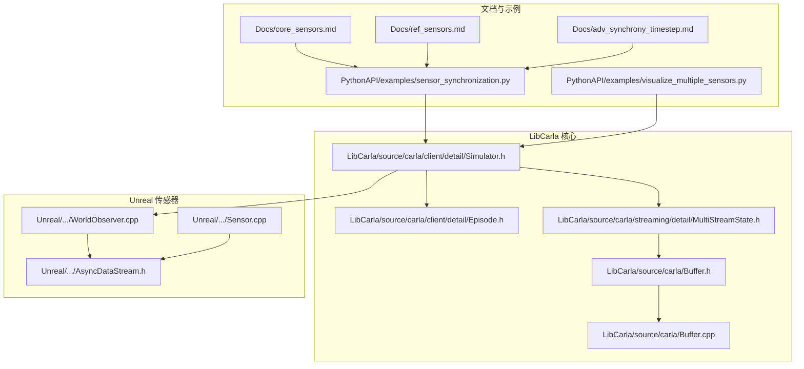
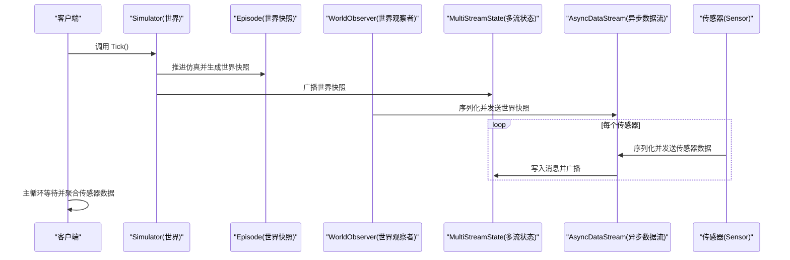
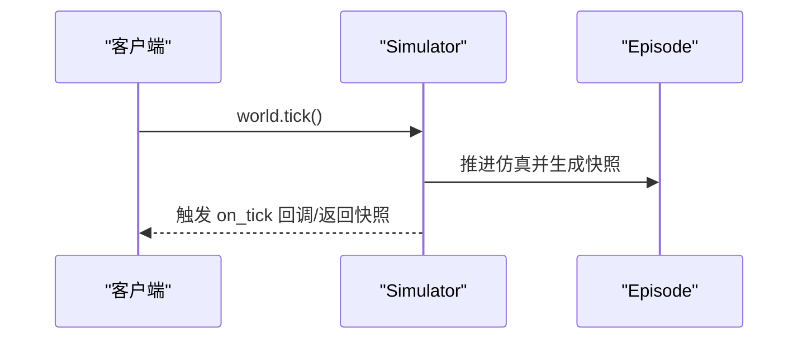
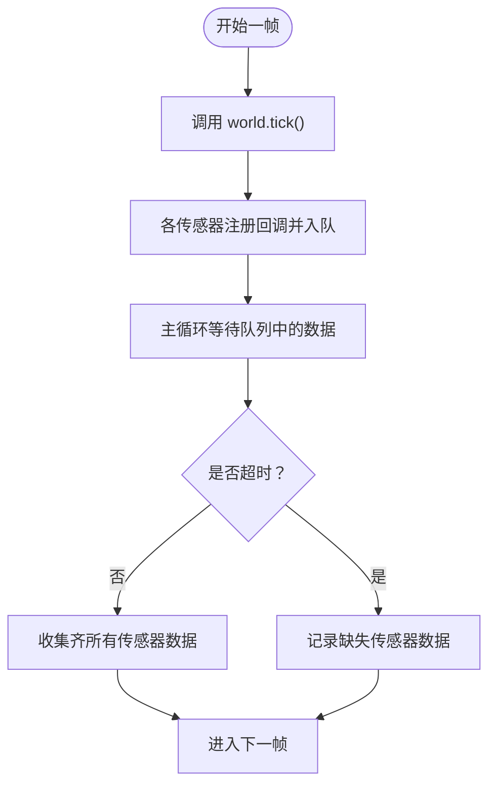
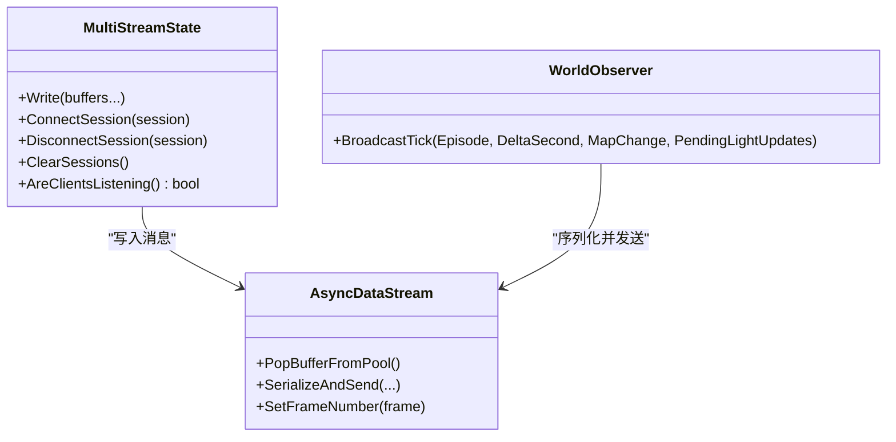
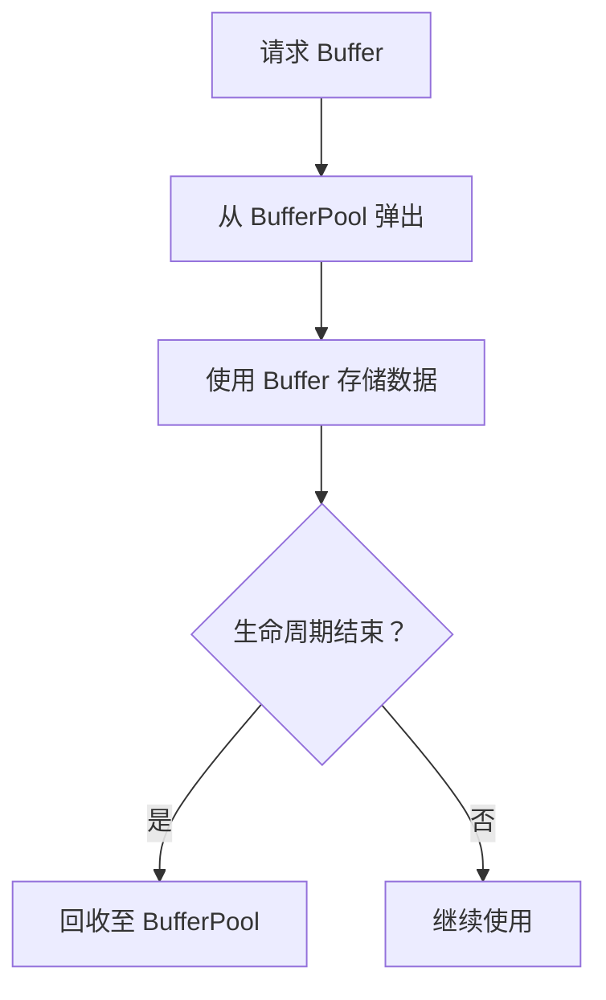
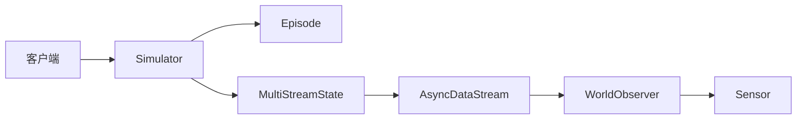

# 多传感器同步

> **引用文件**
> **本文引用的文件**

- [Docs/core_sensors.md](https://github.com/carla-simulator/carla/blob/ue5-dev/Docs/core_sensors.md)
- [Docs/ref_sensors.md](https://github.com/carla-simulator/carla/blob/ue5-dev/Docs/ref_sensors.md)
- [Docs/adv_synchrony_timestep.md](https://github.com/carla-simulator/carla/blob/ue5-dev/Docs/adv_synchrony_timestep.md)
- [PythonAPI/examples/sensor_synchronization.py](https://github.com/carla-simulator/carla/blob/ue5-dev/PythonAPI/examples/sensor_synchronization.py)
- [PythonAPI/examples/visualize_multiple_sensors.py](https://github.com/carla-simulator/carla/blob/ue5-dev/PythonAPI/examples/visualize_multiple_sensors.py)
- [PythonAPI/test/smoke/test_sync.py](https://github.com/carla-simulator/carla/blob/ue5-dev/PythonAPI/test/smoke/test_sync.py)
- [PythonAPI/test/smoke/test_sensor_tick_time.py](https://github.com/carla-simulator/carla/blob/ue5-dev/PythonAPI/test/smoke/test_sensor_tick_time.py)
- [PythonAPI/test/smoke/test_lidar.py](https://github.com/carla-simulator/carla/blob/ue5-dev/PythonAPI/test/smoke/test_lidar.py)
- [LibCarla/source/carla/client/detail/Simulator.h](https://github.com/carla-simulator/carla/blob/ue5-dev/LibCarla/source/carla/client/detail/Simulator.h)
- [LibCarla/source/carla/client/detail/Episode.h](https://github.com/carla-simulator/carla/blob/ue5-dev/LibCarla/source/carla/client/detail/Episode.h)
- [LibCarla/source/carla/streaming/detail/MultiStreamState.h](https://github.com/carla-simulator/carla/blob/ue5-dev/LibCarla/source/carla/streaming/detail/MultiStreamState.h)
- [LibCarla/source/carla/Buffer.h](https://github.com/carla-simulator/carla/blob/ue5-dev/LibCarla/source/carla/Buffer.h)
- [LibCarla/source/carla/Buffer.cpp](https://github.com/carla-simulator/carla/blob/ue5-dev/LibCarla/source/carla/Buffer.cpp)
- [Unreal/CarlaUnreal/Plugins/Carla/Source/Carla/Sensor/WorldObserver.cpp](https://github.com/carla-simulator/carla/blob/ue5-dev/Unreal/CarlaUnreal/Plugins/Carla/Source/Carla/Sensor/WorldObserver.cpp)
- [Unreal/CarlaUnreal/Plugins/Carla/Source/Carla/Sensor/AsyncDataStream.h](https://github.com/carla-simulator/carla/blob/ue5-dev/Unreal/CarlaUnreal/Plugins/Carla/Source/Carla/Sensor/AsyncDataStream.h)
- [Unreal/CarlaUnreal/Plugins/Carla/Source/Carla/Sensor/Sensor.cpp](https://github.com/carla-simulator/carla/blob/ue5-dev/Unreal/CarlaUnreal/Plugins/Carla/Source/Carla/Sensor/Sensor.cpp)
- [LibCarla/source/carla/ros2/ROS2.h](https://github.com/carla-simulator/carla/blob/ue5-dev/LibCarla/source/carla/ros2/ROS2.h)
- [LibCarla/source/carla/ros2/publishers/CarlaLidarPublisher.cpp](https://github.com/carla-simulator/carla/blob/ue5-dev/LibCarla/source/carla/ros2/publishers/CarlaLidarPublisher.cpp)

## 目录

1. [引言](#引言)
2. [项目结构](#项目结构)
3. [核心组件](#核心组件)
4. [架构总览](#架构总览)
5. [详细组件分析](#详细组件分析)
6. [依赖关系分析](#依赖关系分析)
7. [性能考量](#性能考量)
8. [故障排查指南](#故障排查指南)
9. [结论](#结论)
10. [附录](#附录)

## 引言

本文件围绕 CARLA 的多传感器同步机制展开，重点解释在同步模式下如何通过 World.tick() 作为全局同步信号，协调摄像头、激光雷达、IMU 等多种传感器在同一仿真步长内完成数据采集与时间对齐；并系统阐述传感器数据包的批处理与传输流程、不同数据大小与传输延迟的处理策略，以及常见问题（如传感器数据丢失、帧率不匹配、数据包乱序）的缓冲与恢复方案。文末提供可直接参考的示例路径，帮助读者快速上手配置与管理多传感器以实现精确的时间对齐。

## 项目结构

- 文档与示例位于 Docs 与 PythonAPI/examples 中，涵盖传感器类型、参考参数、同步与时间步配置，以及多传感器同步示例脚本。
- 核心同步逻辑与网络传输位于 LibCarla 的客户端与流式传输模块中，包含 World.tick() 的注册回调、世界快照广播、多流状态管理与缓冲池复用。
- Unreal 侧的传感器观察者与异步数据流负责将世界快照与传感器数据打包并通过流通道发送到客户端。

图表来源

- <a href="https://github.com/carla-simulator/carla/blob/ue5-dev/Docs/core_sensors.md#L1-L198" target="_blank">Docs/core_sensors.md</a>
- <a href="https://github.com/carla-simulator/carla/blob/ue5-dev/Docs/ref_sensors.md#L1-L768" target="_blank">Docs/ref_sensors.md</a>
- <a href="https://github.com/carla-simulator/carla/blob/ue5-dev/Docs/adv_synchrony_timestep.md#L139-L186" target="_blank">Docs/adv_synchrony_timestep.md</a>
- <a href="https://github.com/carla-simulator/carla/blob/ue5-dev/PythonAPI/examples/sensor_synchronization.py#L1-L124" target="_blank">PythonAPI/examples/sensor_synchronization.py</a>
- <a href="https://github.com/carla-simulator/carla/blob/ue5-dev/PythonAPI/examples/visualize_multiple_sensors.py#L1-L357" target="_blank">PythonAPI/examples/visualize_multiple_sensors.py</a>
- <a href="https://github.com/carla-simulator/carla/blob/ue5-dev/LibCarla/source/carla/client/detail/Simulator.h#L174-L219" target="_blank">LibCarla/source/carla/client/detail/Simulator.h</a>
- <a href="https://github.com/carla-simulator/carla/blob/ue5-dev/LibCarla/source/carla/client/detail/Episode.h#L49-L98" target="_blank">LibCarla/source/carla/client/detail/Episode.h</a>
- <a href="https://github.com/carla-simulator/carla/blob/ue5-dev/LibCarla/source/carla/streaming/detail/MultiStreamState.h#L1-L147" target="_blank">LibCarla/source/carla/streaming/detail/MultiStreamState.h</a>
- <a href="https://github.com/carla-simulator/carla/blob/ue5-dev/LibCarla/source/carla/Buffer.h#L49-L293" target="_blank">LibCarla/source/carla/Buffer.h</a>
- <a href="https://github.com/carla-simulator/carla/blob/ue5-dev/LibCarla/source/carla/Buffer.cpp#L1-L14" target="_blank">LibCarla/source/carla/Buffer.cpp</a>
- <a href="https://github.com/carla-simulator/carla/blob/ue5-dev/Unreal/CarlaUnreal/Plugins/Carla/Source/Carla/Sensor/WorldObserver.cpp#L371-L400" target="_blank">Unreal/CarlaUnreal/Plugins/Carla/Source/Carla/Sensor/WorldObserver.cpp</a>
- <a href="https://github.com/carla-simulator/carla/blob/ue5-dev/Unreal/CarlaUnreal/Plugins/Carla/Source/Carla/Sensor/AsyncDataStream.h#L40-L78" target="_blank">Unreal/CarlaUnreal/Plugins/Carla/Source/Carla/Sensor/AsyncDataStream.h</a>
- <a href="https://github.com/carla-simulator/carla/blob/ue5-dev/Unreal/CarlaUnreal/Plugins/Carla/Source/Carla/Sensor/Sensor.cpp#L38-L96" target="_blank">Unreal/CarlaUnreal/Plugins/Carla/Source/Carla/Sensor/Sensor.cpp</a>

章节来源

- <a href="https://github.com/carla-simulator/carla/blob/ue5-dev/Docs/core_sensors.md#L1-L198" target="_blank">Docs/core_sensors.md</a>
- <a href="https://github.com/carla-simulator/carla/blob/ue5-dev/Docs/ref_sensors.md#L1-L768" target="_blank">Docs/ref_sensors.md</a>
- <a href="https://github.com/carla-simulator/carla/blob/ue5-dev/Docs/adv_synchrony_timestep.md#L139-L186" target="_blank">Docs/adv_synchrony_timestep.md</a>
- <a href="https://github.com/carla-simulator/carla/blob/ue5-dev/PythonAPI/examples/sensor_synchronization.py#L1-L124" target="_blank">PythonAPI/examples/sensor_synchronization.py</a>
- <a href="https://github.com/carla-simulator/carla/blob/ue5-dev/PythonAPI/examples/visualize_multiple_sensors.py#L1-L357" target="_blank">PythonAPI/examples/visualize_multiple_sensors.py</a>

## 核心组件

- 同步模式与时间步：通过设置 World 的同步模式与固定时间步，确保服务器在每个 tick 上生成一致的世界快照与传感器数据，避免异步导致的数据错位。
- World.tick() 全局同步信号：客户端调用 tick 触发服务器推进仿真并广播世界快照；各传感器在该时刻采集数据，保证多传感器数据的时间戳与帧号一致。
- 传感器监听与回调：每个传感器通过 listen 注册回调，接收数据后写入队列或进行处理，典型做法是将数据帧号与传感器名入队，主循环按帧聚合。
- 流式传输与多流状态：服务器端将世界快照与传感器数据打包为消息，通过多流状态管理器向多个会话广播，支持单会话优化与多会话并发写入。
- 缓冲池与内存复用：使用 Buffer 与 BufferPool 进行内存分配与复用，降低频繁分配带来的开销，提升大数据量传感器（如 LiDAR）的吞吐能力。

章节来源

- <a href="https://github.com/carla-simulator/carla/blob/ue5-dev/Docs/adv_synchrony_timestep.md#L139-L186" target="_blank">Docs/adv_synchrony_timestep.md</a>
- <a href="https://github.com/carla-simulator/carla/blob/ue5-dev/PythonAPI/examples/sensor_synchronization.py#L93-L118" target="_blank">PythonAPI/examples/sensor_synchronization.py</a>
- <a href="https://github.com/carla-simulator/carla/blob/ue5-dev/LibCarla/source/carla/client/detail/Simulator.h#L174-L219" target="_blank">LibCarla/source/carla/client/detail/Simulator.h</a>
- <a href="https://github.com/carla-simulator/carla/blob/ue5-dev/LibCarla/source/carla/streaming/detail/MultiStreamState.h#L1-L147" target="_blank">LibCarla/source/carla/streaming/detail/MultiStreamState.h</a>
- <a href="https://github.com/carla-simulator/carla/blob/ue5-dev/LibCarla/source/carla/Buffer.h#L49-L293" target="_blank">LibCarla/source/carla/Buffer.h</a>
- <a href="https://github.com/carla-simulator/carla/blob/ue5-dev/LibCarla/source/carla/Buffer.cpp#L1-L14" target="_blank">LibCarla/source/carla/Buffer.cpp</a>

## 架构总览

下图展示了从客户端发起 tick 到服务器广播世界快照与传感器数据的整体流程，以及多传感器数据汇聚与处理的关键节点。

图表来源

- <a href="https://github.com/carla-simulator/carla/blob/ue5-dev/LibCarla/source/carla/client/detail/Simulator.h#L174-L219" target="_blank">LibCarla/source/carla/client/detail/Simulator.h</a>
- <a href="https://github.com/carla-simulator/carla/blob/ue5-dev/LibCarla/source/carla/client/detail/Episode.h#L49-L98" target="_blank">LibCarla/source/carla/client/detail/Episode.h</a>
- <a href="https://github.com/carla-simulator/carla/blob/ue5-dev/Unreal/CarlaUnreal/Plugins/Carla/Source/Carla/Sensor/WorldObserver.cpp#L371-L400" target="_blank">Unreal/CarlaUnreal/Plugins/Carla/Source/Carla/Sensor/WorldObserver.cpp</a>
- <a href="https://github.com/carla-simulator/carla/blob/ue5-dev/Unreal/CarlaUnreal/Plugins/Carla/Source/Carla/Sensor/AsyncDataStream.h#L40-L78" target="_blank">Unreal/CarlaUnreal/Plugins/Carla/Source/Carla/Sensor/AsyncDataStream.h</a>
- <a href="https://github.com/carla-simulator/carla/blob/ue5-dev/LibCarla/source/carla/streaming/detail/MultiStreamState.h#L1-L147" target="_blank">LibCarla/source/carla/streaming/detail/MultiStreamState.h</a>

## 详细组件分析

### 组件 A：World.tick() 与世界快照广播

- 作用：客户端调用 tick 后，服务器推进仿真并生成世界快照；同时注册的 on_tick 回调被触发，用于通知客户端获取当前帧的完整数据。
- 关键点：
  - 同步模式下，tick 是全局同步信号，确保所有传感器在同一仿真步长内采集数据。
  - 世界快照包含当前帧号与时间戳，传感器数据需与之对应，以实现时间对齐。
- 示例参考：
  - <a href="https://github.com/carla-simulator/carla/blob/ue5-dev/Docs/adv_synchrony_timestep.md#L139-L186" target="_blank">Docs/adv_synchrony_timestep.md</a>
  - <a href="https://github.com/carla-simulator/carla/blob/ue5-dev/PythonAPI/examples/sensor_synchronization.py#L93-L118" target="_blank">PythonAPI/examples/sensor_synchronization.py</a>
  - <a href="https://github.com/carla-simulator/carla/blob/ue5-dev/LibCarla/source/carla/client/detail/Simulator.h#L174-L219" target="_blank">LibCarla/source/carla/client/detail/Simulator.h</a>
  - <a href="https://github.com/carla-simulator/carla/blob/ue5-dev/LibCarla/source/carla/client/detail/Episode.h#L49-L98" target="_blank">LibCarla/source/carla/client/detail/Episode.h</a>

图表来源

- <a href="https://github.com/carla-simulator/carla/blob/ue5-dev/LibCarla/source/carla/client/detail/Simulator.h#L174-L219" target="_blank">LibCarla/source/carla/client/detail/Simulator.h</a>
- <a href="https://github.com/carla-simulator/carla/blob/ue5-dev/LibCarla/source/carla/client/detail/Episode.h#L49-L98" target="_blank">LibCarla/source/carla/client/detail/Episode.h</a>

章节来源

- <a href="https://github.com/carla-simulator/carla/blob/ue5-dev/Docs/adv_synchrony_timestep.md#L139-L186" target="_blank">Docs/adv_synchrony_timestep.md</a>
- <a href="https://github.com/carla-simulator/carla/blob/ue5-dev/PythonAPI/examples/sensor_synchronization.py#L93-L118" target="_blank">PythonAPI/examples/sensor_synchronization.py</a>
- <a href="https://github.com/carla-simulator/carla/blob/ue5-dev/LibCarla/source/carla/client/detail/Simulator.h#L174-L219" target="_blank">LibCarla/source/carla/client/detail/Simulator.h</a>
- <a href="https://github.com/carla-simulator/carla/blob/ue5-dev/LibCarla/source/carla/client/detail/Episode.h#L49-L98" target="_blank">LibCarla/source/carla/client/detail/Episode.h</a>

### 组件 B：多传感器监听与数据聚合

- 作用：为每个传感器注册回调，将数据帧号与传感器名称入队；主循环在每帧等待所有传感器数据到达后再继续，从而实现严格的时间对齐。
- 关键点：
  - 使用阻塞队列等待传感器数据，必要时设置超时以避免死等。
  - 对于部分传感器（如 IMU）可能在刚创建时无法立即提供正确变换，需要跳过首帧或做特殊处理。
- 示例参考：
  - <a href="https://github.com/carla-simulator/carla/blob/ue5-dev/PythonAPI/examples/sensor_synchronization.py#L30-L118" target="_blank">PythonAPI/examples/sensor_synchronization.py</a>
  - <a href="https://github.com/carla-simulator/carla/blob/ue5-dev/PythonAPI/test/smoke/test_sync.py#L43-L69" target="_blank">PythonAPI/test/smoke/test_sync.py</a>
  - <a href="https://github.com/carla-simulator/carla/blob/ue5-dev/PythonAPI/test/smoke/test_sync.py#L104-L121" target="_blank">PythonAPI/test/smoke/test_sync.py</a>

图表来源

- <a href="https://github.com/carla-simulator/carla/blob/ue5-dev/PythonAPI/examples/sensor_synchronization.py#L93-L118" target="_blank">PythonAPI/examples/sensor_synchronization.py</a>
- <a href="https://github.com/carla-simulator/carla/blob/ue5-dev/PythonAPI/test/smoke/test_sync.py#L104-L121" target="_blank">PythonAPI/test/smoke/test_sync.py</a>

章节来源

- <a href="https://github.com/carla-simulator/carla/blob/ue5-dev/PythonAPI/examples/sensor_synchronization.py#L30-L118" target="_blank">PythonAPI/examples/sensor_synchronization.py</a>
- <a href="https://github.com/carla-simulator/carla/blob/ue5-dev/PythonAPI/test/smoke/test_sync.py#L43-L69" target="_blank">PythonAPI/test/smoke/test_sync.py</a>
- <a href="https://github.com/carla-simulator/carla/blob/ue5-dev/PythonAPI/test/smoke/test_sync.py#L104-L121" target="_blank">PythonAPI/test/smoke/test_sync.py</a>

### 组件 C：传感器数据包的批处理与传输

- 作用：服务器端将世界快照与传感器数据序列化为消息，通过多流状态管理器并发写入多个会话，支持单会话优化与多会话广播。
- 关键点：
  - 多流状态根据连接数选择单会话路径或遍历多会话路径，保证高并发场景下的稳定性。
  - 异步数据流支持从缓冲池弹出 Buffer，减少内存分配次数，提高大消息（如 LiDAR 点云）的传输效率。
  - 传感器头信息包含帧号，可在需要时重写帧号以对齐不同步的客户端。
- 示例参考：
  - <a href="https://github.com/carla-simulator/carla/blob/ue5-dev/LibCarla/source/carla/streaming/detail/MultiStreamState.h#L1-L147" target="_blank">LibCarla/source/carla/streaming/detail/MultiStreamState.h</a>
  - <a href="https://github.com/carla-simulator/carla/blob/ue5-dev/Unreal/CarlaUnreal/Plugins/Carla/Source/Carla/Sensor/AsyncDataStream.h#L40-L78" target="_blank">Unreal/CarlaUnreal/Plugins/Carla/Source/Carla/Sensor/AsyncDataStream.h</a>
  - <a href="https://github.com/carla-simulator/carla/blob/ue5-dev/Unreal/CarlaUnreal/Plugins/Carla/Source/Carla/Sensor/WorldObserver.cpp#L371-L400" target="_blank">Unreal/CarlaUnreal/Plugins/Carla/Source/Carla/Sensor/WorldObserver.cpp</a>

图表来源

- <a href="https://github.com/carla-simulator/carla/blob/ue5-dev/LibCarla/source/carla/streaming/detail/MultiStreamState.h#L1-L147" target="_blank">LibCarla/source/carla/streaming/detail/MultiStreamState.h</a>
- <a href="https://github.com/carla-simulator/carla/blob/ue5-dev/Unreal/CarlaUnreal/Plugins/Carla/Source/Carla/Sensor/AsyncDataStream.h#L40-L78" target="_blank">Unreal/CarlaUnreal/Plugins/Carla/Source/Carla/Sensor/AsyncDataStream.h</a>
- <a href="https://github.com/carla-simulator/carla/blob/ue5-dev/Unreal/CarlaUnreal/Plugins/Carla/Source/Carla/Sensor/WorldObserver.cpp#L371-L400" target="_blank">Unreal/CarlaUnreal/Plugins/Carla/Source/Carla/Sensor/WorldObserver.cpp</a>

章节来源

- <a href="https://github.com/carla-simulator/carla/blob/ue5-dev/LibCarla/source/carla/streaming/detail/MultiStreamState.h#L1-L147" target="_blank">LibCarla/source/carla/streaming/detail/MultiStreamState.h</a>
- <a href="https://github.com/carla-simulator/carla/blob/ue5-dev/Unreal/CarlaUnreal/Plugins/Carla/Source/Carla/Sensor/AsyncDataStream.h#L40-L78" target="_blank">Unreal/CarlaUnreal/Plugins/Carla/Source/Carla/Sensor/AsyncDataStream.h</a>
- <a href="https://github.com/carla-simulator/carla/blob/ue5-dev/Unreal/CarlaUnreal/Plugins/Carla/Source/Carla/Sensor/WorldObserver.cpp#L371-L400" target="_blank">Unreal/CarlaUnreal/Plugins/Carla/Source/Carla/Sensor/WorldObserver.cpp</a>

### 组件 D：缓冲池与内存复用

- 作用：通过 BufferPool 复用 Buffer，避免频繁分配与释放内存，降低 GC 压力，提升大数据量传感器（如 LiDAR）的吞吐。
- 关键点：
  - Buffer 支持 reset/resize/pop/clear 等操作，配合 BufferPool 实现高效内存管理。
  - 当 Buffer 被销毁时，若存在父池，会自动回收至池中，便于后续复用。
- 示例参考：
  - <a href="https://github.com/carla-simulator/carla/blob/ue5-dev/LibCarla/source/carla/Buffer.h#L49-L293" target="_blank">LibCarla/source/carla/Buffer.h</a>
  - <a href="https://github.com/carla-simulator/carla/blob/ue5-dev/LibCarla/source/carla/Buffer.cpp#L1-L14" target="_blank">LibCarla/source/carla/Buffer.cpp</a>

图表来源

- <a href="https://github.com/carla-simulator/carla/blob/ue5-dev/LibCarla/source/carla/Buffer.h#L49-L293" target="_blank">LibCarla/source/carla/Buffer.h</a>
- <a href="https://github.com/carla-simulator/carla/blob/ue5-dev/LibCarla/source/carla/Buffer.cpp#L1-L14" target="_blank">LibCarla/source/carla/Buffer.cpp</a>

章节来源

- <a href="https://github.com/carla-simulator/carla/blob/ue5-dev/LibCarla/source/carla/Buffer.h#L49-L293" target="_blank">LibCarla/source/carla/Buffer.h</a>
- <a href="https://github.com/carla-simulator/carla/blob/ue5-dev/LibCarla/source/carla/Buffer.cpp#L1-L14" target="_blank">LibCarla/source/carla/Buffer.cpp</a>

### 组件 E：传感器类型与数据特征（用于时间对齐）

- 摄像头类传感器：输出图像，通常每帧产生一次数据；可通过 sensor_tick 控制采集间隔。
- GNSS/IMU：输出测量值，通常每帧产生一次数据；IMU 可能存在首帧变换不一致的情况，需特殊处理。
- LiDAR/语义 LiDAR：输出点云，通常每帧产生一次数据；点云数量与属性受通道数、旋转频率、点数/秒等参数影响。
- 雷达：输出检测点集合，通常每帧产生一次数据。
- 示例参考：
  - <a href="https://github.com/carla-simulator/carla/blob/ue5-dev/Docs/core_sensors.md#L1-L198" target="_blank">Docs/core_sensors.md</a>
  - <a href="https://github.com/carla-simulator/carla/blob/ue5-dev/Docs/ref_sensors.md#L1-L768" target="_blank">Docs/ref_sensors.md</a>

章节来源

- <a href="https://github.com/carla-simulator/carla/blob/ue5-dev/Docs/core_sensors.md#L1-L198" target="_blank">Docs/core_sensors.md</a>
- <a href="https://github.com/carla-simulator/carla/blob/ue5-dev/Docs/ref_sensors.md#L1-L768" target="_blank">Docs/ref_sensors.md</a>

### 组件 F：ROS2 发布链路（可选集成）

- 作用：将传感器数据转换为 ROS2 消息格式并发布，便于与 ROS 生态集成。
- 关键点：
  - 不同传感器类型（相机、GNSS、IMU、LiDAR、DVS）分别有对应的处理函数，统一由 ROS2 类型接口分发。
  - LiDAR 数据在发布前会进行坐标系修正与数据封装。
- 示例参考：
  - <a href="https://github.com/carla-simulator/carla/blob/ue5-dev/LibCarla/source/carla/ros2/ROS2.h#L85-L120" target="_blank">LibCarla/source/carla/ros2/ROS2.h</a>
  - <a href="https://github.com/carla-simulator/carla/blob/ue5-dev/LibCarla/source/carla/ros2/publishers/CarlaLidarPublisher.cpp#L150-L170" target="_blank">LibCarla/source/carla/ros2/publishers/CarlaLidarPublisher.cpp</a>

章节来源

- <a href="https://github.com/carla-simulator/carla/blob/ue5-dev/LibCarla/source/carla/ros2/ROS2.h#L85-L120" target="_blank">LibCarla/source/carla/ros2/ROS2.h</a>
- <a href="https://github.com/carla-simulator/carla/blob/ue5-dev/LibCarla/source/carla/ros2/publishers/CarlaLidarPublisher.cpp#L150-L170" target="_blank">LibCarla/source/carla/ros2/publishers/CarlaLidarPublisher.cpp</a>

## 依赖关系分析

- 客户端与服务器交互：客户端通过 Simulator 发起 tick，服务器推进 Episode 并广播世界快照；客户端在 on_tick 回调中拉取数据。
- 传感器生命周期：传感器在 Unreal 侧由 Sensor Actor 管理，Tick 期间准备数据；WorldObserver 将世界快照与传感器数据序列化并通过 AsyncDataStream 发送。
- 流式传输：MultiStreamState 根据连接数选择单会话或多会话写入路径，确保高并发下的稳定传输。
- 缓冲与内存：Buffer/BufferPool 提供高效的内存复用，减少大消息传输的分配开销。

图表来源

- <a href="https://github.com/carla-simulator/carla/blob/ue5-dev/LibCarla/source/carla/client/detail/Simulator.h#L174-L219" target="_blank">LibCarla/source/carla/client/detail/Simulator.h</a>
- <a href="https://github.com/carla-simulator/carla/blob/ue5-dev/LibCarla/source/carla/client/detail/Episode.h#L49-L98" target="_blank">LibCarla/source/carla/client/detail/Episode.h</a>
- <a href="https://github.com/carla-simulator/carla/blob/ue5-dev/LibCarla/source/carla/streaming/detail/MultiStreamState.h#L1-L147" target="_blank">LibCarla/source/carla/streaming/detail/MultiStreamState.h</a>
- <a href="https://github.com/carla-simulator/carla/blob/ue5-dev/Unreal/CarlaUnreal/Plugins/Carla/Source/Carla/Sensor/WorldObserver.cpp#L371-L400" target="_blank">Unreal/CarlaUnreal/Plugins/Carla/Source/Carla/Sensor/WorldObserver.cpp</a>
- <a href="https://github.com/carla-simulator/carla/blob/ue5-dev/Unreal/CarlaUnreal/Plugins/Carla/Source/Carla/Sensor/Sensor.cpp#L38-L96" target="_blank">Unreal/CarlaUnreal/Plugins/Carla/Source/Carla/Sensor/Sensor.cpp</a>

章节来源

- <a href="https://github.com/carla-simulator/carla/blob/ue5-dev/LibCarla/source/carla/client/detail/Simulator.h#L174-L219" target="_blank">LibCarla/source/carla/client/detail/Simulator.h</a>
- <a href="https://github.com/carla-simulator/carla/blob/ue5-dev/LibCarla/source/carla/client/detail/Episode.h#L49-L98" target="_blank">LibCarla/source/carla/client/detail/Episode.h</a>
- <a href="https://github.com/carla-simulator/carla/blob/ue5-dev/LibCarla/source/carla/streaming/detail/MultiStreamState.h#L1-L147" target="_blank">LibCarla/source/carla/streaming/detail/MultiStreamState.h</a>
- <a href="https://github.com/carla-simulator/carla/blob/ue5-dev/Unreal/CarlaUnreal/Plugins/Carla/Source/Carla/Sensor/WorldObserver.cpp#L371-L400" target="_blank">Unreal/CarlaUnreal/Plugins/Carla/Source/Carla/Sensor/WorldObserver.cpp</a>
- <a href="https://github.com/carla-simulator/carla/blob/ue5-dev/Unreal/CarlaUnreal/Plugins/Carla/Source/Carla/Sensor/Sensor.cpp#L38-L96" target="_blank">Unreal/CarlaUnreal/Plugins/Carla/Source/Carla/Sensor/Sensor.cpp</a>

## 性能考量

- 固定时间步与同步模式：合理设置 fixed_delta_seconds 与 synchronous_mode，避免过小的时间步导致客户端处理压力过大。
- 传感器采样率与负载：通过 sensor_tick 控制传感器采样频率，避免过多高频传感器造成带宽与 CPU 压力。
- 缓冲池与内存复用：优先使用 BufferPool 弹出的 Buffer，减少频繁分配；注意大消息（LiDAR）的内存占用与拷贝成本。
- 多流广播优化：当仅有一个客户端时，单会话路径更高效；多客户端时采用多会话广播，但需关注锁竞争与消息复制开销。
- 传输延迟与抖动：在高并发场景下，建议增加队列超时与丢弃策略，避免阻塞主循环；对关键传感器（如 LiDAR）可考虑本地缓存最近 N 帧以应对偶发延迟。

## 故障排查指南

- 传感器数据丢失
  - 现象：主循环等待超时，某些传感器未到达。
  - 排查：检查传感器回调是否正确入队；确认同步模式与固定时间步设置；查看测试用例中的超时处理与断言。
  - 参考：
    - <a href="https://github.com/carla-simulator/carla/blob/ue5-dev/PythonAPI/examples/sensor_synchronization.py#L100-L118" target="_blank">PythonAPI/examples/sensor_synchronization.py</a>
    - <a href="https://github.com/carla-simulator/carla/blob/ue5-dev/PythonAPI/test/smoke/test_sync.py#L104-L121" target="_blank">PythonAPI/test/smoke/test_sync.py</a>
- 帧率不匹配
  - 现象：不同传感器的采样频率不一致，导致时间对齐困难。
  - 解决：统一设置 sensor_tick 或在应用层按帧聚合；验证传感器 tick 计数与总时间的关系。
  - 参考：
    - <a href="https://github.com/carla-simulator/carla/blob/ue5-dev/PythonAPI/test/smoke/test_sensor_tick_time.py#L51-L66" target="_blank">PythonAPI/test/smoke/test_sensor_tick_time.py</a>
- 数据包乱序
  - 现象：同一帧内不同传感器数据到达顺序不确定。
  - 解决：按帧号排序或使用队列按帧聚合；确保所有传感器在同一 tick 后再继续。
  - 参考：
    - <a href="https://github.com/carla-simulator/carla/blob/ue5-dev/PythonAPI/examples/sensor_synchronization.py#L93-L118" target="_blank">PythonAPI/examples/sensor_synchronization.py</a>
- IMU 首帧变换不一致
  - 现象：IMU 在刚创建时可能缺少正确的变换信息。
  - 解决：跳过首帧或等待下一帧再使用；参考测试用例中的注释说明。
  - 参考：
    - <a href="https://github.com/carla-simulator/carla/blob/ue5-dev/PythonAPI/test/smoke/test_sync.py#L104-L121" target="_blank">PythonAPI/test/smoke/test_sync.py</a>
- LiDAR 点数统计异常
  - 现象：点云数量与预期不符。
  - 解决：检查通道数、点数/秒、旋转频率等参数；验证原始数据解析与计数逻辑。
  - 参考：
    - <a href="https://github.com/carla-simulator/carla/blob/ue5-dev/PythonAPI/test/smoke/test_lidar.py#L61-L89" target="_blank">PythonAPI/test/smoke/test_lidar.py</a>
    - <a href="https://github.com/carla-simulator/carla/blob/ue5-dev/PythonAPI/test/smoke/test_lidar.py#L88-L124" target="_blank">PythonAPI/test/smoke/test_lidar.py</a>

章节来源

- <a href="https://github.com/carla-simulator/carla/blob/ue5-dev/PythonAPI/examples/sensor_synchronization.py#L93-L118" target="_blank">PythonAPI/examples/sensor_synchronization.py</a>
- <a href="https://github.com/carla-simulator/carla/blob/ue5-dev/PythonAPI/test/smoke/test_sync.py#L104-L121" target="_blank">PythonAPI/test/smoke/test_sync.py</a>
- <a href="https://github.com/carla-simulator/carla/blob/ue5-dev/PythonAPI/test/smoke/test_sensor_tick_time.py#L51-L66" target="_blank">PythonAPI/test/smoke/test_sensor_tick_time.py</a>
- <a href="https://github.com/carla-simulator/carla/blob/ue5-dev/PythonAPI/test/smoke/test_lidar.py#L61-L89" target="_blank">PythonAPI/test/smoke/test_lidar.py</a>
- <a href="https://github.com/carla-simulator/carla/blob/ue5-dev/PythonAPI/test/smoke/test_lidar.py#L88-L124" target="_blank">PythonAPI/test/smoke/test_lidar.py</a>

## 结论

通过同步模式与 World.tick() 全局同步信号，CARLA 能够在多传感器环境下实现严格的时间对齐。结合多流广播、缓冲池复用与队列聚合策略，可以有效处理不同传感器数据大小与传输延迟带来的挑战。针对常见问题（数据丢失、帧率不匹配、乱序、首帧异常），文档提供了可操作的排查思路与参考示例，便于在实际项目中快速落地。

## 附录

- 快速上手示例路径
  - 多传感器同步示例：<a href="https://github.com/carla-simulator/carla/blob/ue5-dev/PythonAPI/examples/sensor_synchronization.py#L1-L124" target="_blank">PythonAPI/examples/sensor_synchronization.py</a>
  - 多传感器可视化示例：<a href="https://github.com/carla-simulator/carla/blob/ue5-dev/PythonAPI/examples/visualize_multiple_sensors.py#L1-L357" target="_blank">PythonAPI/examples/visualize_multiple_sensors.py</a>
- 参考文档
  - 传感器与数据：<a href="https://github.com/carla-simulator/carla/blob/ue5-dev/Docs/core_sensors.md#L1-L198" target="_blank">Docs/core_sensors.md</a>
  - 传感器参考参数：<a href="https://github.com/carla-simulator/carla/blob/ue5-dev/Docs/ref_sensors.md#L1-L768" target="_blank">Docs/ref_sensors.md</a>
  - 同步与时步：<a href="https://github.com/carla-simulator/carla/blob/ue5-dev/Docs/adv_synchrony_timestep.md#L139-L186" target="_blank">Docs/adv_synchrony_timestep.md</a>
