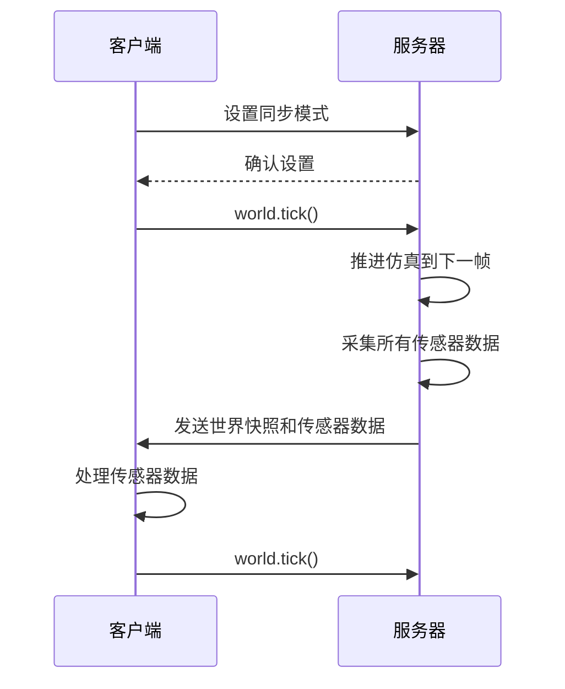
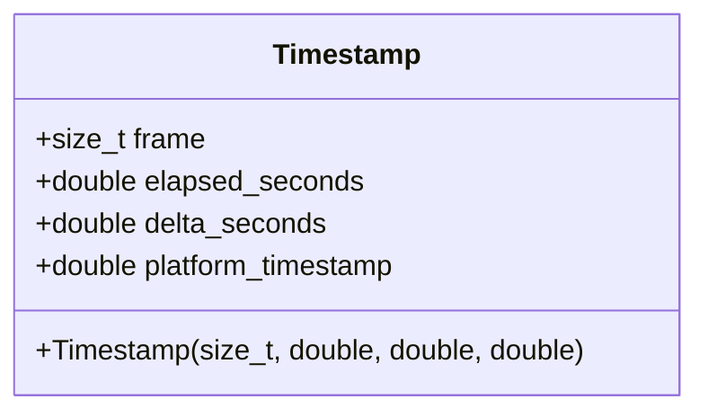
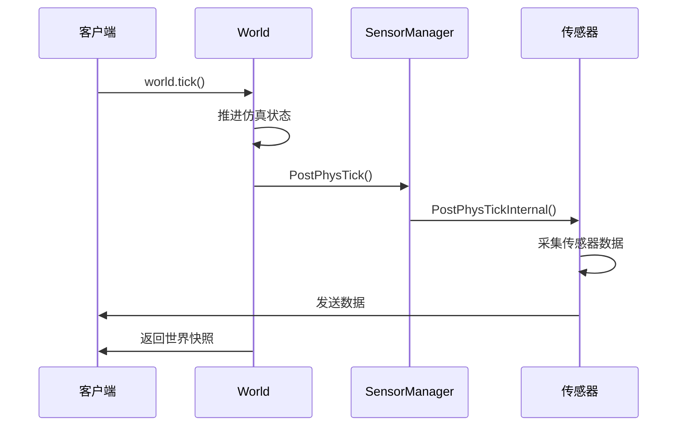
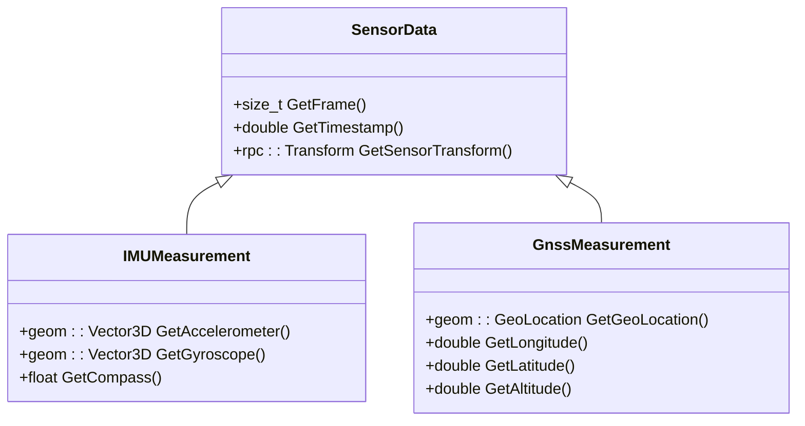
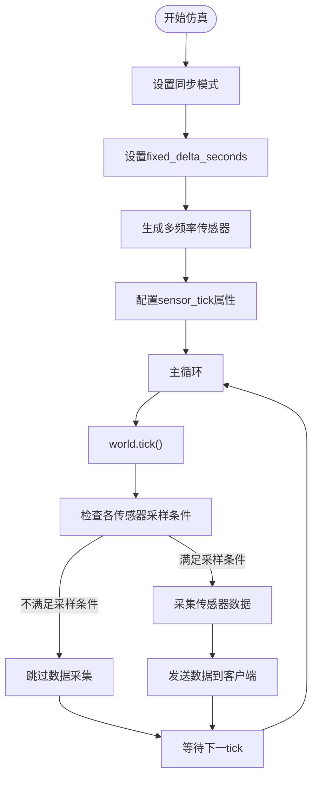
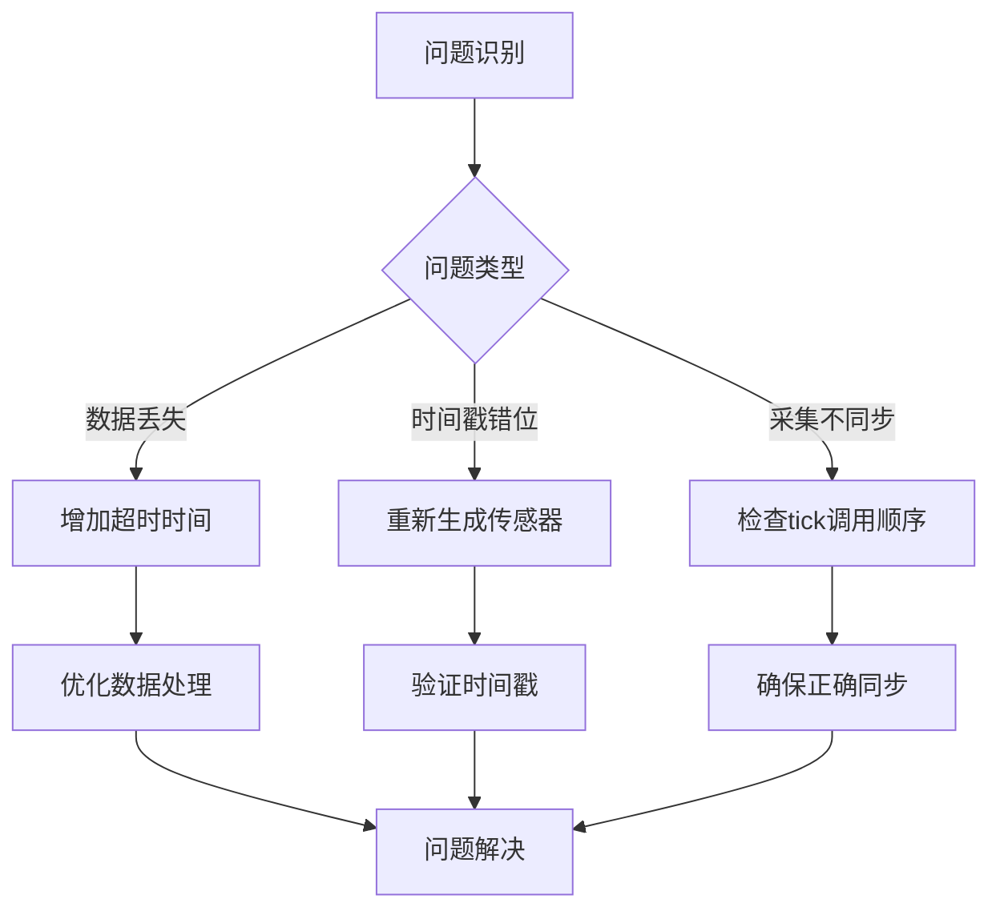

# 数据同步机制


**本文档中引用的文件**  
- [Timestamp.h](https://github.com/carla-simulator/carla/blob/ue5-dev/LibCarla/source/carla/client/Timestamp.h)
- [World.h](https://github.com/carla-simulator/carla/blob/ue5-dev/LibCarla/source/carla/client/World.h)
- [Sensor.h](https://github.com/carla-simulator/carla/blob/ue5-dev/LibCarla/source/carla/client/Sensor.h)
- [Sensor.cpp](https://github.com/carla-simulator/carla/blob/ue5-dev/Unreal/CarlaUnreal/Plugins/Carla/Source/Carla/Sensor/Sensor.cpp)
- [SensorManager.cpp](https://github.com/carla-simulator/carla/blob/ue5-dev/Unreal/CarlaUnreal/Plugins/Carla/Source/Carla/Sensor/SensorManager.cpp)
- [sensor_synchronization.py](https://github.com/carla-simulator/carla/blob/ue5-dev/PythonAPI/examples/sensor_synchronization.py)
- [test_sync.py](https://github.com/carla-simulator/carla/blob/ue5-dev/PythonAPI/test/smoke/test_sync.py)
- [foundations.md](https://github.com/carla-simulator/carla/blob/ue5-dev/Docs/foundations.md)
- [adv_synchrony_timestep.md](https://github.com/carla-simulator/carla/blob/ue5-dev/Docs/adv_synchrony_timestep.md)
- [SensorData.h](https://github.com/carla-simulator/carla/blob/ue5-dev/LibCarla/source/carla/sensor/SensorData.h)
- [SensorHeaderSerializer.h](https://github.com/carla-simulator/carla/blob/ue5-dev/LibCarla/source/carla/sensor/s11n/SensorHeaderSerializer.h)
- [IMUMeasurement.h](https://github.com/carla-simulator/carla/blob/ue5-dev/LibCarla/source/carla/sensor/data/IMUMeasurement.h)
- [GnssMeasurement.h](https://github.com/carla-simulator/carla/blob/ue5-dev/LibCarla/source/carla/sensor/data/GnssMeasurement.h)


## 目录
1. [引言](#引言)
2. [同步模式概述](#同步模式概述)
3. [时间戳结构](#时间戳结构)
4. [帧同步机制](#帧同步机制)
5. [多传感器数据对齐](#多传感器数据对齐)
6. [不同采样频率传感器处理](#不同采样频率传感器处理)
7. [实际代码示例](#实际代码示例)
8. [常见问题与调试](#常见问题与调试)
9. [结论](#结论)

## 引言

CARLA仿真器提供了一种强大的同步模式，用于确保多传感器数据在时间上精确对齐。这种机制对于自动驾驶系统开发至关重要，因为它允许研究人员和开发者在完全可控的环境中收集精确同步的传感器数据。本文档详细介绍了CARLA中数据同步机制的实现原理，包括时间戳结构、帧同步策略以及多传感器数据融合方法。

**本节不分析具体源文件，因此不提供来源**

## 同步模式概述

CARLA的同步模式是一种客户端-服务器通信模型，其中服务器（仿真器）在每个仿真步骤中等待客户端的确认信号（tick）后才推进到下一帧。这种机制确保了客户端有足够的时间处理当前帧的所有传感器数据，避免了数据丢失或混合。同步模式特别适用于处理慢速客户端应用以及需要多个传感器之间同步的场景。

当启用同步模式时，服务器会等待客户端发送tick信号，这使得客户端能够完全控制仿真进度。如果客户端处理速度较慢，服务器会暂停等待，从而防止数据溢出。这对于需要精确时间对齐的多传感器数据采集至关重要。



**Diagram sources**
- [World.h](https://github.com/carla-simulator/carla/blob/ue5-dev/LibCarla/source/carla/client/World.h#L143-L144)
- [foundations.md](https://github.com/carla-simulator/carla/blob/ue5-dev/Docs/foundations.md#L107-L121)

**Section sources**
- [World.h](https://github.com/carla-simulator/carla/blob/ue5-dev/LibCarla/source/carla/client/World.h#L85-L88)
- [foundations.md](https://github.com/carla-simulator/carla/blob/ue5-dev/Docs/foundations.md#L107-L121)

## 时间戳结构

CARLA中的时间戳结构包含多个时间维度，为传感器数据提供了精确的时间参考。`Timestamp`类定义了四个关键的时间属性：帧计数、经过时间、时间步长和平台时间戳。

### 时间戳组件

- **PlatformTime（平台时间）**：操作系统提供的实际时间戳，表示数据采集时的物理时间。这有助于将仿真时间与真实世界时间进行关联。
- **GameTime（游戏时间）**：自当前仿真会话开始以来经过的模拟时间（以秒为单位）。这是仿真内部的时间参考，不受客户端处理速度的影响。
- **SystemTime（系统时间）**：自仿真启动以来经过的总时间，以帧数为单位。这提供了全局的帧计数参考。



**Diagram sources**
- [Timestamp.h](https://github.com/carla-simulator/carla/blob/ue5-dev/LibCarla/source/carla/client/Timestamp.h#L14-L49)

**Section sources**
- [Timestamp.h](https://github.com/carla-simulator/carla/blob/ue5-dev/LibCarla/source/carla/client/Timestamp.h#L14-L72)

## 帧同步机制

CARLA通过`World.tick()`方法实现帧同步，这是同步模式的核心机制。当客户端调用`world.tick()`时，它向服务器发送一个信号，指示服务器推进到下一仿真帧。服务器在接收到tick信号后，会执行以下操作：

1. 推进仿真状态到下一帧
2. 更新所有实体的位置和状态
3. 触发所有传感器的数据采集
4. 将世界快照和所有传感器数据打包发送给客户端

这种机制确保了所有传感器在同一仿真帧内采集数据，实现了完美的时间对齐。`World.tick()`的调用是阻塞的，直到服务器完成所有处理并返回响应。



**Diagram sources**
- [World.h](https://github.com/carla-simulator/carla/blob/ue5-dev/LibCarla/source/carla/client/World.h#L143-L144)
- [SensorManager.cpp](https://github.com/carla-simulator/carla/blob/ue5-dev/Unreal/CarlaUnreal/Plugins/Carla/Source/Carla/Sensor/SensorManager.cpp#L20-L27)
- [Sensor.cpp](https://github.com/carla-simulator/carla/blob/ue5-dev/Unreal/CarlaUnreal/Plugins/Carla/Source/Carla/Sensor/Sensor.cpp#L62-L85)

**Section sources**
- [World.h](https://github.com/carla-simulator/carla/blob/ue5-dev/LibCarla/source/carla/client/World.h#L143-L144)
- [SensorManager.cpp](https://github.com/carla-simulator/carla/blob/ue5-dev/Unreal/CarlaUnreal/Plugins/Carla/Source/Carla/Sensor/SensorManager.cpp#L20-L27)

## 多传感器数据对齐

在同步模式下，CARLA确保所有传感器数据属于同一仿真帧，从而实现精确的时间对齐。这一过程通过统一的帧计数机制和时间戳同步来实现。

### 数据对齐策略

当`World.tick()`被调用时，所有注册的传感器都会在同一仿真帧内采集数据。每个传感器数据包都包含相同的帧计数和时间戳，这使得客户端可以轻松地将来自不同传感器的数据关联到同一时间点。

传感器数据的对齐是通过`SensorHeaderSerializer`实现的，该组件为每个传感器数据包添加了包含帧计数、时间戳和传感器变换的头部信息。这种设计确保了即使在高频率数据流中，也能保持精确的时间对齐。



**Diagram sources**
- [SensorData.h](https://github.com/carla-simulator/carla/blob/ue5-dev/LibCarla/source/carla/sensor/SensorData.h#L25-L68)
- [IMUMeasurement.h](https://github.com/carla-simulator/carla/blob/ue5-dev/LibCarla/source/carla/sensor/data/IMUMeasurement.h#L17-L51)
- [GnssMeasurement.h](https://github.com/carla-simulator/carla/blob/ue5-dev/LibCarla/source/carla/sensor/data/GnssMeasurement.h#L18-L56)

**Section sources**
- [SensorData.h](https://github.com/carla-simulator/carla/blob/ue5-dev/LibCarla/source/carla/sensor/SensorData.h#L25-L68)
- [SensorHeaderSerializer.h](https://github.com/carla-simulator/carla/blob/ue5-dev/LibCarla/source/carla/sensor/s11n/SensorHeaderSerializer.h#L21-L26)

## 不同采样频率传感器处理

CARLA的同步模式能够处理具有不同采样频率的传感器，这是通过`sensor_tick`属性实现的。每个传感器可以配置独立的采样间隔，允许在同步框架内实现灵活的采样策略。

### 采样频率配置

传感器的采样频率可以通过蓝图属性`sensor_tick`进行设置，该属性定义了传感器采集数据的时间间隔（以秒为单位）。例如，一个摄像头可能设置为每0.1秒采集一次数据，而一个IMU可能设置为每0.01秒采集一次数据。

在同步模式下，即使传感器的采样频率不同，它们的数据仍然与仿真帧对齐。服务器会根据每个传感器的`sensor_tick`属性决定是否在当前帧采集数据。这种机制允许在保持时间对齐的同时，支持不同频率的传感器数据流。



**Diagram sources**
- [Sensor.cpp](https://github.com/carla-simulator/carla/blob/ue5-dev/Unreal/CarlaUnreal/Plugins/Carla/Source/Carla/Sensor/Sensor.cpp#L43-L49)
- [test_sensor_tick_time.py](https://github.com/carla-simulator/carla/blob/ue5-dev/PythonAPI/test/smoke/test_sensor_tick_time.py#L51-L66)

**Section sources**
- [Sensor.cpp](https://github.com/carla-simulator/carla/blob/ue5-dev/Unreal/CarlaUnreal/Plugins/Carla/Source/Carla/Sensor/Sensor.cpp#L43-L49)
- [test_sensor_tick_time.py](https://github.com/carla-simulator/carla/blob/ue5-dev/PythonAPI/test/smoke/test_sensor_tick_time.py#L51-L66)

## 实际代码示例

以下代码示例展示了如何在CARLA中实现多传感器数据同步采集。该示例使用队列机制确保所有传感器数据在处理前都已到达，从而实现精确的时间对齐。

### 多传感器同步采集

```python
def sensor_callback(sensor_data, sensor_queue, sensor_name):
    sensor_queue.put((sensor_data.frame, sensor_name))

# 设置同步模式
settings = world.get_settings()
settings.fixed_delta_seconds = 0.2
settings.synchronous_mode = True
world.apply_settings(settings)

# 创建传感器队列
sensor_queue = Queue()

# 创建并配置多个传感器
cam_bp = blueprint_library.find('sensor.camera.rgb')
lidar_bp = blueprint_library.find('sensor.lidar.ray_cast')
radar_bp = blueprint_library.find('sensor.other.radar')

# 生成传感器并设置监听
cam01 = world.spawn_actor(cam_bp, carla.Transform())
cam01.listen(lambda data: sensor_callback(data, sensor_queue, "camera01"))

lidar01 = world.spawn_actor(lidar_bp, carla.Transform())
lidar01.listen(lambda data: sensor_callback(data, sensor_queue, "lidar01"))

# 主循环
while True:
    world.tick()
    w_frame = world.get_snapshot().frame
    
    # 等待所有传感器数据
    try:
        for _ in range(len(sensor_list)):
            s_frame = sensor_queue.get(True, 1.0)
    except Empty:
        print("部分传感器数据丢失")
```

**Section sources**
- [sensor_synchronization.py](https://github.com/carla-simulator/carla/blob/ue5-dev/PythonAPI/examples/sensor_synchronization.py#L34-L117)
- [test_sync.py](https://github.com/carla-simulator/carla/blob/ue5-dev/PythonAPI/test/smoke/test_sync.py#L43-L60)

## 常见问题与调试

在使用CARLA同步模式时，可能会遇到一些常见问题。本节介绍这些问题及其解决方案。

### 传感器数据丢失

传感器数据丢失通常是由于客户端处理速度过慢或网络延迟导致的。解决方案包括：

- 增加队列超时时间
- 优化数据处理算法
- 减少同时采集的传感器数量

### 时间戳错位

时间戳错位可能发生在传感器初始化阶段。确保在设置同步模式后重新生成传感器，以保证时间戳的正确性。

### 数据采集不同步

数据采集不同步通常是由于未正确使用`world.tick()`导致的。确保在处理完当前帧所有传感器数据后再调用`world.tick()`。



**Diagram sources**
- [test_sync.py](https://github.com/carla-simulator/carla/blob/ue5-dev/PythonAPI/test/smoke/test_sync.py#L43-L60)
- [adv_synchrony_timestep.md](https://github.com/carla-simulator/carla/blob/ue5-dev/Docs/adv_synchrony_timestep.md#L161-L173)

**Section sources**
- [test_sync.py](https://github.com/carla-simulator/carla/blob/ue5-dev/PythonAPI/test/smoke/test_sync.py#L43-L60)
- [adv_synchrony_timestep.md](https://github.com/carla-simulator/carla/blob/ue5-dev/Docs/adv_synchrony_timestep.md#L161-L173)

## 结论

CARLA的同步模式提供了一套完整的多传感器数据同步机制，通过`World.tick()`触发所有传感器数据采集，确保了数据的时间一致性。时间戳结构中的PlatformTime、GameTime和SystemTime为数据分析提供了多维度的时间参考。通过合理配置`sensor_tick`属性，可以灵活处理不同采样频率的传感器。使用队列机制可以有效解决多传感器数据融合中的同步问题。这些特性使得CARLA成为自动驾驶研究和开发的理想平台。

**本节不分析具体源文件，因此不提供来源**