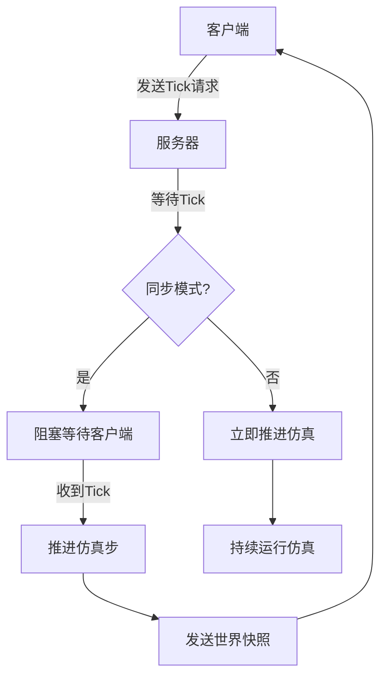
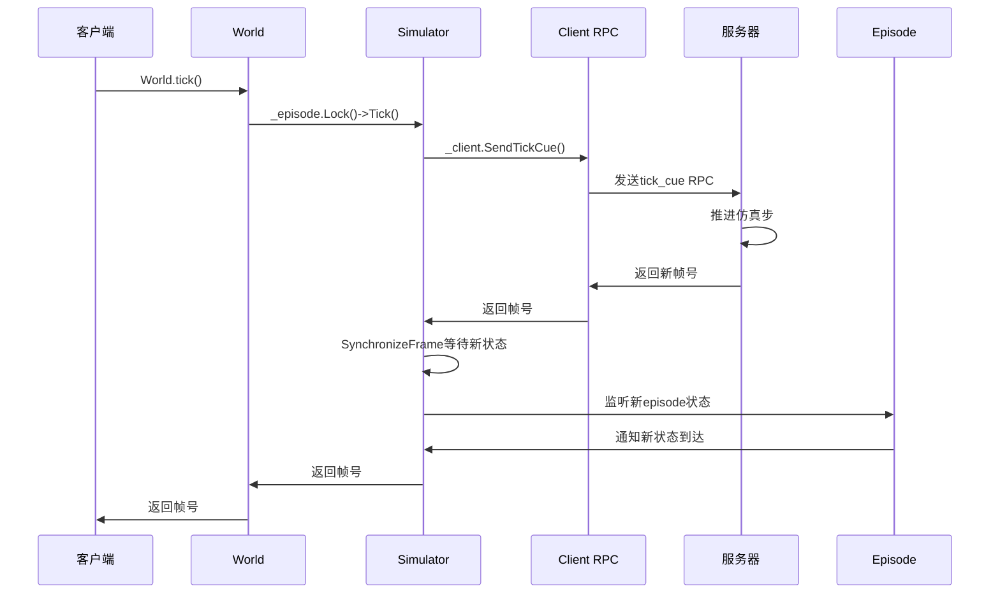

# 数据采集协调


**本文档引用的文件**   
- [World.h](https://github.com/carla-simulator/carla/blob/ue5-dev/LibCarla/source/carla/client/World.h)
- [World.cpp](https://github.com/carla-simulator/carla/blob/ue5-dev/LibCarla/source/carla/client/World.cpp)
- [Simulator.h](https://github.com/carla-simulator/carla/blob/ue5-dev/LibCarla/source/carla/client/detail/Simulator.h)
- [Simulator.cpp](https://github.com/carla-simulator/carla/blob/ue5-dev/LibCarla/source/carla/client/detail/Simulator.cpp)
- [Episode.h](https://github.com/carla-simulator/carla/blob/ue5-dev/LibCarla/source/carla/client/detail/Episode.h)
- [Episode.cpp](https://github.com/carla-simulator/carla/blob/ue5-dev/LibCarla/source/carla/client/detail/Episode.cpp)
- [Client.h](https://github.com/carla-simulator/carla/blob/ue5-dev/LibCarla/source/carla/client/detail/Client.h)
- [Client.cpp](https://github.com/carla-simulator/carla/blob/ue5-dev/LibCarla/source/carla/client/detail/Client.cpp)
- [ServerSideSensor.h](https://github.com/carla-simulator/carla/blob/ue5-dev/LibCarla/source/carla/client/ServerSideSensor.h)
- [ServerSideSensor.cpp](https://github.com/carla-simulator/carla/blob/ue5-dev/LibCarla/source/carla/client/ServerSideSensor.cpp)
- [Sensor.h](https://github.com/carla-simulator/carla/blob/ue5-dev/LibCarla/source/carla/client/Sensor.h)
- [TimeoutException.h](https://github.com/carla-simulator/carla/blob/ue5-dev/LibCarla/source/carla/client/TimeoutException.h)
- [TimeoutException.cpp](https://github.com/carla-simulator/carla/blob/ue5-dev/LibCarla/source/carla/client/TimeoutException.cpp)
- [RecurrentSharedFuture.h](https://github.com/carla-simulator/carla/blob/ue5-dev/LibCarla/source/carla/RecurrentSharedFuture.h)
- [adv_synchrony_timestep.md](https://github.com/carla-simulator/carla/blob/ue5-dev/Docs/adv_synchrony_timestep.md)
- [core_sensors.md](https://github.com/carla-simulator/carla/blob/ue5-dev/Docs/core_sensors.md)
- [sensor_synchronization.py](https://github.com/carla-simulator/carla/blob/ue5-dev/PythonAPI/examples/sensor_synchronization.py)


## 目录
1. [引言](#引言)
2. [同步模式通信协调策略](#同步模式通信协调策略)
3. [World.tick()同步机制](#worldtick同步机制)
4. [传感器数据采集协调](#传感器数据采集协调)
5. [超时处理与错误恢复](#超时处理与错误恢复)
6. [鲁棒的数据采集实现](#鲁棒的数据采集实现)
7. [常见问题与调试](#常见问题与调试)
8. [结论](#结论)

## 引言

CARLA仿真平台采用客户端-服务器架构，其中服务器负责运行仿真，客户端负责获取信息并请求世界状态的改变。在自动驾驶和机器人研究中，精确的数据采集至关重要，特别是在需要多传感器数据同步的场景中。本文档详细介绍了CARLA中客户端与服务器之间在同步模式下的通信协调机制，重点分析了`World.tick()`调用如何作为同步点确保仿真步进和数据采集的一致性。

在异步模式下，服务器会以尽可能快的速度运行仿真，而不等待客户端。而在同步模式下，服务器会等待客户端的"tick"信号（即"准备就绪"消息）后才更新到下一个仿真步骤。这种模式对于处理速度较慢的客户端应用特别重要，可以防止信息溢出和数据丢失。此外，当需要多个传感器之间的数据同步时，同步模式可以确保所有传感器的数据都来自仿真中的同一时刻。

**Section sources**
- [adv_synchrony_timestep.md](https://github.com/carla-simulator/carla/blob/ue5-dev/Docs/adv_synchrony_timestep.md#L113-L129)

## 同步模式通信协调策略

CARLA的同步模式通过客户端-服务器架构中的明确通信协议实现。当启用同步模式时，服务器的仿真循环会被阻塞，直到收到客户端的`World.tick()`调用。这种设计使得客户端能够完全控制仿真的时间步进，确保在处理完当前帧的所有数据后再推进仿真。

同步模式的配置非常简单，只需将世界设置中的`synchronous_mode`属性设置为`True`：

```python
settings = world.get_settings()
settings.synchronous_mode = True
world.apply_settings(settings)
```

在多客户端架构中，必须注意只有一个客户端应该发送tick信号。服务器会将收到的每个tick视为来自同一客户端，多个客户端同时发送tick会导致服务器与客户端之间的状态不一致。

同步模式与时间步长配置的组合会产生不同的仿真行为。固定时间步长配合同步模式可以让客户端完全控制仿真和信息流，而可变时间步长则可能带来不可靠的仿真结果。相反，在异步模式下，固定时间步长能为信息提供良好的时间参考，而可变时间步长则可能导致仿真不易重复。



**Diagram sources**
- [adv_synchrony_timestep.md](https://github.com/carla-simulator/carla/blob/ue5-dev/Docs/adv_synchrony_timestep.md#L178-L184)

**Section sources**
- [adv_synchrony_timestep.md](https://github.com/carla-simulator/carla/blob/ue5-dev/Docs/adv_synchrony_timestep.md#L113-L186)

## World.tick()同步机制

`World.tick()`是CARLA同步模式中的核心同步点，它在客户端和服务器之间建立了明确的协调机制。当客户端调用`World.tick()`时，它向服务器发送一个"tick cue"信号，指示服务器可以推进到下一个仿真步骤。这个调用会阻塞直到收到服务器的响应，确保客户端和服务器在时间步进上保持同步。

在C++实现层面，`World.tick()`方法通过`Simulator`类的`Tick`方法实现：

```cpp
uint64_t World::Tick(time_duration timeout) {
  time_duration local_timeout = timeout.milliseconds() == 0 ?
      _episode.Lock()->GetNetworkingTimeout() : timeout;
  return _episode.Lock()->Tick(local_timeout);
}
```

`Simulator::Tick`方法首先通过RPC调用`SendTickCue`向服务器发送tick信号，然后调用`SynchronizeFrame`函数等待服务器返回新的仿真帧：

```cpp
uint64_t Simulator::Tick(time_duration timeout) {
  DEBUG_ASSERT(_episode != nullptr);

  // tick pedestrian navigation
  NavigationTick();

  // send tick command
  const auto frame = _client.SendTickCue();

  // waits until new episode is received
  bool result = SynchronizeFrame(frame, *_episode, timeout);
  if (!result) {
    throw_exception(TimeoutException(_client.GetEndpoint(), timeout));
  }
  return frame;
}
```

`SynchronizeFrame`函数通过轮询`Episode`的当前状态，等待其帧号达到预期值。如果在指定超时时间内未能收到新的帧，将抛出`TimeoutException`异常。

`World.tick()`调用不仅推进仿真，还会触发一系列回调函数。通过`OnTick`方法注册的回调会在每次收到世界快照时被调用，允许客户端在每个仿真步骤执行特定操作：

```cpp
size_t World::OnTick(std::function<void(WorldSnapshot)> callback) {
  return _episode.Lock()->RegisterOnTickEvent(std::move(callback));
}
```

这种机制确保了仿真步进和数据采集的严格协调，客户端可以确信在调用`World.tick()`后，所有传感器数据都对应于刚刚完成的仿真步骤。



**Diagram sources**
- [World.h](https://github.com/carla-simulator/carla/blob/ue5-dev/LibCarla/source/carla/client/World.h#L139-L143)
- [World.cpp](https://github.com/carla-simulator/carla/blob/ue5-dev/LibCarla/source/carla/client/World.cpp#L157-L161)
- [Simulator.h](https://github.com/carla-simulator/carla/blob/ue5-dev/LibCarla/source/carla/client/detail/Simulator.h#L204-L205)
- [Simulator.cpp](https://github.com/carla-simulator/carla/blob/ue5-dev/LibCarla/source/carla/client/detail/Simulator.cpp#L221-L235)

**Section sources**
- [World.h](https://github.com/carla-simulator/carla/blob/ue5-dev/LibCarla/source/carla/client/World.h#L139-L143)
- [World.cpp](https://github.com/carla-simulator/carla/blob/ue5-dev/LibCarla/source/carla/client/World.cpp#L157-L161)
- [Simulator.h](https://github.com/carla-simulator/carla/blob/ue5-dev/LibCarla/source/carla/client/detail/Simulator.h#L204-L205)
- [Simulator.cpp](https://github.com/carla-simulator/carla/blob/ue5-dev/LibCarla/source/carla/client/detail/Simulator.cpp#L221-L235)

## 传感器数据采集协调

在CARLA中，传感器数据的采集通过`Sensor.listen()`回调机制与`World.tick()`同步。每个传感器都有一个`listen`方法，该方法接受一个回调函数作为参数，当传感器获取到新数据时就会调用这个回调函数。

```cpp
void ServerSideSensor::Listen(CallbackFunctionType callback) {
  log_debug("calling sensor Listen() ", GetDisplayId());
  log_debug(GetDisplayId(), ": subscribing to stream");
  GetEpisode().Lock()->SubscribeToSensor(*this, std::move(callback));
  listening_mask.set(0);
}
```

在同步模式下，传感器数据的采集与仿真步进需要精心协调。典型的协调模式是：客户端调用`World.tick()`推进仿真，然后从各个传感器的回调中收集数据。由于数据是异步到达的，而仿真步进是同步的，因此需要一个协调机制来确保在处理完所有传感器数据后再进行下一步。

一个常见的实现是使用队列来协调多个传感器的数据采集。每个传感器的回调函数将数据放入一个共享队列，主循环在调用`World.tick()`后，从队列中获取所有传感器的数据：

```python
def sensor_callback(sensor_data, sensor_queue, sensor_name):
    sensor_queue.put((sensor_data.frame, sensor_name))

# 主循环
while True:
    # Tick服务器
    world.tick()
    w_frame = world.get_snapshot().frame
    
    # 等待所有传感器数据
    try:
        for _ in range(len(sensor_list)):
            s_frame = sensor_queue.get(True, 1.0)
            print("    Frame: %d   Sensor: %s" % (s_frame[0], s_frame[1]))
    except Empty:
        print("    Some of the sensor information is missed")
```

这种模式的关键在于`sensor_queue.get()`的阻塞特性，它会等待直到所有传感器的数据都被处理。通过设置超时参数，可以避免无限期等待丢失的数据。

对于GPU-based传感器（主要是摄像头），数据通常会有几帧的延迟。这是因为GPU渲染和数据传输需要时间。同步模式在这里尤为重要，因为它确保了即使有延迟，所有传感器的数据仍然对应于同一个仿真时刻。

```mermaid
flowchart TD
A[启动传感器] --> B[设置listen回调]
B --> C[回调函数将数据放入队列]
C --> D[主循环调用World.tick()]
D --> E[主循环从队列获取数据]
E --> F{所有传感器数据都收到?}
F --> |是| G[处理数据]
F --> |否| H[超时处理]
G --> D
H --> D
```

**Diagram sources**
- [ServerSideSensor.h](https://github.com/carla-simulator/carla/blob/ue5-dev/LibCarla/source/carla/client/ServerSideSensor.h#L29-L30)
- [ServerSideSensor.cpp](https://github.com/carla-simulator/carla/blob/ue5-dev/LibCarla/source/carla/client/ServerSideSensor.cpp#L39-L42)
- [sensor_synchronization.py](https://github.com/carla-simulator/carla/blob/ue5-dev/PythonAPI/examples/sensor_synchronization.py#L34-L37)
- [sensor_synchronization.py](https://github.com/carla-simulator/carla/blob/ue5-dev/PythonAPI/examples/sensor_synchronization.py#L94-L112)

**Section sources**
- [ServerSideSensor.h](https://github.com/carla-simulator/carla/blob/ue5-dev/LibCarla/source/carla/client/ServerSideSensor.h#L29-L30)
- [ServerSideSensor.cpp](https://github.com/carla-simulator/carla/blob/ue5-dev/LibCarla/source/carla/client/ServerSideSensor.cpp#L39-L42)
- [core_sensors.md](https://github.com/carla-simulator/carla/blob/ue5-dev/Docs/core_sensors.md#L61-L80)
- [sensor_synchronization.py](https://github.com/carla-simulator/carla/blob/ue5-dev/PythonAPI/examples/sensor_synchronization.py#L34-L112)

## 超时处理与错误恢复

在CARLA的数据采集过程中，超时处理和错误恢复机制对于确保系统的鲁棒性至关重要。系统在多个层面实现了超时检测和恢复策略，以应对网络延迟、数据包丢失等异常情况。

最核心的超时机制体现在`World.tick()`调用中。当调用`World.tick()`时，可以指定一个超时时间。如果在指定时间内未能从服务器收到响应，将抛出`TimeoutException`异常：

```cpp
bool SynchronizeFrame(uint64_t frame, const Episode &episode, time_duration timeout) {
  bool result = true;
  auto start = std::chrono::system_clock::now();
  while (frame > episode.GetState()->GetTimestamp().frame) {
    std::this_thread::yield();
    auto end = std::chrono::system_clock::now();
    auto diff = std::chrono::duration_cast<std::chrono::milliseconds>(end-start);
    if(timeout.to_chrono() < diff) {
      result = false;
      break;
    }
  }
  return result;
}
```

`TimeoutException`类提供了详细的错误信息，包括超时时间和服务器端点：

```cpp
TimeoutException::TimeoutException(
    const std::string &endpoint,
    time_duration timeout)
  : std::runtime_error(
      "time-out of "s + std::to_string(timeout.milliseconds()) +
      "ms while waiting for the simulator, "
      "make sure the simulator is ready and connected to " + endpoint) {}
```

除了`World.tick()`的超时，传感器数据采集也实现了超时机制。在`sensor_synchronization.py`示例中，使用了带超时的队列获取：

```python
try:
    for _ in range(len(sensor_list)):
        s_frame = sensor_queue.get(True, 1.0)  # 1.0秒超时
except Empty:
    print("    Some of the sensor information is missed")
```

当发生超时或异常时，系统提供了多种恢复策略：

1. **重试机制**：对于临时性网络问题，系统会自动尝试重新连接。在TCP客户端实现中，当连接失败时会调用`Reconnect()`方法：

```cpp
void Client::Reconnect() {
  auto self = shared_from_this();
  _connection_timer.expires_from_now(time_duration::seconds(1u));
  _connection_timer.async_wait([this, self](boost::system::error_code ec) {
    if (!ec) {
      Connect();
    }
  });
}
```

2. **状态检查与恢复**：`Episode`类维护了当前仿真状态，当检测到异常时可以进行状态恢复。`Episode`中的`_pending_exceptions`标志用于标记待处理的异常：

```cpp
/// Check for pending exceptions (Mainly TM server closed)
if(self->_pending_exceptions) {
  /// Mark pending exception false
  self->_pending_exceptions = false;
  
  /// Create exception for the error message
  auto exception(self->_pending_exceptions_msg);
  // Notify waiting threads that exception occurred
  self->_snapshot.SetException(std::runtime_error(exception));
}
```

3. **资源清理**：当发生不可恢复的错误时，系统会进行适当的资源清理。`ServerSideSensor`的析构函数会检查并记录未正确停止的传感器：

```cpp
ServerSideSensor::~ServerSideSensor() {
  if (IsAlive() && IsListening()) {
    log_warning(
        "sensor object went out of the scope but the sensor is still alive",
        "in the simulation:",
        GetDisplayId());
  }
  if (IsListening() && GetEpisode().IsValid()) {
    try {
      for (uint32_t i = 1; i != GBufferTextureCount + 1; ++i) {
        if (listening_mask.test(i))
          StopGBuffer(i - 1);
      }
      Stop();
    } catch (const std::exception &e) {
      log_error("exception trying to stop sensor:", GetDisplayId(), ':', e.what());
    }
  }
}
```

这些机制共同构成了一个健壮的错误处理框架，确保在各种异常情况下系统能够优雅地处理错误，避免死锁和状态不一致。

```mermaid
flowchart TD
A[World.tick()调用] --> B{在超时内收到响应?}
B --> |是| C[正常返回]
B --> |否| D[抛出TimeoutException]
D --> E[客户端处理异常]
E --> F{可恢复?}
F --> |是| G[重试或恢复]
F --> |否| H[资源清理]
H --> I[退出或重启]
G --> A
```

**Diagram sources**
- [Simulator.cpp](https://github.com/carla-simulator/carla/blob/ue5-dev/LibCarla/source/carla/client/detail/Simulator.cpp#L231-L234)
- [TimeoutException.h](https://github.com/carla-simulator/carla/blob/ue5-dev/LibCarla/source/carla/client/TimeoutException.h#L17-L23)
- [TimeoutException.cpp](https://github.com/carla-simulator/carla/blob/ue5-dev/LibCarla/source/carla/client/TimeoutException.cpp#L14-L20)
- [sensor_synchronization.py](https://github.com/carla-simulator/carla/blob/ue5-dev/PythonAPI/examples/sensor_synchronization.py#L105-L112)

**Section sources**
- [Simulator.cpp](https://github.com/carla-simulator/carla/blob/ue5-dev/LibCarla/source/carla/client/detail/Simulator.cpp#L231-L234)
- [TimeoutException.h](https://github.com/carla-simulator/carla/blob/ue5-dev/LibCarla/source/carla/client/TimeoutException.h#L17-L23)
- [TimeoutException.cpp](https://github.com/carla-simulator/carla/blob/ue5-dev/LibCarla/source/carla/client/TimeoutException.cpp#L14-L20)
- [Client.cpp](https://github.com/carla-simulator/carla/blob/ue5-dev/LibCarla/source/carla/client/detail/Client.cpp#L152-L154)
- [Episode.cpp](https://github.com/carla-simulator/carla/blob/ue5-dev/LibCarla/source/carla/client/detail/Episode.cpp#L71-L80)
- [ServerSideSensor.cpp](https://github.com/carla-simulator/carla/blob/ue5-dev/LibCarla/source/carla/client/ServerSideSensor.cpp#L19-L36)

## 鲁棒的数据采集实现

基于CARLA的同步机制和错误处理策略，可以实现一个鲁棒的数据采集循环，能够有效处理网络延迟、数据包丢失等异常情况。以下是一个完整的实现示例：

```python
def robust_data_collection():
    # 创建客户端并设置超时
    client = carla.Client('localhost', 2000)
    client.set_timeout(10.0)  # 设置10秒超时
    world = client.get_world()
    
    try:
        # 保存原始设置以便恢复
        original_settings = world.get_settings()
        settings = world.get_settings()
        
        # 启用同步模式
        settings.fixed_delta_seconds = 0.1
        settings.synchronous_mode = True
        world.apply_settings(settings)
        
        # 创建传感器数据队列
        sensor_queue = Queue()
        
        # 创建并启动传感器
        sensor_list = []
        blueprint_library = world.get_blueprint_library()
        
        # 添加RGB摄像头
        cam_bp = blueprint_library.find('sensor.camera.rgb')
        camera = world.spawn_actor(cam_bp, carla.Transform())
        camera.listen(lambda data: sensor_queue.put(('camera', data)))
        sensor_list.append(camera)
        
        # 添加激光雷达
        lidar_bp = blueprint_library.find('sensor.lidar.ray_cast')
        lidar_bp.set_attribute('points_per_second', '100000')
        lidar = world.spawn_actor(lidar_bp, carla.Transform())
        lidar.listen(lambda data: sensor_queue.put(('lidar', data)))
        sensor_list.append(lidar)
        
        # 主数据采集循环
        frame_count = 0
        while True:
            try:
                # 推进仿真步
                world.tick()
                frame_count += 1
                
                # 收集当前帧的所有传感器数据
                collected_data = {}
                expected_sensors = len(sensor_list)
                collected_sensors = 0
                
                # 设置合理的超时时间（例如2秒）
                collection_timeout = 2.0
                
                while collected_sensors < expected_sensors:
                    try:
                        sensor_name, sensor_data = sensor_queue.get(
                            timeout=collection_timeout)
                        
                        # 检查数据是否属于当前帧
                        if sensor_data.frame == frame_count:
                            collected_data[sensor_name] = sensor_data
                            collected_sensors += 1
                        else:
                            # 数据属于旧帧，放回队列
                            sensor_queue.put((sensor_name, sensor_data))
                            
                    except Empty:
                        print(f"警告: 在帧 {frame_count} 中未能收集到所有传感器数据")
                        break
                
                # 处理收集到的数据
                if collected_data:
                    process_frame_data(frame_count, collected_data)
                    
            except carla.TimeoutException as e:
                print(f"World.tick() 超时: {e}")
                print("尝试恢复连接...")
                time.sleep(1)
                continue
                
            except Exception as e:
                print(f"数据采集过程中发生错误: {e}")
                break
                
    finally:
        # 清理资源
        world.apply_settings(original_settings)
        for sensor in sensor_list:
            sensor.destroy()
```

这个实现的关键特性包括：

1. **分层超时处理**：客户端连接有10秒超时，`World.tick()`使用默认超时，传感器数据采集有2秒超时。

2. **数据帧对齐**：检查传感器数据的帧号是否与当前仿真帧匹配，避免处理过时数据。

3. **异常隔离**：将`World.tick()`和数据采集分别放在try-catch块中，确保一个环节的失败不会影响其他环节。

4. **优雅恢复**：在发生超时等可恢复错误时，等待一段时间后继续循环，而不是直接退出。

5. **资源清理**：使用finally块确保无论发生什么情况，都会恢复原始设置并销毁传感器。

这种实现方式能够有效处理网络延迟、数据包丢失、服务器重启等各种异常情况，确保数据采集的连续性和完整性。

**Section sources**
- [sensor_synchronization.py](https://github.com/carla-simulator/carla/blob/ue5-dev/PythonAPI/examples/sensor_synchronization.py#L40-L117)

## 常见问题与调试

在使用CARLA进行数据采集时，可能会遇到一些常见问题，如采集死锁、响应超时和状态不一致等。了解这些问题的原因和解决方案对于构建可靠的系统至关重要。

### 采集死锁

采集死锁通常发生在多传感器同步采集时，当某个传感器未能发送数据，而主循环无限期等待该数据时就会发生死锁。避免死锁的关键是为所有阻塞操作设置合理的超时：

```python
# 错误的做法 - 可能导致死锁
sensor_data = sensor_queue.get()  # 无限期等待

# 正确的做法 - 设置超时
try:
    sensor_data = sensor_queue.get(timeout=2.0)
except Empty:
    print("传感器数据超时，继续下一帧")
```

### 响应超时

响应超时通常是由于网络延迟、服务器负载过高或客户端处理速度过慢引起的。解决方法包括：

1. **增加超时时间**：根据网络状况和系统负载调整超时设置。
2. **优化客户端性能**：减少每帧的数据处理时间，避免阻塞主线程。
3. **监控网络状况**：使用网络监控工具检查延迟和丢包率。

### 状态不一致

状态不一致可能发生在多客户端环境中，当多个客户端同时发送tick信号时。解决方案是确保只有一个客户端负责发送tick：

```python
# 确保只有一个客户端控制仿真步进
if client_role == 'controller':
    world.tick()
else:
    # 其他客户端只读取数据
    world_snapshot = world.wait_for_tick()
```

### 调试工具和监控方法

CARLA提供了多种调试工具和监控方法：

1. **日志记录**：启用详细的日志记录可以帮助诊断问题：
```cpp
log_debug("streaming client: connected to", ep);
log_info("secondary server: connected to ", self->_endpoint);
log_warning("failed to destroy", actor.GetDisplayId());
```

2. **性能监控**：监控`World.tick()`的执行时间和传感器数据的延迟：
```python
start_time = time.time()
world.tick()
tick_time = time.time() - start_time
print(f"Tick时间: {tick_time:.3f}秒")
```

3. **数据完整性检查**：验证传感器数据的帧号是否连续：
```python
if sensor_data.frame != expected_frame:
    print(f"帧丢失: 期望 {expected_frame}, 实际 {sensor_data.frame}")
```

4. **网络监控**：使用系统工具监控网络连接状态和带宽使用情况。

通过结合这些调试工具和最佳实践，可以有效识别和解决数据采集过程中的各种问题，确保系统的稳定运行。

**Section sources**
- [sensor_synchronization.py](https://github.com/carla-simulator/carla/blob/ue5-dev/PythonAPI/examples/sensor_synchronization.py#L105-L112)
- [Simulator.cpp](https://github.com/carla-simulator/carla/blob/ue5-dev/LibCarla/source/carla/client/detail/Simulator.cpp#L231-L234)
- [Client.cpp](https://github.com/carla-simulator/carla/blob/ue5-dev/LibCarla/source/carla/client/detail/Client.cpp#L64-L66)

## 结论

CARLA的数据采集协调机制通过客户端-服务器架构中的同步模式实现了精确的仿真步进和数据采集控制。`World.tick()`调用作为核心同步点，在客户端和服务器之间建立了明确的协调机制，确保了仿真步进和数据采集的一致性。

传感器数据采集通过`Sensor.listen()`回调机制与`World.tick()`同步，使用队列等协调结构可以有效处理异步传感器数据和同步帧边界的关系。系统在多个层面实现了超时处理和错误恢复策略，包括`World.tick()`的超时检测、自动重试机制和资源清理，确保了在各种异常情况下的系统鲁棒性。

通过合理配置同步模式、正确实现数据采集循环并应用适当的调试和监控方法，可以构建一个高效、可靠的数据采集系统，满足自动驾驶和机器人研究中对精确数据同步的严格要求。