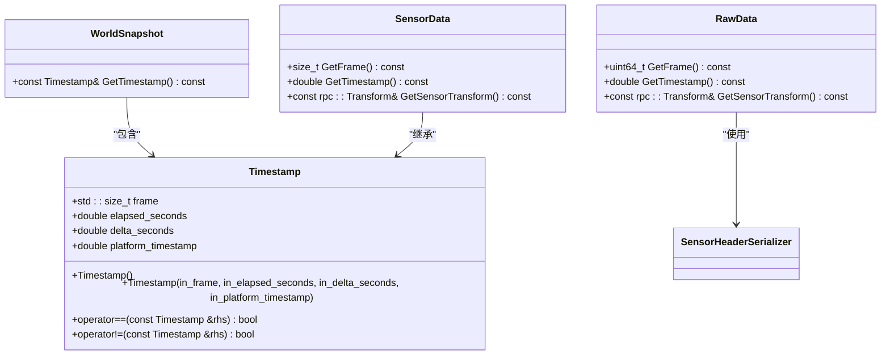
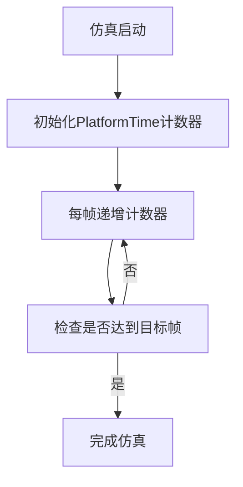
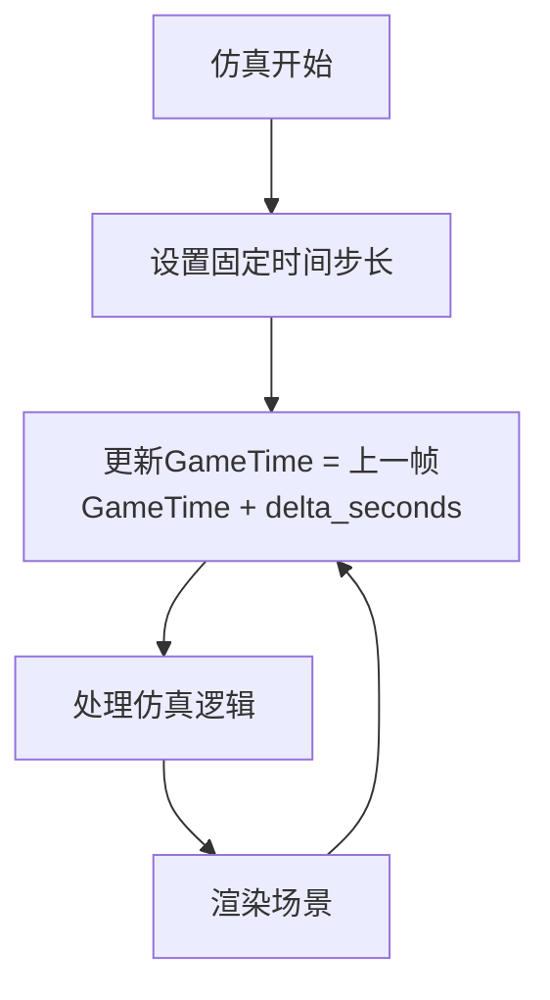
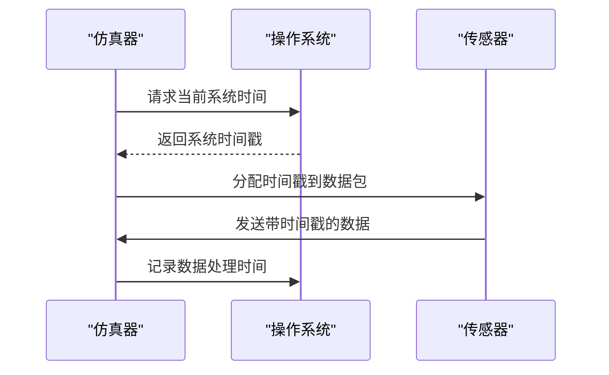
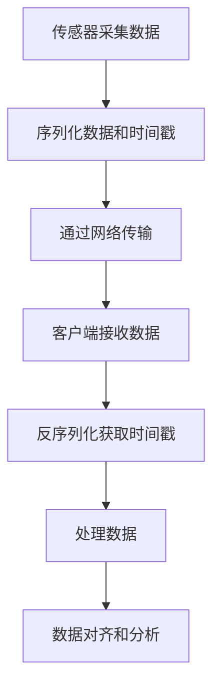
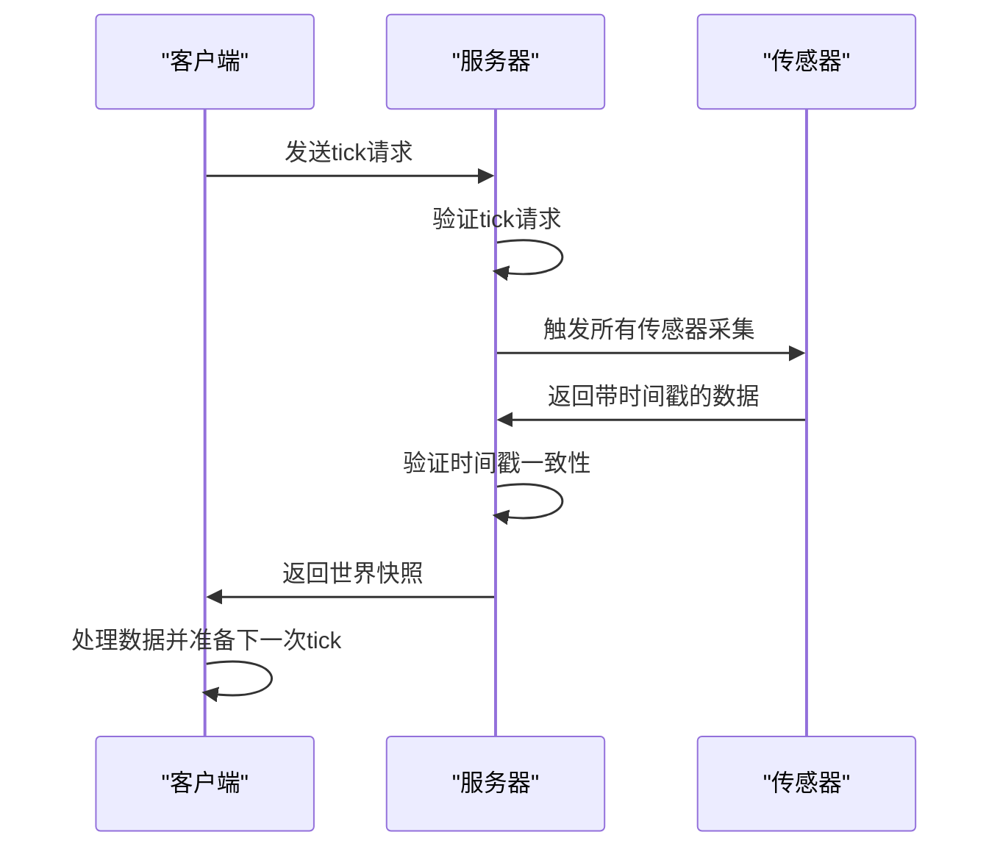
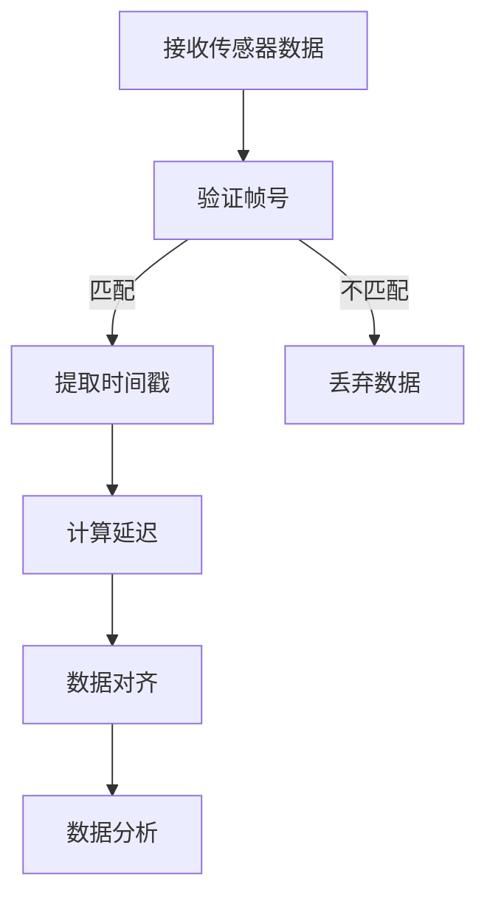

# 时间戳系统


**本文档中引用的文件**   
- [Timestamp.h](https://github.com/carla-simulator/carla/blob/ue5-dev/LibCarla/source/carla/client/Timestamp.h)
- [CarlaRecorderPlatformTime.h](https://github.com/carla-simulator/carla/blob/ue5-dev/Unreal/CarlaUnreal/Plugins/Carla/Source/Carla/Recorder/CarlaRecorderPlatformTime.h)
- [CarlaRecorderPlatformTime.cpp](https://github.com/carla-simulator/carla/blob/ue5-dev/Unreal/CarlaUnreal/Plugins/Carla/Source/Carla/Recorder/CarlaRecorderPlatformTime.cpp)
- [SensorHeaderSerializer.h](https://github.com/carla-simulator/carla/blob/ue5-dev/LibCarla/source/carla/sensor/s11n/SensorHeaderSerializer.h)
- [SensorData.h](https://github.com/carla-simulator/carla/blob/ue5-dev/LibCarla/source/carla/sensor/SensorData.h)
- [RawData.h](https://github.com/carla-simulator/carla/blob/ue5-dev/LibCarla/source/carla/sensor/RawData.h)
- [adv_synchrony_timestep.md](https://github.com/carla-simulator/carla/blob/ue5-dev/Docs/adv_synchrony_timestep.md)
- [python_api.md](https://github.com/carla-simulator/carla/blob/ue5-dev/Docs/python_api.md)
- [core_sensors.md](https://github.com/carla-simulator/carla/blob/ue5-dev/Docs/core_sensors.md)


## 目录
1. [引言](#引言)
2. [时间戳系统架构](#时间戳系统架构)
3. [核心时间维度](#核心时间维度)
4. [传感器数据包中的时间戳](#传感器数据包中的时间戳)
5. [同步模式下的时间戳一致性](#同步模式下的时间戳一致性)
6. [时间戳解析与数据对齐](#时间戳解析与数据对齐)
7. [常见问题与校准方法](#常见问题与校准方法)
8. [最佳实践](#最佳实践)
9. [结论](#结论)

## 引言

CARLA仿真系统中的时间戳机制是确保仿真精度和数据一致性的关键组件。该系统通过三个主要时间维度——PlatformTime、GameTime和SystemTime——来精确跟踪和管理仿真过程中的时间信息。这些时间维度共同构成了一个完整的时序框架，支持从传感器数据采集到仿真状态同步的各个方面。本文档将深入探讨这些时间维度的定义、用途和相互关系，以及它们在实际应用中的实现和优化。

**Section sources**
- [Timestamp.h](https://github.com/carla-simulator/carla/blob/ue5-dev/LibCarla/source/carla/client/Timestamp.h#L1-L52)
- [adv_synchrony_timestep.md](https://github.com/carla-simulator/carla/blob/ue5-dev/Docs/adv_synchrony_timestep.md#L1-L282)

## 时间戳系统架构

CARLA的时间戳系统采用分层架构设计，其中`Timestamp`类作为核心数据结构，封装了所有必要的时序信息。该类定义了四个关键属性：`frame`、`elapsed_seconds`、`delta_seconds`和`platform_timestamp`，分别对应不同的时间维度。系统通过`WorldSnapshot`对象在每个仿真步进中生成时间戳，确保所有传感器和仿真组件能够访问一致的时间信息。



**Diagram sources **
- [Timestamp.h](https://github.com/carla-simulator/carla/blob/ue5-dev/LibCarla/source/carla/client/Timestamp.h#L14-L48)
- [WorldSnapshot.h](https://github.com/carla-simulator/carla/blob/ue5-dev/LibCarla/source/carla/client/WorldSnapshot.h#L33-L35)
- [SensorData.h](https://github.com/carla-simulator/carla/blob/ue5-dev/LibCarla/source/carla/sensor/SensorData.h#L25-L28)
- [RawData.h](https://github.com/carla-simulator/carla/blob/ue5-dev/LibCarla/source/carla/sensor/RawData.h#L25-L43)

**Section sources**
- [Timestamp.h](https://github.com/carla-simulator/carla/blob/ue5-dev/LibCarla/source/carla/client/Timestamp.h#L14-L48)
- [WorldSnapshot.h](https://github.com/carla-simulator/carla/blob/ue5-dev/LibCarla/source/carla/client/WorldSnapshot.h#L33-L35)

## 核心时间维度

CARLA仿真系统中的时间戳机制由三个核心时间维度组成：PlatformTime、GameTime和SystemTime。这些维度分别对应不同的时间参考系，为仿真提供了多维度的时间信息。

### PlatformTime

PlatformTime作为仿真步进计数器，记录自仿真启动以来经过的帧数。它是一个单调递增的整数值，用于标识仿真过程中的每个离散时间点。PlatformTime的主要作用是提供一个稳定的、不可变的时间参考，确保仿真状态的可追溯性和一致性。



**Diagram sources **
- [Timestamp.h](https://github.com/carla-simulator/carla/blob/ue5-dev/LibCarla/source/carla/client/Timestamp.h#L29-L30)
- [CarlaRecorderPlatformTime.h](https://github.com/carla-simulator/carla/blob/ue5-dev/Unreal/CarlaUnreal/Plugins/Carla/Source/Carla/Recorder/CarlaRecorderPlatformTime.h#L12-L27)

### GameTime

GameTime表示仿真世界内部时钟，记录自当前场景开始以来经过的模拟秒数。它是一个双精度浮点数，反映了仿真环境中的真实时间流逝。GameTime的值由仿真引擎根据设定的时间步长计算得出，支持固定和可变时间步长模式。



**Diagram sources **
- [Timestamp.h](https://github.com/carla-simulator/carla/blob/ue5-dev/LibCarla/source/carla/client/Timestamp.h#L32-L33)
- [adv_synchrony_timestep.md](https://github.com/carla-simulator/carla/blob/ue5-dev/Docs/adv_synchrony_timestep.md#L44-L52)

### SystemTime

SystemTime对应主机系统时钟，记录测量发生时的操作系统时间戳。它以秒为单位，基于系统时钟提供绝对时间参考。SystemTime主要用于性能分析、延迟计算和跨系统时间同步。



**Diagram sources **
- [Timestamp.h](https://github.com/carla-simulator/carla/blob/ue5-dev/LibCarla/source/carla/client/Timestamp.h#L38-L40)
- [CarlaRecorderPlatformTime.cpp](https://github.com/carla-simulator/carla/blob/ue5-dev/Unreal/CarlaUnreal/Plugins/Carla/Source/Carla/Recorder/CarlaRecorderPlatformTime.cpp#L11-L21)

**Section sources**
- [Timestamp.h](https://github.com/carla-simulator/carla/blob/ue5-dev/LibCarla/source/carla/client/Timestamp.h#L29-L40)
- [CarlaRecorderPlatformTime.h](https://github.com/carla-simulator/carla/blob/ue5-dev/Unreal/CarlaUnreal/Plugins/Carla/Source/Carla/Recorder/CarlaRecorderPlatformTime.h#L12-L27)
- [CarlaRecorderPlatformTime.cpp](https://github.com/carla-simulator/carla/blob/ue5-dev/Unreal/CarlaUnreal/Plugins/Carla/Source/Carla/Recorder/CarlaRecorderPlatformTime.cpp#L11-L21)

## 传感器数据包中的时间戳

在CARLA系统中，时间戳的序列化和传输机制是确保数据完整性和一致性的关键。传感器数据包通过`SensorHeaderSerializer`类进行序列化，将时间戳信息嵌入到数据包头部。

### 序列化机制

传感器数据包的头部包含`frame`、`timestamp`和`sensor_transform`等关键信息。`SensorHeaderSerializer`类负责将这些信息打包成二进制格式，确保高效传输和解析。

```mermaid
classDiagram
class SensorHeaderSerializer {
+struct Header {
+uint64_t sensor_type
+uint64_t frame
+double timestamp
+rpc : : Transform sensor_transform
}
+static Buffer Serialize(index, frame, timestamp, transform)
+static const Header& Deserialize(const Buffer& message)
}
class SensorData {
+size_t _frame
+double _timestamp
+rpc : : Transform _sensor_transform
}
SensorHeaderSerializer --> SensorData : "序列化/反序列化"
```

**Diagram sources **
- [SensorHeaderSerializer.h](https://github.com/carla-simulator/carla/blob/ue5-dev/LibCarla/source/carla/sensor/s11n/SensorHeaderSerializer.h#L16-L27)
- [SensorData.h](https://github.com/carla-simulator/carla/blob/ue5-dev/LibCarla/source/carla/sensor/SensorData.h#L24-L28)

### 传输机制

时间戳通过`RawData`类进行传输，该类封装了原始传感器数据及其元信息。`RawData`提供了访问时间戳的接口，确保客户端能够正确解析和使用时间信息。



**Diagram sources **
- [RawData.h](https://github.com/carla-simulator/carla/blob/ue5-dev/LibCarla/source/carla/sensor/RawData.h#L25-L43)
- [SensorHeaderSerializer.h](https://github.com/carla-simulator/carla/blob/ue5-dev/LibCarla/source/carla/sensor/s11n/SensorHeaderSerializer.h#L16-L27)

**Section sources**
- [SensorHeaderSerializer.h](https://github.com/carla-simulator/carla/blob/ue5-dev/LibCarla/source/carla/sensor/s11n/SensorHeaderSerializer.h#L16-L27)
- [SensorData.h](https://github.com/carla-simulator/carla/blob/ue5-dev/LibCarla/source/carla/sensor/SensorData.h#L24-L28)
- [RawData.h](https://github.com/carla-simulator/carla/blob/ue5-dev/LibCarla/source/carla/sensor/RawData.h#L25-L43)

## 同步模式下的时间戳一致性

在同步模式下，CARLA通过严格的时序控制确保时间戳的一致性。服务器等待客户端的"tick"消息后才推进仿真，这种机制保证了所有传感器数据在同一仿真步进中被采集。

### 同步流程



### 一致性保证

同步模式通过以下机制确保时间戳一致性：
1. 所有传感器在同一仿真步进中被触发
2. 时间戳基于相同的`frame`和`elapsed_seconds`值
3. 服务器验证所有传感器数据的时间戳匹配

**Section sources**
- [adv_synchrony_timestep.md](https://github.com/carla-simulator/carla/blob/ue5-dev/Docs/adv_synchrony_timestep.md#L117-L173)
- [sensor_synchronization.py](https://github.com/carla-simulator/carla/blob/ue5-dev/PythonAPI/examples/sensor_synchronization.py#L40-L124)

## 时间戳解析与数据对齐

### 解析方法

时间戳解析主要通过`SensorData`类的接口实现，客户端可以访问`GetFrame()`和`GetTimestamp()`方法获取时间信息。



### 延迟计算

延迟计算基于SystemTime和GameTime的差值，用于评估系统性能和网络延迟。

```python
# 伪代码示例
def calculate_latency(sensor_data, system_time):
    game_time = sensor_data.timestamp
    system_time_diff = system_time - sensor_data.platform_timestamp
    latency = system_time_diff - game_time
    return latency
```

**Section sources**
- [SensorData.h](https://github.com/carla-simulator/carla/blob/ue5-dev/LibCarla/source/carla/sensor/SensorData.h#L38-L45)
- [RawData.h](https://github.com/carla-simulator/carla/blob/ue5-dev/LibCarla/source/carla/sensor/RawData.h#L37-L43)
- [python_api.md](https://github.com/carla-simulator/carla/blob/ue5-dev/Docs/python_api.md#L1900-L1911)

## 常见问题与校准方法

### 时间戳漂移

时间戳漂移通常由系统时钟不准确或网络延迟引起。解决方案包括：
- 定期与NTP服务器同步
- 使用高精度定时器
- 实施时钟漂移补偿算法

### 时钟不同步

在分布式系统中，时钟不同步可能导致数据不一致。校准方法包括：
- 使用PTP（精确时间协议）
- 实施时钟同步算法
- 在数据包中包含参考时间戳

### 时间精度损失

时间精度损失主要发生在浮点数运算中。缓解措施包括：
- 使用双精度浮点数
- 避免长时间累积误差
- 定期重置时间基准

**Section sources**
- [adv_synchrony_timestep.md](https://github.com/carla-simulator/carla/blob/ue5-dev/Docs/adv_synchrony_timestep.md#L69-L72)
- [Time.h](https://github.com/carla-simulator/carla/blob/ue5-dev/LibCarla/source/carla/Time.h#L43-L71)

## 最佳实践

1. **始终使用固定时间步长**：在同步模式下，固定时间步长确保物理模拟的稳定性和可预测性。
2. **合理设置超时**：为tick操作设置合理的超时值，避免死锁。
3. **批量处理命令**：使用`apply_batch_sync`批量处理命令，提高效率和可靠性。
4. **定期校准时钟**：实施定期时钟校准，确保长时间运行的仿真精度。
5. **监控时间戳一致性**：实时监控时间戳的连续性和一致性，及时发现异常。

**Section sources**
- [adv_synchrony_timestep.md](https://github.com/carla-simulator/carla/blob/ue5-dev/Docs/adv_synchrony_timestep.md#L194-L198)
- [python_api.md](https://github.com/carla-simulator/carla/blob/ue5-dev/Docs/python_api.md#L212-L239)

## 结论

CARLA仿真系统的时间戳机制通过PlatformTime、GameTime和SystemTime三个维度的协同工作，为仿真提供了精确、可靠的时间参考。该系统不仅支持基本的时序跟踪，还通过同步模式和序列化机制确保了数据的一致性和完整性。理解这些时间维度的特性和相互关系，对于开发高性能、高精度的自动驾驶仿真应用至关重要。通过遵循最佳实践和实施适当的校准方法，可以最大限度地发挥CARLA时间戳系统的优势，为自动驾驶技术的研发提供坚实的基础。