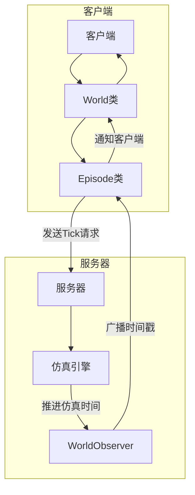
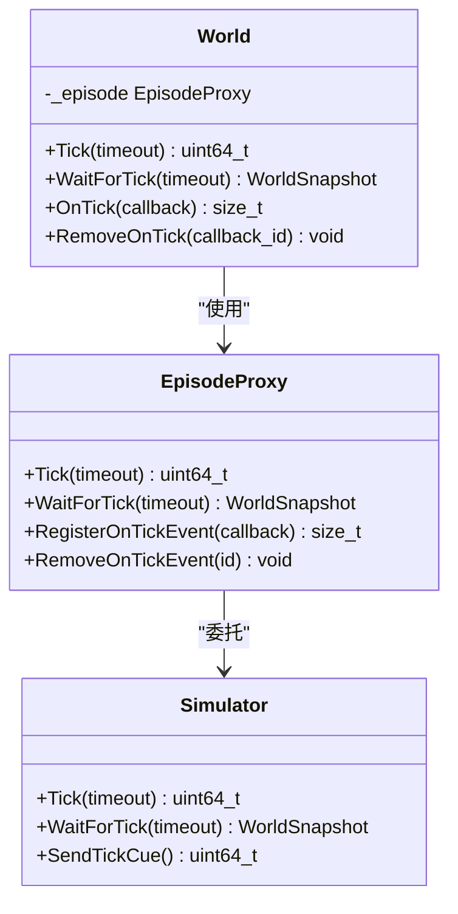
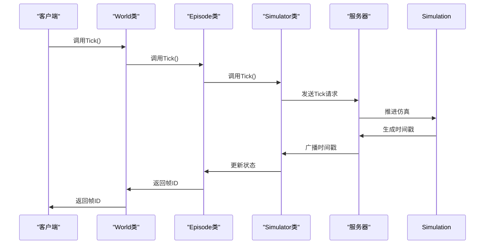
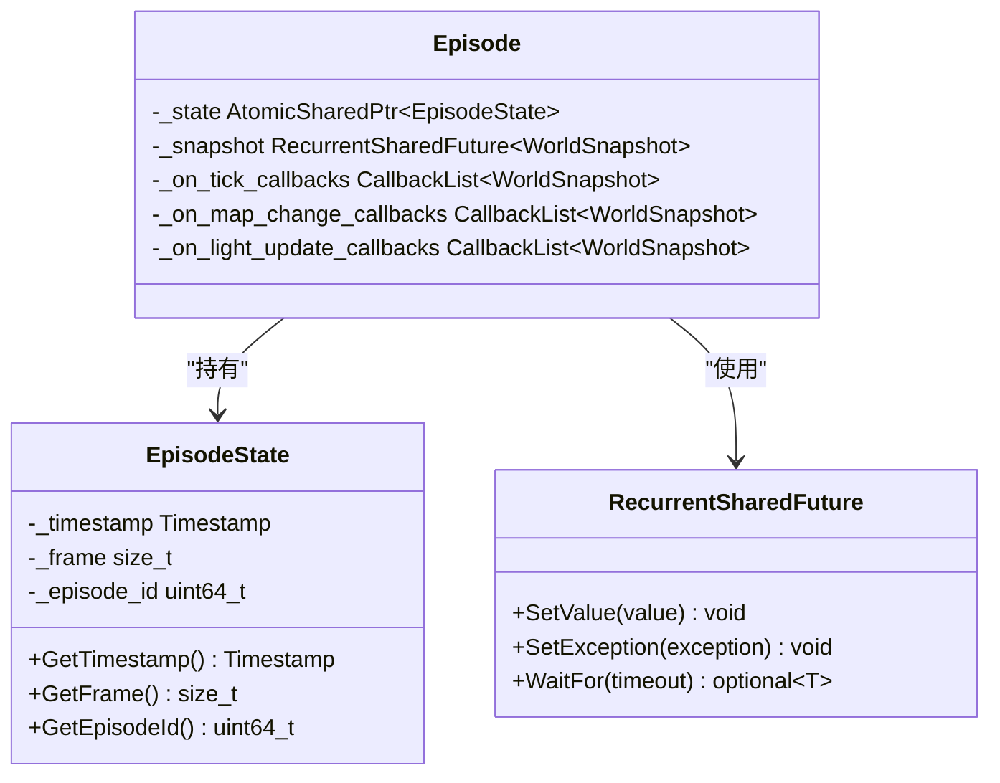
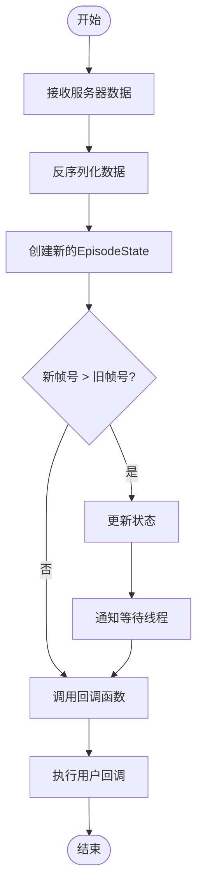
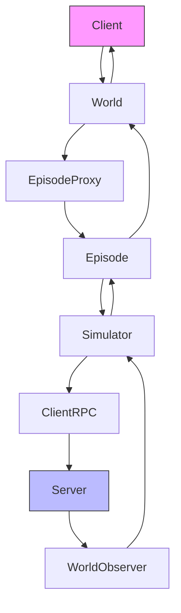
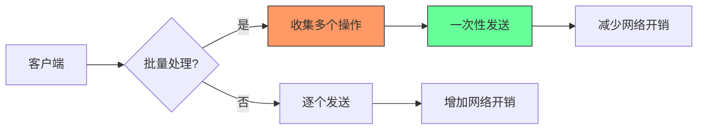

# 客户端-服务器同步协议

**本文档引用的文件**   
- [World.h](https://github.com/carla-simulator/carla/blob/ue5-dev/LibCarla/source/carla/client/World.h)
- [World.cpp](https://github.com/carla-simulator/carla/blob/ue5-dev/LibCarla/source/carla/client/World.cpp)
- [Episode.h](https://github.com/carla-simulator/carla/blob/ue5-dev/LibCarla/source/carla/client/detail/Episode.h)
- [Episode.cpp](https://github.com/carla-simulator/carla/blob/ue5-dev/LibCarla/source/carla/client/detail/Episode.cpp)
- [Simulator.h](https://github.com/carla-simulator/carla/blob/ue5-dev/LibCarla/source/carla/client/detail/Simulator.h)
- [Simulator.cpp](https://github.com/carla-simulator/carla/blob/ue5-dev/LibCarla/source/carla/client/detail/Simulator.cpp)
- [Timestamp.h](https://github.com/carla-simulator/carla/blob/ue5-dev/LibCarla/source/carla/client/Timestamp.h)
- [WorldSnapshot.h](https://github.com/carla-simulator/carla/blob/ue5-dev/LibCarla/source/carla/client/WorldSnapshot.h)

## 目录
1. [引言](#引言)
2. [核心组件分析](#核心组件分析)
3. [同步协议架构概述](#同步协议架构概述)
4. [详细组件分析](#详细组件分析)
5. [依赖关系分析](#依赖关系分析)
6. [性能优化建议](#性能优化建议)
7. [故障排除指南](#故障排除指南)
8. [结论](#结论)

## 引言
本文档详细解析CARLA仿真平台中客户端-服务器同步协议的核心机制，重点分析World.tick()和World.wait_for_tick()方法的内部实现。文档将深入探讨在同步模式下，客户端如何通过tick请求推进仿真时间，服务器如何生成包含时间戳的响应，以及客户端如何等待并处理该响应的完整流程。同时，文档将解析Episode类中维护的期望tick计数与实际接收到的tick之间的同步机制，包括超时处理和丢失tick的恢复策略。

## 核心组件分析
CARLA的同步协议基于客户端-服务器架构，其中World类提供了tick()和wait_for_tick()两个核心方法来控制仿真时间的推进。这两个方法通过底层的Episode和Simulator组件协同工作，实现了精确的同步控制。

**Section sources**
- [World.h](https://github.com/carla-simulator/carla/blob/ue5-dev/LibCarla/source/carla/client/World.h#L128-L143)
- [World.cpp](https://github.com/carla-simulator/carla/blob/ue5-dev/LibCarla/source/carla/client/World.cpp#L142-L161)

## 同步协议架构概述
CARLA的同步协议采用事件驱动架构，客户端通过发送tick请求来推进仿真时间，服务器在完成仿真步进后广播包含时间戳的世界快照。客户端通过回调机制或阻塞等待来接收这些快照，从而实现精确的同步控制。

**Diagram sources **
- [World.h](https://github.com/carla-simulator/carla/blob/ue5-dev/LibCarla/source/carla/client/World.h#L128-L143)
- [Simulator.h](https://github.com/carla-simulator/carla/blob/ue5-dev/LibCarla/source/carla/client/detail/Simulator.h#L186-L205)
- [Episode.h](https://github.com/carla-simulator/carla/blob/ue5-dev/LibCarla/source/carla/client/detail/Episode.h#L66-L72)

## 详细组件分析

### World类分析
World类是客户端访问仿真世界的主要接口，提供了tick()和wait_for_tick()两个关键方法来控制同步模式下的仿真推进。

#### World类方法实现

**Diagram sources **
- [World.h](https://github.com/carla-simulator/carla/blob/ue5-dev/LibCarla/source/carla/client/World.h#L128-L143)
- [Episode.h](https://github.com/carla-simulator/carla/blob/ue5-dev/LibCarla/source/carla/client/detail/Episode.h#L66-L72)
- [Simulator.h](https://github.com/carla-simulator/carla/blob/ue5-dev/LibCarla/source/carla/client/detail/Simulator.h#L186-L205)

#### Tick方法调用流程

**Diagram sources **
- [World.cpp](https://github.com/carla-simulator/carla/blob/ue5-dev/LibCarla/source/carla/client/World.cpp#L157-L161)
- [Simulator.cpp](https://github.com/carla-simulator/carla/blob/ue5-dev/LibCarla/source/carla/client/detail/Simulator.cpp#L221-L236)
- [Episode.cpp](https://github.com/carla-simulator/carla/blob/ue5-dev/LibCarla/source/carla/client/detail/Episode.cpp#L58-L112)

### Episode类分析
Episode类是同步协议的核心，负责维护仿真状态、处理tick事件和管理客户端-服务器之间的同步。

#### Episode状态管理

**Diagram sources **
- [Episode.h](https://github.com/carla-simulator/carla/blob/ue5-dev/LibCarla/source/carla/client/detail/Episode.h#L113-L126)
- [WorldSnapshot.h](https://github.com/carla-simulator/carla/blob/ue5-dev/LibCarla/source/carla/client/WorldSnapshot.h#L21-L73)
- [Timestamp.h](https://github.com/carla-simulator/carla/blob/ue5-dev/LibCarla/source/carla/client/Timestamp.h#L14-L49)

#### 时间戳同步机制

**Diagram sources **
- [Episode.cpp](https://github.com/carla-simulator/carla/blob/ue5-dev/LibCarla/source/carla/client/detail/Episode.cpp#L58-L112)
- [Simulator.cpp](https://github.com/carla-simulator/carla/blob/ue5-dev/LibCarla/source/carla/client/detail/Simulator.cpp#L208-L219)

## 依赖关系分析
CARLA的同步协议涉及多个组件的紧密协作，形成了清晰的依赖关系链。

**Diagram sources **
- [World.h](https://github.com/carla-simulator/carla/blob/ue5-dev/LibCarla/source/carla/client/World.h#L237)
- [Episode.h](https://github.com/carla-simulator/carla/blob/ue5-dev/LibCarla/source/carla/client/detail/Episode.h#L135)
- [Simulator.h](https://github.com/carla-simulator/carla/blob/ue5-dev/LibCarla/source/carla/client/detail/Simulator.h#L236)

**Section sources**
- [World.h](https://github.com/carla-simulator/carla/blob/ue5-dev/LibCarla/source/carla/client/World.h#L47-L239)
- [Episode.h](https://github.com/carla-simulator/carla/blob/ue5-dev/LibCarla/source/carla/client/detail/Episode.h#L38-L137)
- [Simulator.h](https://github.com/carla-simulator/carla/blob/ue5-dev/LibCarla/source/carla/client/detail/Simulator.h#L49-L800)

## 性能优化建议
为了优化CARLA同步协议的性能，建议采用以下策略：

1. **批量处理tick请求**：通过批量处理多个tick请求来减少网络开销
2. **避免tick积压**：在高频率控制循环中合理安排tick调用，避免积压
3. **使用事件回调**：优先使用OnTick事件回调而非阻塞等待，提高响应性
4. **合理设置超时**：根据网络状况和仿真复杂度设置合理的超时时间

**Diagram sources **
- [Simulator.h](https://github.com/carla-simulator/carla/blob/ue5-dev/LibCarla/source/carla/client/detail/Simulator.h#L741-L748)
- [World.h](https://github.com/carla-simulator/carla/blob/ue5-dev/LibCarla/source/carla/client/World.h#L133-L137)

## 故障排除指南
在使用CARLA同步协议时，可能会遇到以下常见问题：

**Section sources**
- [Simulator.cpp](https://github.com/carla-simulator/carla/blob/ue5-dev/LibCarla/source/carla/client/detail/Simulator.cpp#L215-L218)
- [Episode.cpp](https://github.com/carla-simulator/carla/blob/ue5-dev/LibCarla/source/carla/client/detail/Episode.cpp#L71-L80)

### 超时问题
当客户端等待tick响应超时时，系统会抛出TimeoutException。这通常是由于网络延迟或服务器负载过高导致的。

### 丢失tick恢复
当检测到tick丢失时，系统会通过比较帧号来识别状态不一致，并触发相应的恢复机制。

### 版本不匹配
客户端和服务器版本不匹配时，系统会发出警告，建议确保版本一致性以避免兼容性问题。

## 结论
CARLA的客户端-服务器同步协议通过精心设计的架构实现了精确的仿真时间控制。World.tick()和World.wait_for_tick()方法提供了灵活的同步控制机制，而Episode类则负责维护状态一致性和事件处理。通过理解这些核心组件的工作原理，开发者可以更好地利用CARLA平台进行高效的仿真开发。