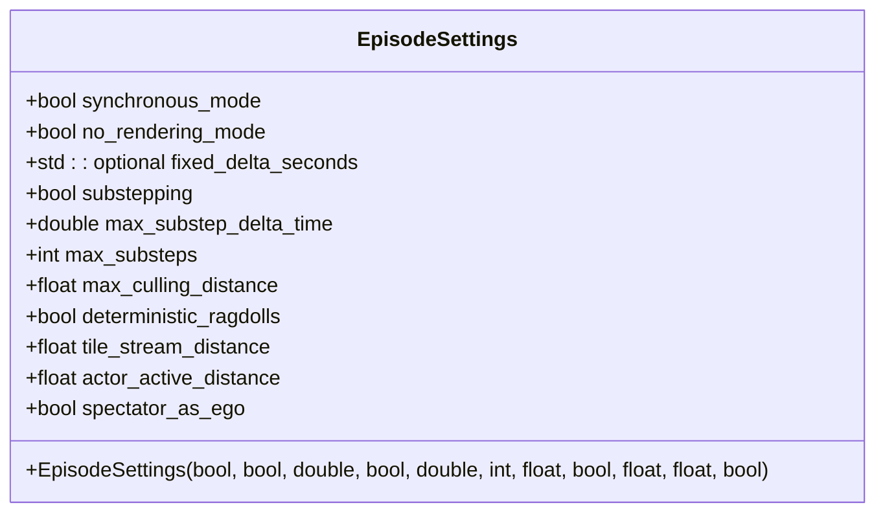
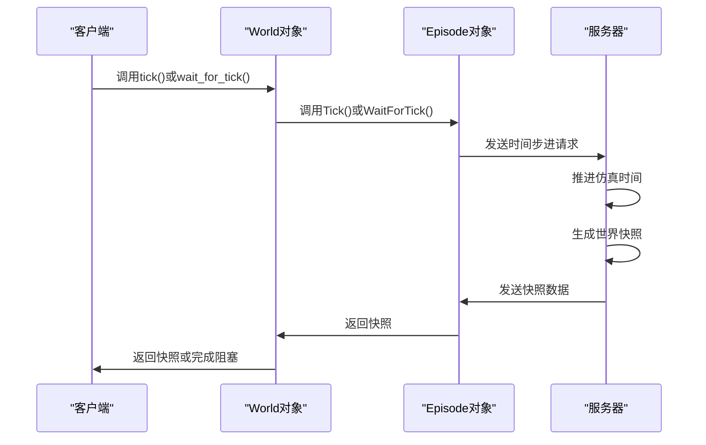
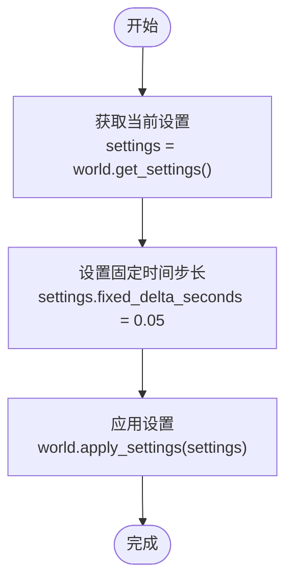
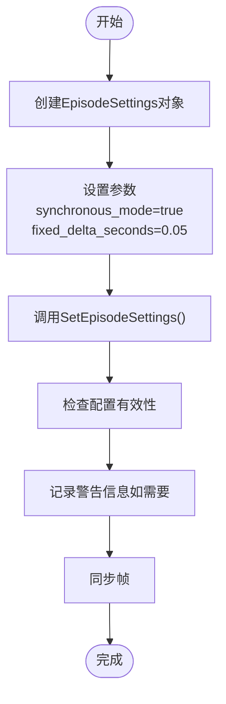
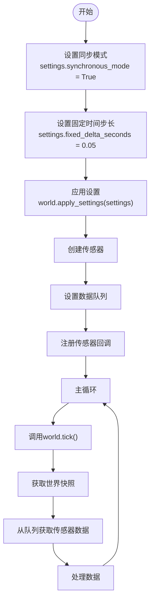
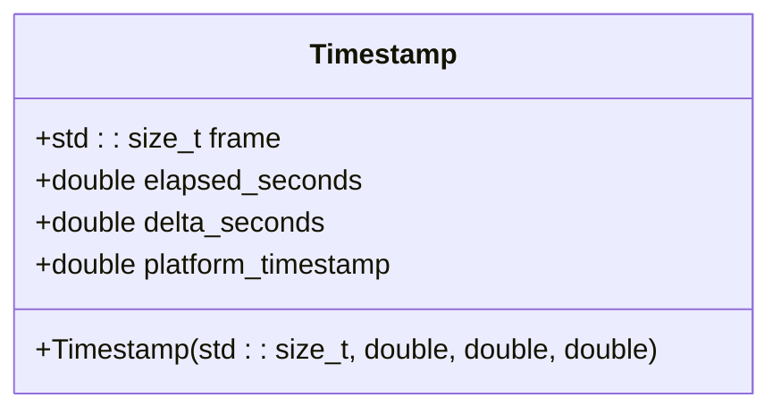

# 时间步进控制


**本文档引用的文件**   
- [EpisodeSettings.h](https://github.com/carla-simulator/carla/blob/ue5-dev/LibCarla/source/carla/rpc/EpisodeSettings.h)
- [Simulator.cpp](https://github.com/carla-simulator/carla/blob/ue5-dev/LibCarla/source/carla/client/detail/Simulator.cpp)
- [WorldObserver.cpp](https://github.com/carla-simulator/carla/blob/ue5-dev/Unreal/CarlaUnreal/Plugins/Carla/Source/Carla/Sensor/WorldObserver.cpp)
- [World.cpp](https://github.com/carla-simulator/carla/blob/ue5-dev/LibCarla/source/carla/client/World.cpp)
- [World.h](https://github.com/carla-simulator/carla/blob/ue5-dev/LibCarla/source/carla/client/World.h)
- [Episode.h](https://github.com/carla-simulator/carla/blob/ue5-dev/LibCarla/source/carla/client/detail/Episode.h)
- [Timestamp.h](https://github.com/carla-simulator/carla/blob/ue5-dev/LibCarla/source/carla/client/Timestamp.h)
- [World.cpp](https://github.com/carla-simulator/carla/blob/ue5-dev/PythonAPI/carla/src/World.cpp)
- [adv_synchrony_timestep.md](https://github.com/carla-simulator/carla/blob/ue5-dev/Docs/adv_synchrony_timestep.md)
- [test_sync.py](https://github.com/carla-simulator/carla/blob/ue5-dev/PythonAPI/test/smoke/test_sync.py)
- [config.py](https://github.com/carla-simulator/carla/blob/ue5-dev/PythonAPI/util/config.py)


## 目录
1. [简介](#简介)
2. [EpisodeSettings和FixedDeltaSeconds配置机制](#episodesettings和fixeddeltaseconds配置机制)
3. [World.tick()和World.wait_for_tick()方法实现原理](#worldtick和worldwait_for_tick方法实现原理)
4. [Python API和C++ API中的固定时间步长配置](#python-api和c-api中的固定时间步长配置)
5. [时间步长对仿真精度和性能的影响](#时间步长对仿真精度和性能的影响)
6. [自动驾驶算法中的控制循环协调](#自动驾驶算法中的控制循环协调)
7. [性能瓶颈和物理仿真稳定性问题](#性能瓶颈和物理仿真稳定性问题)
8. [调试技巧和最佳实践](#调试技巧和最佳实践)

## 简介
CARLA仿真器中的时间步进控制是确保仿真精度和稳定性的关键机制。本文档详细介绍了CARLA同步模式下的时间步进控制，重点分析EpisodeSettings和FixedDeltaSeconds的配置机制，以及World.tick()和World.wait_for_tick()方法的内部实现原理。文档还涵盖了如何通过Python API和C++ API配置固定时间步长，以及不同时间步长对仿真精度和性能的影响。

**Section sources**
- [adv_synchrony_timestep.md](https://github.com/carla-simulator/carla/blob/ue5-dev/Docs/adv_synchrony_timestep.md#L1-L282)

## EpisodeSettings和FixedDeltaSeconds配置机制

EpisodeSettings是CARLA中用于配置仿真会话参数的核心数据结构，其中包含synchronous_mode、no_rendering_mode、fixed_delta_seconds等关键属性。fixed_delta_seconds是一个可选的双精度浮点数，用于指定固定的时间步长。当设置为正值时，仿真将使用固定的时间增量；当未设置时，仿真将使用可变时间步长。

在C++实现中，EpisodeSettings类定义了多个构造函数，允许在创建时指定各种参数。当fixed_delta_seconds被设置为正数时，它会被存储在std::optional\<double\>类型的成员变量中；否则，该值将为空，表示使用可变时间步长。



**Diagram sources**
- [EpisodeSettings.h](https://github.com/carla-simulator/carla/blob/ue5-dev/LibCarla/source/carla/rpc/EpisodeSettings.h#L23-L159)

**Section sources**
- [EpisodeSettings.h](https://github.com/carla-simulator/carla/blob/ue5-dev/LibCarla/source/carla/rpc/EpisodeSettings.h#L23-L159)

## World.tick()和World.wait_for_tick()方法实现原理

World.tick()和World.wait_for_tick()是CARLA中用于控制仿真步进的核心方法。这两个方法的实现涉及客户端请求发送、服务器端时间推进和响应确认的完整流程。

在客户端，World.tick()方法通过调用_episode.Lock()->Tick()来请求服务器推进到下一个仿真步。该方法会等待指定的超时时间，直到收到服务器的响应。World.wait_for_tick()方法则通过调用_episode.Lock()->WaitForTick()来阻塞当前线程，直到收到下一个世界快照。

在服务器端，FWorldObserver::BroadcastTick函数负责广播时间步进事件。该函数会创建一个异步数据流，序列化当前仿真状态，并将其发送给所有连接的客户端。服务器会等待客户端的确认，然后推进到下一个仿真步。



**Diagram sources**
- [World.cpp](https://github.com/carla-simulator/carla/blob/ue5-dev/LibCarla/source/carla/client/World.cpp#L157-L161)
- [World.h](https://github.com/carla-simulator/carla/blob/ue5-dev/LibCarla/source/carla/client/World.h#L143-L144)
- [Episode.h](https://github.com/carla-simulator/carla/blob/ue5-dev/LibCarla/source/carla/client/detail/Episode.h#L67-L73)
- [WorldObserver.cpp](https://github.com/carla-simulator/carla/blob/ue5-dev/Unreal/CarlaUnreal/Plugins/Carla/Source/Carla/Sensor/WorldObserver.cpp#L379-L400)

**Section sources**
- [World.cpp](https://github.com/carla-simulator/carla/blob/ue5-dev/LibCarla/source/carla/client/World.cpp#L157-L161)
- [World.h](https://github.com/carla-simulator/carla/blob/ue5-dev/LibCarla/source/carla/client/World.h#L143-L144)
- [Episode.h](https://github.com/carla-simulator/carla/blob/ue5-dev/LibCarla/source/carla/client/detail/Episode.h#L67-L73)
- [WorldObserver.cpp](https://github.com/carla-simulator/carla/blob/ue5-dev/Unreal/CarlaUnreal/Plugins/Carla/Source/Carla/Sensor/WorldObserver.cpp#L379-L400)

## Python API和C++ API中的固定时间步长配置

在Python API中，可以通过World对象的get_settings()和apply_settings()方法来配置固定时间步长。首先获取当前的世界设置，然后设置fixed_delta_seconds属性，最后应用新的设置。



**Diagram sources**
- [World.cpp](https://github.com/carla-simulator/carla/blob/ue5-dev/PythonAPI/carla/src/World.cpp#L67-L70)
- [adv_synchrony_timestep.md](https://github.com/carla-simulator/carla/blob/ue5-dev/Docs/adv_synchrony_timestep.md#L48-L52)

在C++ API中，可以通过直接创建EpisodeSettings对象并调用SetEpisodeSettings方法来配置固定时间步长。C++实现中还包含了对配置有效性的检查，例如在启用同步模式时建议设置固定时间步长。



**Diagram sources**
- [Simulator.cpp](https://github.com/carla-simulator/carla/blob/ue5-dev/LibCarla/source/carla/client/detail/Simulator.cpp#L255-L282)
- [World.cpp](https://github.com/carla-simulator/carla/blob/ue5-dev/PythonAPI/carla/src/World.cpp#L67-L70)

**Section sources**
- [Simulator.cpp](https://github.com/carla-simulator/carla/blob/ue5-dev/LibCarla/source/carla/client/detail/Simulator.cpp#L255-L282)
- [World.cpp](https://github.com/carla-simulator/carla/blob/ue5-dev/PythonAPI/carla/src/World.cpp#L67-L70)

## 时间步长对仿真精度和性能的影响

时间步长的选择对仿真精度和性能有显著影响。较小的时间步长可以提高物理仿真的精度，但会增加计算开销；较大的时间步长可以提高性能，但可能导致物理仿真不稳定。

在同步模式下，固定时间步长是推荐的配置，因为它可以确保仿真结果的可重复性。文档明确警告：在同步模式下应始终使用固定时间步长，否则可能导致物理仿真不可靠。

物理子步进（Physics substepping）是CARLA中的一项重要特性，它允许在每个仿真步内执行多个物理计算步。这可以提高物理仿真的精度，而不会影响传感器渲染等其他计算的频率。子步进的配置需要满足以下条件：
```
fixed_delta_seconds <= max_substep_delta_time * max_substeps
```

为了获得最佳的物理仿真效果，子步时间应至少低于0.01666秒，理想情况下低于0.01秒。

**Section sources**
- [adv_synchrony_timestep.md](https://github.com/carla-simulator/carla/blob/ue5-dev/Docs/adv_synchrony_timestep.md#L73-L103)
- [EpisodeSettings.h](https://github.com/carla-simulator/carla/blob/ue5-dev/LibCarla/source/carla/rpc/EpisodeSettings.h#L34-L40)

## 自动驾驶算法中的控制循环协调

在自动驾驶算法中，正确协调控制循环与仿真步进至关重要。典型的同步模式工作流程包括：设置同步模式和固定时间步长、创建传感器、注册传感器回调、在主循环中调用world.tick()并处理传感器数据。

测试代码展示了如何验证同步模式下的时间步进行为。通过比较世界快照的帧号和传感器数据的帧号，可以确保所有数据都来自同一仿真时刻。这对于多传感器融合和精确的时间序列分析非常重要。



**Diagram sources**
- [test_sync.py](https://github.com/carla-simulator/carla/blob/ue5-dev/PythonAPI/test/smoke/test_sync.py#L25-L31)
- [test_sync.py](https://github.com/carla-simulator/carla/blob/ue5-dev/PythonAPI/test/smoke/test_sync.py#L48-L58)

**Section sources**
- [test_sync.py](https://github.com/carla-simulator/carla/blob/ue5-dev/PythonAPI/test/smoke/test_sync.py#L22-L180)

## 性能瓶颈和物理仿真稳定性问题

时间步长过小会导致性能瓶颈，因为服务器需要在更短的时间内完成相同的计算工作量。这可能导致帧率下降，甚至无法实时运行仿真。另一方面，时间步长过大会导致物理仿真不稳定，因为物理引擎无法准确计算大时间间隔内的物体运动和碰撞。

文档建议在同步模式下使用固定时间步长，并提供了具体的配置建议。例如，对于物理子步进，建议最大子步时间不超过0.01秒，最大子步数为10。这些配置可以在保证物理仿真精度的同时，避免过度的计算开销。

此外，文档还提到了浮点数算术误差的问题。在可变时间步长模式下，由于实时时钟的连续性与浮点数表示的离散性之间的差异，累积的时间截断误差可能会影响仿真的精确重复性。

**Section sources**
- [adv_synchrony_timestep.md](https://github.com/carla-simulator/carla/blob/ue5-dev/Docs/adv_synchrony_timestep.md#L60-L72)
- [adv_synchrony_timestep.md](https://github.com/carla-simulator/carla/blob/ue5-dev/Docs/adv_synchrony_timestep.md#L97-L98)

## 调试技巧和最佳实践

调试时间步进控制的有效方法是使用Timestamp数据验证时间步进的准确性。CARLA的Timestamp类提供了frame、elapsed_seconds、delta_seconds和platform_timestamp四个关键属性，可以用于验证仿真时间的正确性。

最佳实践包括：
1. 在同步模式下始终使用固定时间步长
2. 在加载或重新加载世界之前启用同步模式
3. 每次重复仿真时重新加载世界
4. 批量发送命令而不是逐个发送
5. 使用适当的物理子步进配置

通过遵循这些最佳实践，可以确保仿真结果的可重复性和物理准确性，这对于自动驾驶算法的开发和测试至关重要。



**Diagram sources**
- [Timestamp.h](https://github.com/carla-simulator/carla/blob/ue5-dev/LibCarla/source/carla/client/Timestamp.h#L14-L49)

**Section sources**
- [Timestamp.h](https://github.com/carla-simulator/carla/blob/ue5-dev/LibCarla/source/carla/client/Timestamp.h#L1-L73)
- [adv_synchrony_timestep.md](https://github.com/carla-simulator/carla/blob/ue5-dev/Docs/adv_synchrony_timestep.md#L205-L239)