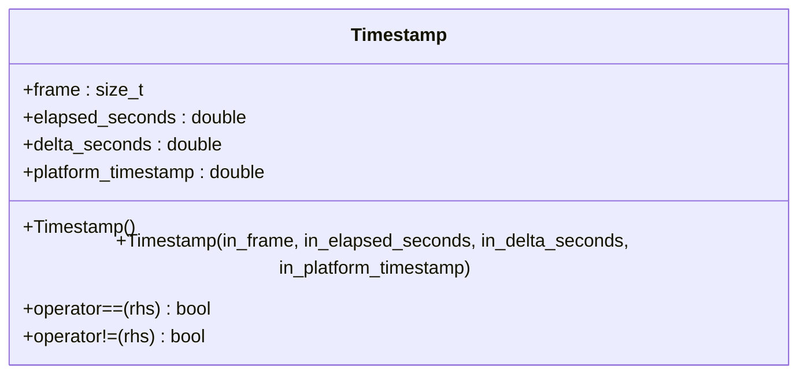
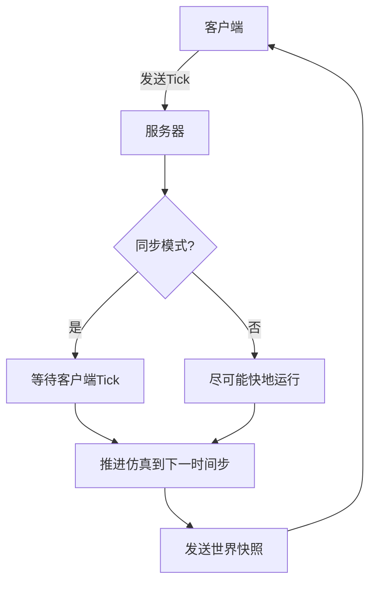
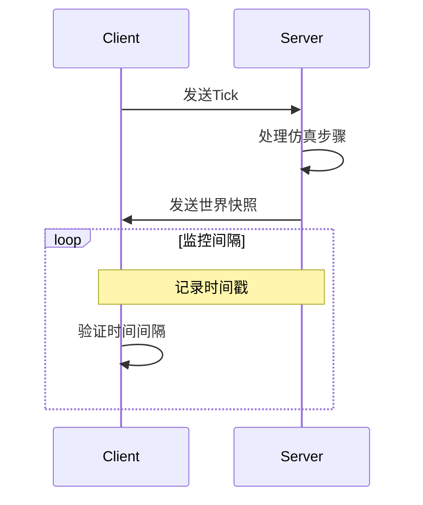
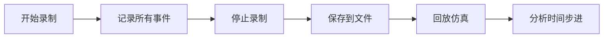
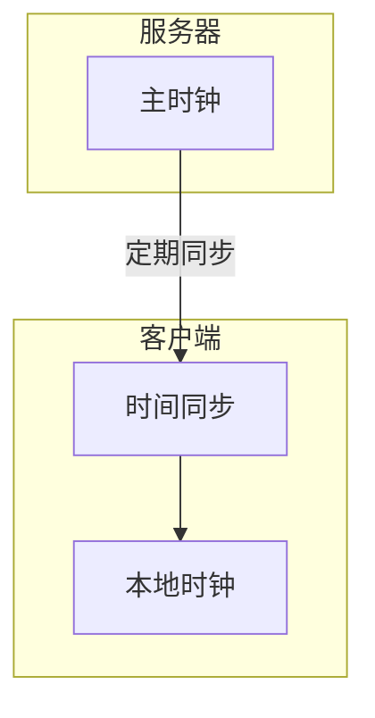

# 时间步进调试

> **引用文件**
> **本文档中引用的文件**

- [Timestamp.h](https://github.com/carla-simulator/carla/blob/ue5-dev/LibCarla/source/carla/client/Timestamp.h)
- [World.h](https://github.com/carla-simulator/carla/blob/ue5-dev/LibCarla/source/carla/client/World.h)
- [EpisodeSettings.h](https://github.com/carla-simulator/carla/blob/ue5-dev/LibCarla/source/carla/rpc/EpisodeSettings.h)
- [Simulator.cpp](https://github.com/carla-simulator/carla/blob/ue5-dev/LibCarla/source/carla/client/detail/Simulator.cpp)
- [adv_synchrony_timestep.md](https://github.com/carla-simulator/carla/blob/ue5-dev/Docs/adv_synchrony_timestep.md)
- [CarlaRecorderPlatformTime.cpp](https://github.com/carla-simulator/carla/blob/ue5-dev/Unreal/CarlaUnreal/Plugins/Carla/Source/Carla/Recorder/CarlaRecorderPlatformTime.cpp)
- [CarlaRecorderPlatformTime.h](https://github.com/carla-simulator/carla/blob/ue5-dev/Unreal/CarlaUnreal/Plugins/Carla/Source/Carla/Recorder/CarlaRecorderPlatformTime.h)
- [recorder_replay.py](https://github.com/carla-simulator/carla/blob/ue5-dev/PythonAPI/examples/recorder_replay.py)
- [test_sensor_tick_time.py](https://github.com/carla-simulator/carla/blob/ue5-dev/PythonAPI/test/smoke/test_sensor_tick_time.py)
- [test_world.py](https://github.com/carla-simulator/carla/blob/ue5-dev/PythonAPI/test/smoke/test_world.py)

## 目录

1. [简介](#简介)
2. [CARLA 时间步进机制](#carla时间步进机制)
3. [时间戳数据结构分析](#时间戳数据结构分析)
4. [同步模式与时间步进](#同步模式与时间步进)
5. [时间步进验证方法](#时间步进验证方法)
6. [常见同步问题诊断](#常见同步问题诊断)
7. [调试工具与技术](#调试工具与技术)
8. [最佳实践与解决方案](#最佳实践与解决方案)
9. [结论](#结论)

## 简介

CARLA 仿真器的时间步进机制是确保仿真准确性和一致性的核心。本文档提供了一个实用指南，重点介绍如何使用 Timestamp 数据验证仿真时间步进的准确性和一致性。我们将探讨如何记录连续 tick 之间的时间间隔，计算实际帧率，并与预期的 FixedDeltaSeconds 进行对比分析。文档还将涵盖常见的同步问题诊断方法，如检测 tick 丢失、时间漂移和客户端-服务器时钟不同步等问题，以及相应的解决方案和最佳实践。

**本文档中引用的文件**

- [adv_synchrony_timestep.md](https://github.com/carla-simulator/carla/blob/ue5-dev/Docs/adv_synchrony_timestep.md)

## CARLA 时间步进机制

CARLA 仿真器采用客户端-服务器架构，其中服务器负责运行仿真，而客户端负责检索信息和请求世界变更。时间步进机制是这一架构的核心，它决定了仿真时间如何推进以及客户端和服务器如何同步。

CARLA 支持两种时间步进模式：可变时间步长和固定时间步长。在可变时间步长模式下，仿真时间间隔取决于服务器计算两个步骤所需的时间。而在固定时间步长模式下，时间间隔保持恒定，这有助于收集可预测和可重复的数据。固定时间步长特别适用于需要精确物理模拟和传感器数据采集的场景。

同步模式是另一个关键概念。在异步模式下，服务器尽可能快地运行仿真，而不等待客户端。而在同步模式下，服务器在更新到下一个仿真步骤之前会等待客户端的 tick 信号。这种模式对于慢速客户端应用程序和需要不同元素（如传感器）之间同步的场景尤为重要。

**本文档中引用的文件**

- [adv_synchrony_timestep.md](https://github.com/carla-simulator/carla/blob/ue5-dev/Docs/adv_synchrony_timestep.md)
- [EpisodeSettings.h](https://github.com/carla-simulator/carla/blob/ue5-dev/LibCarla/source/carla/rpc/EpisodeSettings.h)

## 时间戳数据结构分析

CARLA 中的时间戳数据结构是验证时间步进准确性的基础。`Timestamp`类定义了仿真中的关键时间参数，包括帧号、已过时间、时间增量和平台时间戳。



**图源**

- <a href="https://github.com/carla-simulator/carla/blob/ue5-dev/LibCarla/source/carla/client/Timestamp.h#L14-L49" target="_blank">Timestamp.h</a>

`frame`字段表示自仿真启动以来经过的帧数，`elapsed_seconds`表示自当前情景开始以来经过的模拟秒数，`delta_seconds`表示自上一帧以来经过的模拟秒数，而`platform_timestamp`表示操作系统给出的帧时间戳。这些字段共同提供了全面的时间信息，可用于验证时间步进的一致性。

**本文档中引用的文件**

- [Timestamp.h](https://github.com/carla-simulator/carla/blob/ue5-dev/LibCarla/source/carla/client/Timestamp.h)

## 同步模式与时间步进

同步模式与时间步进的配置密切相关。在同步模式下，建议使用固定时间步长，以确保物理模拟的可靠性。如果在同步模式下使用可变时间步长，由于服务器必须等待客户端，时间步长可能会变得过大，导致物理模拟不可靠。



**图源**

- <a href="https://github.com/carla-simulator/carla/blob/ue5-dev/LibCarla/source/carla/client/World.h#L143-L144" target="_blank">World.h</a>
- <a href="https://github.com/carla-simulator/carla/blob/ue5-dev/LibCarla/source/carla/client/detail/Simulator.cpp#L255-L282" target="_blank">Simulator.cpp</a>

当启用同步模式和固定时间步长时，子步进选项需要与固定时间步长的值保持一致。必须满足的条件是：`fixed_delta_seconds <= max_substep_delta_time * max_substeps`。这确保了物理子步进能够正确处理固定时间步长。

**本文档中引用的文件**

- [adv_synchrony_timestep.md](https://github.com/carla-simulator/carla/blob/ue5-dev/Docs/adv_synchrony_timestep.md)
- [Simulator.cpp](https://github.com/carla-simulator/carla/blob/ue5-dev/LibCarla/source/carla/client/detail/Simulator.cpp)

## 时间步进验证方法

验证时间步进的准确性是确保仿真可靠性的关键步骤。通过比较实际测量的时间间隔与预期的固定时间步长，可以评估仿真的一致性。

```python
def validate_time_step(world, expected_delta_seconds, num_ticks=100):
    """
    验证仿真时间步进的准确性
    """
    actual_deltas = []
    for _ in range(num_ticks):
        world.tick()
        timestamp = world.get_snapshot().timestamp
        actual_deltas.append(timestamp.delta_seconds)

    avg_delta = sum(actual_deltas) / len(actual_deltas)
    deviation = abs(avg_delta - expected_delta_seconds)

    print(f"预期时间步长: {expected_delta_seconds}")
    print(f"平均实际时间步长: {avg_delta}")
    print(f"偏差: {deviation}")

    return deviation < 0.001  # 偏差小于1ms认为是准确的
```

**代码片段路径**

- <a href="https://github.com/carla-simulator/carla/blob/ue5-dev/PythonAPI/test/smoke/test_world.py#L12-L24" target="_blank">test_world.py</a>
- <a href="https://github.com/carla-simulator/carla/blob/ue5-dev/PythonAPI/test/smoke/test_sensor_tick_time.py#L54-L66" target="_blank">test_sensor_tick_time.py</a>

通过这种方法，可以系统地验证时间步进的准确性。此外，还可以计算实际帧率并与预期值进行比较，以进一步确认仿真性能。

**本文档中引用的文件**

- [test_world.py](https://github.com/carla-simulator/carla/blob/ue5-dev/PythonAPI/test/smoke/test_world.py)
- [test_sensor_tick_time.py](https://github.com/carla-simulator/carla/blob/ue5-dev/PythonAPI/test/smoke/test_sensor_tick_time.py)

## 常见同步问题诊断

在 CARLA 仿真中，常见的同步问题包括 tick 丢失、时间漂移和客户端-服务器时钟不同步。这些问题可能导致仿真不一致和数据采集错误。

### Tick 丢失检测

Tick 丢失是指客户端未能及时向服务器发送 tick 信号，导致仿真暂停。可以通过监控连续 tick 之间的时间间隔来检测 tick 丢失。



**图源**

- <a href="https://github.com/carla-simulator/carla/blob/ue5-dev/LibCarla/source/carla/client/World.h#L129-L130" target="_blank">World.h</a>
- <a href="https://github.com/carla-simulator/carla/blob/ue5-dev/LibCarla/source/carla/client/detail/Simulator.cpp#L255-L282" target="_blank">Simulator.cpp</a>

### 时间漂移分析

时间漂移是指仿真时间与真实时间之间的累积偏差。这可以通过比较`elapsed_seconds`和`platform_timestamp`来检测。

```python
def detect_time_drift(world, duration=60):
    """
    检测仿真中的时间漂移
    """
    start_platform = world.get_snapshot().timestamp.platform_timestamp
    start_elapsed = world.get_snapshot().timestamp.elapsed_seconds

    # 运行仿真一段时间
    for _ in range(int(duration / world.get_settings().fixed_delta_seconds)):
        world.tick()

    end_platform = world.get_snapshot().timestamp.platform_timestamp
    end_elapsed = world.get_snapshot().timestamp.elapsed_seconds

    real_time_passed = end_platform - start_platform
    sim_time_passed = end_elapsed - start_elapsed
    drift = abs(real_time_passed - sim_time_passed)

    print(f"真实时间经过: {real_time_passed}")
    print(f"仿真时间经过: {sim_time_passed}")
    print(f"时间漂移: {drift}")

    return drift
```

**代码片段路径**

- <a href="https://github.com/carla-simulator/carla/blob/ue5-dev/LibCarla/source/carla/client/Timestamp.h#L32-L40" target="_blank">Timestamp.h</a>

**本文档中引用的文件**

- [Timestamp.h](https://github.com/carla-simulator/carla/blob/ue5-dev/LibCarla/source/carla/client/Timestamp.h)
- [World.h](https://github.com/carla-simulator/carla/blob/ue5-dev/LibCarla/source/carla/client/World.h)

## 调试工具与技术

CARLA 提供了多种调试工具和技术，帮助开发者分析和解决时间步进相关的问题。

### 录制器功能

CARLA 的录制器功能允许记录仿真过程，以便事后分析时间步进行为。通过录制和回放仿真，可以详细检查每个 tick 的时间信息。



**图源**

- [CarlaRecorderPlatformTime.h](https://github.com/carla-simulator/carla/blob/ue5-dev/Unreal/CarlaUnreal/Plugins/Carla/Source/Carla/Recorder/CarlaRecorderPlatformTime.h)
- [CarlaRecorderPlatformTime.cpp](https://github.com/carla-simulator/carla/blob/ue5-dev/Unreal/CarlaUnreal/Plugins/Carla/Source/Carla/Recorder/CarlaRecorderPlatformTime.cpp)

录制器记录包括演员创建和销毁、交通灯状态变化、车辆位置和方向等信息。这些数据可以用于精确分析仿真中的时间步进行为。

### 日志输出监控

通过启用详细的日志输出，可以监控 tick 确认的延迟情况。CARLA 的 Logging 系统提供了不同级别的日志记录，从调试信息到关键错误。

```cpp
// 在Simulator.cpp中，设置情景设置时会进行一致性检查
if (settings.synchronous_mode && settings.substepping) {
    if(settings.max_substeps < 1 || settings.max_substeps > 16) {
        log_warning("synchronous mode and substepping are enabled but the number of substeps is not valid.");
    }
    double n_substeps = settings.fixed_delta_seconds.value() / settings.max_substep_delta_time;
    if (n_substeps > static_cast<double>(settings.max_substeps)) {
        log_warning("synchronous mode and substepping are enabled but the values for the simulation are not valid.");
    }
}
```

**代码片段路径**

- <a href="https://github.com/carla-simulator/carla/blob/ue5-dev/LibCarla/source/carla/client/detail/Simulator.cpp#L255-L275" target="_blank">Simulator.cpp</a>

**本文档中引用的文件**

- [CarlaRecorderPlatformTime.cpp](https://github.com/carla-simulator/carla/blob/ue5-dev/Unreal/CarlaUnreal/Plugins/Carla/Source/Carla/Recorder/CarlaRecorderPlatformTime.cpp)
- [CarlaRecorderPlatformTime.h](https://github.com/carla-simulator/carla/blob/ue5-dev/Unreal/CarlaUnreal/Plugins/Carla/Source/Carla/Recorder/CarlaRecorderPlatformTime.h)
- [Simulator.cpp](https://github.com/carla-simulator/carla/blob/ue5-dev/LibCarla/source/carla/client/detail/Simulator.cpp)

## 最佳实践与解决方案

为了确保 CARLA 仿真中的时间步进准确性和一致性，以下是一些最佳实践和解决方案。

### 网络缓冲区调整

在分布式仿真环境中，调整网络缓冲区大小可以减少延迟和抖动。禁用 Nagle 算法可以显著提高同步模式下的性能。

```cpp
// 在TCP客户端中，禁用Nagle算法
_socket.set_option(boost::asio::ip::tcp::no_delay(true));
```

**代码片段路径**

- <a href="https://github.com/carla-simulator/carla/blob/ue5-dev/LibCarla/source/carla/streaming/detail/tcp/Client.cpp#L107-L109" target="_blank">Client.cpp</a>

### 客户端处理逻辑优化

优化客户端处理逻辑，避免在处理 tick 时出现延迟。这包括减少每个 tick 的计算量和使用异步处理。

```python
def optimized_tick_loop(world, sensor_queue):
    """
    优化的tick循环，避免处理延迟
    """
    while True:
        # 使用非阻塞方式获取传感器数据
        try:
            data = sensor_queue.get_nowait()
            process_data(data)
        except queue.Empty:
            pass

        # 立即发送tick，避免延迟
        world.tick()

        # 在后台处理其他任务
        process_background_tasks()
```

### 分布式仿真时间同步

在分布式仿真环境中，保持时间同步的最佳实践包括使用高精度时钟和定期同步客户端与服务器时间。



**图源**

- <a href="https://github.com/carla-simulator/carla/blob/ue5-dev/Unreal/CarlaUnreal/Plugins/Carla/Source/Carla/Recorder/CarlaRecorderPlatformTime.cpp#L17-L20" target="_blank">CarlaRecorderPlatformTime.cpp</a>

**本文档中引用的文件**

- [Client.cpp](https://github.com/carla-simulator/carla/blob/ue5-dev/LibCarla/source/carla/streaming/detail/tcp/Client.cpp)
- [CarlaRecorderPlatformTime.cpp](https://github.com/carla-simulator/carla/blob/ue5-dev/Unreal/CarlaUnreal/Plugins/Carla/Source/Carla/Recorder/CarlaRecorderPlatformTime.cpp)

## 结论

CARLA 仿真器的时间步进机制是确保仿真准确性和一致性的关键。通过理解时间戳数据结构、正确配置同步模式和固定时间步长，以及使用录制器和日志输出等调试工具，可以有效地验证和诊断时间步进问题。遵循最佳实践，如调整网络缓冲区大小、优化客户端处理逻辑和在分布式环境中保持时间同步，可以进一步提高仿真的可靠性和性能。这些方法和工具的综合应用，将有助于创建更加精确和可重复的自动驾驶仿真环境。
