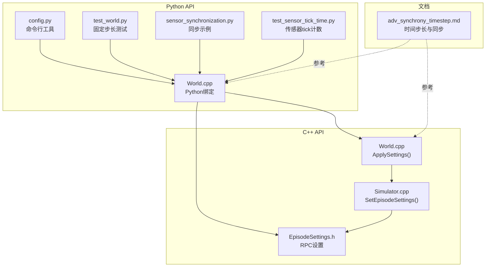
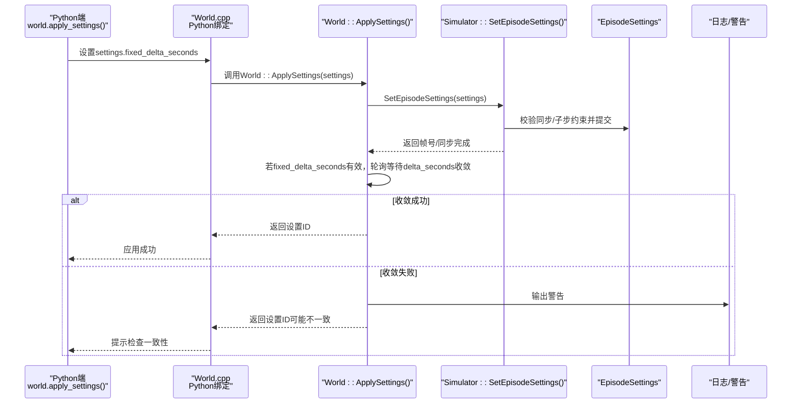
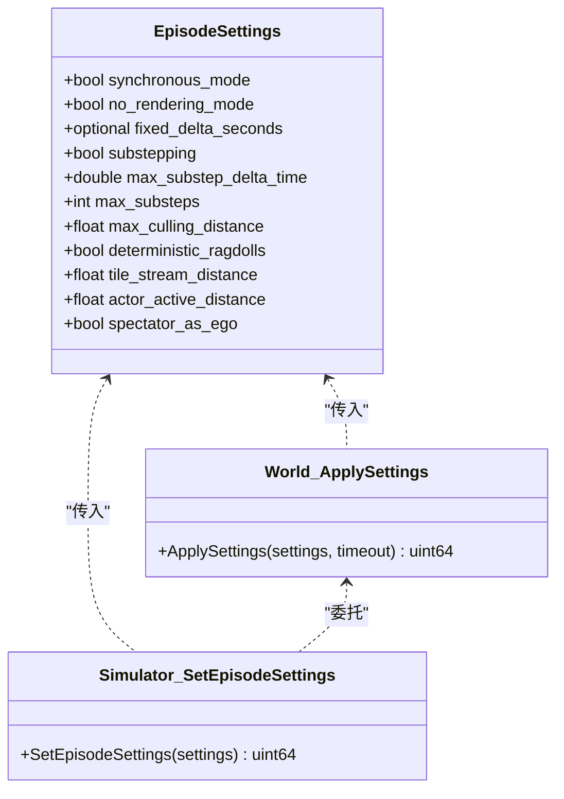

# 时间步进配置

> **引用文件**
> **本文引用的文件列表**

- [EpisodeSettings.h](https://github.com/carla-simulator/carla/blob/ue5-dev/LibCarla/source/carla/rpc/EpisodeSettings.h)
- [Simulator.cpp](https://github.com/carla-simulator/carla/blob/ue5-dev/LibCarla/source/carla/client/detail/Simulator.cpp)
- [World.cpp](https://github.com/carla-simulator/carla/blob/ue5-dev/LibCarla/source/carla/client/World.cpp)
- [World.cpp（Python 绑定）](https://github.com/carla-simulator/carla/blob/ue5-dev/PythonAPI/carla/src/World.cpp)
- [adv_synchrony_timestep.md](https://github.com/carla-simulator/carla/blob/ue5-dev/Docs/adv_synchrony_timestep.md)
- [config.py](https://github.com/carla-simulator/carla/blob/ue5-dev/PythonAPI/util/config.py)
- [test_world.py](https://github.com/carla-simulator/carla/blob/ue5-dev/PythonAPI/test/smoke/test_world.py)
- [sensor_synchronization.py](https://github.com/carla-simulator/carla/blob/ue5-dev/PythonAPI/examples/sensor_synchronization.py)
- [test_sensor_tick_time.py](https://github.com/carla-simulator/carla/blob/ue5-dev/PythonAPI/test/smoke/test_sensor_tick_time.py)

## 目录

1. [简介](#简介)
2. [项目结构与相关组件](#项目结构与相关组件)
3. [核心组件：EpisodeSettings 与时间步长](#核心组件episodesettings与时间步长)
4. [架构总览：Python/C++ API 到底层设置应用](#架构总览pythonc-api到底层设置应用)
5. [详细组件分析](#详细组件分析)
6. [依赖关系分析](#依赖关系分析)
7. [性能与稳定性考量](#性能与稳定性考量)
8. [故障排查与错误处理](#故障排查与错误处理)
9. [结论与最佳实践](#结论与最佳实践)
10. [附录：常用时间步长示例路径](#附录常用时间步长示例路径)

## 简介

本文件聚焦于 CARLA 仿真中的时间步进配置，围绕 EpisodeSettings 类中的 FixedDeltaSeconds 参数展开，系统阐述：

- 如何通过 Python API 的 world.apply_settings()与 C++ API 的 World::ApplySettings()设置固定时间步长；
- 不同时间步长（如 0.05 秒、0.1 秒、0.01 秒、0.2 秒）对物理引擎精度、传感器数据采集频率与网络通信开销的影响；
- 小时间步长带来的高精度与高计算负载，大时间步长导致的物理不稳定问题；
- 推荐在自动驾驶仿真中采用 0.05 秒的标准时间步长及其在精度与性能间的平衡；
- 错误处理与异常行为说明，帮助用户正确配置并避免常见陷阱。

## 项目结构与相关组件

- EpisodeSettings 是跨语言共享的 RPC 设置对象，承载同步模式、渲染模式、固定时间步长、子步配置等关键参数。
- C++侧 World::ApplySettings 负责应用设置并验证固定时间步长是否生效；Simulator::SetEpisodeSettings 负责与客户端交互并进行一致性检查与警告提示。
- Python 侧 World.cpp 提供 EpisodeSettings 的 Python 绑定，允许通过 world.apply_settings()设置固定时间步长。
- 文档 adv_synchrony_timestep.md 系统讲解了固定/可变时间步长、同步模式、子步策略与确定性物理等主题。
- 工具脚本 config.py 支持命令行设置固定时间步长或变量帧率。
- 测试用例与示例展示了固定时间步长的使用与传感器 tick 计数关系。

图表来源

- <a href="https://github.com/carla-simulator/carla/blob/ue5-dev/PythonAPI/carla/src/World.cpp#L150-L174" target="_blank">World.cpp（Python 绑定）</a>
- <a href="https://github.com/carla-simulator/carla/blob/ue5-dev/LibCarla/source/carla/client/World.cpp#L56-L84" target="_blank">World.cpp</a>
- <a href="https://github.com/carla-simulator/carla/blob/ue5-dev/LibCarla/source/carla/client/detail/Simulator.cpp#L255-L282" target="_blank">Simulator.cpp</a>
- <a href="https://github.com/carla-simulator/carla/blob/ue5-dev/LibCarla/source/carla/rpc/EpisodeSettings.h#L30-L85" target="_blank">EpisodeSettings.h</a>
- <a href="https://github.com/carla-simulator/carla/blob/ue5-dev/Docs/adv_synchrony_timestep.md#L1-L282" target="_blank">adv_synchrony_timestep.md</a>
- <a href="https://github.com/carla-simulator/carla/blob/ue5-dev/PythonAPI/util/config.py#L208-L240" target="_blank">config.py</a>
- <a href="https://github.com/carla-simulator/carla/blob/ue5-dev/PythonAPI/test/smoke/test_world.py#L11-L24" target="_blank">test_world.py</a>
- <a href="https://github.com/carla-simulator/carla/blob/ue5-dev/PythonAPI/examples/sensor_synchronization.py#L52-L55" target="_blank">sensor_synchronization.py</a>
- <a href="https://github.com/carla-simulator/carla/blob/ue5-dev/PythonAPI/test/smoke/test_sensor_tick_time.py#L51-L66" target="_blank">test_sensor_tick_time.py</a>

章节来源

- <a href="https://github.com/carla-simulator/carla/blob/ue5-dev/LibCarla/source/carla/rpc/EpisodeSettings.h#L30-L85" target="_blank">EpisodeSettings.h</a>
- <a href="https://github.com/carla-simulator/carla/blob/ue5-dev/PythonAPI/carla/src/World.cpp#L150-L174" target="_blank">World.cpp（Python 绑定）</a>
- <a href="https://github.com/carla-simulator/carla/blob/ue5-dev/LibCarla/source/carla/client/World.cpp#L56-L84" target="_blank">World.cpp</a>
- <a href="https://github.com/carla-simulator/carla/blob/ue5-dev/LibCarla/source/carla/client/detail/Simulator.cpp#L255-L282" target="_blank">Simulator.cpp</a>
- <a href="https://github.com/carla-simulator/carla/blob/ue5-dev/Docs/adv_synchrony_timestep.md#L1-L282" target="_blank">adv_synchrony_timestep.md</a>
- <a href="https://github.com/carla-simulator/carla/blob/ue5-dev/PythonAPI/util/config.py#L208-L240" target="_blank">config.py</a>
- <a href="https://github.com/carla-simulator/carla/blob/ue5-dev/PythonAPI/test/smoke/test_world.py#L11-L24" target="_blank">test_world.py</a>
- <a href="https://github.com/carla-simulator/carla/blob/ue5-dev/PythonAPI/examples/sensor_synchronization.py#L52-L55" target="_blank">sensor_synchronization.py</a>
- <a href="https://github.com/carla-simulator/carla/blob/ue5-dev/PythonAPI/test/smoke/test_sensor_tick_time.py#L51-L66" target="_blank">test_sensor_tick_time.py</a>

## 核心组件：EpisodeSettings 与时间步长

- EpisodeSettings 包含 fixed_delta_seconds 字段，类型为 std::optional<double>，用于表示固定时间步长。构造函数中对输入值进行校验：仅当大于 0 时才赋值，否则保持空值以表示变量时间步长。
- 同步模式与子步策略（substepping、max_substep_delta_time、max_substeps）与固定时间步长密切相关，需满足约束条件以保证物理稳定性与一致性。
- Python 侧 WorldSettings 通过属性访问器暴露 fixed_delta_seconds，允许直接读写该字段并通过 world.apply_settings()提交。

章节来源

- <a href="https://github.com/carla-simulator/carla/blob/ue5-dev/LibCarla/source/carla/rpc/EpisodeSettings.h#L30-L85" target="_blank">EpisodeSettings.h</a>
- <a href="https://github.com/carla-simulator/carla/blob/ue5-dev/PythonAPI/carla/src/World.cpp#L150-L174" target="_blank">World.cpp（Python 绑定）</a>

## 架构总览：Python/C++ API 到底层设置应用

下图展示了从 Python/C++调用到底层设置应用与验证的关键流程。

图表来源

- <a href="https://github.com/carla-simulator/carla/blob/ue5-dev/LibCarla/source/carla/client/World.cpp#L56-L84" target="_blank">World.cpp</a>
- <a href="https://github.com/carla-simulator/carla/blob/ue5-dev/LibCarla/source/carla/client/detail/Simulator.cpp#L255-L282" target="_blank">Simulator.cpp</a>
- <a href="https://github.com/carla-simulator/carla/blob/ue5-dev/LibCarla/source/carla/rpc/EpisodeSettings.h#L30-L85" target="_blank">EpisodeSettings.h</a>

章节来源

- <a href="https://github.com/carla-simulator/carla/blob/ue5-dev/LibCarla/source/carla/client/World.cpp#L56-L84" target="_blank">World.cpp</a>
- <a href="https://github.com/carla-simulator/carla/blob/ue5-dev/LibCarla/source/carla/client/detail/Simulator.cpp#L255-L282" target="_blank">Simulator.cpp</a>

## 详细组件分析

### 固定时间步长的设置与验证（Python API）

- Python 端通过 world.get_settings()获取 WorldSettings 对象，设置 fixed_delta_seconds 后调用 world.apply_settings()提交。
- 示例路径：
  - 使用 0.05 秒固定时间步长：参见<a href="https://github.com/carla-simulator/carla/blob/ue5-dev/PythonAPI/examples/sensor_synchronization.py#L52-L55" target="_blank">示例片段路径</a>
  - 使用 0.1 秒固定时间步长：参见<a href="https://github.com/carla-simulator/carla/blob/ue5-dev/PythonAPI/test/smoke/test_world.py#L17-L23" target="_blank">示例片段路径</a>
  - 命令行设置固定时间步长：参见<a href="https://github.com/carla-simulator/carla/blob/ue5-dev/PythonAPI/util/config.py#L221-L233" target="_blank">示例片段路径</a>

章节来源

- <a href="https://github.com/carla-simulator/carla/blob/ue5-dev/PythonAPI/carla/src/World.cpp#L150-L174" target="_blank">World.cpp（Python 绑定）</a>
- <a href="https://github.com/carla-simulator/carla/blob/ue5-dev/PythonAPI/examples/sensor_synchronization.py#L52-L55" target="_blank">sensor_synchronization.py</a>
- <a href="https://github.com/carla-simulator/carla/blob/ue5-dev/PythonAPI/test/smoke/test_world.py#L17-L23" target="_blank">test_world.py</a>
- <a href="https://github.com/carla-simulator/carla/blob/ue5-dev/PythonAPI/util/config.py#L221-L233" target="_blank">config.py</a>

### 固定时间步长的设置与验证（C++ API）

- C++端 World::ApplySettings 会：
  - 调用 SetEpisodeSettings 提交设置；
  - 若设置了 fixed_delta_seconds，则循环轮询当前快照的 delta_seconds，直到误差小于浮点阈值且连续两次满足，或达到最大尝试次数；
  - 若超过尝试次数仍未收敛，记录警告并返回设置 ID。
- Simulator::SetEpisodeSettings 会在同步模式下进行额外校验：
  - 同步模式+未设置固定时间步长时发出警告；
  - 同步模式+子步启用时检查 max_substeps 范围与约束条件（fixed_delta_seconds <= max_substep_delta_time \* max_substeps），并在不满足时发出警告。

章节来源

- <a href="https://github.com/carla-simulator/carla/blob/ue5-dev/LibCarla/source/carla/client/World.cpp#L56-L84" target="_blank">World.cpp</a>
- <a href="https://github.com/carla-simulator/carla/blob/ue5-dev/LibCarla/source/carla/client/detail/Simulator.cpp#L255-L282" target="_blank">Simulator.cpp</a>

### 子步策略与物理稳定性

- 默认启用子步（substepping），最大子步数为 10，最大子步物理步长为 0.01 秒；
- 子步策略能显著提升物理计算精度，尤其在较大固定时间步长下；
- 文档明确要求：在同步模式下，子步参数必须满足 fixed_delta_seconds <= max_substep_delta_time \* max_substeps，否则可能出现时间步长不保证的情况。

章节来源

- <a href="https://github.com/carla-simulator/carla/blob/ue5-dev/Docs/adv_synchrony_timestep.md#L73-L103" target="_blank">adv_synchrony_timestep.md</a>
- <a href="https://github.com/carla-simulator/carla/blob/ue5-dev/LibCarla/source/carla/client/detail/Simulator.cpp#L255-L282" target="_blank">Simulator.cpp</a>

### 传感器数据采集频率与时间步长的关系

- 传感器的 sensor_tick 属性决定了其独立采样周期；
- 在固定时间步长下，传感器 tick 数量与仿真总时间、传感器 tick 间隔存在确定关系；
- 测试用例验证了固定时间步长下传感器 tick 计数的一致性。

章节来源

- <a href="https://github.com/carla-simulator/carla/blob/ue5-dev/PythonAPI/test/smoke/test_sensor_tick_time.py#L51-L66" target="_blank">test_sensor_tick_time.py</a>

## 依赖关系分析

- EpisodeSettings 作为 RPC 设置载体，被 C++ World 与 Simulator 共享使用；
- Python 绑定通过 EpisodeSettings 属性访问器桥接 Python 世界与 C++内部设置；
- 文档与示例共同定义了固定时间步长的使用规范与边界条件。

图表来源

- <a href="https://github.com/carla-simulator/carla/blob/ue5-dev/LibCarla/source/carla/rpc/EpisodeSettings.h#L30-L85" target="_blank">EpisodeSettings.h</a>
- <a href="https://github.com/carla-simulator/carla/blob/ue5-dev/LibCarla/source/carla/client/World.cpp#L56-L84" target="_blank">World.cpp</a>
- <a href="https://github.com/carla-simulator/carla/blob/ue5-dev/LibCarla/source/carla/client/detail/Simulator.cpp#L255-L282" target="_blank">Simulator.cpp</a>

章节来源

- <a href="https://github.com/carla-simulator/carla/blob/ue5-dev/LibCarla/source/carla/rpc/EpisodeSettings.h#L30-L85" target="_blank">EpisodeSettings.h</a>
- <a href="https://github.com/carla-simulator/carla/blob/ue5-dev/LibCarla/source/carla/client/World.cpp#L56-L84" target="_blank">World.cpp</a>
- <a href="https://github.com/carla-simulator/carla/blob/ue5-dev/LibCarla/source/carla/client/detail/Simulator.cpp#L255-L282" target="_blank">Simulator.cpp</a>

## 性能与稳定性考量

- 小时间步长（如 0.01 秒）：
  - 物理精度高，适合对动力学与碰撞敏感的场景；
  - 计算负载显著增加，CPU/GPU 占用上升，实时性下降；
  - 需要充足的硬件资源与合理的子步参数以维持稳定。
- 大时间步长（如 0.2 秒）：
  - 计算效率高，但物理仿真易出现不稳定、数值发散与碰撞穿透；
  - 在同步模式下，若未设置固定时间步长，服务器等待客户端时可能出现过大的时间步长，导致物理不可靠。
- 推荐在自动驾驶仿真中采用 0.05 秒的标准时间步长：
  - 在精度与性能之间取得良好平衡；
  - 与默认子步策略（max_substep_delta_time=0.01，max_substeps=10）兼容，满足 fixed_delta_seconds <= max_substep_delta_time \* max_substeps；
  - 便于传感器数据对齐与多传感器同步采集。

章节来源

- <a href="https://github.com/carla-simulator/carla/blob/ue5-dev/Docs/adv_synchrony_timestep.md#L188-L199" target="_blank">adv_synchrony_timestep.md</a>
- <a href="https://github.com/carla-simulator/carla/blob/ue5-dev/LibCarla/source/carla/client/detail/Simulator.cpp#L255-L282" target="_blank">Simulator.cpp</a>

## 故障排查与错误处理

- 固定时间步长未生效：
  - C++ World::ApplySettings 在设置 fixed_delta_seconds 后会进行收敛检测，若多次 Tick 后仍不收敛，会输出警告提示检查一致性；
  - 建议确认是否处于同步模式、子步参数是否合理、网络超时设置是否合适。
- 同步模式下的警告：
  - 同步模式+未设置固定时间步长：发出强烈建议设置固定时间步长的警告；
  - 同步模式+子步启用：检查 max_substeps 范围与约束条件，不满足时会警告“时间步长不保证”。
- 变量时间步长与重复性：
  - 文档指出变量时间步长在回放时存在插值与浮点误差累积的问题，不利于精确重现。

章节来源

- <a href="https://github.com/carla-simulator/carla/blob/ue5-dev/LibCarla/source/carla/client/World.cpp#L56-L84" target="_blank">World.cpp</a>
- <a href="https://github.com/carla-simulator/carla/blob/ue5-dev/LibCarla/source/carla/client/detail/Simulator.cpp#L255-L282" target="_blank">Simulator.cpp</a>
- <a href="https://github.com/carla-simulator/carla/blob/ue5-dev/Docs/adv_synchrony_timestep.md#L37-L71" target="_blank">adv_synchrony_timestep.md</a>

## 结论与最佳实践

- 在自动驾驶仿真中，推荐使用 0.05 秒固定时间步长，兼顾精度与性能；
- 同步模式下必须设置固定时间步长，且子步参数需满足约束条件；
- 传感器数据采集应与固定时间步长对齐，确保多传感器在同一时刻的数据一致性；
- 使用工具脚本 config.py 或示例程序快速切换固定/变量时间步长，便于实验与调试。

## 附录：常用时间步长示例路径

- 设置 0.05 秒固定时间步长（Python）：参见<a href="https://github.com/carla-simulator/carla/blob/ue5-dev/PythonAPI/examples/sensor_synchronization.py#L52-L55" target="_blank">示例片段路径</a>
- 设置 0.1 秒固定时间步长（Python）：参见<a href="https://github.com/carla-simulator/carla/blob/ue5-dev/PythonAPI/test/smoke/test_world.py#L17-L23" target="_blank">示例片段路径</a>
- 命令行设置固定时间步长（Python）：参见<a href="https://github.com/carla-simulator/carla/blob/ue5-dev/PythonAPI/util/config.py#L221-L233" target="_blank">示例片段路径</a>
- 设置 0.01 秒固定时间步长（Python）：参见<a href="https://github.com/carla-simulator/carla/blob/ue5-dev/PythonAPI/test/smoke/test_world.py#L17-L23" target="_blank">示例片段路径</a>
- 设置 0.2 秒固定时间步长（Python）：参见<a href="https://github.com/carla-simulator/carla/blob/ue5-dev/PythonAPI/examples/sensor_synchronization.py#L52-L55" target="_blank">示例片段路径</a>
