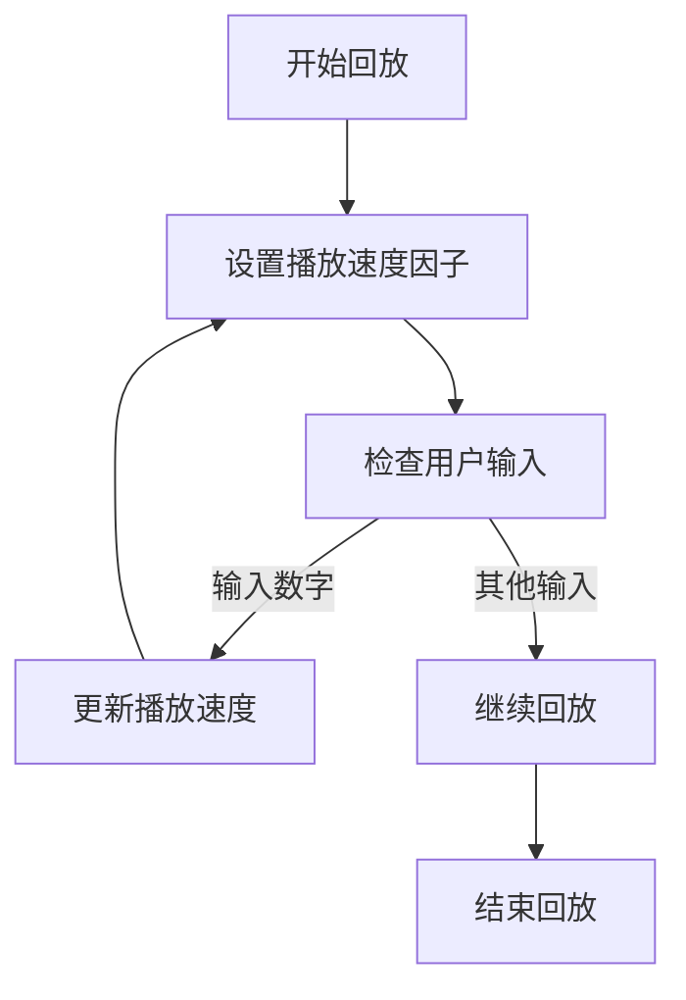
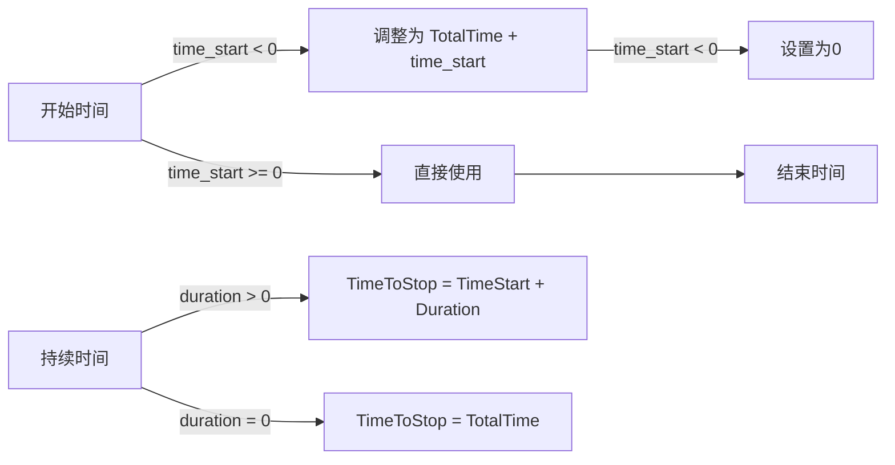
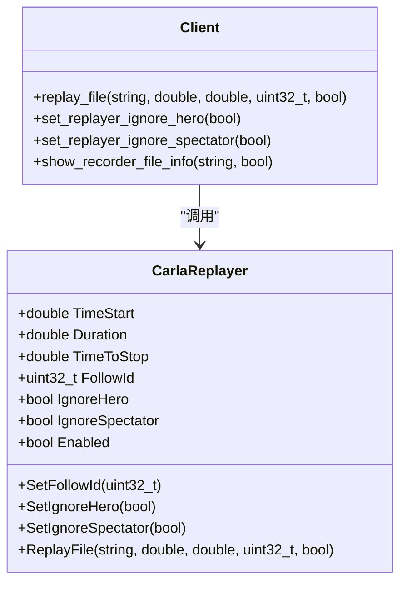

# 参数控制


**本文档中引用的文件**  
- [recorder_replay.py](https://github.com/carla-simulator/carla/blob/ue5-dev/PythonAPI/examples/recorder_replay.py)
- [start_replaying.py](https://github.com/carla-simulator/carla/blob/ue5-dev/PythonAPI/util/start_replaying.py)
- [Client.cpp](https://github.com/carla-simulator/carla/blob/ue5-dev/PythonAPI/carla/src/Client.cpp)
- [CarlaReplayer.cpp](https://github.com/carla-simulator/carla/blob/ue5-dev/Unreal/CarlaUnreal/Plugins/Carla/Source/Carla/Recorder/CarlaReplayer.cpp)
- [CarlaReplayer.h](https://github.com/carla-simulator/carla/blob/ue5-dev/Unreal/CarlaUnreal/Plugins/Carla/Source/Carla/Recorder/CarlaReplayer.h)
- [adv_recorder.md](https://github.com/carla-simulator/carla/blob/ue5-dev/Docs/adv_recorder.md)


## 目录
1. [简介](#简介)
2. [replay_file()方法参数详解](#replay_file方法参数详解)
3. [播放速度控制](#播放速度控制)
4. [时间范围限定](#时间范围限定)
5. [Actor过滤与追踪](#actor过滤与追踪)
6. [传感器回放控制](#传感器回放控制)
7. [参数组合使用示例](#参数组合使用示例)
8. [最佳实践与注意事项](#最佳实践与注意事项)

## 简介
CARLA仿真器提供了强大的回放功能，允许用户重放先前录制的模拟数据。通过`replay_file()`方法及其相关参数，用户可以精确控制回放过程，包括播放速度、时间范围、特定参与者追踪和传感器数据回放等。本文档详细解释了这些参数的使用方法和相互影响，帮助用户实现灵活的回放控制。

## replay_file()方法参数详解
`replay_file()`方法是CARLA回放功能的核心，它接受多个参数来控制回放行为。该方法的定义在`Client.cpp`文件中，其参数包括文件名、开始时间、持续时间、跟随ID和传感器回放标志。

**Section sources**
- [Client.cpp](https://github.com/carla-simulator/carla/blob/ue5-dev/PythonAPI/carla/src/Client.cpp#L209)

## 播放速度控制
播放速度通过`set_replayer_time_factor()`方法进行控制，该方法接受一个浮点数参数表示时间因子。1.0表示正常速度，大于1.0表示加速播放（如2.0为双倍速），小于1.0表示减速播放（如0.5为半速）。此设置可以在回放过程中动态调整，允许实时修改播放速度。



**Diagram sources**
- [recorder_replay.py](https://github.com/carla-simulator/carla/blob/ue5-dev/PythonAPI/examples/recorder_replay.py#L127)
- [CarlaReplayer.h](https://github.com/carla-simulator/carla/blob/ue5-dev/Unreal/CarlaUnreal/Plugins/Carla/Source/Carla/Recorder/CarlaReplayer.h#L78)

**Section sources**
- [client.yml](https://github.com/carla-simulator/carla/blob/ue5-dev/PythonAPI/docs/client.yml#L281-L290)

## 时间范围限定
时间范围通过`replay_file()`方法的`time_start`和`duration`参数进行控制。`time_start`指定回放的起始时间（以秒为单位），`duration`指定回放的持续时间。如果`duration`为0，则回放直到录制文件结束。负的`time_start`值表示从录制结束前的指定时间开始回放。



**Diagram sources**
- [CarlaReplayer.cpp](https://github.com/carla-simulator/carla/blob/ue5-dev/Unreal/CarlaUnreal/Plugins/Carla/Source/Carla/Recorder/CarlaReplayer.cpp#L163-L174)

**Section sources**
- [CarlaReplayer.cpp](https://github.com/carla-simulator/carla/blob/ue5-dev/Unreal/CarlaUnreal/Plugins/Carla/Source/Carla/Recorder/CarlaReplayer.cpp#L162-L175)

## Actor过滤与追踪
Actor过滤和追踪通过`follow_id`参数实现。该参数指定一个Actor ID，使摄像机跟随该参与者。特殊值0表示不跟随任何参与者。此外，可以通过`set_replayer_ignore_hero()`方法选择是否忽略英雄车辆的回放。`show_recorder_file_info()`方法可用于分析录制文件中的参与者信息，帮助确定要追踪的Actor ID。



**Diagram sources**
- [CarlaReplayer.cpp](https://github.com/carla-simulator/carla/blob/ue5-dev/Unreal/CarlaUnreal/Plugins/Carla/Source/Carla/Recorder/CarlaReplayer.cpp#L185-L188)
- [CarlaReplayer.h](https://github.com/carla-simulator/carla/blob/ue5-dev/Unreal/CarlaUnreal/Plugins/Carla/Source/Carla/Recorder/CarlaReplayer.h#L84-L93)

**Section sources**
- [recorder_replay.py](https://github.com/carla-simulator/carla/blob/ue5-dev/PythonAPI/examples/recorder_replay.py#L110-L118)
- [start_replaying.py](https://github.com/carla-simulator/carla/blob/ue5-dev/PythonAPI/util/start_replaying.py#L35)

## 传感器回放控制
传感器回放由`replay_sensors`布尔参数控制。当设置为`true`时，录制的传感器数据将被回放；当设置为`false`时，传感器数据将被忽略。此参数允许用户选择是否需要回放传感器数据，从而优化性能或专注于特定方面的分析。

**Section sources**
- [CarlaReplayer.cpp](https://github.com/carla-simulator/carla/blob/ue5-dev/Unreal/CarlaUnreal/Plugins/Carla/Source/Carla/Recorder/CarlaReplayer.cpp#L249)
- [Client.cpp](https://github.com/carla-simulator/carla/blob/ue5-dev/PythonAPI/carla/src/Client.cpp#L209)

## 参数组合使用示例
以下是一些常见的参数组合使用场景：

### 只回放特定车辆
```python
# 回放文件中ID为173的车辆，从第34秒开始
client.replay_file("col3.log", 34, 0, 173)
```

### 跳过初始静止阶段
```python
# 从录制结束前10秒开始回放，以分析最后阶段
client.replay_file("recording.log", -10, 0, 0)
```

### 以2倍速播放
```python
# 以2倍速回放整个录制文件
client.replay_file("recording.log", 0, 0, 0)
client.set_replayer_time_factor(2.0)
```

**Section sources**
- [adv_recorder.md](https://github.com/carla-simulator/carla/blob/ue5-dev/Docs/adv_recorder.md#L240-L242)
- [start_replaying.py](https://github.com/carla-simulator/carla/blob/ue5-dev/PythonAPI/util/start_replaying.py#L65)

## 最佳实践与注意事项
1. 在调用`replay_file()`之前，确保已设置正确的同步模式和固定时间步长。
2. 使用`show_recorder_file_info()`方法预先分析录制文件内容，了解参与者和时间范围。
3. 在回放结束后，调用`stop_replayer()`清理资源，并重置时间因子。
4. 注意`follow_id`为0时不会跟随任何参与者，摄像机将保持在初始位置。
5. 负的开始时间值用于从录制结束前指定时间开始回放，便于分析最后阶段的事件。

**Section sources**
- [recorder_replay.py](https://github.com/carla-simulator/carla/blob/ue5-dev/PythonAPI/examples/recorder_replay.py#L158-L159)
- [adv_recorder.md](https://github.com/carla-simulator/carla/blob/ue5-dev/Docs/adv_recorder.md#L263-L272)