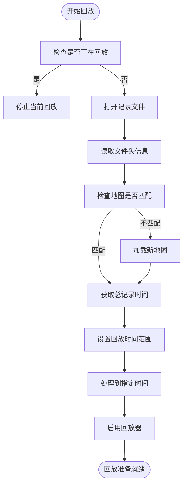
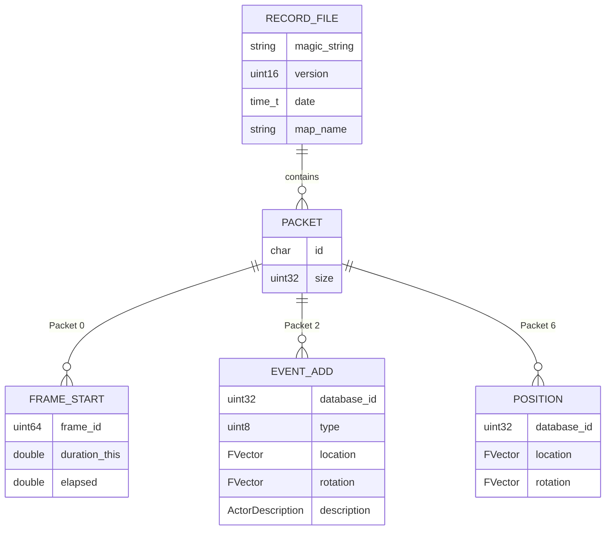
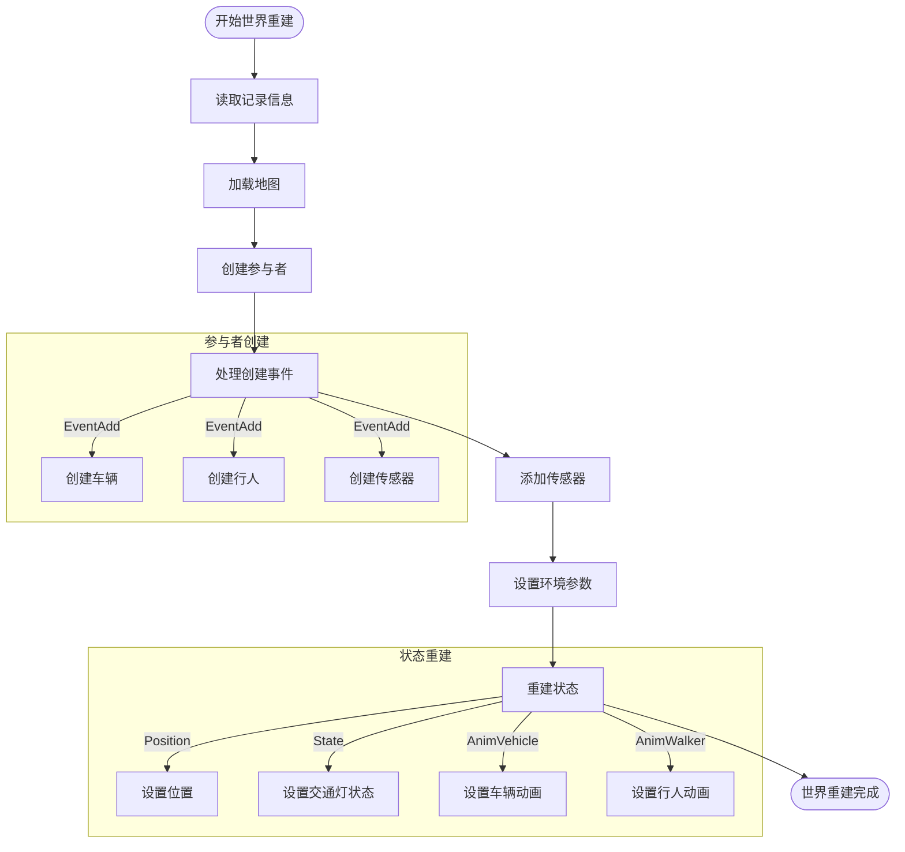
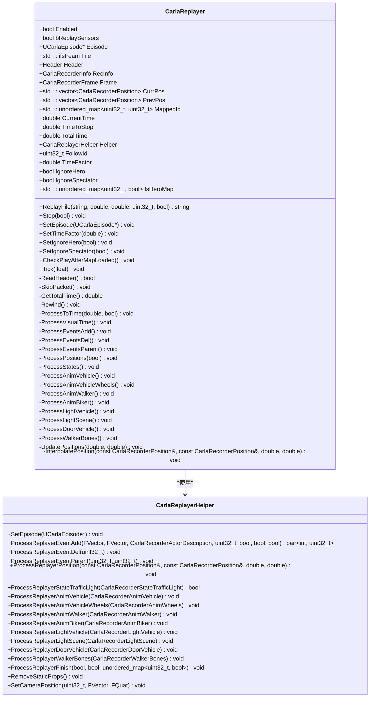
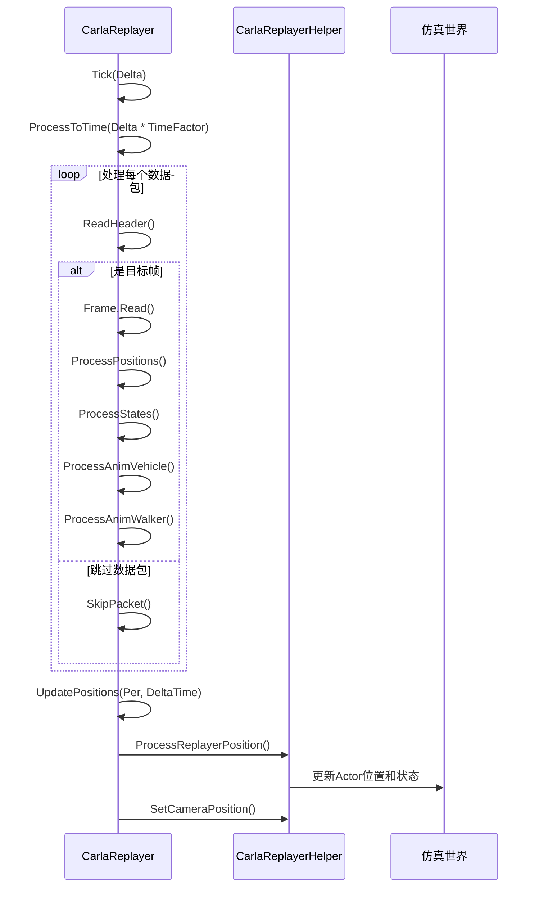
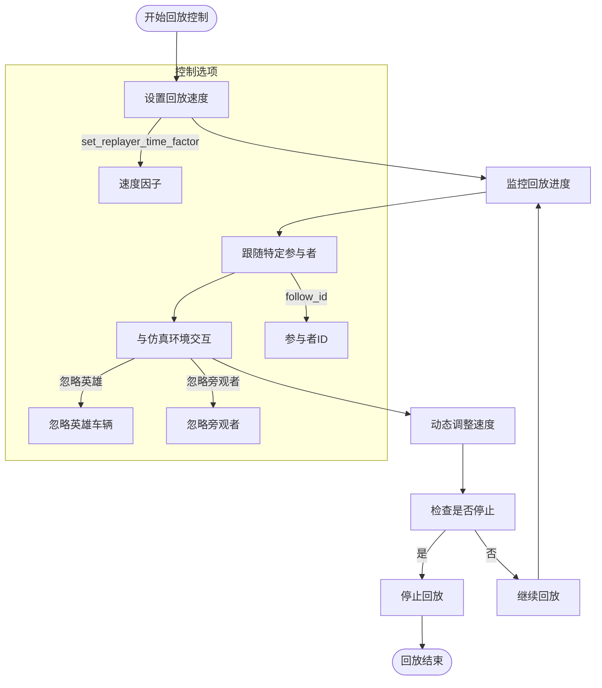

# 回放流程


**本文档中引用的文件**  
- [CarlaReplayer.cpp](https://github.com/carla-simulator/carla/blob/ue5-dev/Unreal/CarlaUnreal/Plugins/Carla/Source/Carla/Recorder/CarlaReplayer.cpp)
- [CarlaReplayer.h](https://github.com/carla-simulator/carla/blob/ue5-dev/Unreal/CarlaUnreal/Plugins/Carla/Source/Carla/Recorder/CarlaReplayer.h)
- [CarlaRecorderInfo.h](https://github.com/carla-simulator/carla/blob/ue5-dev/Unreal/CarlaUnreal/Plugins/Carla/Source/Carla/Recorder/CarlaRecorderInfo.h)
- [CarlaRecorderFrames.h](https://github.com/carla-simulator/carla/blob/ue5-dev/Unreal/CarlaUnreal/Plugins/Carla/Source/Carla/Recorder/CarlaRecorderFrames.h)
- [CarlaRecorderEventAdd.h](https://github.com/carla-simulator/carla/blob/ue5-dev/Unreal/CarlaUnreal/Plugins/Carla/Source/Carla/Recorder/CarlaRecorderEventAdd.h)
- [CarlaRecorderPosition.h](https://github.com/carla-simulator/carla/blob/ue5-dev/Unreal/CarlaUnreal/Plugins/Carla/Source/Carla/Recorder/CarlaRecorderPosition.h)
- [recorder_replay.py](https://github.com/carla-simulator/carla/blob/ue5-dev/PythonAPI/examples/recorder_replay.py)
- [start_replaying.py](https://github.com/carla-simulator/carla/blob/ue5-dev/PythonAPI/util/start_replaying.py)
- [ref_recorder_binary_file_format.md](https://github.com/carla-simulator/carla/blob/ue5-dev/Docs/ref_recorder_binary_file_format.md)


## 目录
1. [简介](#简介)
2. [回放流程概述](#回放流程概述)
3. [记录文件解析](#记录文件解析)
4. [世界状态重建](#世界状态重建)
5. [CarlaReplayer类分析](#carlareplayer类分析)
6. [时间同步与状态插值](#时间同步与状态插值)
7. [回放控制与交互](#回放控制与交互)
8. [代码示例](#代码示例)
9. [结论](#结论)

## 简介
CARLA的回放功能允许用户精确地重现先前记录的仿真会话。通过调用`replay_file()`方法，系统能够从记录文件中恢复完整的仿真状态，包括地图、交通参与者、传感器配置和环境参数。本文档详细解释了从调用`replay_file()`方法开始的完整回放过程。

**回放流程**的核心是`CarlaReplayer`类，它负责解析记录文件、重建世界状态并逐帧处理记录数据。该系统实现了精确的时间同步和状态插值，确保回放的准确性和可重复性。

## 回放流程概述
CARLA的回放流程始于调用`replay_file()`方法，该方法触发了一系列关键步骤来重建仿真环境。整个流程可以分为四个主要阶段：记录文件解析、地图重建、Actor创建和状态恢复。

回放过程首先验证当前是否正在运行另一个回放，如果是则停止当前回放。然后打开指定的记录文件并从头开始读取。如果记录文件中的地图与当前加载的地图不同，系统会先加载正确的地图，然后继续回放过程。



**回放流程图**
- [CarlaReplayer.cpp](https://github.com/carla-simulator/carla/blob/ue5-dev/Unreal/CarlaUnreal/Plugins/Carla/Source/Carla/Recorder/CarlaReplayer.cpp#L106-L261)

**本节来源**
- [CarlaReplayer.cpp](https://github.com/carla-simulator/carla/blob/ue5-dev/Unreal/CarlaUnreal/Plugins/Carla/Source/Carla/Recorder/CarlaReplayer.cpp#L106-L261)
- [ref_recorder_binary_file_format.md](https://github.com/carla-simulator/carla/blob/ue5-dev/Docs/ref_recorder_binary_file_format.md#L1-L53)

## 记录文件解析
CARLA的记录文件采用自定义的二进制格式，使用小端字节序存储多字节值。文件格式包含一个小型头文件，其中包含版本信息、标识字符串、日期和使用的地图名称，以及不同类型的数据包集合。

记录文件的解析从读取文件头开始，文件头包含标识符和数据大小。`CarlaReplayer`类通过`ReadHeader()`方法读取这些基本信息，然后根据标识符类型处理相应的数据包。文件中的数据包按时间顺序排列，每个数据包代表仿真中的特定事件或状态变化。



**记录文件数据模型**
- [CarlaRecorderInfo.h](https://github.com/carla-simulator/carla/blob/ue5-dev/Unreal/CarlaUnreal/Plugins/Carla/Source/Carla/Recorder/CarlaRecorderInfo.h#L14-L36)
- [CarlaRecorderFrames.h](https://github.com/carla-simulator/carla/blob/ue5-dev/Unreal/CarlaUnreal/Plugins/Carla/Source/Carla/Recorder/CarlaRecorderFrames.h#L12-L22)
- [CarlaRecorderEventAdd.h](https://github.com/carla-simulator/carla/blob/ue5-dev/Unreal/CarlaUnreal/Plugins/Carla/Source/Carla/Recorder/CarlaRecorderEventAdd.h#L26-L36)
- [CarlaRecorderPosition.h](https://github.com/carla-simulator/carla/blob/ue5-dev/Unreal/CarlaUnreal/Plugins/Carla/Source/Carla/Recorder/CarlaRecorderPosition.h#L13-L23)

**本节来源**
- [ref_recorder_binary_file_format.md](https://github.com/carla-simulator/carla/blob/ue5-dev/Docs/ref_recorder_binary_file_format.md#L1-L53)
- [CarlaReplayer.cpp](https://github.com/carla-simulator/carla/blob/ue5-dev/Unreal/CarlaUnreal/Plugins/Carla/Source/Carla/Recorder/CarlaReplayer.cpp#L37-L48)
- [CarlaRecorderInfo.h](https://github.com/carla-simulator/carla/blob/ue5-dev/Unreal/CarlaUnreal/Plugins/Carla/Source/Carla/Recorder/CarlaRecorderInfo.h#L14-L36)

## 世界状态重建
世界状态重建是回放过程中的关键步骤，包括地图加载、交通参与者生成、传感器配置和环境参数设置。当`CarlaReplayer`检测到记录文件中的地图与当前地图不匹配时，它会触发地图加载过程。

地图重建首先通过`Episode->LoadNewEpisode()`方法加载记录中指定的地图。在加载新地图后，系统会继续执行回放过程。交通参与者的生成通过处理`EventAdd`数据包实现，每个`EventAdd`包包含创建新Actor所需的所有信息，包括位置、旋转和描述。



**世界状态重建流程**
- [CarlaReplayer.cpp](https://github.com/carla-simulator/carla/blob/ue5-dev/Unreal/CarlaUnreal/Plugins/Carla/Source/Carla/Recorder/CarlaReplayer.cpp#L135-L145)
- [CarlaReplayer.cpp](https://github.com/carla-simulator/carla/blob/ue5-dev/Unreal/CarlaUnreal/Plugins/Carla/Source/Carla/Recorder/CarlaReplayer.cpp#L446-L490)

**本节来源**
- [CarlaReplayer.cpp](https://github.com/carla-simulator/carla/blob/ue5-dev/Unreal/CarlaUnreal/Plugins/Carla/Source/Carla/Recorder/CarlaReplayer.cpp#L135-L145)
- [CarlaReplayer.cpp](https://github.com/carla-simulator/carla/blob/ue5-dev/Unreal/CarlaUnreal/Plugins/Carla/Source/Carla/Recorder/CarlaReplayer.cpp#L446-L490)
- [CarlaRecorderEventAdd.h](https://github.com/carla-simulator/carla/blob/ue5-dev/Unreal/CarlaUnreal/Plugins/Carla/Source/Carla/Recorder/CarlaRecorderEventAdd.h#L26-L36)

## CarlaReplayer类分析
`CarlaReplayer`类是CARLA回放系统的核心组件，负责管理整个回放过程。该类提供了主要的回放控制方法，如`ReplayFile()`、`Stop()`和`Tick()`，以及处理各种记录事件的私有方法。

`CarlaReplayer`类的关键属性包括`Enabled`（回放是否启用）、`File`（记录文件流）、`MappedId`（ID映射表）和`CurrentTime`（当前回放时间）。ID映射表用于将记录文件中的数据库ID映射到当前仿真中的实际Actor ID，这对于正确引用和更新参与者状态至关重要。



**CarlaReplayer类结构**
- [CarlaReplayer.h](https://github.com/carla-simulator/carla/blob/ue5-dev/Unreal/CarlaUnreal/Plugins/Carla/Source/Carla/Recorder/CarlaReplayer.h#L27-L170)
- [CarlaReplayer.cpp](https://github.com/carla-simulator/carla/blob/ue5-dev/Unreal/CarlaUnreal/Plugins/Carla/Source/Carla/Recorder/CarlaReplayer.cpp#L17-L824)

**本节来源**
- [CarlaReplayer.h](https://github.com/carla-simulator/carla/blob/ue5-dev/Unreal/CarlaUnreal/Plugins/Carla/Source/Carla/Recorder/CarlaReplayer.h#L27-L170)
- [CarlaReplayer.cpp](https://github.com/carla-simulator/carla/blob/ue5-dev/Unreal/CarlaUnreal/Plugins/Carla/Source/Carla/Recorder/CarlaReplayer.cpp#L17-L824)

## 时间同步与状态插值
CARLA回放系统通过精确的时间同步机制和状态插值算法确保回放的精确性和可重复性。`ProcessToTime()`方法是时间同步的核心，它处理所有记录事件直到指定的目标时间。

状态插值通过`UpdatePositions()`和`InterpolatePosition()`方法实现。系统维护当前和前一帧的位置数据，通过线性插值计算中间状态。当时间因子较高（≥2.0）时，系统会直接使用起始位置以避免过度插值导致的不自然运动。



**时间同步序列图**
- [CarlaReplayer.cpp](https://github.com/carla-simulator/carla/blob/ue5-dev/Unreal/CarlaUnreal/Plugins/Carla/Source/Carla/Recorder/CarlaReplayer.cpp#L263-L435)
- [CarlaReplayer.cpp](https://github.com/carla-simulator/carla/blob/ue5-dev/Unreal/CarlaUnreal/Plugins/Carla/Source/Carla/Recorder/CarlaReplayer.cpp#L746-L812)

**本节来源**
- [CarlaReplayer.cpp](https://github.com/carla-simulator/carla/blob/ue5-dev/Unreal/CarlaUnreal/Plugins/Carla/Source/Carla/Recorder/CarlaReplayer.cpp#L263-L435)
- [CarlaReplayer.cpp](https://github.com/carla-simulator/carla/blob/ue5-dev/Unreal/CarlaUnreal/Plugins/Carla/Source/Carla/Recorder/CarlaReplayer.cpp#L746-L812)

## 回放控制与交互
用户可以通过Python API与回放过程进行交互，控制回放速度、监控进度并在回放过程中与仿真环境交互。`client.replay_file()`方法启动回放，`client.set_replayer_time_factor()`方法调整回放速度，`client.stop_replayer()`方法停止回放。

回放过程中，用户可以设置跟随特定的Actor，系统会自动将摄像机对准该Actor。还可以选择忽略英雄车辆或旁观者摄像机，以满足不同的测试需求。这些控制选项通过`CarlaReplayer`类的相应方法实现。



**回放控制流程**
- [start_replaying.py](https://github.com/carla-simulator/carla/blob/ue5-dev/PythonAPI/util/start_replaying.py#L56-L65)
- [recorder_replay.py](https://github.com/carla-simulator/carla/blob/ue5-dev/PythonAPI/examples/recorder_replay.py#L37-L40)

**本节来源**
- [start_replaying.py](https://github.com/carla-simulator/carla/blob/ue5-dev/PythonAPI/util/start_replaying.py#L56-L65)
- [recorder_replay.py](https://github.com/carla-simulator/carla/blob/ue5-dev/PythonAPI/examples/recorder_replay.py#L37-L40)
- [CarlaReplayer.h](https://github.com/carla-simulator/carla/blob/ue5-dev/Unreal/CarlaUnreal/Plugins/Carla/Source/Carla/Recorder/CarlaReplayer.h#L78-L93)

## 代码示例
以下代码示例展示了如何使用Python API启动回放、监控回放进度以及在回放过程中与仿真环境交互。

```python
# 启动回放
client.replay_file("recording.log", start_time=0.0, duration=30.0, follow_id=82, replay_sensors=True)

# 设置回放速度因子
client.set_replayer_time_factor(1.5)

# 忽略英雄车辆
client.set_replayer_ignore_hero(True)

# 忽略旁观者摄像机
client.set_replayer_ignore_spectator(False)

# 停止回放
client.stop_replayer(keep_actors=True)
```

**Python回放控制示例**
- [start_replaying.py](https://github.com/carla-simulator/carla/blob/ue5-dev/PythonAPI/util/start_replaying.py#L56-L65)
- [recorder_replay.py](https://github.com/carla-simulator/carla/blob/ue5-dev/PythonAPI/examples/recorder_replay.py#L126-L127)

**本节来源**
- [start_replaying.py](https://github.com/carla-simulator/carla/blob/ue5-dev/PythonAPI/util/start_replaying.py#L56-L65)
- [recorder_replay.py](https://github.com/carla-simulator/carla/blob/ue5-dev/PythonAPI/examples/recorder_replay.py#L126-L127)

## 结论
CARLA的回放系统提供了一个强大而精确的机制来重现仿真会话。通过`CarlaReplayer`类，系统能够解析记录文件、重建世界状态并逐帧处理记录数据，实现精确的时间同步和状态插值。

回放流程从调用`replay_file()`方法开始，经过记录文件解析、地图重建、Actor创建和状态恢复等关键步骤。系统通过维护ID映射表来正确引用参与者，并使用线性插值算法平滑过渡状态变化。

用户可以通过Python API灵活控制回放过程，包括调整回放速度、选择跟随的参与者以及决定是否保留回放结束后的Actor。这些功能使得CARLA回放系统成为测试和验证自动驾驶算法的宝贵工具。