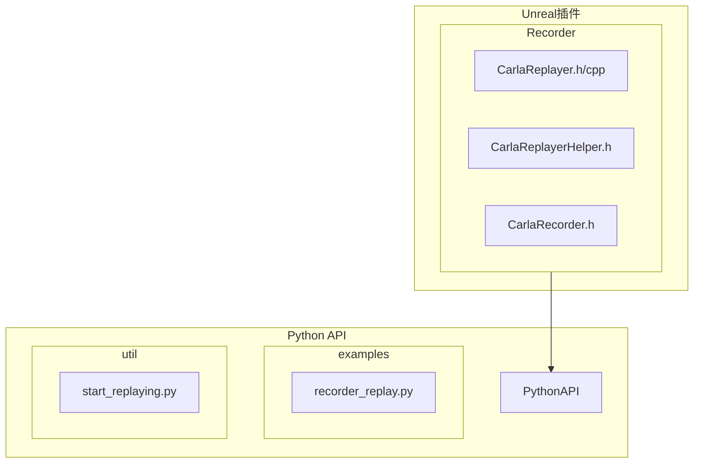
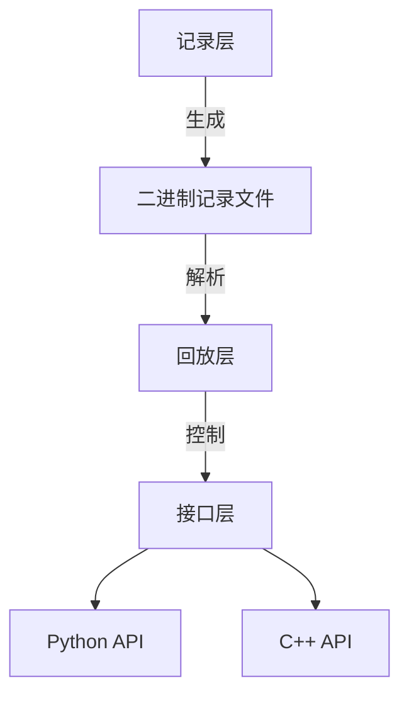
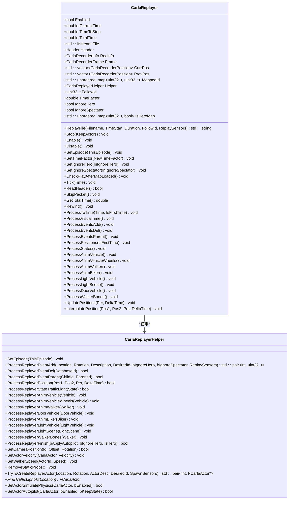
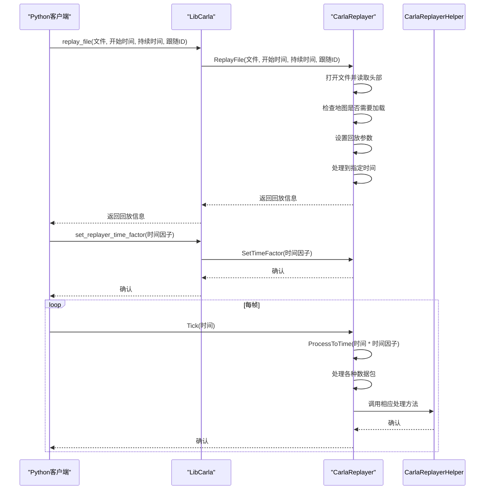
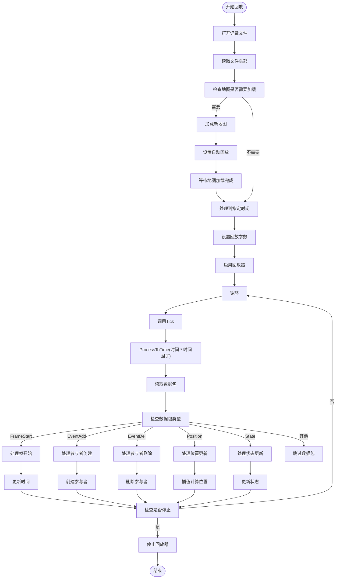

# 回放系统

**本文档引用文件**   
- [CarlaReplayer.h](https://github.com/carla-simulator/carla/blob/ue5-dev/Unreal/CarlaUnreal/Plugins/Carla/Source/Carla/Recorder/CarlaReplayer.h)
- [CarlaReplayer.cpp](https://github.com/carla-simulator/carla/blob/ue5-dev/Unreal/CarlaUnreal/Plugins/Carla/Source/Carla/Recorder/CarlaReplayer.cpp)
- [CarlaReplayerHelper.h](https://github.com/carla-simulator/carla/blob/ue5-dev/Unreal/CarlaUnreal/Plugins/Carla/Source/Carla/Recorder/CarlaReplayerHelper.h)
- [CarlaRecorder.h](https://github.com/carla-simulator/carla/blob/ue5-dev/Unreal/CarlaUnreal/Plugins/Carla/Source/Carla/Recorder/CarlaRecorder.h)
- [Client.cpp](https://github.com/carla-simulator/carla/blob/ue5-dev/LibCarla/source/carla/client/detail/Client.cpp)
- [recorder_replay.py](https://github.com/carla-simulator/carla/blob/ue5-dev/PythonAPI/examples/recorder_replay.py)
- [start_replaying.py](https://github.com/carla-simulator/carla/blob/ue5-dev/PythonAPI/util/start_replaying.py)
- [ref_recorder_binary_file_format.md](https://github.com/carla-simulator/carla/blob/ue5-dev/Docs/ref_recorder_binary_file_format.md)

## 目录
1. [简介](#简介)
2. [项目结构](#项目结构)
3. [核心组件](#核心组件)
4. [架构概述](#架构概述)
5. [详细组件分析](#详细组件分析)
6. [依赖分析](#依赖分析)
7. [性能考虑](#性能考虑)
8. [故障排除指南](#故障排除指南)
9. [结论](#结论)

## 简介
CARLA回放系统是一个强大的工具，允许用户重放先前记录的仿真会话。该系统能够精确重建仿真世界，包括所有参与者的位置、状态和事件。通过使用CarlaReplayer类，用户可以控制回放过程，包括播放速度、时间范围和过滤条件。本文档深入探讨了CarlaReplayer类的工作机制，包括如何解析记录文件、重建仿真世界和同步时间线。

## 项目结构
CARLA回放系统的代码分布在多个目录中，主要集中在Unreal插件和Python API中。核心回放功能在Unreal/CarlaUnreal/Plugins/Carla/Source/Carla/Recorder目录下实现，而Python API提供了用户友好的接口来控制回放过程。

**图表来源**
- [CarlaReplayer.h](https://github.com/carla-simulator/carla/blob/ue5-dev/Unreal/CarlaUnreal/Plugins/Carla/Source/Carla/Recorder/CarlaReplayer.h)
- [CarlaReplayer.cpp](https://github.com/carla-simulator/carla/blob/ue5-dev/Unreal/CarlaUnreal/Plugins/Carla/Source/Carla/Recorder/CarlaReplayer.cpp)
- [recorder_replay.py](https://github.com/carla-simulator/carla/blob/ue5-dev/PythonAPI/examples/recorder_replay.py)

**章节来源**
- [CarlaReplayer.h](https://github.com/carla-simulator/carla/blob/ue5-dev/Unreal/CarlaUnreal/Plugins/Carla/Source/Carla/Recorder/CarlaReplayer.h)
- [CarlaReplayer.cpp](https://github.com/carla-simulator/carla/blob/ue5-dev/Unreal/CarlaUnreal/Plugins/Carla/Source/Carla/Recorder/CarlaReplayer.cpp)
- [recorder_replay.py](https://github.com/carla-simulator/carla/blob/ue5-dev/PythonAPI/examples/recorder_replay.py)

## 核心组件
CarlaReplayer类是CARLA回放系统的核心，负责解析记录文件、重建仿真世界和同步时间线。该类通过读取二进制记录文件，处理各种数据包类型，包括参与者创建、位置更新、状态变化和事件触发。CarlaReplayerHelper类作为辅助类，处理具体的参与者操作，如创建、移动和状态更新。

**章节来源**
- [CarlaReplayer.h](https://github.com/carla-simulator/carla/blob/ue5-dev/Unreal/CarlaUnreal/Plugins/Carla/Source/Carla/Recorder/CarlaReplayer.h)
- [CarlaReplayerHelper.h](https://github.com/carla-simulator/carla/blob/ue5-dev/Unreal/CarlaUnreal/Plugins/Carla/Source/Carla/Recorder/CarlaReplayerHelper.h)

## 架构概述
CARLA回放系统的架构分为三个主要层次：记录层、回放层和接口层。记录层负责生成二进制记录文件，包含所有仿真数据。回放层由CarlaReplayer类实现，负责解析记录文件并重建仿真世界。接口层提供Python和C++接口，允许用户控制回放过程。

**图表来源**
- [CarlaRecorder.h](https://github.com/carla-simulator/carla/blob/ue5-dev/Unreal/CarlaUnreal/Plugins/Carla/Source/Carla/Recorder/CarlaRecorder.h)
- [CarlaReplayer.h](https://github.com/carla-simulator/carla/blob/ue5-dev/Unreal/CarlaUnreal/Plugins/Carla/Source/Carla/Recorder/CarlaReplayer.h)
- [Client.cpp](https://github.com/carla-simulator/carla/blob/ue5-dev/LibCarla/source/carla/client/detail/Client.cpp)

## 详细组件分析

### CarlaReplayer类分析
CarlaReplayer类是回放系统的核心，负责处理记录文件中的各种数据包。该类通过ProcessToTime方法处理时间线，根据当前时间读取和处理相应的数据包。关键方法包括ReplayFile用于启动回放，Tick用于推进时间线，以及各种Process方法处理特定类型的数据包。

#### 对象导向组件：

**图表来源**
- [CarlaReplayer.h](https://github.com/carla-simulator/carla/blob/ue5-dev/Unreal/CarlaUnreal/Plugins/Carla/Source/Carla/Recorder/CarlaReplayer.h)
- [CarlaReplayerHelper.h](https://github.com/carla-simulator/carla/blob/ue5-dev/Unreal/CarlaUnreal/Plugins/Carla/Source/Carla/Recorder/CarlaReplayerHelper.h)

#### API/服务组件：

**图表来源**
- [Client.cpp](https://github.com/carla-simulator/carla/blob/ue5-dev/LibCarla/source/carla/client/detail/Client.cpp)
- [CarlaReplayer.h](https://github.com/carla-simulator/carla/blob/ue5-dev/Unreal/CarlaUnreal/Plugins/Carla/Source/Carla/Recorder/CarlaReplayer.h)
- [CarlaReplayer.cpp](https://github.com/carla-simulator/carla/blob/ue5-dev/Unreal/CarlaUnreal/Plugins/Carla/Source/Carla/Recorder/CarlaReplayer.cpp)

**章节来源**
- [CarlaReplayer.h](https://github.com/carla-simulator/carla/blob/ue5-dev/Unreal/CarlaUnreal/Plugins/Carla/Source/Carla/Recorder/CarlaReplayer.h)
- [CarlaReplayer.cpp](https://github.com/carla-simulator/carla/blob/ue5-dev/Unreal/CarlaUnreal/Plugins/Carla/Source/Carla/Recorder/CarlaReplayer.cpp)
- [Client.cpp](https://github.com/carla-simulator/carla/blob/ue5-dev/LibCarla/source/carla/client/detail/Client.cpp)

### 回放过程分析
回放过程包括几个关键步骤：地图加载、参与者创建、状态插值和事件触发。当回放文件中的地图与当前地图不同时，系统会自动加载新地图。然后，系统会根据记录文件中的事件创建参与者，并通过插值计算参与者的位置和状态。

#### 复杂逻辑组件：

**图表来源**
- [CarlaReplayer.cpp](https://github.com/carla-simulator/carla/blob/ue5-dev/Unreal/CarlaUnreal/Plugins/Carla/Source/Carla/Recorder/CarlaReplayer.cpp)
- [CarlaReplayerHelper.h](https://github.com/carla-simulator/carla/blob/ue5-dev/Unreal/CarlaUnreal/Plugins/Carla/Source/Carla/Recorder/CarlaReplayerHelper.h)

**章节来源**
- [CarlaReplayer.cpp](https://github.com/carla-simulator/carla/blob/ue5-dev/Unreal/CarlaUnreal/Plugins/Carla/Source/Carla/Recorder/CarlaReplayer.cpp)
- [CarlaReplayerHelper.h](https://github.com/carla-simulator/carla/blob/ue5-dev/Unreal/CarlaUnreal/Plugins/Carla/Source/Carla/Recorder/CarlaReplayerHelper.h)

## 依赖分析
CARLA回放系统依赖于多个组件和库。核心依赖包括Unreal Engine的插件系统、LibCarla库和Python API。回放系统通过CarlaReplayer类与仿真世界交互，通过CarlaReplayerHelper类处理具体的参与者操作。

```mermaid
graph TD
A[CarlaReplayer] --> B[CarlaReplayerHelper]
A --> C[CarlaRecorderInfo]
A --> D[CarlaRecorderFrame]
A --> E[CarlaRecorderPosition]
A --> F[CarlaRecorderEventAdd]
A --> G[CarlaRecorderEventDel]
A --> H[CarlaRecorderEventParent]
A --> I[CarlaRecorderState]
A --> J[CarlaRecorderAnimVehicle]
A --> K[CarlaRecorderAnimVehicleWheels]
A --> L[CarlaRecorderAnimWalker]
A --> M[CarlaRecorderAnimBiker]
A --> N[CarlaRecorderLightVehicle]
A --> O[CarlaRecorderLightScene]
A --> P[CarlaRecorderDoorVehicle]
A --> Q[CarlaRecorderWalkerBones]
B --> R[UCarlaEpisode]
B --> S[FCarlaActor]
B --> T[FActorDescription]
```

**图表来源**
- [CarlaReplayer.h](https://github.com/carla-simulator/carla/blob/ue5-dev/Unreal/CarlaUnreal/Plugins/Carla/Source/Carla/Recorder/CarlaReplayer.h)
- [CarlaReplayerHelper.h](https://github.com/carla-simulator/carla/blob/ue5-dev/Unreal/CarlaUnreal/Plugins/Carla/Source/Carla/Recorder/CarlaReplayerHelper.h)

**章节来源**
- [CarlaReplayer.h](https://github.com/carla-simulator/carla/blob/ue5-dev/Unreal/CarlaUnreal/Plugins/Carla/Source/Carla/Recorder/CarlaReplayer.h)
- [CarlaReplayerHelper.h](https://github.com/carla-simulator/carla/blob/ue5-dev/Unreal/CarlaUnreal/Plugins/Carla/Source/Carla/Recorder/CarlaReplayerHelper.h)

## 性能考虑
大规模场景回放可能面临性能挑战，特别是在高帧率和复杂场景下。为了优化性能，建议使用适当的时间因子，避免过高的播放速度。此外，可以通过过滤条件减少回放的参与者数量，从而提高性能。对于大规模场景，建议使用异步模式以减少延迟。

## 故障排除指南
回放过程中可能遇到的常见问题包括文件找不到、地图加载失败和参与者创建失败。对于文件找不到的问题，确保记录文件路径正确。对于地图加载失败，检查地图文件是否存在且版本兼容。对于参与者创建失败，检查参与者描述是否正确且资源可用。

**章节来源**
- [CarlaReplayer.cpp](https://github.com/carla-simulator/carla/blob/ue5-dev/Unreal/CarlaUnreal/Plugins/Carla/Source/Carla/Recorder/CarlaReplayer.cpp)
- [CarlaReplayerHelper.h](https://github.com/carla-simulator/carla/blob/ue5-dev/Unreal/CarlaUnreal/Plugins/Carla/Source/Carla/Recorder/CarlaReplayerHelper.h)

## 结论
CARLA回放系统提供了一个强大而灵活的工具，用于重放和分析仿真会话。通过深入理解CarlaReplayer类的工作机制，用户可以充分利用回放系统的功能，包括精确的时间线控制、参与者状态插值和事件触发。通过合理配置回放参数和优化性能，用户可以在各种场景下高效地使用回放系统。