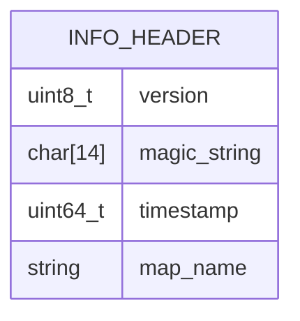
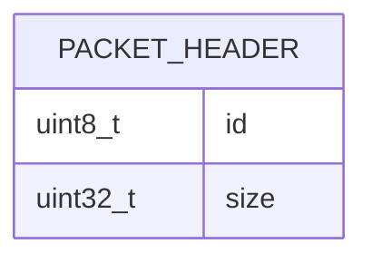
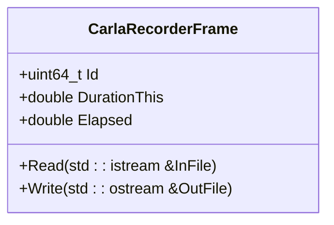
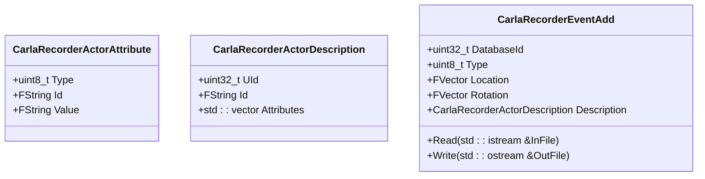
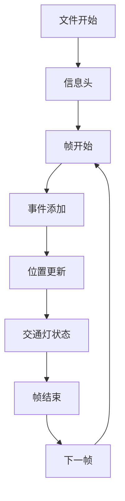
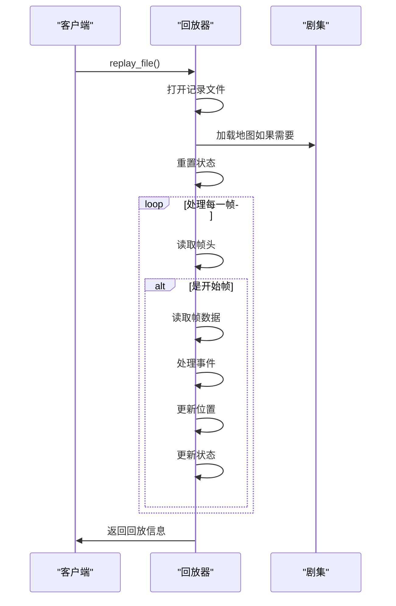

# 录制与回放

> **引用文件**
> **本文档引用的文件**

- [adv_recorder.md](https://github.com/carla-simulator/carla/blob/ue5-dev/Docs/adv_recorder.md)
- [ref_recorder_binary_file_format.md](https://github.com/carla-simulator/carla/blob/ue5-dev/Docs/ref_recorder_binary_file_format.md)
- [CarlaRecorder.h](https://github.com/carla-simulator/carla/blob/ue5-dev/Unreal/CarlaUnreal/Plugins/Carla/Source/Carla/Recorder/CarlaRecorder.h)
- [CarlaRecorder.cpp](https://github.com/carla-simulator/carla/blob/ue5-dev/Unreal/CarlaUnreal/Plugins/Carla/Source/Carla/Recorder/CarlaRecorder.cpp)
- [CarlaReplayer.h](https://github.com/carla-simulator/carla/blob/ue5-dev/Unreal/CarlaUnreal/Plugins/Carla/Source/Carla/Recorder/CarlaReplayer.h)
- [CarlaReplayer.cpp](https://github.com/carla-simulator/carla/blob/ue5-dev/Unreal/CarlaUnreal/Plugins/Carla/Source/Carla/Recorder/CarlaReplayer.cpp)
- [CarlaRecorderFrames.h](https://github.com/carla-simulator/carla/blob/ue5-dev/Unreal/CarlaUnreal/Plugins/Carla/Source/Carla/Recorder/CarlaRecorderFrames.h)
- [CarlaRecorderEventAdd.h](https://github.com/carla-simulator/carla/blob/ue5-dev/Unreal/CarlaUnreal/Plugins/Carla/Source/Carla/Recorder/CarlaRecorderEventAdd.h)
- [CarlaRecorderEventAdd.cpp](https://github.com/carla-simulator/carla/blob/ue5-dev/Unreal/CarlaUnreal/Plugins/Carla/Source/Carla/Recorder/CarlaRecorderEventAdd.cpp)
- [Client.cpp](https://github.com/carla-simulator/carla/blob/ue5-dev/PythonAPI/carla/src/Client.cpp)
- [recorder_replay.py](https://github.com/carla-simulator/carla/blob/ue5-dev/PythonAPI/examples/recorder_replay.py)
- [show_recorder_file_info.py](https://github.com/carla-simulator/carla/blob/ue5-dev/PythonAPI/util/show_recorder_file_info.py)

## 目录

1. [简介](#简介)
2. [二进制记录文件结构](#二进制记录文件结构)
3. [录制 API 使用方法](#录制api使用方法)
4. [回放功能与场景重建](#回放功能与场景重建)
5. [查询与分析记录数据](#查询与分析记录数据)
6. [代码示例](#代码示例)
7. [常见问题与解决方案](#常见问题与解决方案)

## 简介

CARLA 的录制与回放系统是一个强大的工具，用于场景复现和算法验证。该系统能够精确记录仿真过程中的所有事件，并在后续进行重放，从而允许开发者分析和调试自动驾驶算法。录制功能将所有必要的信息保存到一个二进制文件中，包括演员（Actor）的创建与销毁、交通灯状态变化、车辆和行人的位置与姿态等。回放功能则利用这些记录的数据，在仿真环境中重建整个场景，使得用户可以观察和分析特定事件的发生过程。

**Section sources**

- [adv_recorder.md](https://github.com/carla-simulator/carla/blob/ue5-dev/Docs/adv_recorder.md#recording)
- [ref_recorder_binary_file_format.md](https://github.com/carla-simulator/carla/blob/ue5-dev/Docs/ref_recorder_binary_file_format.md#1-strings-in-binary)

## 二进制记录文件结构

CARLA 的记录文件采用二进制格式，使用小端字节序存储多字节值。文件结构由一个信息头和一系列数据包组成，每个数据包都有特定的类型和大小，便于在回放时快速跳过不感兴趣的数据。

### 信息头

信息头包含记录文件的通用信息，如版本号、标识字符串、记录日期和使用的地图名称。这些信息对于识别和验证记录文件至关重要。



**Diagram sources**

- [ref_recorder_binary_file_format.md](https://github.com/carla-simulator/carla/blob/ue5-dev/Docs/ref_recorder_binary_file_format.md#2-info-header)

### 数据包结构

每个数据包以一个 5 字节的头部开始，包含数据包类型（id）和数据大小（size）。根据类型的不同，数据包可以包含不同的信息，如演员的创建、销毁、位置更新等。



**Diagram sources**

- [ref_recorder_binary_file_format.md](https://github.com/carla-simulator/carla/blob/ue5-dev/Docs/ref_recorder_binary_file_format.md#3-packets)

### 关键数据结构

#### CarlaRecorderFrame

`CarlaRecorderFrame` 结构体定义了每一帧的基本信息，包括帧 ID、当前帧的持续时间（DurationThis）和从开始到当前帧的总时间（Elapsed）。



**Diagram sources**

- <a href="https://github.com/carla-simulator/carla/blob/ue5-dev/Unreal/CarlaUnreal/Plugins/Carla/Source/Carla/Recorder/CarlaRecorderFrames.h#L12-L22" target="_blank">CarlaRecorderFrames.h</a>

#### CarlaRecorderEventAdd

`CarlaRecorderEventAdd` 结构体用于记录演员的创建事件。它包含了演员的 ID、类型、位置、旋转以及描述信息。描述信息中包括了演员的唯一 ID（UId）、文本 ID（Id）和一系列属性（Attributes），如颜色、轮子数量等。



**Diagram sources**

- <a href="https://github.com/carla-simulator/carla/blob/ue5-dev/Unreal/CarlaUnreal/Plugins/Carla/Source/Carla/Recorder/CarlaRecorderEventAdd.h#L26-L36" target="_blank">CarlaRecorderEventAdd.h</a>
- <a href="https://github.com/carla-simulator/carla/blob/ue5-dev/Unreal/CarlaUnreal/Plugins/Carla/Source/Carla/Recorder/CarlaRecorderEventAdd.cpp#L45-L66" target="_blank">CarlaRecorderEventAdd.cpp</a>

### 文件布局

记录文件的布局遵循一定的顺序：首先是一个信息头，然后是一系列按帧组织的数据包。每帧以`Frame Start`包开始，以`Frame End`包结束。在这之间，可以包含各种类型的事件包，如演员创建、位置更新等。



**Diagram sources**

- [ref_recorder_binary_file_format.md](https://github.com/carla-simulator/carla/blob/ue5-dev/Docs/ref_recorder_binary_file_format.md#5-file-layout)

## 录制 API 使用方法

### 开始录制

使用`Client.start_recorder()`方法可以开始录制仿真过程。该方法需要一个文件名作为参数，如果文件名包含路径分隔符，则会被视为绝对路径；否则，文件将保存在`CarlaUnreal/Saved`目录下。

```python
client.start_recorder("/home/carla/recording01.log")
```

为了记录更多的信息，如车辆和行人的线速度和角速度、交通灯的时间设置等，可以在调用`start_recorder`时将`additional_data`参数设置为`True`。

```python
client.start_recorder("/home/carla/recording01.log", True)
```

**Section sources**

- [adv_recorder.md](https://github.com/carla-simulator/carla/blob/ue5-dev/Docs/adv_recorder.md#recording)
- <a href="https://github.com/carla-simulator/carla/blob/ue5-dev/PythonAPI/carla/src/Client.cpp#L204" target="_blank">Client.cpp</a>

### 停止录制

录制可以通过调用`Client.stop_recorder()`方法来停止。此方法会关闭记录文件并释放相关资源。

```python
client.stop_recorder()
```

**Section sources**

- [adv_recorder.md](https://github.com/carla-simulator/carla/blob/ue5-dev/Docs/adv_recorder.md#recording)
- <a href="https://github.com/carla-simulator/carla/blob/ue5-dev/PythonAPI/carla/src/Client.cpp#L205" target="_blank">Client.cpp</a>

## 回放功能与场景重建

### 启动回放

回放功能通过`Client.replay_file()`方法启动。该方法需要指定记录文件的路径、开始时间、持续时间和跟随的演员 ID。

```python
client.replay_file("recording01.log", start, duration, camera)
```

| 参数       | 描述                           | 说明                                             |
| ---------- | ------------------------------ | ------------------------------------------------ |
| `start`    | 从记录的开始或结束处计算的秒数 | 正数表示从开始计算，负数表示从结束计算           |
| `duration` | 回放的秒数，0 表示回放整个记录 | 回放结束后，车辆将设置为自动驾驶模式，行人将停止 |
| `camera`   | 摄像机跟随的演员 ID            | 设置为 0 表示允许观察者自由移动                  |

**Section sources**

- [adv_recorder.md](https://github.com/carla-simulator/carla/blob/ue5-dev/Docs/adv_recorder.md#simulation-playback)
- <a href="https://github.com/carla-simulator/carla/blob/ue5-dev/PythonAPI/carla/src/Client.cpp#L209" target="_blank">Client.cpp</a>

### 时间因子设置

时间因子（time factor）决定了回放的速度。可以通过`Client.set_replayer_time_factor()`方法动态调整时间因子，而无需停止回放。

```python
client.set_replayer_time_factor(2.0)
```

| 参数          | 默认值 | 快速播放 | 慢速播放 |
| ------------- | ------ | -------- | -------- |
| `time_factor` | 1.0    | >1.0     | <1.0     |

当时间因子大于 2.0 时，演员的位置插值将被禁用，仅进行更新。行人的动画不受时间因子的影响。

**Section sources**

- [adv_recorder.md](https://github.com/carla-simulator/carla/blob/ue5-dev/Docs/adv_recorder.md#setting-a-time-factor)
- <a href="https://github.com/carla-simulator/carla/blob/ue5-dev/PythonAPI/carla/src/Client.cpp#L211" target="_blank">Client.cpp</a>

### 场景重建过程

回放过程中，系统会根据记录文件中的数据重建场景。这包括演员的创建、状态恢复和时间同步。`CarlaReplayer`类负责处理这些任务，确保场景的准确复现。



**Diagram sources**

- <a href="https://github.com/carla-simulator/carla/blob/ue5-dev/Unreal/CarlaUnreal/Plugins/Carla/Source/Carla/Recorder/CarlaReplayer.cpp#L106-L198" target="_blank">CarlaReplayer.cpp</a>

## 查询与分析记录数据

### 显示记录文件信息

使用`Client.show_recorder_file_info()`方法可以获取记录文件的详细信息，包括地图、日期、帧信息和关闭信息。

```python
print(client.show_recorder_file_info("recording01.log"))
```

**Section sources**

- [adv_recorder.md](https://github.com/carla-simulator/carla/blob/ue5-dev/Docs/adv_recorder.md#recorded-file)
- <a href="https://github.com/carla-simulator/carla/blob/ue5-dev/PythonAPI/carla/src/Client.cpp#L206" target="_blank">Client.cpp</a>

### 查询碰撞事件

`Client.show_recorder_collisions()`方法可以查询记录中的碰撞事件。通过指定两个演员类型标志，可以过滤出特定类型的碰撞。

```python
print(client.show_recorder_collisions("recording01.log", "v", "a"))
```

可用的演员类型标志包括：

- `h` = Hero
- `v` = Vehicle
- `w` = Walker
- `t` = Traffic light
- `o` = Other
- `a` = Any

**Section sources**

- [adv_recorder.md](https://github.com/carla-simulator/carla/blob/ue5-dev/Docs/adv_recorder.md#collisions)
- <a href="https://github.com/carla-simulator/carla/blob/ue5-dev/PythonAPI/carla/src/Client.cpp#L207" target="_blank">Client.cpp</a>

### 查询阻塞的演员

`Client.show_recorder_actors_blocked()`方法可以检测在记录过程中被阻塞的车辆。一个演员被认为是阻塞的，如果它在一定时间内没有移动最小距离。

```python
print(client.show_recorder_actors_blocked("recording01.log", min_time, min_distance))
```

| 参数           | 描述                             | 默认值  |
| -------------- | -------------------------------- | ------- |
| `min_time`     | 移动`min_distance`所需的最短时间 | 30 秒   |
| `min_distance` | 不被视为阻塞的最小移动距离       | 10 厘米 |

**Section sources**

- [adv_recorder.md](https://github.com/carla-simulator/carla/blob/ue5-dev/Docs/adv_recorder.md#blocked-actors)
- <a href="https://github.com/carla-simulator/carla/blob/ue5-dev/PythonAPI/carla/src/Client.cpp#L208" target="_blank">Client.cpp</a>

## 代码示例

以下是一个完整的 Python 脚本示例，展示了如何使用 CARLA 的录制与回放功能。

```python
#!/usr/bin/env python

import argparse
import threading
import sys
import os
import pygame
import carla

FPS = 20
FIRST_FRAME = 0
LAST_FRAME = False
REPLAY_SPEED = 1
TIME = 0

def tick(world):
    global TIME, REPLAY_SPEED
    world.tick()
    TIME += world.get_snapshot().delta_seconds * REPLAY_SPEED

def recorder_utilities(client):
    global LAST_FRAME, REPLAY_SPEED
    stop = False

    while not stop and not LAST_FRAME:
        data = input("\n输入下一个操作: ")
        try:
            int_data = float(data)
            print("  设置回放因子为 {}".format(int_data))
            client.set_replayer_time_factor(int_data)
            REPLAY_SPEED = int_data
        except ValueError:
            if data not in ("S", "R"):
                print("\033[93m忽略未知命令 '{}'\033[0m".format(data))
                continue

            print("  时间: {}".format(round(TIME, 3)))
            if data == 'S':
                stop = True
    LAST_FRAME = True

def main():
    argparser = argparse.ArgumentParser(description=__doc__)
    argparser.add_argument(
        '--host', metavar='H', default='localhost',
        help='主机IP地址（默认：localhost）')
    argparser.add_argument(
        '--port', metavar='P', default=2000, type=int,
        help='CARLA模拟器的TCP端口（默认：2000）')
    argparser.add_argument(
        '-f', '--file', default='', required=True,
        help='要执行的文件')
    argparser.add_argument(
        '--start-time', default=0, type=float,
        help='记录的开始时间')
    argparser.add_argument(
        '--end-time', default=0, type=float,
        help='记录的结束时间')
    argparser.add_argument(
        '--follow-id', default=0, type=int,
        help='要跟随的ID')
    argparser.add_argument(
        '--follow-ego', action="store_true",
        help='跟随主车')
    argparser.add_argument(
        '--factor', default=1, type=float,
        help='初始回放因子')

    args = argparser.parse_args()

    if args.follow_id and args.follow_ego:
        print("选择跟随一个ID或主车，但不能同时选择")
        sys.exit(0)

    global TIME, LAST_FRAME, REPLAY_SPEED

    TIME = args.start_time
    REPLAY_SPEED = args.factor

    client = None
    world = None

    if not os.path.exists(args.file):
        print("警告：指定的'.log'文件不存在。正在关闭")
        sys.exit(-1)

    print("\n\033[1m> 设置仿真\033[0m")
    client = carla.Client(args.host, args.port)
    client.set_timeout(200.0)
    file_info = client.show_recorder_file_info(args.file, True)

    world = client.get_world()
    settings = world.get_settings()
    settings.synchronous_mode = True
    settings.fixed_delta_seconds = 1/FPS
    world.apply_settings(settings)

    follow_id = args.follow_id
    if args.follow_ego:
        file_split = file_info.split("Create ")
        for data in file_split:
            if not 'hero' in data:
                continue
            follow_id = int(data.split(": ")[0])
            print("检测到主车ID为 '{}'".format(follow_id))
            break

    duration = args.end_time
    if not duration:
        duration = float(file_info.split("Duration: ")[-1].split(" ")[0])

    print("\033[1m> 启动回放器\033[0m")
    client.replay_file(args.file, args.start_time, args.end_time, follow_id)
    client.set_replayer_time_factor(args.factor)

    tick(world)

    try:
        print("\033[1m> 运行回放器。使用\033[0m")
        print("\033[1m  - R: 记录回放器时间戳数据\033[0m")
        print("\033[1m  - S: 停止脚本\033[0m")
        print("\033[1m  - 数字: 改变回放器的速度因子\033[0m")

        t1 = threading.Thread(target=recorder_utilities, args=(client, ))
        t1.start()

        clock = pygame.time.Clock()
        while not LAST_FRAME:
            clock.tick_busy_loop(20)
            tick(world)
            if TIME >= duration:
                LAST_FRAME = True

    except KeyboardInterrupt:
        pass
    finally:
        if world is not None:
            settings = world.get_settings()
            settings.synchronous_mode = False
            settings.fixed_delta_seconds = None
            world.apply_settings(settings)

        if client is not None:
            client.stop_replayer(True)
            client.set_replayer_time_factor(1)

if __name__ == '__main__':
    main()
```

**Section sources**

- [recorder_replay.py](https://github.com/carla-simulator/carla/blob/ue5-dev/PythonAPI/examples/recorder_replay.py)

## 常见问题与解决方案

### 大文件处理

长时间的录制会产生较大的文件。建议定期清理不必要的记录文件，并使用压缩工具对文件进行压缩，以节省存储空间。

### 时间偏移校正

在回放过程中，可能会出现时间偏移的问题。可以通过调整`fixed_delta_seconds`参数来校正时间偏移，确保回放的准确性。

### 自定义对象回放

对于自定义对象的回放，需要确保在录制和回放时使用相同的对象定义和属性。如果对象定义发生变化，可能导致回放失败或行为异常。

**Section sources**

- [adv_recorder.md](https://github.com/carla-simulator/carla/blob/ue5-dev/Docs/adv_recorder.md#queries)
- <a href="https://github.com/carla-simulator/carla/blob/ue5-dev/Unreal/CarlaUnreal/Plugins/Carla/Source/Carla/Recorder/CarlaReplayer.cpp#L106-L198" target="_blank">CarlaReplayer.cpp</a>
