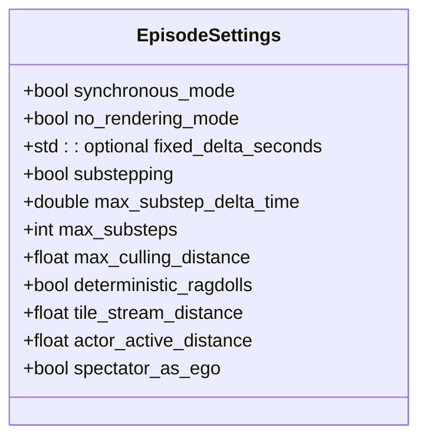
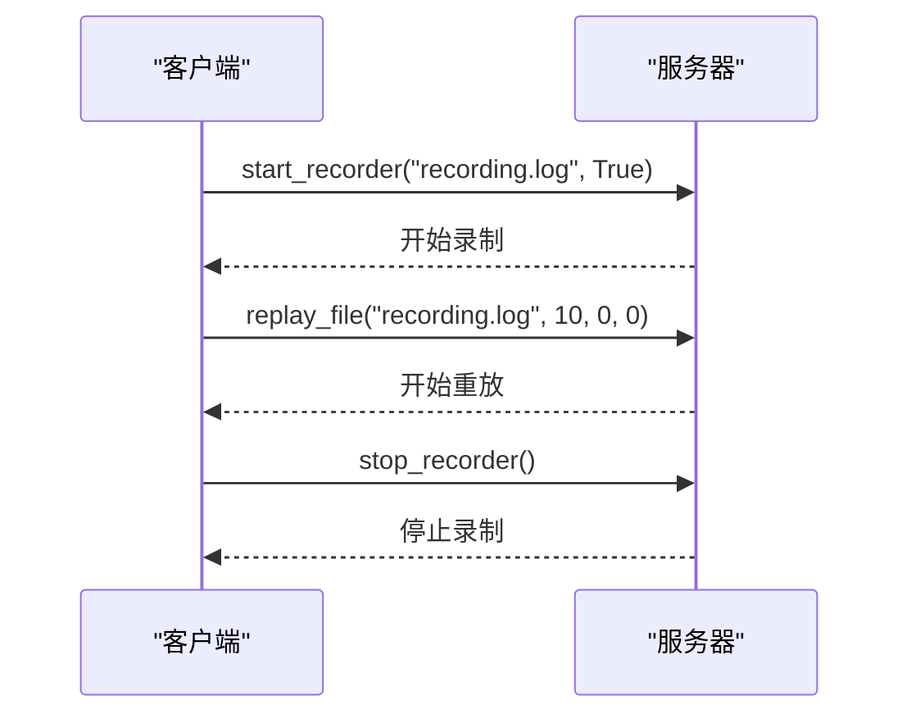
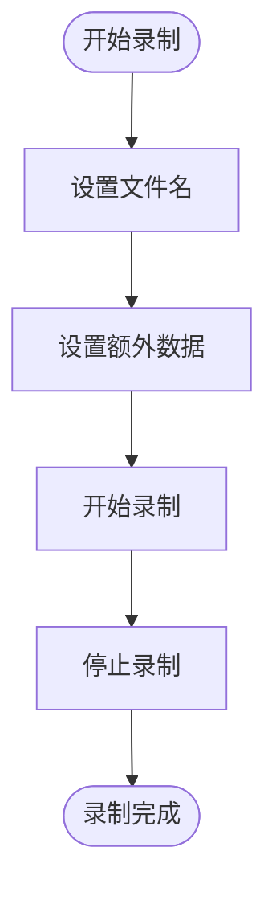

# 参数配置

> **引用文件**
> **本文档中引用的文件**

- [EpisodeSettings.h](https://github.com/carla-simulator/carla/blob/ue5-dev/LibCarla/source/carla/rpc/EpisodeSettings.h)
- [adv_recorder.md](https://github.com/carla-simulator/carla/blob/ue5-dev/Docs/adv_recorder.md)
- [ref_recorder_binary_file_format.md](https://github.com/carla-simulator/carla/blob/ue5-dev/Docs/ref_recorder_binary_file_format.md)
- [Client.cpp](https://github.com/carla-simulator/carla/blob/ue5-dev/PythonAPI/carla/src/Client.cpp)
- [recorder_replay.py](https://github.com/carla-simulator/carla/blob/ue5-dev/PythonAPI/examples/recorder_replay.py)
- [show_recorder_file_info.py](https://github.com/carla-simulator/carla/blob/ue5-dev/PythonAPI/util/show_recorder_file_info.py)

## 目录

1. [简介](#简介)
2. [录制参数配置](#录制参数配置)
3. [API 中的录制设置](#api中的录制设置)
4. [高级录制选项](#高级录制选项)
5. [性能影响与最佳实践](#性能影响与最佳实践)
6. [结论](#结论)

## 简介

CARLA 仿真器提供了强大的录制功能，允许用户记录和重放仿真过程。本文档详细介绍了与录制相关的配置选项，包括记录频率、数据过滤规则和压缩策略。通过深入分析 EpisodeSettings 中的相关参数，我们将探讨如何通过 API 设置录制参数，如选择要记录的 Actor 类型、传感器数据的采样率以及是否记录环境对象。

**Section sources**

- <a href="https://github.com/carla-simulator/carla/blob/ue5-dev/Docs/adv_recorder.md#L1-L318" target="_blank">adv_recorder.md</a>

## 录制参数配置

CARLA 的录制功能通过 EpisodeSettings 类进行配置。该类定义了多个与录制相关的参数，包括同步模式、渲染模式、固定时间步长等。这些参数在录制过程中起着关键作用，影响着录制数据的完整性和仿真性能。

**Diagram sources**

- <a href="https://github.com/carla-simulator/carla/blob/ue5-dev/LibCarla/source/carla/rpc/EpisodeSettings.h#L23-L158" target="_blank">EpisodeSettings.h</a>

**Section sources**

- <a href="https://github.com/carla-simulator/carla/blob/ue5-dev/LibCarla/source/carla/rpc/EpisodeSettings.h#L1-L159" target="_blank">EpisodeSettings.h</a>

## API 中的录制设置

通过 Python API，用户可以方便地配置和控制录制过程。主要的录制相关方法包括 start_recorder、stop_recorder、replay_file 等。这些方法允许用户指定录制文件名、是否记录额外数据、重放时间点等参数。

**Diagram sources**

- <a href="https://github.com/carla-simulator/carla/blob/ue5-dev/PythonAPI/carla/src/Client.cpp#L204-L210" target="_blank">Client.cpp</a>
- <a href="https://github.com/carla-simulator/carla/blob/ue5-dev/PythonAPI/examples/recorder_replay.py#L126-L127" target="_blank">recorder_replay.py</a>

**Section sources**

- <a href="https://github.com/carla-simulator/carla/blob/ue5-dev/PythonAPI/carla/src/Client.cpp#L1-L219" target="_blank">Client.cpp</a>
- <a href="https://github.com/carla-simulator/carla/blob/ue5-dev/PythonAPI/examples/recorder_replay.py#L1-L164" target="_blank">recorder_replay.py</a>

## 高级录制选项

CARLA 提供了多种高级录制选项，允许用户根据具体需求定制录制过程。例如，可以通过设置 additional_data 参数来控制是否记录额外的仿真数据。此外，还可以通过 replay_file 方法的参数来控制重放过程的起始时间、持续时间和跟随的 Actor。

**Diagram sources**

- <a href="https://github.com/carla-simulator/carla/blob/ue5-dev/Docs/adv_recorder.md#L34-L51" target="_blank">adv_recorder.md</a>
- <a href="https://github.com/carla-simulator/carla/blob/ue5-dev/PythonAPI/util/show_recorder_file_info.py#L42-L45" target="_blank">show_recorder_file_info.py</a>

**Section sources**

- <a href="https://github.com/carla-simulator/carla/blob/ue5-dev/Docs/adv_recorder.md#L1-L318" target="_blank">adv_recorder.md</a>
- <a href="https://github.com/carla-simulator/carla/blob/ue5-dev/PythonAPI/util/show_recorder_file_info.py#L1-L60" target="_blank">show_recorder_file_info.py</a>

## 性能影响与最佳实践

不同的录制配置会对磁盘空间占用和仿真性能产生显著影响。例如，记录额外数据会增加文件大小，但能提供更完整的仿真信息。建议在实际使用中根据需求权衡数据完整性和存储成本。对于长时间的仿真，可以考虑使用较低的采样率或选择性地记录特定类型的 Actor。

**Section sources**

- <a href="https://github.com/carla-simulator/carla/blob/ue5-dev/Docs/adv_recorder.md#L53-L55" target="_blank">adv_recorder.md</a>
- <a href="https://github.com/carla-simulator/carla/blob/ue5-dev/Docs/ref_recorder_binary_file_format.md#L1-L234" target="_blank">ref_recorder_binary_file_format.md</a>

## 结论

CARLA 的录制功能为仿真数据的记录和分析提供了强大的支持。通过合理配置 EpisodeSettings 中的参数，并利用 Python API 进行灵活控制，用户可以根据具体需求定制录制过程。在实际应用中，应根据性能要求和存储限制选择合适的配置，以达到最佳的录制效果。
