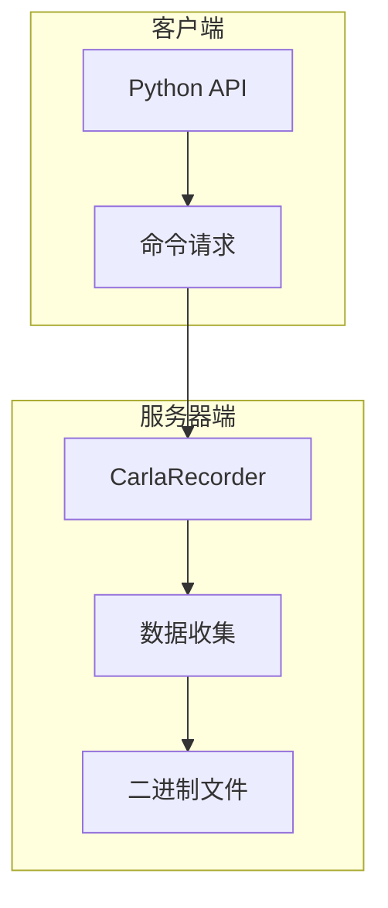
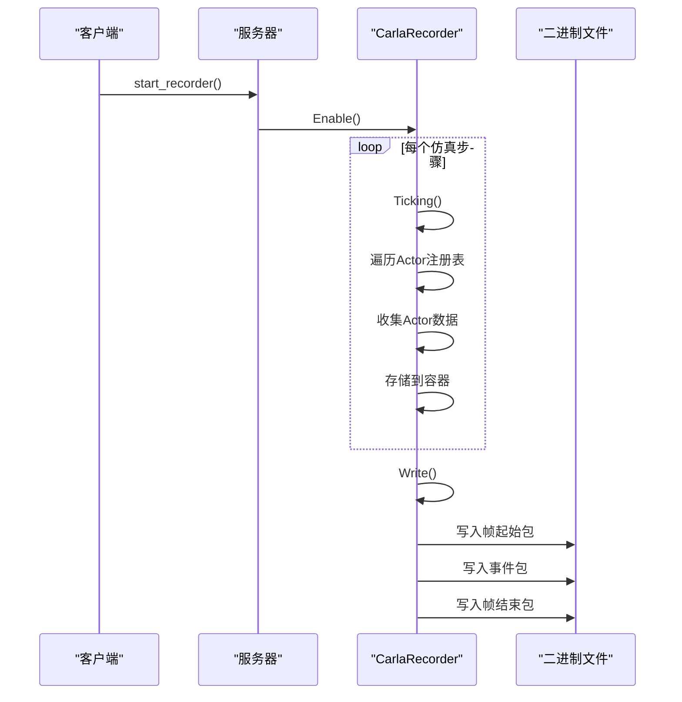

# 录制机制

> **引用文件**
> **本文档中引用的文件**

- [CarlaRecorder.h](https://github.com/carla-simulator/carla/blob/ue5-dev/Unreal/CarlaUnreal/Plugins/Carla/Source/Carla/Recorder/CarlaRecorder.h)
- [CarlaRecorder.cpp](https://github.com/carla-simulator/carla/blob/ue5-dev/Unreal/CarlaUnreal/Plugins/Carla/Source/Carla/Recorder/CarlaRecorder.cpp)
- [CarlaRecorderFrames.h](https://github.com/carla-simulator/carla/blob/ue5-dev/Unreal/CarlaUnreal/Plugins/Carla/Source/Carla/Recorder/CarlaRecorderFrames.h)
- [CarlaRecorderPlatformTime.h](https://github.com/carla-simulator/carla/blob/ue5-dev/Unreal/CarlaUnreal/Plugins/Carla/Source/Carla/Recorder/CarlaRecorderPlatformTime.h)
- [CarlaRecorderInfo.h](https://github.com/carla-simulator/carla/blob/ue5-dev/Unreal/CarlaUnreal/Plugins/Carla/Source/Carla/Recorder/CarlaRecorderInfo.h)
- [CarlaRecorderHelpers.h](https://github.com/carla-simulator/carla/blob/ue5-dev/Unreal/CarlaUnreal/Plugins/Carla/Source/Carla/Recorder/CarlaRecorderHelpers.h)
- [adv_recorder.md](https://github.com/carla-simulator/carla/blob/ue5-dev/Docs/adv_recorder.md)
- [ref_recorder_binary_file_format.md](https://github.com/carla-simulator/carla/blob/ue5-dev/Docs/ref_recorder_binary_file_format.md)
- [recorder_replay.py](https://github.com/carla-simulator/carla/blob/ue5-dev/PythonAPI/examples/recorder_replay.py)
- [show_recorder_file_info.py](https://github.com/carla-simulator/carla/blob/ue5-dev/PythonAPI/util/show_recorder_file_info.py)

## 目录

1. [简介](#简介)
2. [录制机制架构](#录制机制架构)
3. [CarlaRecorder 类内部工作原理](#carlarecorder类内部工作原理)
4. [数据流路径](#数据流路径)
5. [录制参数配置](#录制参数配置)
6. [Python API 使用示例](#python-api使用示例)
7. [录制会话生命周期管理](#录制会话生命周期管理)
8. [性能考虑因素](#性能考虑因素)
9. [结论](#结论)

## 简介

CARLA 的录制机制是一个强大的功能，允许用户记录和重放仿真过程。该机制能够捕获世界状态、Actor 变换、传感器数据和各种事件，为仿真分析、调试和测试提供了重要支持。录制文件以二进制格式存储在服务器端，包含了重放仿真所需的所有信息。通过客户端 API，用户可以启动和停止录制，查询录制文件信息，并进行回放操作。本文档将深入探讨 CarlaRecorder 类的内部工作原理，详细解释数据捕获和记录的完整过程。

## 录制机制架构

CARLA 的录制机制采用客户端-服务器架构，其中录制功能主要在服务器端实现，而控制通过客户端 API 进行。核心组件是 CarlaRecorder 类，它负责收集和序列化仿真数据。录制过程从客户端发送开始录制请求开始，服务器端的 CarlaRecorder 实例被激活并开始收集数据。数据收集包括 Actor 的创建和销毁、位置变换、状态变化、碰撞事件等。所有数据被组织成帧结构，每帧对应仿真中的一个时间步。录制文件以二进制格式存储，包含一个信息头和一系列数据包。信息头包含版本、地图名称、录制日期等元数据，而数据包则包含实际的仿真数据。这种架构设计确保了录制过程的高效性和数据的完整性。



**图源**

- [CarlaRecorder.h](https://github.com/carla-simulator/carla/blob/ue5-dev/Unreal/CarlaUnreal/Plugins/Carla/Source/Carla/Recorder/CarlaRecorder.h)
- [CarlaRecorder.cpp](https://github.com/carla-simulator/carla/blob/ue5-dev/Unreal/CarlaUnreal/Plugins/Carla/Source/Carla/Recorder/CarlaRecorder.cpp)

## CarlaRecorder 类内部工作原理

CarlaRecorder 类是 CARLA 录制系统的核心，继承自 AActor 类，作为仿真世界中的一个特殊 Actor 存在。该类通过 Tick 函数在每个仿真步骤中被调用，实现持续的数据收集。当录制启用时，Ticking 函数会遍历 Actor 注册表中的所有 Actor，根据其类型收集相应的数据。对于车辆 Actor，收集位置、方向、控制输入（油门、刹车、转向）等信息；对于行人 Actor，收集位置和速度信息；对于交通灯，收集状态和计时信息。这些数据被存储在不同的容器中，如 Positions、Vehicles、Walkers 和 States 等。

录制过程以帧为单位组织，每帧由 CarlaRecorderFrames 类管理。帧开始时，写入帧起始包，包含帧 ID 和经过时间；帧结束时，写入帧结束包。在帧的开始和结束之间，写入各种事件包，如 Actor 创建、销毁、位置更新、状态变化等。CarlaRecorder 使用一系列辅助结构来管理不同类型的数据，如 CarlaRecorderPosition 用于存储 Actor 位置，CarlaRecorderAnimVehicle 用于存储车辆动画数据，CarlaRecorderStateTrafficLight 用于存储交通灯状态。这些数据结构通过模板函数 WriteValue 和 ReadValue 进行序列化和反序列化，确保数据的高效存储和读取。

**节源**

- <a href="https://github.com/carla-simulator/carla/blob/ue5-dev/Unreal/CarlaUnreal/Plugins/Carla/Source/Carla/Recorder/CarlaRecorder.h#L78-L236" target="_blank">CarlaRecorder.h</a>
- <a href="https://github.com/carla-simulator/carla/blob/ue5-dev/Unreal/CarlaUnreal/Plugins/Carla/Source/Carla/Recorder/CarlaRecorder.cpp#L90-L156" target="_blank">CarlaRecorder.cpp</a>

## 数据流路径

录制过程的数据流从客户端请求开始，经过服务器端的数据收集、序列化，最终写入二进制文件。当客户端调用 start_recorder 时，服务器端的 CarlaRecorder 实例被激活，Enable 函数被调用，使能录制功能。在每个仿真步骤中，Ticking 函数被调用，触发数据收集过程。数据收集首先通过遍历 Actor 注册表，获取所有 Actor 的当前状态。然后，根据 Actor 类型，调用相应的数据收集函数，如 AddActorPosition、AddVehicleAnimation、AddTrafficLightState 等。这些函数将数据添加到相应的容器中。

在帧结束时，Write 函数被调用，将当前帧的所有数据写入文件。写入过程遵循严格的顺序：首先写入帧起始包，然后写入各种事件包，包括 Actor 创建、销毁、位置更新、状态变化等，最后写入帧结束包。每个数据包都有一个头部，包含包类型 ID 和数据大小，便于解析时跳过不需要的数据包。数据包的写入使用统一的序列化函数，确保数据格式的一致性。整个数据流路径设计考虑了性能和可靠性，通过批量写入和内存缓冲来优化 I/O 性能，同时确保数据的完整性和一致性。



**图源**

- <a href="https://github.com/carla-simulator/carla/blob/ue5-dev/Unreal/CarlaUnreal/Plugins/Carla/Source/Carla/Recorder/CarlaRecorder.cpp#L424-L466" target="_blank">CarlaRecorder.cpp</a>
- <a href="https://github.com/carla-simulator/carla/blob/ue5-dev/Unreal/CarlaUnreal/Plugins/Carla/Source/Carla/Recorder/CarlaRecorderHelpers.h#L19-L44" target="_blank">CarlaRecorderHelpers.h</a>

## 录制参数配置

CARLA 录制机制提供了灵活的参数配置选项，允许用户根据需求调整录制行为。主要配置参数包括录制文件名、附加数据标志和录制范围。录制文件名可以是相对路径或绝对路径，相对路径的文件将保存在 CarlaUnreal/Saved 目录下。附加数据标志是一个布尔值，当设置为 True 时，录制器会收集额外的信息，如车辆和行人的线速度和角速度、交通灯时间设置、执行时间、Actor 的触发和边界框以及车辆的物理控制参数。

录制范围可以通过回放时的参数进行控制，包括开始时间、持续时间和跟随的 Actor ID。开始时间可以是正数（从录制开始计算）或负数（从录制结束计算）。持续时间为 0 表示播放整个录制。跟随的 Actor ID 用于控制摄像机视角，设置为 0 时允许观察者自由移动。此外，还可以通过 set_replayer_time_factor 函数设置回放速度因子，控制回放速度。这些参数配置使得录制和回放过程高度可定制，满足不同场景的需求。

**节源**

- <a href="https://github.com/carla-simulator/carla/blob/ue5-dev/Docs/adv_recorder.md#L32-L46" target="_blank">adv_recorder.md</a>
- <a href="https://github.com/carla-simulator/carla/blob/ue5-dev/Unreal/CarlaUnreal/Plugins/Carla/Source/Carla/Recorder/CarlaRecorder.h#L97-L100" target="_blank">CarlaRecorder.h</a>

## Python API 使用示例

CARLA 提供了简洁的 Python API 来控制录制功能。以下代码示例展示了如何使用 Python API 启动和停止录制：

```python
import carla

# 创建客户端
client = carla.Client('localhost', 2000)
client.set_timeout(10.0)

# 启动录制
try:
    recording_file = client.start_recorder("/home/carla/recording01.log", True)
    print(f"录制已启动，文件: {recording_file}")
except RuntimeError as e:
    print(f"启动录制失败: {e}")

# 停止录制
try:
    client.stop_recorder()
    print("录制已停止")
except RuntimeError as e:
    print(f"停止录制失败: {e}")
```

在录制过程中，可能会遇到各种异常情况，如文件权限错误、磁盘空间不足等。建议在代码中添加适当的异常处理机制，确保程序的健壮性。此外，还可以使用 show_recorder_file_info 函数检查录制文件的内容，验证录制是否成功。

**节源**

- <a href="https://github.com/carla-simulator/carla/blob/ue5-dev/PythonAPI/examples/recorder_replay.py#L80-L128" target="_blank">recorder_replay.py</a>
- <a href="https://github.com/carla-simulator/carla/blob/ue5-dev/PythonAPI/util/show_recorder_file_info.py#L38-L45" target="_blank">show_recorder_file_info.py</a>

## 录制会话生命周期管理

录制会话的生命周期由 CarlaRecorder 类管理，包括创建、启动、运行和停止等阶段。会话创建时，CarlaRecorder 实例被初始化并设置为禁用状态。启动阶段通过调用 Start 函数实现，该函数负责打开输出文件、写入信息头、重置帧计数器和启用录制功能。在运行阶段，Ticking 函数在每个仿真步骤中被调用，持续收集和写入数据。停止阶段通过调用 Stop 函数实现，该函数禁用录制功能、关闭文件并清除内部数据容器。

多会话处理通过 CarlaReplayer 类实现，允许在同一个仿真中进行录制和回放。当开始新的录制时，如果存在正在进行的回放，会自动停止回放。资源释放主要在 Stop 函数中完成，包括关闭文件流和清除所有数据容器。这种生命周期管理确保了录制会话的正确性和资源的有效利用。

**节源**

- <a href="https://github.com/carla-simulator/carla/blob/ue5-dev/Unreal/CarlaUnreal/Plugins/Carla/Source/Carla/Recorder/CarlaRecorder.cpp#L424-L478" target="_blank">CarlaRecorder.cpp</a>
- <a href="https://github.com/carla-simulator/carla/blob/ue5-dev/Unreal/CarlaUnreal/Plugins/Carla/Source/Carla/Recorder/CarlaRecorder.h#L97-L100" target="_blank">CarlaRecorder.h</a>

## 性能考虑因素

录制机制的性能主要受磁盘 I/O、内存使用和仿真性能影响。磁盘 I/O 优化通过批量写入和内存缓冲实现，减少频繁的磁盘操作。录制文件的大小与录制时长、Actor 数量和录制频率成正比，通常 1 小时的录制（包含 50 个交通灯和 100 辆车）大约占用 200MB 空间。内存使用主要取决于同时存储的帧数和 Actor 数量，CarlaRecorder 通过在每帧结束后清除数据容器来控制内存使用。

对仿真性能的影响主要体现在 CPU 开销上，因为数据收集和序列化需要消耗计算资源。为了最小化性能影响，录制过程被设计为尽可能高效，使用简单的数据结构和快速的序列化方法。建议在不需要高精度数据时，禁用附加数据选项，以减少数据量和处理开销。此外，合理的录制频率设置也能有效平衡数据精度和性能开销。

**节源**

- <a href="https://github.com/carla-simulator/carla/blob/ue5-dev/Docs/adv_recorder.md#L53-L55" target="_blank">adv_recorder.md</a>
- <a href="https://github.com/carla-simulator/carla/blob/ue5-dev/Unreal/CarlaUnreal/Plugins/Carla/Source/Carla/Recorder/CarlaRecorder.cpp#L503-L547" target="_blank">CarlaRecorder.cpp</a>

## 结论

CARLA 的录制机制是一个功能强大且设计精良的系统，为仿真数据的记录和分析提供了坚实基础。通过深入分析 CarlaRecorder 类的内部工作原理，我们了解到其如何高效地捕获世界状态、Actor 变换、传感器数据和事件。数据流从客户端请求到服务器端记录的完整路径清晰明了，录制参数的配置灵活多样，满足不同应用场景的需求。Python API 的使用示例展示了如何便捷地控制录制过程，而录制会话的生命周期管理确保了资源的有效利用。性能考虑因素的分析为优化录制过程提供了指导。总体而言，CARLA 的录制机制是自动驾驶仿真研究中不可或缺的工具。
