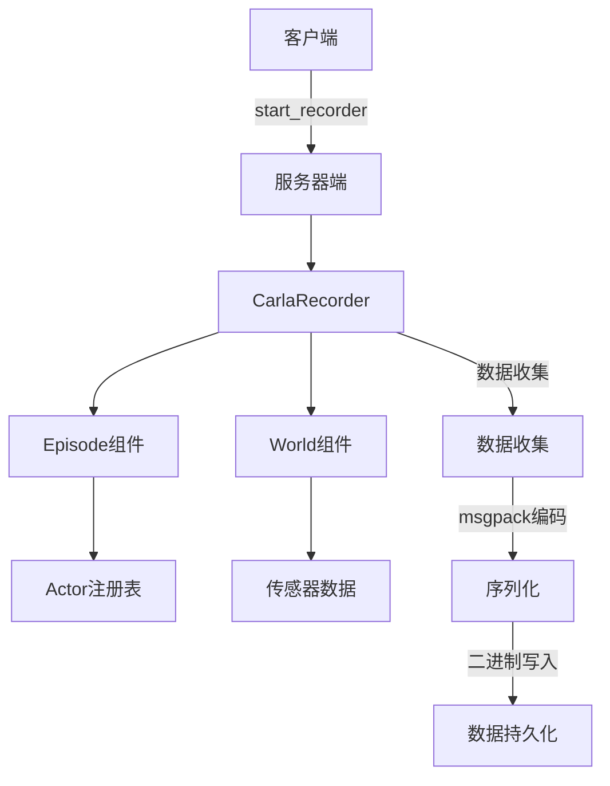
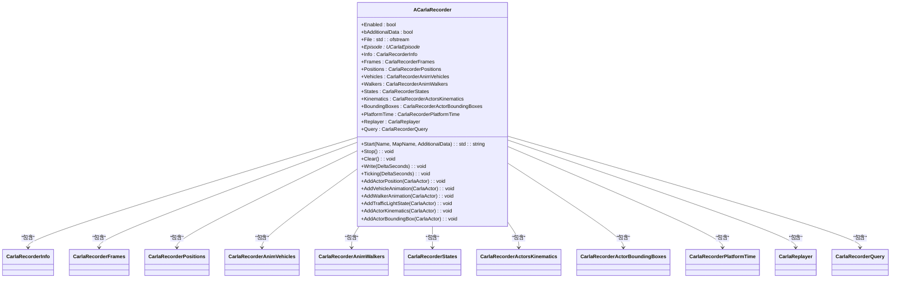
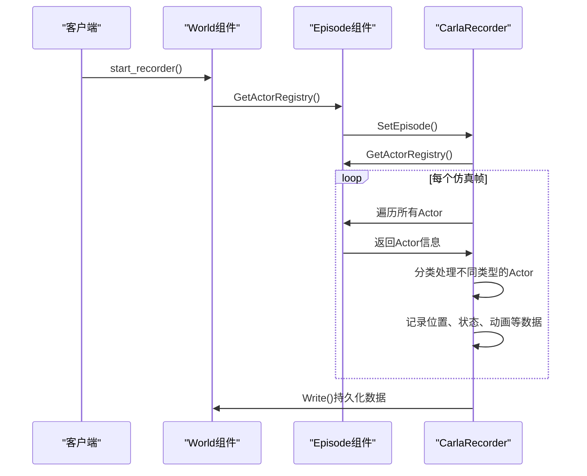
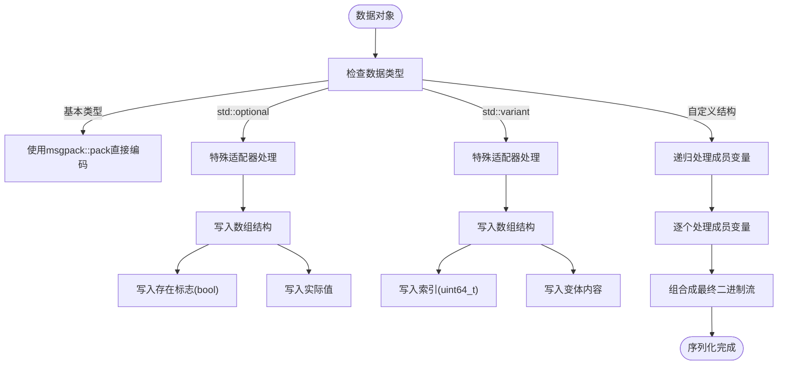
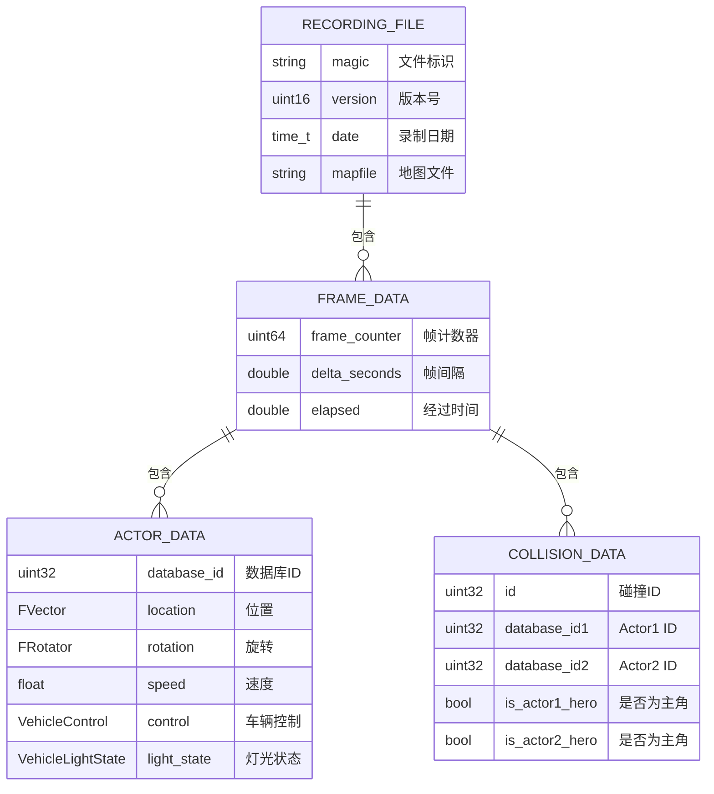
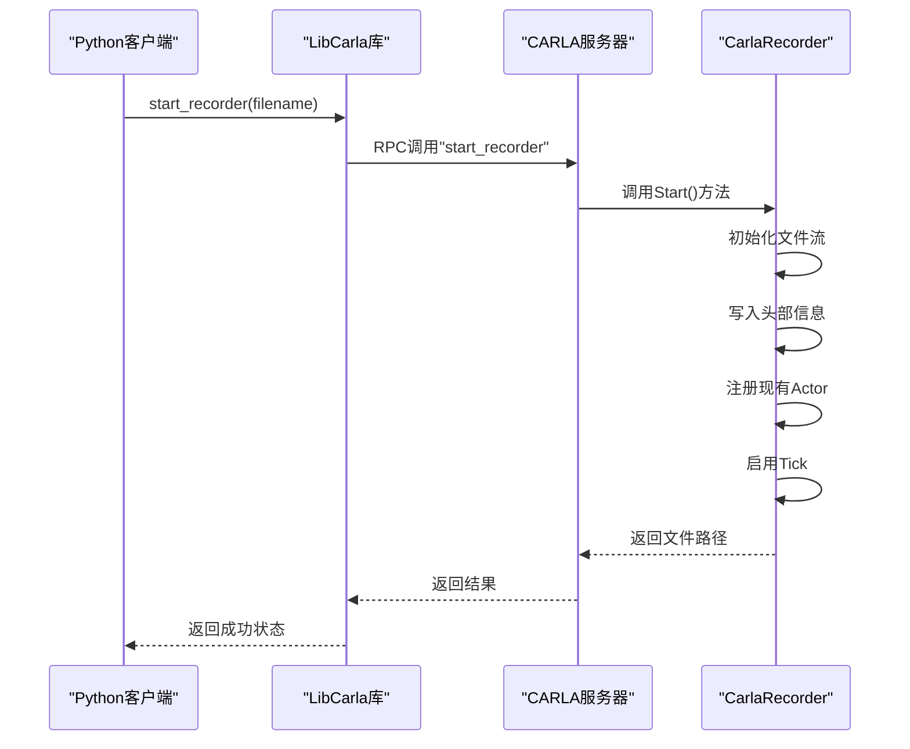
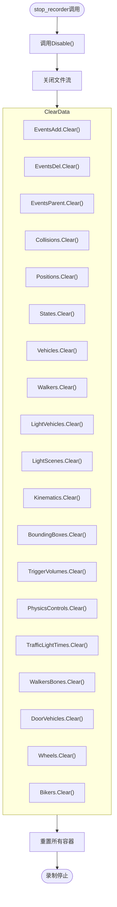
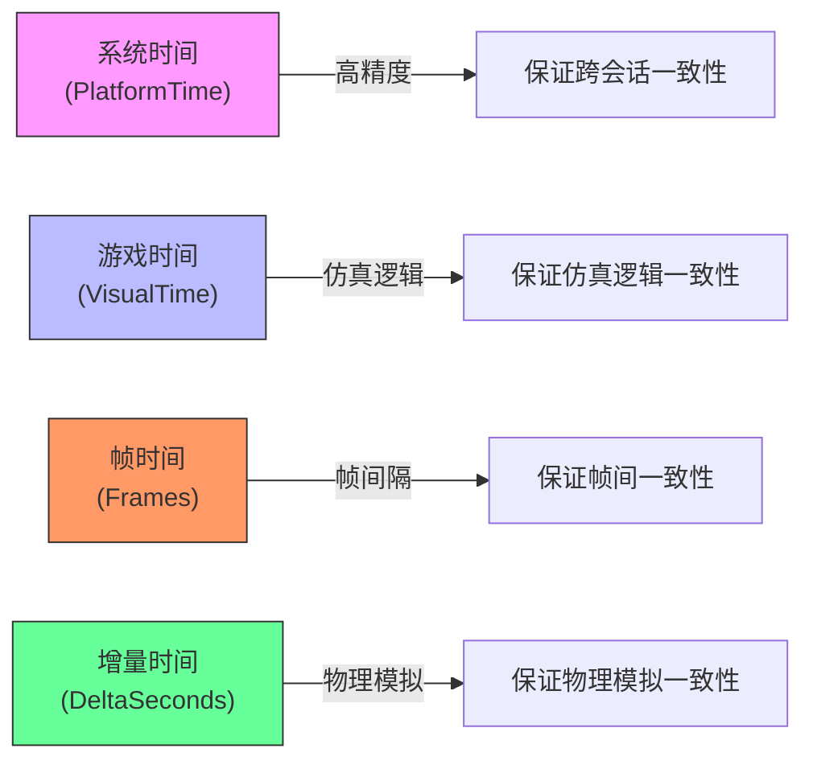
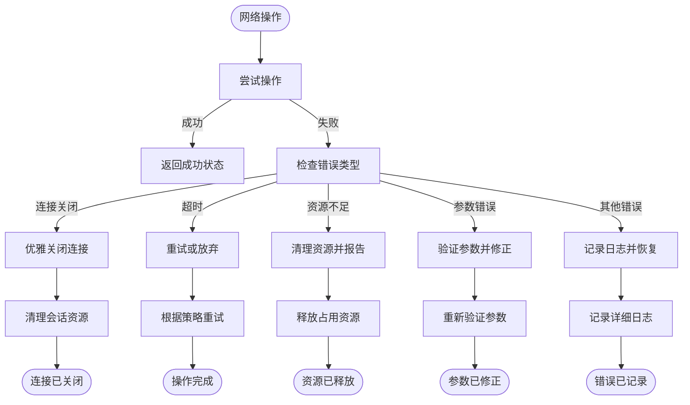
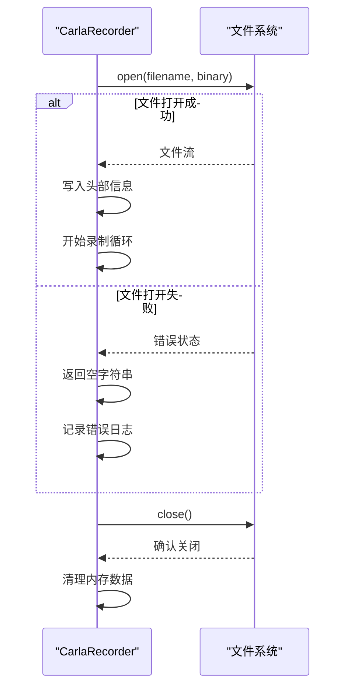

# 录制流程

> **引用文件**
> **本文档中引用的文件**

- [CarlaRecorder.cpp](https://github.com/carla-simulator/carla/blob/ue5-dev/Unreal/CarlaUnreal/Plugins/Carla/Source/Carla/Recorder/CarlaRecorder.cpp)
- [CarlaRecorder.h](https://github.com/carla-simulator/carla/blob/ue5-dev/Unreal/CarlaUnreal/Plugins/Carla/Source/Carla/Recorder/CarlaRecorder.h)
- [CarlaRecorderHelpers.h](https://github.com/carla-simulator/carla/blob/ue5-dev/Unreal/CarlaUnreal/Plugins/Carla/Source/Carla/Recorder/CarlaRecorderHelpers.h)
- [CarlaRecorderInfo.h](https://github.com/carla-simulator/carla/blob/ue5-dev/Unreal/CarlaUnreal/Plugins/Carla/Source/Carla/Recorder/CarlaRecorderInfo.h)
- [CarlaRecorderFrames.h](https://github.com/carla-simulator/carla/blob/ue5-dev/Unreal/CarlaUnreal/Plugins/Carla/Source/Carla/Recorder/CarlaRecorderFrames.h)
- [CarlaRecorderPlatformTime.h](https://github.com/carla-simulator/carla/blob/ue5-dev/Unreal/CarlaUnreal/Plugins/Carla/Source/Carla/Recorder/CarlaRecorderPlatformTime.h)
- [PythonAPI.cpp](https://github.com/carla-simulator/carla/blob/ue5-dev/PythonAPI/carla/src/PythonAPI.cpp)
- [MsgPack.h](https://github.com/carla-simulator/carla/blob/ue5-dev/LibCarla/source/carla/MsgPack.h)
- [MsgPackAdaptors.h](https://github.com/carla-simulator/carla/blob/ue5-dev/LibCarla/source/carla/MsgPackAdaptors.h)
- [World.cpp](https://github.com/carla-simulator/carla/blob/ue5-dev/LibCarla/source/carla/client/World.cpp)
- [Client.h](https://github.com/carla-simulator/carla/blob/ue5-dev/LibCarla/source/carla/client/detail/Client.h)

## 目录

1. [简介](#简介)
2. [录制流程架构](#录制流程架构)
3. [核心组件分析](#核心组件分析)
4. [数据序列化机制](#数据序列化机制)
5. [Python API 实现细节](#python-api实现细节)
6. [时间同步机制](#时间同步机制)
7. [异常处理](#异常处理)
8. [结论](#结论)

## 简介

CARLA 录制系统提供了一套完整的仿真数据记录解决方案，能够捕获仿真过程中的所有关键状态信息。本系统从客户端发起录制请求开始，通过服务器端的 CarlaRecorder 类与 Episode 和 World 组件交互，完整记录仿真状态，最终将数据持久化到二进制文件中。录制的数据包括 Actor 的变换、速度、控制输入和传感器数据等关键信息。

## 录制流程架构



**图示来源**

- <a href="https://github.com/carla-simulator/carla/blob/ue5-dev/Unreal/CarlaUnreal/Plugins/Carla/Source/Carla/Recorder/CarlaRecorder.cpp#L424-L466" target="_blank">CarlaRecorder.cpp</a>
- <a href="https://github.com/carla-simulator/carla/blob/ue5-dev/LibCarla/source/carla/client/World.cpp#L98-L169" target="_blank">World.cpp</a>

## 核心组件分析

### CarlaRecorder 类分析

CarlaRecorder 是 CARLA 录制系统的核心组件，负责管理整个录制过程。该类继承自 AActor，通过 Tick 机制在每个仿真帧中收集数据。



**图示来源**

- <a href="https://github.com/carla-simulator/carla/blob/ue5-dev/Unreal/CarlaUnreal/Plugins/Carla/Source/Carla/Recorder/CarlaRecorder.h#L78-L236" target="_blank">CarlaRecorder.h</a>
- <a href="https://github.com/carla-simulator/carla/blob/ue5-dev/Unreal/CarlaUnreal/Plugins/Carla/Source/Carla/Recorder/CarlaRecorder.cpp#L35-L810" target="_blank">CarlaRecorder.cpp</a>

### Episode 和 World 组件交互

CarlaRecorder 通过 Episode 组件访问 World 状态，获取所有 Actor 的信息并记录其状态变化。



**图示来源**

- <a href="https://github.com/carla-simulator/carla/blob/ue5-dev/Unreal/CarlaUnreal/Plugins/Carla/Source/Carla/Recorder/CarlaRecorder.cpp#L90-L150" target="_blank">CarlaRecorder.cpp</a>
- <a href="https://github.com/carla-simulator/carla/blob/ue5-dev/LibCarla/source/carla/client/World.cpp#L113-L114" target="_blank">World.cpp</a>

## 数据序列化机制

### msgpack 二进制编码

CARLA 使用 msgpack 进行数据序列化，这是一种高效的二进制序列化格式，能够紧凑地编码各种数据类型。



**图示来源**

- <a href="https://github.com/carla-simulator/carla/blob/ue5-dev/LibCarla/source/carla/MsgPack.h#L18-L36" target="_blank">MsgPack.h</a>
- <a href="https://github.com/carla-simulator/carla/blob/ue5-dev/LibCarla/source/carla/MsgPackAdaptors.h#L53-L171" target="_blank">MsgPackAdaptors.h</a>

### 录制文件格式结构

CARLA 录制文件采用自定义的二进制格式，包含头部信息和按帧组织的数据块。



**图示来源**

- <a href="https://github.com/carla-simulator/carla/blob/ue5-dev/Unreal/CarlaUnreal/Plugins/Carla/Source/Carla/Recorder/CarlaRecorderInfo.h#L14-L36" target="_blank">CarlaRecorderInfo.h</a>
- <a href="https://github.com/carla-simulator/carla/blob/ue5-dev/Unreal/CarlaUnreal/Plugins/Carla/Source/Carla/Recorder/CarlaRecorderFrames.h#L12-L42" target="_blank">CarlaRecorderFrames.h</a>
- [CarlaRecorderCollision.h](https://github.com/carla-simulator/carla/blob/ue5-dev/Unreal/CarlaUnreal/Plugins/Carla/Source/Carla/Recorder/CarlaRecorderCollision.h)

## Python API 实现细节

### start_recorder 方法实现

Python API 的 start_recorder 方法通过 RPC 调用与服务器端通信，启动录制过程。



**图示来源**

- <a href="https://github.com/carla-simulator/carla/blob/ue5-dev/PythonAPI/carla/src/PythonAPI.cpp#L31-L57" target="_blank">PythonAPI.cpp</a>
- <a href="https://github.com/carla-simulator/carla/blob/ue5-dev/Unreal/CarlaUnreal/Plugins/Carla/Source/Carla/Recorder/CarlaRecorder.cpp#L424-L466" target="_blank">CarlaRecorder.cpp</a>

### stop_recorder 方法实现

stop_recorder 方法停止录制过程，关闭文件流并清理内存中的数据。



**图示来源**

- <a href="https://github.com/carla-simulator/carla/blob/ue5-dev/Unreal/CarlaUnreal/Plugins/Carla/Source/Carla/Recorder/CarlaRecorder.cpp#L468-L478" target="_blank">CarlaRecorder.cpp</a>
- <a href="https://github.com/carla-simulator/carla/blob/ue5-dev/Unreal/CarlaUnreal/Plugins/Carla/Source/Carla/Recorder/CarlaRecorder.h#L97-L100" target="_blank">CarlaRecorder.h</a>

## 时间同步机制

### 平台时间同步

CarlaRecorder 使用系统时钟来确保录制数据的时间戳一致性。

```mermaid
classDiagram
class CarlaRecorderPlatformTime {
+RecorderStartTime : time_point
+Time : double
+SetStartTime() : void
+UpdateTime() : void
+Read(InFile) : void
+Write(OutFile) : void
}
class CarlaRecorderVisualTime {
+Time : double
+SetTime(GameTime) : void
+Read(InFile) : void
+Write(OutFile) : void
}
class CarlaRecorderFrames {
+Frame : CarlaRecorderFrame
+OffsetPreviousFrame : streampos
+SetFrame(DeltaSeconds) : void
+WriteStart(OutFile) : void
+WriteEnd(OutFile) : void
}
CarlaRecorder --> CarlaRecorderPlatformTime : "包含"
CarlaRecorder --> CarlaRecorderVisualTime : "包含"
CarlaRecorder --> CarlaRecorderFrames : "包含"
CarlaRecorderPlatformTime --> std : : chrono : "使用"
CarlaRecorderVisualTime --> UCarlaEpisode : "获取"
```

**图示来源**

- <a href="https://github.com/carla-simulator/carla/blob/ue5-dev/Unreal/CarlaUnreal/Plugins/Carla/Source/Carla/Recorder/CarlaRecorderPlatformTime.h#L13-L29" target="_blank">CarlaRecorderPlatformTime.h</a>
- <a href="https://github.com/carla-simulator/carla/blob/ue5-dev/Unreal/CarlaUnreal/Plugins/Carla/Source/Carla/Recorder/CarlaRecorderPlatformTime.cpp#L11-L38" target="_blank">CarlaRecorderPlatformTime.cpp</a>
- <a href="https://github.com/carla-simulator/carla/blob/ue5-dev/Unreal/CarlaUnreal/Plugins/Carla/Source/Carla/Recorder/CarlaRecorderFrames.h#L12-L42" target="_blank">CarlaRecorderFrames.h</a>

### 时间戳一致性保证

系统通过多种时间戳确保数据的一致性：



**图示来源**

- <a href="https://github.com/carla-simulator/carla/blob/ue5-dev/Unreal/CarlaUnreal/Plugins/Carla/Source/Carla/Recorder/CarlaRecorder.cpp#L101-L102" target="_blank">CarlaRecorder.cpp</a>
- [CarlaRecorderFrames.cpp](https://github.com/carla-simulator/carla/blob/ue5-dev/Unreal/CarlaUnreal/Plugins/Carla/Source/Carla/Recorder/CarlaRecorderFrames.cpp)

## 异常处理

### 网络通信异常处理

系统在处理网络通信时实现了完善的异常处理机制。



**图示来源**

- <a href="https://github.com/carla-simulator/carla/blob/ue5-dev/LibCarla/source/carla/streaming/detail/tcp/ServerSession.cpp#L78-L119" target="_blank">ServerSession.cpp</a>
- <a href="https://github.com/carla-simulator/carla/blob/ue5-dev/LibCarla/source/carla/multigpu/primary.cpp#L90-L183" target="_blank">primary.cpp</a>

### 文件操作异常处理

录制过程中对文件操作的异常处理确保了数据的完整性。



**图示来源**

- <a href="https://github.com/carla-simulator/carla/blob/ue5-dev/Unreal/CarlaUnreal/Plugins/Carla/Source/Carla/Recorder/CarlaRecorder.cpp#L440-L444" target="_blank">CarlaRecorder.cpp</a>
- <a href="https://github.com/carla-simulator/carla/blob/ue5-dev/Unreal/CarlaUnreal/Plugins/Carla/Source/Carla/Recorder/CarlaRecorder.cpp#L472-L475" target="_blank">CarlaRecorder.cpp</a>

## 结论

CARLA 的录制系统通过精心设计的架构实现了完整的仿真数据记录功能。系统从客户端发起请求开始，通过 CarlaRecorder 类与 Episode 和 World 组件紧密协作，捕获所有 Actor 的状态信息。使用 msgpack 进行高效的二进制序列化，确保了数据的紧凑性和快速读写性能。通过多种时间戳机制保证了数据的时间一致性，同时完善的异常处理机制确保了系统的稳定性和数据的完整性。整个录制流程体现了模块化、高效性和可靠性的设计原则，为自动驾驶仿真研究提供了强大的数据支持能力。
