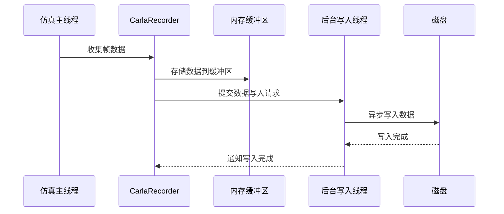

# 性能优化

> **引用文件**
> **本文档引用的文件**

- [CarlaRecorder.cpp](https://github.com/carla-simulator/carla/blob/ue5-dev/Unreal/CarlaUnreal/Plugins/Carla/Source/Carla/Recorder/CarlaRecorder.cpp)
- [CarlaRecorder.h](https://github.com/carla-simulator/carla/blob/ue5-dev/Unreal/CarlaUnreal/Plugins/Carla/Source/Carla/Recorder/CarlaRecorder.h)
- [CarlaRecorderFrames.cpp](https://github.com/carla-simulator/carla/blob/ue5-dev/Unreal/CarlaUnreal/Plugins/Carla/Source/Carla/Recorder/CarlaRecorderFrames.cpp)
- [CarlaRecorderFrames.h](https://github.com/carla-simulator/carla/blob/ue5-dev/Unreal/CarlaUnreal/Plugins/Carla/Source/Carla/Recorder/CarlaRecorderFrames.h)
- [Buffer.h](https://github.com/carla-simulator/carla/blob/ue5-dev/LibCarla/source/carla/Buffer.h)
- [Buffer.cpp](https://github.com/carla-simulator/carla/blob/ue5-dev/LibCarla/source/carla/Buffer.cpp)
- [Client.cpp](https://github.com/carla-simulator/carla/blob/ue5-dev/LibCarla/source/carla/client/detail/Client.cpp)
- [adv_recorder.md](https://github.com/carla-simulator/carla/blob/ue5-dev/Docs/adv_recorder.md)
- [ref_recorder_binary_file_format.md](https://github.com/carla-simulator/carla/blob/ue5-dev/Docs/ref_recorder_binary_file_format.md)

## 目录

1. [引言](#引言)
2. [CARLA 录制性能关键因素](#carla录制性能关键因素)
3. [CarlaRecorder 内部机制](#carlacrecorder内部机制)
4. [缓冲机制与异步写入策略](#缓冲机制与异步写入策略)
5. [流式传输与数据优化](#流式传输与数据优化)
6. [性能调优建议](#性能调优建议)
7. [结论](#结论)

## 引言

CARLA 仿真平台的录制功能是自动驾驶研究和开发中的关键组件，它能够记录仿真过程中的所有事件和状态变化，为后续的回放、分析和调试提供重要支持。然而，高帧率仿真下的大规模数据录制对系统性能提出了严峻挑战，特别是在磁盘 I/O、内存使用和网络带宽方面。本文档深入探讨 CARLA 录制性能优化的各个方面，详细分析影响性能的关键因素，包括磁盘 I/O 瓶颈、内存使用模式和网络带宽消耗。文档将重点介绍 CarlaRecorder 内部的缓冲机制和异步写入策略，这些机制如何减少对仿真主线程的影响。此外，还将详细描述流式传输技术在大规模数据录制中的应用，以及如何通过数据压缩和选择性记录来优化资源使用。最后，提供实际的性能调优建议，包括文件系统选择、存储设备配置和多线程处理策略，以确保在高帧率仿真下的稳定录制。

## CARLA 录制性能关键因素

CARLA 录制性能受到多个关键因素的影响，主要包括磁盘 I/O 瓶颈、内存使用模式和网络带宽消耗。这些因素在高帧率仿真下尤为突出，直接影响录制的稳定性和效率。

### 磁盘 I/O 瓶颈

磁盘 I/O 是 CARLA 录制过程中最常见的性能瓶颈之一。录制功能需要将大量的仿真数据写入磁盘，包括车辆位置、交通灯状态、碰撞事件等。在高帧率仿真下，数据生成速度非常快，如果磁盘写入速度跟不上数据生成速度，就会导致数据积压，进而影响仿真性能。根据文档中的信息，1 小时的录制（包含 50 个交通灯和 100 辆车）大约需要 200MB 的存储空间。虽然这个数据量看似不大，但在高帧率下，每秒生成的数据量仍然相当可观，对磁盘 I/O 提出了较高要求。

### 内存使用模式

内存使用模式也是影响 CARLA 录制性能的重要因素。录制过程中，CarlaRecorder 需要在内存中缓存当前帧的数据，直到该帧的所有数据收集完毕后再写入磁盘。这种缓冲机制可以减少对磁盘的频繁写入，但同时也增加了内存的使用。如果内存使用不当，可能会导致内存溢出或频繁的垃圾回收，影响仿真性能。CarlaRecorder 通过使用`std::ofstream`对象和各种数据结构（如`CarlaRecorderFrames`、`CarlaRecorderPositions`等）来管理内存中的数据，确保数据的高效存储和访问。

### 网络带宽消耗

在网络仿真环境中，录制数据可能需要通过网络传输到远程存储设备或分析服务器。网络带宽的消耗直接影响数据传输的速度和稳定性。如果网络带宽不足，可能会导致数据传输延迟或丢失，影响录制的完整性和准确性。CARLA 的录制功能主要在服务器端进行，客户端通过 API 调用控制录制过程，因此网络带宽主要影响客户端与服务器之间的通信，而不是录制数据本身的传输。

**Section sources**

- <a href="https://github.com/carla-simulator/carla/blob/ue5-dev/Unreal/CarlaUnreal/Plugins/Carla/Source/Carla/Recorder/CarlaRecorder.cpp#L1-L810" target="_blank">CarlaRecorder.cpp</a>
- <a href="https://github.com/carla-simulator/carla/blob/ue5-dev/Unreal/CarlaUnreal/Plugins/Carla/Source/Carla/Recorder/CarlaRecorder.h#L1-L236" target="_blank">CarlaRecorder.h</a>
- <a href="https://github.com/carla-simulator/carla/blob/ue5-dev/Docs/adv_recorder.md#L1-L318" target="_blank">adv_recorder.md</a>

## CarlaRecorder 内部机制

CarlaRecorder 是 CARLA 仿真平台中负责录制功能的核心组件。它通过一系列精心设计的机制，确保仿真过程中的所有事件和状态变化都能被准确记录。CarlaRecorder 的主要功能包括启动和停止录制、记录各种事件（如车辆创建、销毁、碰撞等）、以及管理录制数据的写入。

### 录制流程

CarlaRecorder 的录制流程可以分为以下几个步骤：

1. **启动录制**：当用户调用`start_recorder` API 时，CarlaRecorder 会创建一个二进制文件，并写入录制的通用信息，如版本号、地图名称、录制时间等。这些信息构成了录制文件的头部，为后续的数据解析提供基础。

2. **数据收集**：在每个仿真帧中，CarlaRecorder 会遍历所有注册的演员（actors），收集它们的位置、状态和其他相关信息。这些数据被存储在内存中的各种数据结构中，如`CarlaRecorderPositions`、`CarlaRecorderStates`等。

3. **数据写入**：当一个帧的所有数据收集完毕后，CarlaRecorder 会将这些数据写入磁盘。写入过程是异步的，以减少对仿真主线程的影响。CarlaRecorder 使用`std::ofstream`对象进行文件操作，并通过`WriteStart`和`WriteEnd`方法标记每个帧的开始和结束。

4. **停止录制**：当用户调用`stop_recorder` API 时，CarlaRecorder 会停止数据收集，并关闭文件流。此时，录制文件已经完整，可以用于后续的回放和分析。

### 数据结构

CarlaRecorder 使用多种数据结构来管理录制数据，这些数据结构的设计旨在提高数据的存储效率和访问速度。主要的数据结构包括：

- **CarlaRecorderFrame**：表示一个仿真帧的基本信息，包括帧 ID、持续时间和经过的时间。
- **CarlaRecorderFrames**：管理所有帧的集合，提供帧的添加、删除和写入功能。
- **CarlaRecorderPositions**：存储所有演员在每个帧中的位置和方向。
- **CarlaRecorderStates**：存储所有交通灯在每个帧中的状态。
- **CarlaRecorderCollisions**：记录所有碰撞事件。
- **CarlaRecorderEventsAdd** 和 **CarlaRecorderEventsDel**：分别记录演员的创建和销毁事件。

这些数据结构通过链表或向量等容器进行管理，确保数据的高效存储和访问。

**Section sources**

- <a href="https://github.com/carla-simulator/carla/blob/ue5-dev/Unreal/CarlaUnreal/Plugins/Carla/Source/Carla/Recorder/CarlaRecorder.cpp#L1-L810" target="_blank">CarlaRecorder.cpp</a>
- <a href="https://github.com/carla-simulator/carla/blob/ue5-dev/Unreal/CarlaUnreal/Plugins/Carla/Source/Carla/Recorder/CarlaRecorder.h#L1-L236" target="_blank">CarlaRecorder.h</a>
- <a href="https://github.com/carla-simulator/carla/blob/ue5-dev/Unreal/CarlaUnreal/Plugins/Carla/Source/Carla/Recorder/CarlaRecorderFrames.cpp#L1-L91" target="_blank">CarlaRecorderFrames.cpp</a>
- <a href="https://github.com/carla-simulator/carla/blob/ue5-dev/Unreal/CarlaUnreal/Plugins/Carla/Source/Carla/Recorder/CarlaRecorderFrames.h#L1-L42" target="_blank">CarlaRecorderFrames.h</a>

## 缓冲机制与异步写入策略

CarlaRecorder 通过缓冲机制和异步写入策略，有效减少了对仿真主线程的影响，确保了高帧率仿真下的稳定录制。

### 缓冲机制

CarlaRecorder 在内存中使用缓冲区来暂存每个帧的数据。当一个帧的数据收集完毕后，这些数据会被写入缓冲区，而不是立即写入磁盘。这种缓冲机制有以下几个优点：

1. **减少磁盘 I/O**：通过批量写入数据，减少了对磁盘的频繁访问，提高了写入效率。
2. **提高数据完整性**：缓冲区可以确保一个帧的所有数据都收集完毕后再写入磁盘，避免了数据不完整的问题。
3. **降低主线程负担**：数据写入操作可以在后台线程中进行，不会阻塞仿真主线程。

### 异步写入策略

CarlaRecorder 采用异步写入策略，将数据写入操作从仿真主线程中分离出来。具体实现如下：

1. **数据收集**：在仿真主线程中，CarlaRecorder 收集每个帧的数据，并将其存储在内存中的缓冲区。
2. **数据写入**：当一个帧的数据收集完毕后，CarlaRecorder 将缓冲区中的数据提交给一个后台线程，由后台线程负责将数据写入磁盘。
3. **错误处理**：如果数据写入过程中发生错误，CarlaRecorder 会记录错误信息，并尝试重新写入数据，确保数据的完整性和可靠性。

通过这种异步写入策略，CarlaRecorder 能够在不影响仿真性能的前提下，高效地完成数据录制任务。

**Diagram sources**

- <a href="https://github.com/carla-simulator/carla/blob/ue5-dev/Unreal/CarlaUnreal/Plugins/Carla/Source/Carla/Recorder/CarlaRecorder.cpp#L503-L547" target="_blank">CarlaRecorder.cpp</a>
- <a href="https://github.com/carla-simulator/carla/blob/ue5-dev/Unreal/CarlaUnreal/Plugins/Carla/Source/Carla/Recorder/CarlaRecorder.h#L103-L104" target="_blank">CarlaRecorder.h</a>

## 流式传输与数据优化

流式传输技术在大规模数据录制中发挥着重要作用，通过数据压缩和选择性记录，可以显著优化资源使用，提高录制效率。

### 流式传输

流式传输技术允许数据在生成的同时被传输和处理，而不需要等待所有数据生成完毕。在 CARLA 录制中，流式传输可以用于实时传输录制数据到远程服务器或分析工具，实现数据的实时监控和分析。CarlaRecorder 通过`std::ofstream`对象和异步写入策略，实现了数据的流式传输，确保数据能够及时写入磁盘。

### 数据压缩

数据压缩是优化资源使用的重要手段。通过压缩录制数据，可以显著减少存储空间和网络带宽的消耗。CARLA 录制文件采用二进制格式，本身就具有较高的存储效率。此外，可以通过启用`additional_data`参数，选择性地记录额外信息，如车辆的线速度和角速度、交通灯时间设置等，进一步优化数据量。

### 选择性记录

选择性记录是指根据实际需求，只记录必要的数据，避免记录冗余信息。在 CARLA 录制中，用户可以通过`additional_data`参数控制是否记录额外信息。默认情况下，录制文件只包含回放仿真所需的必要信息，如演员的创建和销毁、位置和状态等。如果需要更详细的信息，可以启用`additional_data`参数，记录更多的数据。

**Section sources**

- <a href="https://github.com/carla-simulator/carla/blob/ue5-dev/Unreal/CarlaUnreal/Plugins/Carla/Source/Carla/Recorder/CarlaRecorder.cpp#L424-L466" target="_blank">CarlaRecorder.cpp</a>
- <a href="https://github.com/carla-simulator/carla/blob/ue5-dev/Docs/adv_recorder.md#L38-L46" target="_blank">adv_recorder.md</a>

## 性能调优建议

为了确保高帧率仿真下的稳定录制，以下是一些性能调优建议：

### 文件系统选择

选择合适的文件系统对录制性能有重要影响。推荐使用高性能的文件系统，如 ext4 或 XFS，这些文件系统在处理大量小文件时表现良好，能够提供较高的 I/O 吞吐量。

### 存储设备配置

使用高速存储设备，如 SSD，可以显著提高磁盘 I/O 性能。SSD 的读写速度远高于传统 HDD，能够更好地应对高帧率仿真下的数据写入需求。

### 多线程处理策略

通过多线程处理策略，可以进一步提高录制性能。可以将数据收集和数据写入操作分配到不同的线程中，充分利用多核处理器的计算能力。此外，可以使用线程池管理后台写入线程，提高线程的复用率，减少线程创建和销毁的开销。

### 网络配置

在网络仿真环境中，优化网络配置可以减少数据传输延迟。建议使用高速网络连接，如 10GbE，确保数据传输的稳定性和速度。此外，可以使用网络压缩技术，减少网络带宽的消耗。

**Section sources**

- <a href="https://github.com/carla-simulator/carla/blob/ue5-dev/Unreal/CarlaUnreal/Plugins/Carla/Source/Carla/Recorder/CarlaRecorder.cpp#L440-L444" target="_blank">CarlaRecorder.cpp</a>
- <a href="https://github.com/carla-simulator/carla/blob/ue5-dev/Docs/adv_recorder.md#L53-L55" target="_blank">adv_recorder.md</a>

## 结论

CARLA 录制功能是自动驾驶研究和开发中的重要工具，通过深入分析其内部机制和性能优化策略，可以显著提高录制的稳定性和效率。本文档详细介绍了 CARLA 录制性能的关键因素，包括磁盘 I/O 瓶颈、内存使用模式和网络带宽消耗。文档重点分析了 CarlaRecorder 内部的缓冲机制和异步写入策略，这些机制如何减少对仿真主线程的影响。此外，还详细描述了流式传输技术在大规模数据录制中的应用，以及如何通过数据压缩和选择性记录来优化资源使用。最后，提供了实际的性能调优建议，包括文件系统选择、存储设备配置和多线程处理策略，以确保在高帧率仿真下的稳定录制。通过这些优化措施，可以充分发挥 CARLA 录制功能的潜力，为自动驾驶研究和开发提供有力支持。
