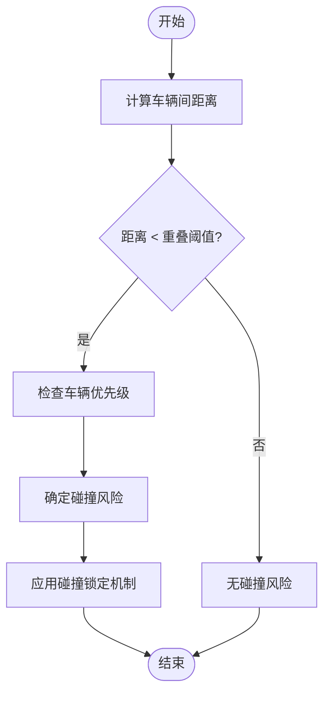
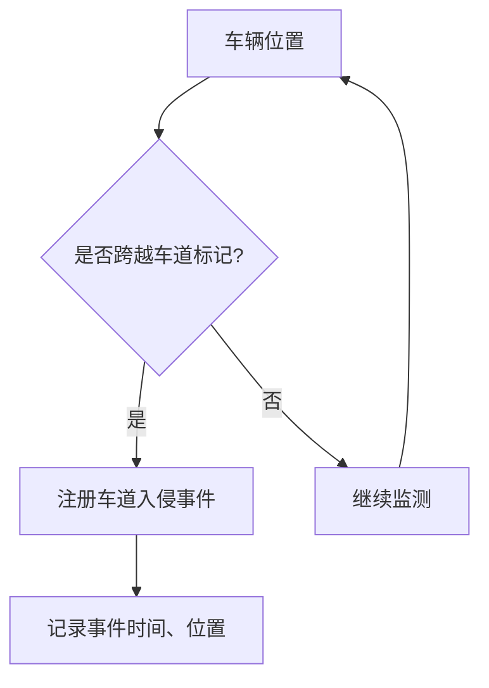

# 分析方法

> **引用文件**
> **本文档引用的文件**

- [recorder_comparer.py](https://github.com/carla-simulator/carla/blob/ue5-dev/PythonAPI/util/recorder_comparer.py)
- [show_recorder_file_info.py](https://github.com/carla-simulator/carla/blob/ue5-dev/PythonAPI/util/show_recorder_file_info.py)
- [recorder_replay.py](https://github.com/carla-simulator/carla/blob/ue5-dev/PythonAPI/examples/recorder_replay.py)
- [SensorData.cpp](https://github.com/carla-simulator/carla/blob/ue5-dev/PythonAPI/carla/src/SensorData.cpp)
- [start_replaying.py](https://github.com/carla-simulator/carla/blob/ue5-dev/PythonAPI/util/start_replaying.py)
- [CollisionStage.cpp](https://github.com/carla-simulator/carla/blob/ue5-dev/LibCarla/source/carla/trafficmanager/CollisionStage.cpp)
- [MotionPlanStage.cpp](https://github.com/carla-simulator/carla/blob/ue5-dev/LibCarla/source/carla/trafficmanager/MotionPlanStage.cpp)
- [RssCheck.cpp](https://github.com/carla-simulator/carla/blob/ue5-dev/LibCarla/source/carla/rss/RssCheck.cpp)
- [interpolate_camera.py](https://github.com/carla-simulator/carla/blob/ue5-dev/PythonAPI/examples/interpolate_camera.py)

## 目录

1. [引言](#引言)
2. [数据提取与预处理](#数据提取与预处理)
3. [轨迹分析](#轨迹分析)
4. [速度与加速度计算](#速度与加速度计算)
5. [碰撞检测算法](#碰撞检测算法)
6. [交通规则遵守评估](#交通规则遵守评估)
7. [基于 pandas 的数据处理实例](#基于pandas的数据处理实例)
8. [自定义分析逻辑实现](#自定义分析逻辑实现)
9. [大数据集批处理与内存优化](#大数据集批处理与内存优化)
10. [结论](#结论)

## 引言

CARLA 模拟器提供了强大的记录和回放功能，允许用户对自动驾驶场景进行全面的分析。本文档详细阐述了如何对 CARLA 记录的数据进行定量分析，包括轨迹平滑、速度加速度计算、碰撞检测算法和交通规则遵守评估。文档还提供了使用 pandas 进行数据处理的实例，展示了如何计算平均速度、加速度变化率和路径偏差等统计指标。此外，文档解释了如何实现自定义分析逻辑，如交通冲突预测、驾驶行为分类和传感器融合验证，并涵盖了大数据集的批处理技术和内存优化策略，以确保分析效率。

## 数据提取与预处理

CARLA 记录的数据可以通过多种工具进行提取和预处理。`show_recorder_file_info.py`工具可以显示记录文件的详细信息，包括创建、销毁、移动和碰撞事件。该工具通过`client.show_recorder_file_info()`方法获取记录文件信息，并可以选择性地保存到文件中。`recorder_comparer.py`工具可以比较两个记录文件的差异，忽略基于 ID 的行，如父级关系、碰撞和销毁事件，以及真实时间信息，从而专注于确定性差异。

对于数据预处理，CARLA 提供了多种传感器数据处理方法。图像数据可以通过`ConvertImage`函数进行颜色转换，支持原始、深度、对数深度和 CityScapes 调色板等转换模式。点云数据可以通过`SavePointCloudToDisk`函数保存到磁盘。光学流图像可以通过`ColorCodedFlow`函数转换为彩色编码的 RGB 图像，便于可视化分析。

**Section sources**

- <a href="https://github.com/carla-simulator/carla/blob/ue5-dev/PythonAPI/util/show_recorder_file_info.py#L1-L60" target="_blank">show_recorder_file_info.py</a>
- <a href="https://github.com/carla-simulator/carla/blob/ue5-dev/PythonAPI/util/recorder_comparer.py#L1-L134" target="_blank">recorder_comparer.py</a>
- <a href="https://github.com/carla-simulator/carla/blob/ue5-dev/PythonAPI/carla/src/SensorData.cpp#L1-L558" target="_blank">SensorData.cpp</a>

## 轨迹分析

轨迹分析是评估自动驾驶车辆行为的关键。CARLA 提供了多种方法来分析和处理轨迹数据。`interpolate_camera.py`示例展示了如何对相机轨迹进行插值，通过离散化时间和使用插值函数生成平滑的轨迹。该方法可以应用于车辆轨迹，以获得更精确的运动分析。

轨迹平滑可以通过多种算法实现，如三次样条插值或卡尔曼滤波。在 CARLA 中，可以通过对记录的位置数据应用这些算法来实现轨迹平滑。例如，使用`CubicPolynomial`类可以对轨迹进行多项式拟合，从而获得平滑的路径。此外，可以通过计算路径偏差来评估轨迹的稳定性，路径偏差可以通过比较实际轨迹与理想轨迹之间的距离来计算。

**Section sources**

- <a href="https://github.com/carla-simulator/carla/blob/ue5-dev/PythonAPI/examples/interpolate_camera.py#L75-L104" target="_blank">interpolate_camera.py</a>
- <a href="https://github.com/carla-simulator/carla/blob/ue5-dev/LibCarla/source/carla/geom/CubicPolynomial.h#L1-L166" target="_blank">CubicPolynomial.h</a>

## 速度与加速度计算

速度和加速度是评估车辆动态行为的重要指标。CARLA 记录的数据包含车辆的速度和加速度信息，可以通过`RssCheck.cpp`中的代码逻辑进行计算。横向和纵向加速度的计算基于车辆的速度变化和时间间隔。具体来说，横向加速度`route_accel_lat`和纵向加速度`route_accel_lon`通过以下公式计算：

```
route_accel_lat = (route_speed_lat - last_route_speed_lat) / delta_time
route_accel_lon = (route_speed_lon - last_route_speed_lon) / delta_time
```

其中，`route_speed_lat`和`route_speed_lon`分别是横向和纵向速度，`delta_time`是时间间隔。为了防止数值下溢，当平均加速度为零时，会将其设置为零。此外，可以通过计算加速度变化率来评估驾驶的平稳性，加速度变化率可以通过对加速度数据进行差分计算得到。

**Section sources**

- <a href="https://github.com/carla-simulator/carla/blob/ue5-dev/LibCarla/source/carla/rss/RssCheck.cpp#L656-L669" target="_blank">RssCheck.cpp</a>

## 碰撞检测算法

CARLA 的碰撞检测算法在`CollisionStage.cpp`中实现，通过几何比较来检测潜在的碰撞。算法首先计算车辆之间的地理距离和边界框距离，然后根据这些距离判断是否存在碰撞风险。具体来说，如果地理路径和边界框之间的距离小于重叠阈值，并且满足预碰撞或后碰撞条件，则认为存在碰撞风险。

碰撞检测算法还考虑了车辆的优先级，通过比较车辆路径到对方车辆的距离来确定优先级。优先级较低的车辆需要让行。此外，算法还实现了碰撞锁定机制，确保在接近前车时边界框扩展不会过快减少，从而保持碰撞跟踪。



**Diagram sources **

- <a href="https://github.com/carla-simulator/carla/blob/ue5-dev/LibCarla/source/carla/trafficmanager/CollisionStage.cpp#L359-L375" target="_blank">CollisionStage.cpp</a>

**Section sources**

- <a href="https://github.com/carla-simulator/carla/blob/ue5-dev/LibCarla/source/carla/trafficmanager/CollisionStage.cpp#L359-L385" target="_blank">CollisionStage.cpp</a>

## 交通规则遵守评估

交通规则遵守评估包括对交通信号灯、限速标志和车道入侵的检测。CARLA 通过`TrafficLightManager.cpp`和`SpeedLimitComponent.h`等文件实现交通规则的模拟和检测。交通信号灯的状态可以通过`MatchSignalAndActor`函数与实际交通标志进行匹配，确保模拟的准确性。

限速标志的检测通过`USpeedLimitComponent`类实现，该类在车辆进入限速区域时触发重叠事件，并设置相应的速度限制。车道入侵检测通过`LaneInvasionSensor.cpp`实现，该传感器在车辆跨越车道标记时注册事件。检测基于 OpenDRIVE 地图数据，考虑车辆四个车轮之间的空间来确定是否入侵其他车道。



**Diagram sources **

- <a href="https://github.com/carla-simulator/carla/blob/ue5-dev/Unreal/CarlaUnreal/Plugins/Carla/Source/Carla/Traffic/TrafficLightManager.cpp#L411-L487" target="_blank">TrafficLightManager.cpp</a>
- <a href="https://github.com/carla-simulator/carla/blob/ue5-dev/Unreal/CarlaUnreal/Plugins/Carla/Source/Carla/Traffic/SpeedLimitComponent.h#L1-L43" target="_blank">SpeedLimitComponent.h</a>
- <a href="https://github.com/carla-simulator/carla/blob/ue5-dev/LibCarla/source/carla/client/LaneInvasionSensor.cpp#L40-L91" target="_blank">LaneInvasionSensor.cpp</a>

**Section sources**

- <a href="https://github.com/carla-simulator/carla/blob/ue5-dev/Unreal/CarlaUnreal/Plugins/Carla/Source/Carla/Traffic/TrafficLightManager.cpp#L411-L487" target="_blank">TrafficLightManager.cpp</a>
- <a href="https://github.com/carla-simulator/carla/blob/ue5-dev/Unreal/CarlaUnreal/Plugins/Carla/Source/Carla/Traffic/SpeedLimitComponent.h#L1-L43" target="_blank">SpeedLimitComponent.h</a>
- <a href="https://github.com/carla-simulator/carla/blob/ue5-dev/LibCarla/source/carla/client/LaneInvasionSensor.cpp#L40-L91" target="_blank">LaneInvasionSensor.cpp</a>

## 基于 pandas 的数据处理实例

使用 pandas 进行数据处理可以高效地计算各种统计指标。以下是一个示例，展示如何从 CARLA 记录数据中提取速度和加速度信息，并计算平均速度、加速度变化率和路径偏差。

```python
import pandas as pd
import numpy as np

# 假设从CARLA记录中提取的数据已存储在DataFrame中
data = pd.read_csv('carla_record.csv')

# 计算平均速度
average_speed = data['speed'].mean()

# 计算加速度变化率
data['acceleration'] = np.gradient(data['speed'], data['time'])
data['jerk'] = np.gradient(data['acceleration'], data['time'])
acceleration_change_rate = data['jerk'].mean()

# 计算路径偏差
# 假设ideal_path是理想路径的坐标数组
ideal_path = np.array([[x1, y1], [x2, y2], ...])
actual_path = data[['x', 'y']].values
path_deviation = np.mean(np.sqrt(np.sum((actual_path - ideal_path)**2, axis=1)))

print(f"平均速度: {average_speed} m/s")
print(f"加速度变化率: {acceleration_change_rate} m/s³")
print(f"路径偏差: {path_deviation} m")
```

**Section sources**

- <a href="https://github.com/carla-simulator/carla/blob/ue5-dev/PythonAPI/examples/recorder_replay.py#L1-L164" target="_blank">recorder_replay.py</a>

## 自定义分析逻辑实现

自定义分析逻辑可以扩展 CARLA 的分析能力，实现更复杂的评估。例如，交通冲突预测可以通过分析车辆之间的相对位置和速度来实现。驾驶行为分类可以通过机器学习算法对驾驶数据进行分类，识别不同的驾驶风格。传感器融合验证可以通过比较不同传感器的数据一致性来评估传感器的可靠性。

实现自定义分析逻辑的关键是利用 CARLA 提供的 API 获取详细的传感器数据和车辆状态。例如，通过订阅多个传感器的数据流，可以实现多传感器数据的同步和融合。通过分析这些数据，可以构建复杂的分析模型，如基于深度学习的驾驶行为识别模型。

**Section sources**

- <a href="https://github.com/carla-simulator/carla/blob/ue5-dev/PythonAPI/util/start_replaying.py#L1-L79" target="_blank">start_replaying.py</a>

## 大数据集批处理与内存优化

处理大数据集时，批处理和内存优化是确保分析效率的关键。CARLA 提供了`Import.py`工具，通过分批导入地图瓦片来防止内存溢出。类似地，在分析大数据集时，可以将数据分批处理，每批处理完成后释放内存。

内存优化策略包括使用生成器而不是列表来处理数据，避免一次性加载大量数据到内存中。此外，可以使用 pandas 的`chunksize`参数逐块读取 CSV 文件，从而减少内存占用。对于大规模数据分析，可以考虑使用 Dask 等分布式计算框架，将计算任务分布到多个节点上。

**Section sources**

- <a href="https://github.com/carla-simulator/carla/blob/ue5-dev/Util/Tools/Import.py#L340-L366" target="_blank">Import.py</a>

## 结论

CARLA 模拟器提供了丰富的工具和 API，支持对自动驾驶场景的全面分析。通过合理利用这些工具，可以实现轨迹平滑、速度加速度计算、碰撞检测和交通规则遵守评估。使用 pandas 进行数据处理可以高效地计算各种统计指标，而自定义分析逻辑的实现可以扩展分析的深度和广度。对于大数据集，批处理和内存优化策略是确保分析效率的关键。未来的工作可以进一步探索机器学习和深度学习在自动驾驶分析中的应用，以实现更智能和自动化的评估。
