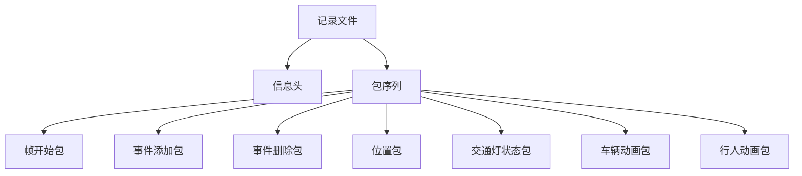
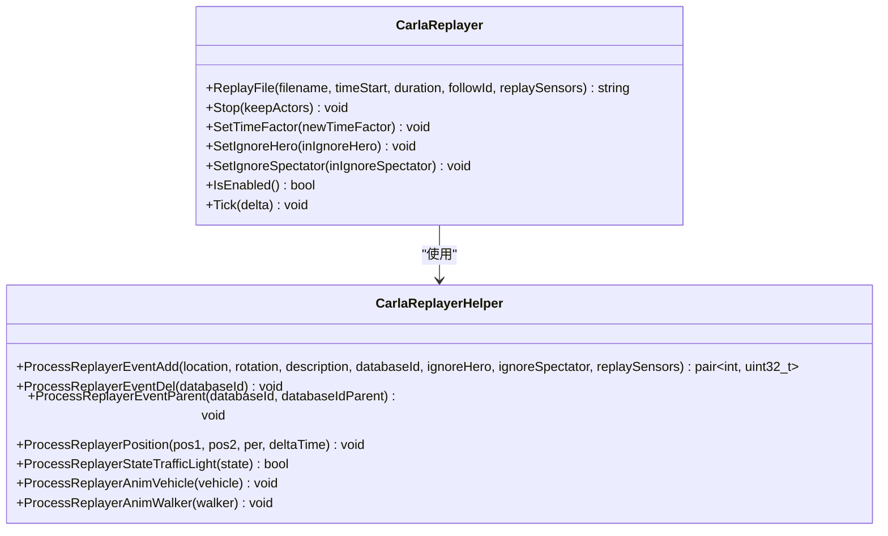
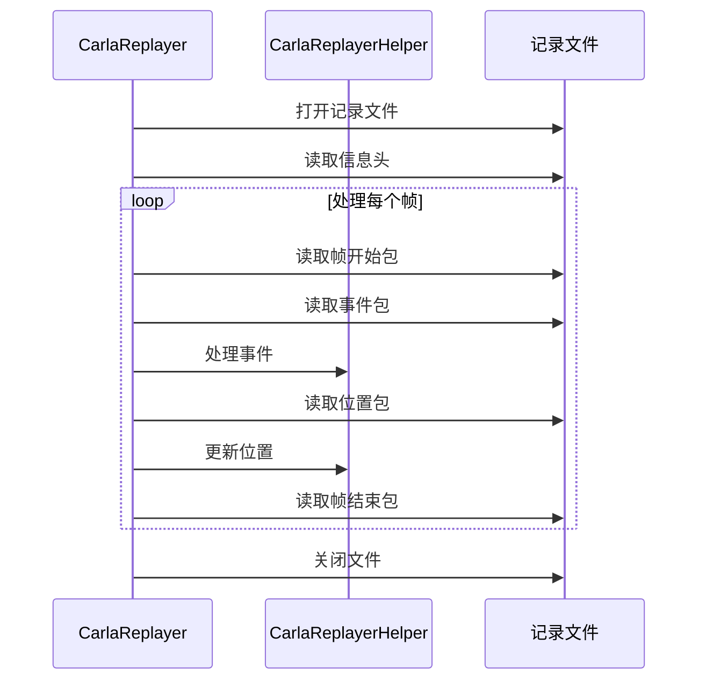
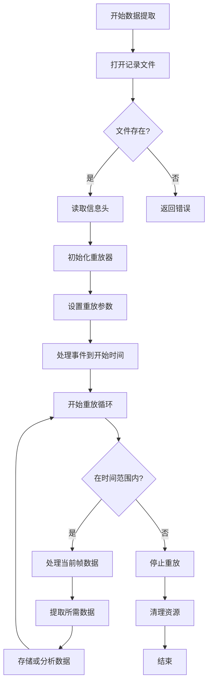

# 数据提取

> **引用文件**
> **本文档引用的文件**

- [CarlaReplayer.h](https://github.com/carla-simulator/carla/blob/ue5-dev/Unreal/CarlaUnreal/Plugins/Carla/Source/Carla/Recorder/CarlaReplayer.h)
- [CarlaReplayer.cpp](https://github.com/carla-simulator/carla/blob/ue5-dev/Unreal/CarlaUnreal/Plugins/Carla/Source/Carla/Recorder/CarlaReplayer.cpp)
- [ref_recorder_binary_file_format.md](https://github.com/carla-simulator/carla/blob/ue5-dev/Docs/ref_recorder_binary_file_format.md)
- [recorder_replay.py](https://github.com/carla-simulator/carla/blob/ue5-dev/PythonAPI/examples/recorder_replay.py)
- [show_recorder_file_info.py](https://github.com/carla-simulator/carla/blob/ue5-dev/PythonAPI/util/show_recorder_file_info.py)
- [start_replaying.py](https://github.com/carla-simulator/carla/blob/ue5-dev/PythonAPI/util/start_replaying.py)

## 目录

1. [简介](#简介)
2. [CARLA 记录文件格式](#carla记录文件格式)
3. [CarlaReplayer 类详解](#carlareplayer类详解)
4. [数据提取核心 API](#数据提取核心api)
5. [数据结构与时间同步](#数据结构与时间同步)
6. [增量加载与内存管理](#增量加载与内存管理)
7. [数据过滤与查询](#数据过滤与查询)
8. [关键数据点访问](#关键数据点访问)
9. [错误处理与数据完整性](#错误处理与数据完整性)
10. [Python API 使用示例](#python-api使用示例)

## 简介

CARLA 模拟器提供了强大的记录和重放功能，允许用户将整个模拟过程保存到二进制文件中，并在后续进行回放和数据分析。本文档详细介绍了如何使用 CarlaReplayer 类和相关 API 从二进制记录文件中提取原始数据，包括 Actor 状态、传感器数据和环境事件。文档涵盖了数据结构、时间戳同步机制、增量加载技术以及错误处理策略，为用户提供完整的数据提取解决方案。

**本节不分析具体源文件**

## CARLA 记录文件格式

CARLA 记录文件采用自定义的二进制格式，使用小端字节序存储多字节值。文件格式包含一个信息头和一系列不同类型的包(packet)，每个包都有特定的 ID 和大小，允许重放器选择性地处理感兴趣的包。

### 字符串编码

字符串在二进制中首先存储其长度，然后是字符数据，不包含空字符结尾。例如，字符串'Town06'将被保存为十六进制值：06 00 54 6f 77 6e 30 36。

### 信息头

信息头包含记录文件的一般信息，包括版本号、用于标识记录文件的魔术字符串、从 1900 年纪元开始的日期时间戳，以及用于记录的地图名称。

### 包结构

每个包以 5 字节的头部开始，包含：

- **id**: 包类型
- **size**: 包数据大小

头部后跟随可选的数据部分。如果大小为 0，则表示包没有数据；如果大小大于 0，则表示包包含相应字节的数据。



**Diagram sources**

- [ref_recorder_binary_file_format.md](https://github.com/carla-simulator/carla/blob/ue5-dev/Docs/ref_recorder_binary_file_format.md#3-packets)

## CarlaReplayer 类详解

CarlaReplayer 类是 CARLA 记录文件重放的核心组件，负责读取二进制记录文件并重建模拟状态。该类提供了控制重放过程的各种方法，包括开始、停止、暂停和设置重放速度。

### 主要功能

CarlaReplayer 类的主要功能包括：

- 读取和解析记录文件
- 重建模拟中的 Actor
- 更新 Actor 的位置和状态
- 处理碰撞和事件
- 控制重放速度和时间

### 核心方法

CarlaReplayer 类提供了以下核心方法：

- `ReplayFile`: 开始重放指定的记录文件
- `Stop`: 停止重放过程
- `SetTimeFactor`: 设置重放速度因子
- `SetIgnoreHero`: 设置是否忽略英雄车辆
- `SetIgnoreSpectator`: 设置是否忽略观察者摄像机



**Diagram sources**

- <a href="https://github.com/carla-simulator/carla/blob/ue5-dev/Unreal/CarlaUnreal/Plugins/Carla/Source/Carla/Recorder/CarlaReplayer.h#L55-L68" target="_blank">CarlaReplayer.h</a>
- <a href="https://github.com/carla-simulator/carla/blob/ue5-dev/Unreal/CarlaUnreal/Plugins/Carla/Source/Carla/Recorder/CarlaReplayer.cpp#L106-L135" target="_blank">CarlaReplayer.cpp</a>

**Section sources**

- <a href="https://github.com/carla-simulator/carla/blob/ue5-dev/Unreal/CarlaUnreal/Plugins/Carla/Source/Carla/Recorder/CarlaReplayer.h#L27-L170" target="_blank">CarlaReplayer.h</a>
- <a href="https://github.com/carla-simulator/carla/blob/ue5-dev/Unreal/CarlaUnreal/Plugins/Carla/Source/Carla/Recorder/CarlaReplayer.cpp#L1-L824" target="_blank">CarlaReplayer.cpp</a>

## 数据提取核心 API

CARLA 提供了丰富的 API 用于从记录文件中提取数据。这些 API 允许用户按时间范围、Actor 类型或特定事件过滤数据，从而实现精确的数据分析。

### 重放文件 API

`ReplayFile`方法是数据提取的入口点，它接受以下参数：

- `filename`: 要重放的记录文件名
- `timeStart`: 重放开始时间（秒）
- `duration`: 重放持续时间（秒）
- `followId`: 要跟随的 Actor ID
- `replaySensors`: 是否重放传感器

该方法返回一个包含重放信息的字符串，包括文件路径、总记录时间、重放时间范围等。

### 时间控制 API

CARLA 提供了多种时间控制 API，允许用户精确控制重放过程：

- `SetTimeFactor`: 设置重放速度因子，允许加速或减速重放
- `GetTotalTime`: 获取记录文件的总时间
- `ProcessToTime`: 处理到指定时间点的所有事件

### 事件处理 API

CarlaReplayerHelper 类提供了多个事件处理方法，用于处理不同类型的记录事件：

- `ProcessReplayerEventAdd`: 处理 Actor 创建事件
- `ProcessReplayerEventDel`: 处理 Actor 销毁事件
- `ProcessReplayerEventParent`: 处理 Actor 父子关系事件
- `ProcessReplayerPosition`: 处理 Actor 位置更新事件

**Section sources**

- <a href="https://github.com/carla-simulator/carla/blob/ue5-dev/Unreal/CarlaUnreal/Plugins/Carla/Source/Carla/Recorder/CarlaReplayer.h#L55-L57" target="_blank">CarlaReplayer.h</a>
- <a href="https://github.com/carla-simulator/carla/blob/ue5-dev/Unreal/CarlaUnreal/Plugins/Carla/Source/Carla/Recorder/CarlaReplayer.cpp#L106-L135" target="_blank">CarlaReplayer.cpp</a>

## 数据结构与时间同步

CARLA 记录文件中的数据结构设计精巧，确保了多传感器数据的时间一致性。理解这些数据结构对于正确提取和分析数据至关重要。

### 帧结构

帧结构(CarlaRecorderFrame)包含以下字段：

- `Id`: 帧 ID
- `DurationThis`: 当前帧的持续时间
- `Elapsed`: 从模拟开始到当前帧开始的经过时间

这些字段共同定义了模拟的时间线，确保所有数据在正确的时间点被处理。

### 位置数据

位置包(CarlaRecorderPosition)记录了场景中所有车辆和行人的位置和方向。每个位置记录包含：

- `DatabaseId`: Actor 的数据库 ID
- `Transform`: Actor 的变换（位置和旋转）
- `Velocity`: Actor 的速度
- `AngularVelocity`: Actor 的角速度

### 时间同步机制

CARLA 使用固定的时间步长来确保模拟的确定性。在记录过程中，每个帧的持续时间被精确记录，重放时使用相同的时间步长来重建模拟状态。这种机制确保了多传感器数据的时间一致性，即使在不同的硬件上重放也能获得相同的结果。



**Diagram sources**

- <a href="https://github.com/carla-simulator/carla/blob/ue5-dev/Unreal/CarlaUnreal/Plugins/Carla/Source/Carla/Recorder/CarlaReplayer.cpp#L263-L435" target="_blank">CarlaReplayer.cpp</a>
- <a href="https://github.com/carla-simulator/carla/blob/ue5-dev/Unreal/CarlaUnreal/Plugins/Carla/Source/Carla/Recorder/CarlaRecorderFrames.cpp#L52-L91" target="_blank">CarlaRecorderFrames.cpp</a>

## 增量加载与内存管理

处理大型记录文件时，内存管理至关重要。CARLA 的重放系统采用增量加载技术，避免内存溢出问题。

### 流式处理

CarlaReplayer 类采用流式处理方式读取记录文件，而不是一次性将整个文件加载到内存中。这种方法的主要优势包括：

- 降低内存使用
- 支持处理任意大小的记录文件
- 允许在处理过程中进行实时分析

### 内存优化策略

CARLA 重放系统实现了多种内存优化策略：

- 只在需要时加载数据
- 及时释放不再需要的数据
- 使用高效的容器存储映射关系

### 处理大型文件

对于大型记录文件，建议采用以下策略：

- 分段处理：将大文件分成多个时间段处理
- 按需加载：只加载感兴趣的数据类型
- 增量分析：在处理过程中逐步分析数据，而不是等待整个文件处理完成

**Section sources**

- <a href="https://github.com/carla-simulator/carla/blob/ue5-dev/Unreal/CarlaUnreal/Plugins/Carla/Source/Carla/Recorder/CarlaReplayer.cpp#L263-L435" target="_blank">CarlaReplayer.cpp</a>
- <a href="https://github.com/carla-simulator/carla/blob/ue5-dev/Unreal/CarlaUnreal/Plugins/Carla/Source/Carla/Recorder/CarlaReplayer.h#L141-L142" target="_blank">CarlaReplayer.h</a>

## 数据过滤与查询

CARLA 提供了强大的数据过滤和查询功能，允许用户根据特定条件提取数据。

### 按时间范围过滤

用户可以指定开始时间和持续时间来过滤数据，只处理感兴趣的时间段。这在分析特定事件或场景时非常有用。

### 按 Actor 类型过滤

通过设置`IgnoreHero`和`IgnoreSpectator`标志，用户可以选择忽略特定类型的 Actor，如英雄车辆或观察者摄像机。这有助于专注于特定的 Actor 或场景元素。

### 按特定事件过滤

CARLA 记录文件包含多种事件类型，包括：

- Actor 创建和销毁
- Actor 父子关系变化
- 碰撞事件
- 交通灯状态变化

用户可以根据这些事件类型进行过滤，提取特定类型的事件数据。

### 自定义过滤

通过继承和扩展 CarlaReplayerHelper 类，用户可以实现自定义的过滤逻辑，满足特定的分析需求。

**Section sources**

- <a href="https://github.com/carla-simulator/carla/blob/ue5-dev/Unreal/CarlaUnreal/Plugins/Carla/Source/Carla/Recorder/CarlaReplayer.cpp#L106-L135" target="_blank">CarlaReplayer.cpp</a>
- <a href="https://github.com/carla-simulator/carla/blob/ue5-dev/Unreal/CarlaUnreal/Plugins/Carla/Source/Carla/Recorder/CarlaReplayer.h#L83-L93" target="_blank">CarlaReplayer.h</a>

## 关键数据点访问

CARLA 记录文件包含丰富的关键数据点，包括车辆控制命令、物理状态和碰撞事件等。

### 车辆控制命令

车辆动画包(CarlaRecorderAnimVehicle)记录了车辆的控制输入，包括：

- 油门
- 转向
- 刹车
- 手刹
- 挡位

这些数据对于分析驾驶行为和车辆动力学非常有价值。

### 物理状态

位置包和物理控制包记录了 Actor 的物理状态，包括：

- 位置和方向
- 速度和角速度
- 加速度
- 物理控制参数

### 碰撞事件

碰撞包(CarlaRecorderCollision)记录了 Actor 之间的碰撞事件，包括：

- 碰撞双方的 ID
- 碰撞位置
- 碰撞法线
- 碰撞冲击力

这些数据对于分析安全性和碰撞场景至关重要。



**Diagram sources**

- <a href="https://github.com/carla-simulator/carla/blob/ue5-dev/Unreal/CarlaUnreal/Plugins/Carla/Source/Carla/Recorder/CarlaReplayer.cpp#L106-L135" target="_blank">CarlaReplayer.cpp</a>
- <a href="https://github.com/carla-simulator/carla/blob/ue5-dev/Unreal/CarlaUnreal/Plugins/Carla/Source/Carla/Recorder/CarlaReplayer.h#L55-L68" target="_blank">CarlaReplayer.h</a>

## 错误处理与数据完整性

稳健的错误处理和数据完整性验证是确保数据提取过程可靠的关键。

### 错误处理策略

CARLA 重放系统实现了多种错误处理策略：

- 文件不存在检查
- 文件格式验证
- 数据完整性检查
- 异常安全的资源管理

### 数据完整性验证

为了确保提取的数据完整和准确，建议采取以下措施：

- 验证记录文件的版本兼容性
- 检查关键数据包的存在
- 验证时间序列的连续性
- 检查 Actor ID 映射的正确性

### 异常恢复

在处理大型记录文件时，可能会遇到各种异常情况。CARLA 重放系统设计为尽可能从异常中恢复，例如：

- 跳过损坏的数据包
- 继续处理后续数据
- 提供详细的错误信息

**Section sources**

- <a href="https://github.com/carla-simulator/carla/blob/ue5-dev/Unreal/CarlaUnreal/Plugins/Carla/Source/Carla/Recorder/CarlaReplayer.cpp#L124-L129" target="_blank">CarlaReplayer.cpp</a>
- <a href="https://github.com/carla-simulator/carla/blob/ue5-dev/Unreal/CarlaUnreal/Plugins/Carla/Source/Carla/Recorder/CarlaReplayer.h#L59-L60" target="_blank">CarlaReplayer.h</a>

## Python API 使用示例

CARLA 提供了 Python API，使用户能够方便地使用脚本进行数据提取和分析。

### 基本重放示例

```python
import carla

# 创建客户端
client = carla.Client('localhost', 2000)
client.set_timeout(10.0)

# 重放记录文件
client.replay_file('recording.log', start_time=0, duration=30, follow_id=0)
```

### 高级数据提取

```python
import carla

def extract_vehicle_data():
    client = carla.Client('localhost', 2000)
    client.set_timeout(10.0)

    # 显示记录文件信息
    file_info = client.show_recorder_file_info('recording.log', True)
    print(file_info)

    # 设置同步模式
    world = client.get_world()
    settings = world.get_settings()
    settings.synchronous_mode = True
    settings.fixed_delta_seconds = 0.05
    world.apply_settings(settings)

    # 开始重放
    client.replay_file('recording.log', 0, 30, 0)

    try:
        while True:
            world.tick()
            # 在这里添加数据提取和分析代码
            pass
    finally:
        # 恢复原始设置
        settings.synchronous_mode = False
        settings.fixed_delta_seconds = None
        world.apply_settings(settings)
        client.stop_replayer()
```

### 数据过滤示例

```python
import carla

def filter_by_actor_type():
    client = carla.Client('localhost', 2000)
    client.set_timeout(10.0)

    # 忽略英雄车辆
    client.set_replayer_ignore_hero(True)

    # 忽略观察者摄像机
    client.set_replayer_ignore_spectator(True)

    # 重放文件
    client.replay_file('recording.log', 0, 30, 0)
```

**Section sources**

- <a href="https://github.com/carla-simulator/carla/blob/ue5-dev/PythonAPI/examples/recorder_replay.py#L1-L164" target="_blank">recorder_replay.py</a>
- <a href="https://github.com/carla-simulator/carla/blob/ue5-dev/PythonAPI/util/start_replaying.py#L1-L79" target="_blank">start_replaying.py</a>
- <a href="https://github.com/carla-simulator/carla/blob/ue5-dev/PythonAPI/util/show_recorder_file_info.py#L1-L60" target="_blank">show_recorder_file_info.py</a>
