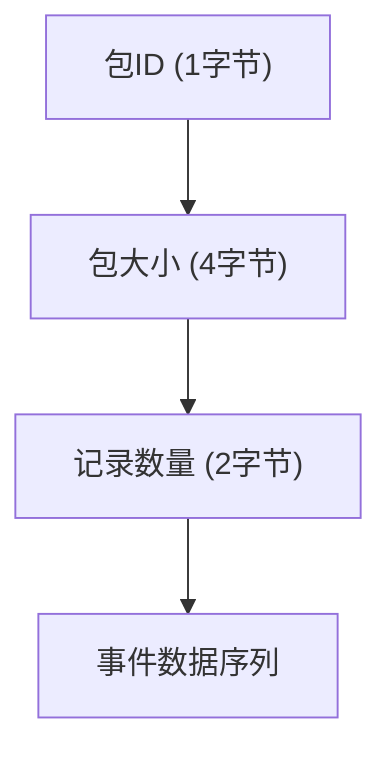
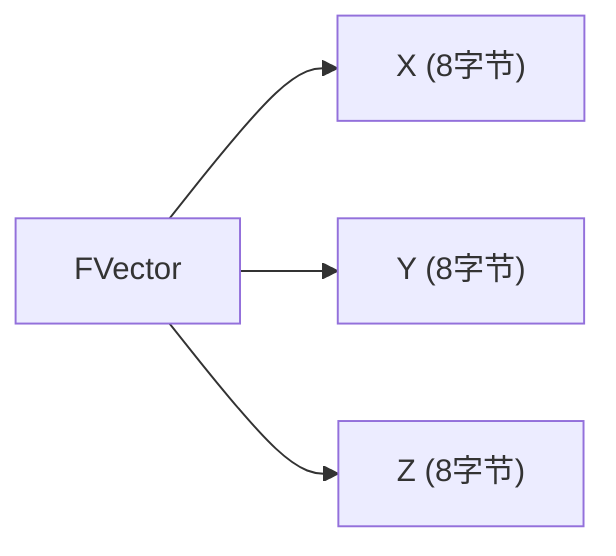
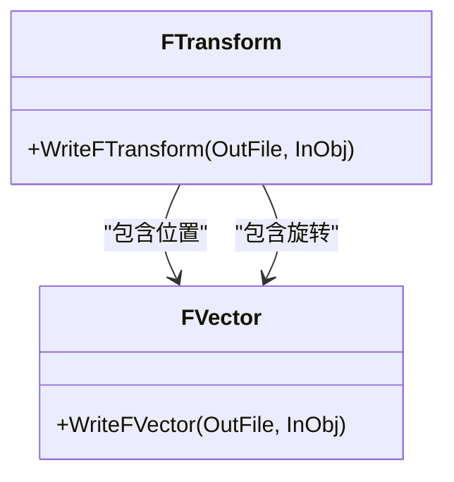
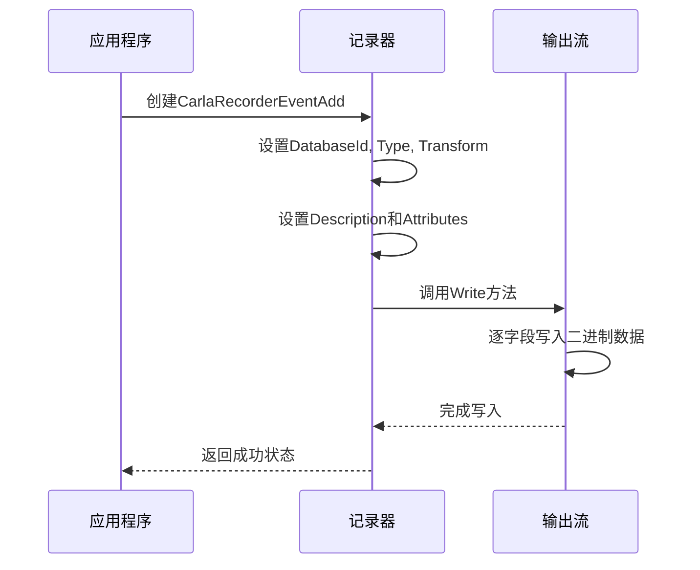

# 数据编码

> **引用文件**
> **本文档中引用的文件**

- [CarlaRecorderEventAdd.h](https://github.com/carla-simulator/carla/blob/ue5-dev/Unreal/CarlaUnreal/Plugins/Carla/Source/Carla/Recorder/CarlaRecorderEventAdd.h)
- [CarlaRecorderEventAdd.cpp](https://github.com/carla-simulator/carla/blob/ue5-dev/Unreal/CarlaUnreal/Plugins/Carla/Source/Carla/Recorder/CarlaRecorderEventAdd.cpp)
- [CarlaRecorderEventDel.h](https://github.com/carla-simulator/carla/blob/ue5-dev/Unreal/CarlaUnreal/Plugins/Carla/Source/Carla/Recorder/CarlaRecorderEventDel.h)
- [CarlaRecorderEventDel.cpp](https://github.com/carla-simulator/carla/blob/ue5-dev/Unreal/CarlaUnreal/Plugins/Carla/Source/Carla/Recorder/CarlaRecorderEventDel.cpp)
- [CarlaRecorderHelpers.h](https://github.com/carla-simulator/carla/blob/ue5-dev/Unreal/CarlaUnreal/Plugins/Carla/Source/Carla/Recorder/CarlaRecorderHelpers.h)
- [CarlaRecorderHelpers.cpp](https://github.com/carla-simulator/carla/blob/ue5-dev/Unreal/CarlaUnreal/Plugins/Carla/Source/Carla/Recorder/CarlaRecorderHelpers.cpp)
- [CarlaRecorder.h](https://github.com/carla-simulator/carla/blob/ue5-dev/Unreal/CarlaUnreal/Plugins/Carla/Source/Carla/Recorder/CarlaRecorder.h)
- [CarlaRecorder.cpp](https://github.com/carla-simulator/carla/blob/ue5-dev/Unreal/CarlaUnreal/Plugins/Carla/Source/Carla/Recorder/CarlaRecorder.cpp)
- [ActorAttribute.h](https://github.com/carla-simulator/carla/blob/ue5-dev/Unreal/CarlaUnreal/Plugins/Carla/Source/Carla/Actor/ActorAttribute.h)

## 目录

1. [引言](#引言)
2. [记录事件的数据结构](#记录事件的数据结构)
3. [序列化格式与二进制表示](#序列化格式与二进制表示)
4. [变换矩阵与向量编码](#变换矩阵与向量编码)
5. [字符串与属性数据编码](#字符串与属性数据编码)
6. [跨平台数据对齐与字节序](#跨平台数据对齐与字节序)
7. [C++序列化与反序列化示例](#c序列化与反序列化示例)
8. [总结](#总结)

## 引言

CARLA 模拟器提供了强大的记录和回放功能，用于捕获和重现实验过程中的所有事件。这些记录数据以二进制格式存储，包含了 Actor 的创建、销毁、状态更新等关键信息。本文档详细分析了 CARLA 记录数据的编码机制，重点研究了`CarlaRecorderEventAdd`和`CarlaRecorderActorDesc`类的字段编码方式，以及各种事件的二进制表示方法。

## 记录事件的数据结构

CARLA 记录系统定义了多种事件类型来捕获模拟过程中的不同操作。这些事件通过特定的数据结构进行组织和存储。

### Actor 创建事件（CarlaRecorderEventAdd）

`CarlaRecorderEventAdd`结构体用于记录 Actor 的创建事件。它包含了创建新 Actor 所需的所有必要信息：

- **DatabaseId**: 32 位无符号整数，表示 Actor 在数据库中的唯一标识符
- **Type**: 8 位无符号整数，表示 Actor 的类型
- **Location**: FVector，表示 Actor 的位置坐标
- **Rotation**: FVector，表示 Actor 的旋转角度
- **Description**: CarlaRecorderActorDescription，包含 Actor 的详细描述信息

**Section sources**

- <a href="https://github.com/carla-simulator/carla/blob/ue5-dev/Unreal/CarlaUnreal/Plugins/Carla/Source/Carla/Recorder/CarlaRecorderEventAdd.h#L26-L36" target="_blank">CarlaRecorderEventAdd.h</a>

### Actor 描述信息（CarlaRecorderActorDescription）

`CarlaRecorderActorDescription`结构体包含了 Actor 的元数据信息：

- **UId**: 32 位无符号整数，表示 Actor 的唯一 ID
- **Id**: FString，表示 Actor 的标识符字符串
- **Attributes**: std::vector<CarlaRecorderActorAttribute>，包含 Actor 的属性列表

每个属性（CarlaRecorderActorAttribute）由以下字段组成：

- **Type**: 8 位无符号整数，表示属性类型（对应 EActorAttributeType 枚举）
- **Id**: FString，属性名称
- **Value**: FString，属性值

**Section sources**

- <a href="https://github.com/carla-simulator/carla/blob/ue5-dev/Unreal/CarlaUnreal/Plugins/Carla/Source/Carla/Recorder/CarlaRecorderEventAdd.h#L19-L24" target="_blank">CarlaRecorderEventAdd.h</a>

### Actor 销毁事件（CarlaRecorderEventDel）

`CarlaRecorderEventDel`结构体用于记录 Actor 的销毁事件：

- **DatabaseId**: 32 位无符号整数，表示被销毁 Actor 的数据库 ID

该结构体相对简单，仅需记录被销毁 Actor 的标识符即可。

**Section sources**

- <a href="https://github.com/carla-simulator/carla/blob/ue5-dev/Unreal/CarlaUnreal/Plugins/Carla/Source/Carla/Recorder/CarlaRecorderEventDel.h#L12-L18" target="_blank">CarlaRecorderEventDel.h</a>

## 序列化格式与二进制表示

CARLA 记录数据采用紧凑的二进制格式进行序列化，以提高存储效率和读写性能。

### 事件包结构

所有记录事件都遵循统一的包结构，包含以下组成部分：

1. **包 ID**: 一个字符，标识事件类型（如 CarlaRecorderPacketId::EventAdd）
2. **包大小**: 32 位无符号整数，表示包的实际大小
3. **记录数量**: 16 位无符号整数，表示包中包含的事件数量
4. **事件数据**: 实际的事件数据序列



**Diagram sources**

- <a href="https://github.com/carla-simulator/carla/blob/ue5-dev/Unreal/CarlaUnreal/Plugins/Carla/Source/Carla/Recorder/CarlaRecorderEventAdd.cpp#L83-L104" target="_blank">CarlaRecorderEventAdd.cpp</a>
- <a href="https://github.com/carla-simulator/carla/blob/ue5-dev/Unreal/CarlaUnreal/Plugins/Carla/Source/Carla/Recorder/CarlaRecorderEventDel.cpp#L37-L60" target="_blank">CarlaRecorderEventDel.cpp</a>

### 数据写入流程

`CarlaRecorderEventsAdd::Write`方法实现了事件包的写入流程：

1. 写入包 ID
2. 写入占位的包大小（初始为 0）
3. 写入记录数量
4. 逐个写入每个事件的数据
5. 计算实际包大小并回写到文件中相应位置

这种两遍写入策略确保了包大小的准确性，同时保持了流式写入的效率。

**Section sources**

- <a href="https://github.com/carla-simulator/carla/blob/ue5-dev/Unreal/CarlaUnreal/Plugins/Carla/Source/Carla/Recorder/CarlaRecorderEventAdd.cpp#L80-L104" target="_blank">CarlaRecorderEventAdd.cpp</a>

## 变换矩阵与向量编码

CARLA 记录系统对变换矩阵和向量数据采用了高效的编码策略。

### FVector 编码

`FVector`类型（三维向量）被序列化为三个连续的双精度浮点数：



`WriteFVector`函数负责将 FVector 对象写入输出流，依次写入 X、Y、Z 三个分量。

**Diagram sources**

- <a href="https://github.com/carla-simulator/carla/blob/ue5-dev/Unreal/CarlaUnreal/Plugins/Carla/Source/Carla/Recorder/CarlaRecorderHelpers.cpp#L40-L46" target="_blank">CarlaRecorderHelpers.cpp</a>

### FTransform 编码

`FTransform`类型（变换矩阵）被分解为位置和旋转两部分进行编码：

- **位置**: 通过`GetTranslation()`获取，作为 FVector 写入
- **旋转**: 通过`GetRotation().Euler()`获取欧拉角，作为 FVector 写入



**Diagram sources**

- <a href="https://github.com/carla-simulator/carla/blob/ue5-dev/Unreal/CarlaUnreal/Plugins/Carla/Source/Carla/Recorder/CarlaRecorderHelpers.cpp#L48-L53" target="_blank">CarlaRecorderHelpers.cpp</a>

## 字符串与属性数据编码

字符串和属性数据的编码采用了可变长度的打包方法，以优化存储空间。

### FString 编码

`FString`类型采用长度前缀编码方式：

1. 写入字符串长度（16 位无符号整数）
2. 写入 UTF-8 编码的字符串数据

```cpp
void WriteFString(std::ostream &OutFile, const FString &InObj)
{
    // 编码为UTF8以确定最终长度
    FTCHARToUTF8 EncodedString(*InObj);
    int16_t Length = EncodedString.Length();
    // 写入长度
    WriteValue<uint16_t>(OutFile, Length);
    // 写入字符串数据
    OutFile.write(reinterpret_cast<char *>(TCHAR_TO_UTF8(*InObj)), Length);
}
```

**Section sources**

- <a href="https://github.com/carla-simulator/carla/blob/ue5-dev/Unreal/CarlaUnreal/Plugins/Carla/Source/Carla/Recorder/CarlaRecorderHelpers.cpp#L56-L64" target="_blank">CarlaRecorderHelpers.cpp</a>

### 属性列表编码

属性列表采用动态数组编码策略：

1. 写入属性数量（16 位无符号整数）
2. 对每个属性，依次写入：
   - 类型（8 位无符号整数）
   - ID 字符串
   - 值字符串

这种编码方式支持任意数量的属性，同时保持了良好的可读性和效率。

**Section sources**

- <a href="https://github.com/carla-simulator/carla/blob/ue5-dev/Unreal/CarlaUnreal/Plugins/Carla/Source/Carla/Recorder/CarlaRecorderEventAdd.cpp#L26-L34" target="_blank">CarlaRecorderEventAdd.cpp</a>

## 跨平台数据对齐与字节序

CARLA 记录系统通过标准化的数据表示方法解决了跨平台兼容性问题。

### 数据对齐

所有基本数据类型都使用固定大小的类型定义，确保在不同平台上的大小一致：

- uint32_t: 32 位无符号整数
- uint16_t: 16 位无符号整数
- uint8_t: 8 位无符号整数
- double: 64 位浮点数

### 字节序处理

虽然 CARLA 记录代码中没有显式的字节序转换，但通过以下方式确保了跨平台兼容性：

1. 使用标准的二进制流操作
2. 依赖底层文件系统的字节序处理
3. 在读取和写入时保持一致的字节序

对于需要跨不同字节序系统使用的场景，建议在读取记录文件时进行适当的字节序转换。

**Section sources**

- <a href="https://github.com/carla-simulator/carla/blob/ue5-dev/Unreal/CarlaUnreal/Plugins/Carla/Source/Carla/Recorder/CarlaRecorderHelpers.h#L21-L24" target="_blank">CarlaRecorderHelpers.h</a>
- <a href="https://github.com/carla-simulator/carla/blob/ue5-dev/Unreal/CarlaUnreal/Plugins/Carla/Source/Carla/Recorder/CarlaRecorderHelpers.h#L59-L63" target="_blank">CarlaRecorderHelpers.h</a>

## C++序列化与反序列化示例

以下是 CARLA 记录系统中序列化和反序列化操作的典型示例。

### 序列化示例



**Diagram sources**

- <a href="https://github.com/carla-simulator/carla/blob/ue5-dev/Unreal/CarlaUnreal/Plugins/Carla/Source/Carla/Recorder/CarlaRecorderEventAdd.cpp#L11-L35" target="_blank">CarlaRecorderEventAdd.cpp</a>

### 反序列化示例

```mermaid
sequenceDiagram
participant 输入流
participant 记录器
participant 应用程序
输入流->>记录器 : 提供输入流
记录器->>输入流 : 调用Read方法
输入流->>记录器 : 读取DatabaseId
记录器->>输入流 : 读取Type
输入流->>记录器 : 读取Location和Rotation
记录器->>输入流 : 读取Description.UId和Id
输入流->>记录器 : 读取Attributes数量
循环 读取每个属性
输入流->>记录器 : 读取Attribute.Type
输入流->>记录器 : 读取Attribute.Id
输入流->>记录器 : 读取Attribute.Value
end
记录器-->>应用程序 : 返回填充的事件对象
```

**Diagram sources**

- <a href="https://github.com/carla-simulator/carla/blob/ue5-dev/Unreal/CarlaUnreal/Plugins/Carla/Source/Carla/Recorder/CarlaRecorderEventAdd.cpp#L37-L66" target="_blank">CarlaRecorderEventAdd.cpp</a>

## 总结

CARLA 记录系统的数据编码设计充分考虑了效率、可扩展性和跨平台兼容性。通过使用紧凑的二进制格式、长度前缀字符串编码和标准化的数据类型，系统能够高效地存储和传输大量的模拟数据。`CarlaRecorderEventAdd`和`CarlaRecorderActorDesc`等核心类的设计体现了模块化和可扩展的原则，支持未来添加新的事件类型和属性。开发者可以基于这些编码规则实现自定义的记录分析工具或数据转换器。
