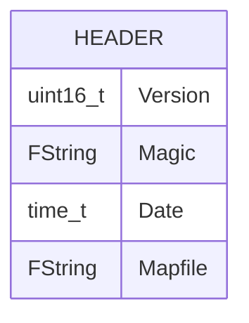
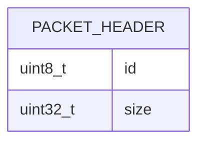
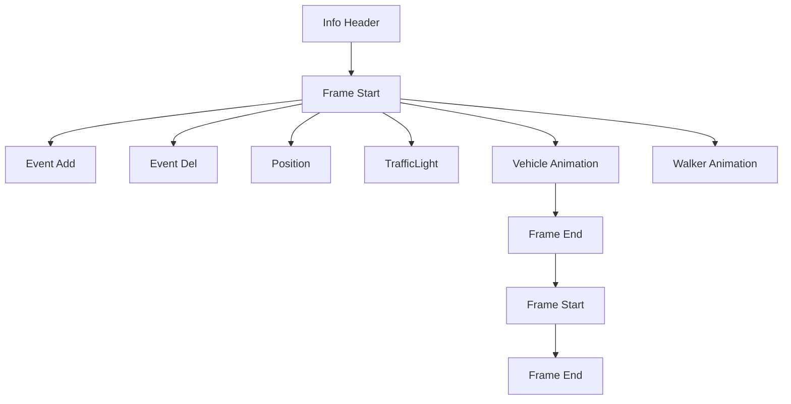
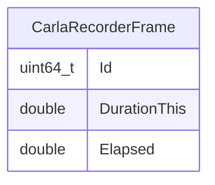
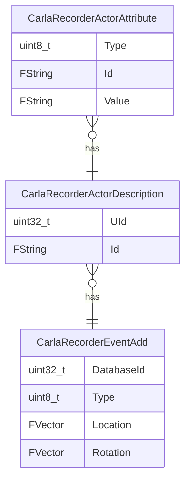
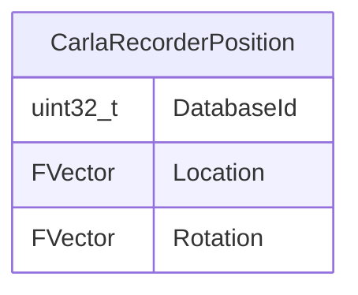
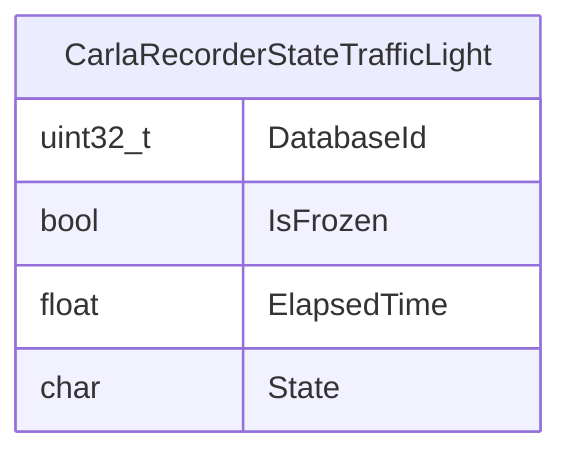

# 文件格式

> **引用文件**
> **本文档中引用的文件**

- [ref_recorder_binary_file_format.md](https://github.com/carla-simulator/carla/blob/ue5-dev/Docs/ref_recorder_binary_file_format.md)
- [CarlaRecorder.h](https://github.com/carla-simulator/carla/blob/ue5-dev/Unreal/CarlaUnreal/Plugins/Carla/Source/Carla/Recorder/CarlaRecorder.h)
- [CarlaRecorderInfo.h](https://github.com/carla-simulator/carla/blob/ue5-dev/Unreal/CarlaUnreal/Plugins/Carla/Source/Carla/Recorder/CarlaRecorderInfo.h)
- [CarlaRecorderFrames.h](https://github.com/carla-simulator/carla/blob/ue5-dev/Unreal/CarlaUnreal/Plugins/Carla/Source/Carla/Recorder/CarlaRecorderFrames.h)
- [CarlaRecorderEventAdd.h](https://github.com/carla-simulator/carla/blob/ue5-dev/Unreal/CarlaUnreal/Plugins/Carla/Source/Carla/Recorder/CarlaRecorderEventAdd.h)
- [CarlaRecorderPosition.h](https://github.com/carla-simulator/carla/blob/ue5-dev/Unreal/CarlaUnreal/Plugins/Carla/Source/Carla/Recorder/CarlaRecorderPosition.h)
- [CarlaRecorderState.h](https://github.com/carla-simulator/carla/blob/ue5-dev/Unreal/CarlaUnreal/Plugins/Carla/Source/Carla/Recorder/CarlaRecorderState.h)
- [CarlaRecorderAnimVehicle.h](https://github.com/carla-simulator/carla/blob/ue5-dev/Unreal/CarlaUnreal/Plugins/Carla/Source/Carla/Recorder/CarlaRecorderAnimVehicle.h)
- [CarlaRecorderAnimWalker.h](https://github.com/carla-simulator/carla/blob/ue5-dev/Unreal/CarlaUnreal/Plugins/Carla/Source/Carla/Recorder/CarlaRecorderAnimWalker.h)
- [CarlaRecorderHelpers.h](https://github.com/carla-simulator/carla/blob/ue5-dev/Unreal/CarlaUnreal/Plugins/Carla/Source/Carla/Recorder/CarlaRecorderHelpers.h)
- [CarlaRecorderHelpers.cpp](https://github.com/carla-simulator/carla/blob/ue5-dev/Unreal/CarlaUnreal/Plugins/Carla/Source/Carla/Recorder/CarlaRecorderHelpers.cpp)
- [CarlaRecorder.cpp](https://github.com/carla-simulator/carla/blob/ue5-dev/Unreal/CarlaUnreal/Plugins/Carla/Source/Carla/Recorder/CarlaRecorder.cpp)

## 目录

1. [简介](#简介)
2. [二进制字符串编码](#二进制字符串编码)
3. [头部信息](#头部信息)
4. [数据包结构](#数据包结构)
5. [帧布局](#帧布局)
6. [文件整体布局](#文件整体布局)
7. [核心数据结构](#核心数据结构)
8. [记录事件类型](#记录事件类型)
9. [文件解析示例](#文件解析示例)
10. [版本兼容性与升级](#版本兼容性与升级)
11. [性能与优化](#性能与优化)

## 简介

CARLA 记录器系统将重放模拟所需的所有信息保存在一个二进制文件中，该文件采用小端字节序存储多字节值。文件格式包含一个小型头部，其中包含版本、魔数字符串、日期和所使用的地图等通用信息，以及多种类型的数据包（目前使用 10 种类型，未来可能会继续增加）。

**Section sources**

- <a href="https://github.com/carla-simulator/carla/blob/ue5-dev/Docs/ref_recorder_binary_file_format.md#L3-L29" target="_blank">ref_recorder_binary_file_format.md</a>

## 二进制字符串编码

在二进制文件中，字符串首先以长度编码，然后是字符本身，不包含空字符结尾。例如，字符串'Town06'将被保存为十六进制值：06 00 54 6f 77 6e 30 36。

**Section sources**

- <a href="https://github.com/carla-simulator/carla/blob/ue5-dev/Docs/ref_recorder_binary_file_format.md#L34-L40" target="_blank">ref_recorder_binary_file_format.md</a>

## 头部信息

头部信息包含关于记录文件的一般信息。它包含版本号和用于标识文件为记录器文件的魔数字符串。如果头部发生变化，版本号也会随之改变。此外，它还包含一个时间戳（从 1900 年纪元开始的秒数）和一个字符串，表示用于记录的地图名称。



**Diagram sources**

- <a href="https://github.com/carla-simulator/carla/blob/ue5-dev/Unreal/CarlaUnreal/Plugins/Carla/Source/Carla/Recorder/CarlaRecorderInfo.h#L14-L20" target="_blank">CarlaRecorderInfo.h</a>

**Section sources**

- <a href="https://github.com/carla-simulator/carla/blob/ue5-dev/Docs/ref_recorder_binary_file_format.md#L43-L55" target="_blank">ref_recorder_binary_file_format.md</a>
- <a href="https://github.com/carla-simulator/carla/blob/ue5-dev/Unreal/CarlaUnreal/Plugins/Carla/Source/Carla/Recorder/CarlaRecorderInfo.h#L14-L36" target="_blank">CarlaRecorderInfo.h</a>

## 数据包结构

每个数据包以一个 5 字节的小头部开始，包含两个字段：

- **id**：数据包类型
- **size**：数据包数据的大小

头部信息后跟的是**data**。**data**是可选的，大小为 0 表示数据包中没有**data**。如果**size**大于 0，则表示数据包有**data**字节。因此，需要根据数据包的类型重新解释**data**。



**Diagram sources**

- <a href="https://github.com/carla-simulator/carla/blob/ue5-dev/Docs/ref_recorder_binary_file_format.md#L59-L64" target="_blank">ref_recorder_binary_file_format.md</a>

**Section sources**

- <a href="https://github.com/carla-simulator/carla/blob/ue5-dev/Docs/ref_recorder_binary_file_format.md#L57-L75" target="_blank">ref_recorder_binary_file_format.md</a>

## 帧布局

一帧由多个数据包组成，除了必须始终存在的**Frame Start**和**Frame End**外，其他数据包都是可选的。事件数据包仅在它们发生的帧中存在。**Position**和**traffic light**数据包应该存在于所有帧中，因为它们是移动所有参与者和设置交通灯状态所必需的。动画数据包也是可选的，但默认情况下会记录。

**Section sources**

- <a href="https://github.com/carla-simulator/carla/blob/ue5-dev/Docs/ref_recorder_binary_file_format.md#L197-L213" target="_blank">ref_recorder_binary_file_format.md</a>

## 文件整体布局

文件布局以**info header**开始，然后是按组排列的数据包集合。每组的第一个是**Frame Start**数据包，最后一个**Frame End**数据包。在这之间，我们还可以找到其余的数据包。



**Diagram sources**

- <a href="https://github.com/carla-simulator/carla/blob/ue5-dev/Docs/ref_recorder_binary_file_format.md#L217-L222" target="_blank">ref_recorder_binary_file_format.md</a>

**Section sources**

- <a href="https://github.com/carla-simulator/carla/blob/ue5-dev/Docs/ref_recorder_binary_file_format.md#L215-L229" target="_blank">ref_recorder_binary_file_format.md</a>

## 核心数据结构

### CarlaRecorderFrame

该结构表示一个帧，包含帧 ID、当前帧的持续时间和经过的时间。



**Diagram sources**

- <a href="https://github.com/carla-simulator/carla/blob/ue5-dev/Unreal/CarlaUnreal/Plugins/Carla/Source/Carla/Recorder/CarlaRecorderFrames.h#L12-L21" target="_blank">CarlaRecorderFrames.h</a>

### CarlaRecorderEventAdd

该结构表示添加参与者的事件，包含数据库 ID、类型、位置、旋转和参与者描述。



**Diagram sources**

- <a href="https://github.com/carla-simulator/carla/blob/ue5-dev/Unreal/CarlaUnreal/Plugins/Carla/Source/Carla/Recorder/CarlaRecorderEventAdd.h#L26-L32" target="_blank">CarlaRecorderEventAdd.h</a>

### CarlaRecorderPosition

该结构记录参与者的 ID、位置和旋转。



**Diagram sources**

- <a href="https://github.com/carla-simulator/carla/blob/ue5-dev/Unreal/CarlaUnreal/Plugins/Carla/Source/Carla/Recorder/CarlaRecorderPosition.h#L13-L17" target="_blank">CarlaRecorderPosition.h</a>

### CarlaRecorderStateTrafficLight

该结构记录交通灯的状态，包括 ID、是否冻结、经过时间和状态。



**Diagram sources**

- <a href="https://github.com/carla-simulator/carla/blob/ue5-dev/Unreal/CarlaUnreal/Plugins/Carla/Source/Carla/Recorder/CarlaRecorderState.h#L13-L18" target="_blank">CarlaRecorderState.h</a>

**Section sources**

- <a href="https://github.com/carla-simulator/carla/blob/ue5-dev/Unreal/CarlaUnreal/Plugins/Carla/Source/Carla/Recorder/CarlaRecorderFrames.h#L12-L21" target="_blank">CarlaRecorderFrames.h</a>
- <a href="https://github.com/carla-simulator/carla/blob/ue5-dev/Unreal/CarlaUnreal/Plugins/Carla/Source/Carla/Recorder/CarlaRecorderEventAdd.h#L26-L32" target="_blank">CarlaRecorderEventAdd.h</a>
- <a href="https://github.com/carla-simulator/carla/blob/ue5-dev/Unreal/CarlaUnreal/Plugins/Carla/Source/Carla/Recorder/CarlaRecorderPosition.h#L13-L17" target="_blank">CarlaRecorderPosition.h</a>
- <a href="https://github.com/carla-simulator/carla/blob/ue5-dev/Unreal/CarlaUnreal/Plugins/Carla/Source/Carla/Recorder/CarlaRecorderState.h#L13-L18" target="_blank">CarlaRecorderState.h</a>

## 记录事件类型

### Packet 0 - 帧开始

此数据包标记新帧的开始，是每个帧的第一个数据包。所有数据包都需要放置在**Frame Start**和**Frame End**之间。

### Packet 1 - 帧结束

此数据包没有数据，仅标记当前帧的结束。这有助于重放器在新帧开始之前知道每个帧的结束。

### Packet 2 - 事件添加

此数据包说明在当前帧需要创建多少参与者。字段**total**表示后续记录的数量。每个记录以**id**字段开始，即参与者在记录时具有的 ID。**type**可以有以下可能值：

- 0 = 其他
- 1 = 车辆
- 2 = 行人
- 3 = 交通灯
- 4 = 无效

### Packet 3 - 事件删除

此数据包说明在当前帧需要销毁多少参与者。它有**total**记录数，每个记录有要删除的参与者的**id**。

### Packet 4 - 事件父级

此数据包说明哪个参与者是另一个（父级）的子级。第一个 id 是子参与者，第二个是父参与者。

### Packet 5 - 事件碰撞

如果两个参与者之间发生碰撞，它将在此数据包中注册。目前只有带有碰撞传感器的参与者才会报告碰撞。

### Packet 6 - 位置

此数据包记录场景中所有**车辆**和**行人**类型参与者的位罝和方向。

### Packet 7 - 交通灯

此数据包记录场景中所有**交通灯**的状态。这意味着它存储状态（红、橙或绿）和等待切换到新状态的时间。

### Packet 8 - 车辆动画

此数据包记录车辆、自行车和摩托车的动画。它存储**油门**、**转向**、**刹车**、**手刹**和**档位**输入，并在重放时设置它们。

### Packet 9 - 行人动画

此数据包记录行人的动画。它只保存行人的**速度**，用于动画。

**Section sources**

- <a href="https://github.com/carla-simulator/carla/blob/ue5-dev/Docs/ref_recorder_binary_file_format.md#L84-L194" target="_blank">ref_recorder_binary_file_format.md</a>

## 文件解析示例

以下代码示例展示了如何读取和验证记录文件的完整性：

```cpp
// 读取头部信息
CarlaRecorderInfo Info;
Info.Read(File);

// 验证魔数字符串
if (Info.Magic != TEXT("CARLA_RECORDER")) {
    // 文件无效
    return false;
}

// 读取帧数据
while (File) {
    CarlaRecorderFrame Frame;
    Frame.Read(File);
    // 处理帧数据
}
```

**Section sources**

- <a href="https://github.com/carla-simulator/carla/blob/ue5-dev/Unreal/CarlaUnreal/Plugins/Carla/Source/Carla/Recorder/CarlaRecorder.cpp#L446-L453" target="_blank">CarlaRecorder.cpp</a>
- <a href="https://github.com/carla-simulator/carla/blob/ue5-dev/Unreal/CarlaUnreal/Plugins/Carla/Source/Carla/Recorder/CarlaRecorderHelpers.cpp#L88-L104" target="_blank">CarlaRecorderHelpers.cpp</a>

## 版本兼容性与升级

当头部信息发生变化时，版本号也会改变。建议使用 100 以上的**id**作为用户自定义数据包，因为此列表将在未来继续增长。

**Section sources**

- <a href="https://github.com/carla-simulator/carla/blob/ue5-dev/Docs/ref_recorder_binary_file_format.md#L46-L47" target="_blank">ref_recorder_binary_file_format.md</a>
- <a href="https://github.com/carla-simulator/carla/blob/ue5-dev/Unreal/CarlaUnreal/Plugins/Carla/Source/Carla/Recorder/CarlaRecorder.h#L48-L73" target="_blank">CarlaRecorder.h</a>

## 性能与优化

记录器系统支持记录额外数据（如运动学、边界框等），这可以通过设置`bAdditionalData`标志来启用。这有助于在重放时提供更详细的模拟信息。

**Section sources**

- <a href="https://github.com/carla-simulator/carla/blob/ue5-dev/Unreal/CarlaUnreal/Plugins/Carla/Source/Carla/Recorder/CarlaRecorder.cpp#L532-L541" target="_blank">CarlaRecorder.cpp</a>
- <a href="https://github.com/carla-simulator/carla/blob/ue5-dev/Unreal/CarlaUnreal/Plugins/Carla/Source/Carla/Recorder/CarlaRecorder.h#L184-L185" target="_blank">CarlaRecorder.h</a>
