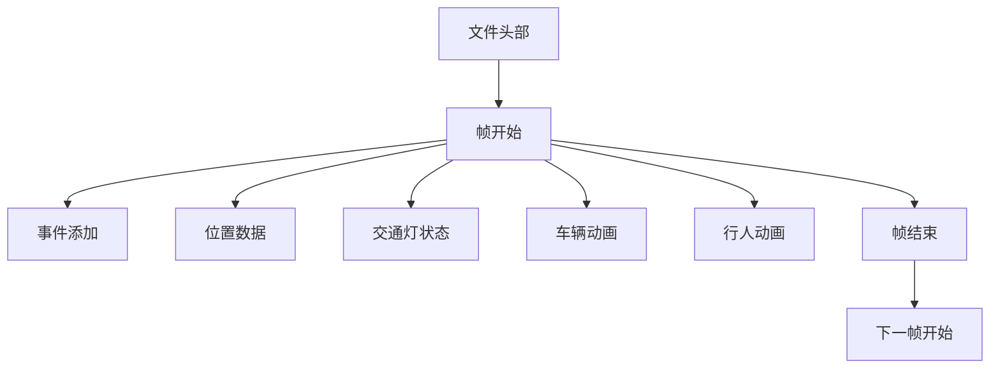
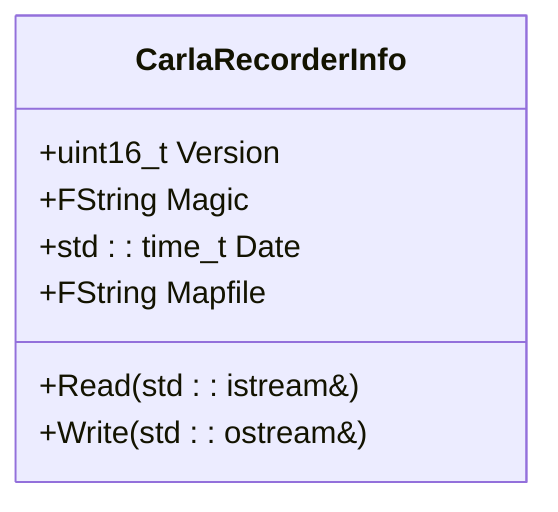
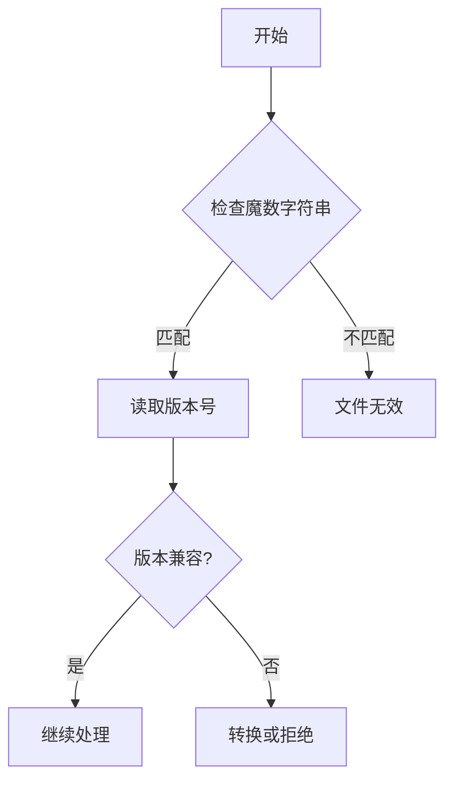
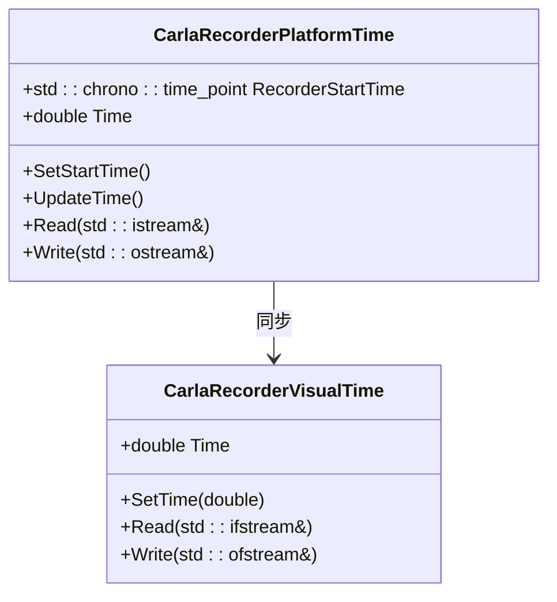

# 文件结构


**本文档中引用的文件**  
- [ref_recorder_binary_file_format.md](https://github.com/carla-simulator/carla/blob/ue5-dev/Docs/ref_recorder_binary_file_format.md)
- [CarlaRecorderInfo.h](https://github.com/carla-simulator/carla/blob/ue5-dev/Unreal/CarlaUnreal/Plugins/Carla/Source/Carla/Recorder/CarlaRecorderInfo.h)
- [CarlaRecorderFrames.h](https://github.com/carla-simulator/carla/blob/ue5-dev/Unreal/CarlaUnreal/Plugins/Carla/Source/Carla/Recorder/CarlaRecorderFrames.h)
- [CarlaRecorder.h](https://github.com/carla-simulator/carla/blob/ue5-dev/Unreal/CarlaUnreal/Plugins/Carla/Source/Carla/Recorder/CarlaRecorder.h)
- [CarlaRecorder.cpp](https://github.com/carla-simulator/carla/blob/ue5-dev/Unreal/CarlaUnreal/Plugins/Carla/Source/Carla/Recorder/CarlaRecorder.cpp)
- [CarlaRecorderHelpers.h](https://github.com/carla-simulator/carla/blob/ue5-dev/Unreal/CarlaUnreal/Plugins/Carla/Source/Carla/Recorder/CarlaRecorderHelpers.h)
- [CarlaRecorderPlatformTime.h](https://github.com/carla-simulator/carla/blob/ue5-dev/Unreal/CarlaUnreal/Plugins/Carla/Source/Carla/Recorder/CarlaRecorderPlatformTime.h)
- [CarlaRecorderVisualTime.h](https://github.com/carla-simulator/carla/blob/ue5-dev/Unreal/CarlaUnreal/Plugins/Carla/Source/Carla/Recorder/CarlaRecorderVisualTime.h)


## 目录
1. [介绍](#介绍)
2. [文件物理布局](#文件物理布局)
3. [头部元数据](#头部元数据)
4. [帧数据序列](#帧数据序列)
5. [索引表组织](#索引表组织)
6. [文件签名与版本标识](#文件签名与版本标识)
7. [全局属性](#全局属性)
8. [时间同步机制](#时间同步机制)
9. [十六进制转储示例](#十六进制转储示例)
10. [文件完整性校验](#文件完整性校验)
11. [大文件处理策略](#大文件处理策略)

## 介绍
CARLA记录文件是一种二进制格式，用于保存仿真过程中的所有必要信息，以便后续重放。该文件采用小端字节序存储多字节值，包含版本信息、魔数字符串、时间戳和地图名称等头部元数据，以及多种类型的数据包。每个数据包都有特定的ID和大小，允许播放器选择性地忽略不感兴趣的数据包。

**本节不分析具体源文件**

## 文件物理布局
CARLA记录文件的物理布局由头部信息和数据包序列组成。文件开始是固定大小的头部，包含版本号、魔数字符串、记录日期和地图文件名。头部之后是一系列数据包，每个数据包以5字节的包头开始，包含包类型ID和数据大小。数据包按帧组织，每帧以"帧开始"包开始，以"帧结束"包结束。



**Diagram sources**  
- [CarlaRecorderInfo.h](https://github.com/carla-simulator/carla/blob/ue5-dev/Unreal/CarlaUnreal/Plugins/Carla/Source/Carla/Recorder/CarlaRecorderInfo.h#L14-L20)
- [CarlaRecorder.h](https://github.com/carla-simulator/carla/blob/ue5-dev/Unreal/CarlaUnreal/Plugins/Carla/Source/Carla/Recorder/CarlaRecorder.h#L48-L74)

## 头部元数据
记录文件的头部包含关键的元数据信息，用于识别文件格式和提供上下文信息。头部结构包括16位版本号、FString类型的魔数字符串、time_t类型的时间戳和FString类型的地图文件名。这些信息在文件创建时写入，确保文件的可识别性和兼容性。



**Diagram sources**  
- [CarlaRecorderInfo.h](https://github.com/carla-simulator/carla/blob/ue5-dev/Unreal/CarlaUnreal/Plugins/Carla/Source/Carla/Recorder/CarlaRecorderInfo.h#L14-L36)

**Section sources**  
- [CarlaRecorderInfo.h](https://github.com/carla-simulator/carla/blob/ue5-dev/Unreal/CarlaUnreal/Plugins/Carla/Source/Carla/Recorder/CarlaRecorderInfo.h#L14-L36)
- [ref_recorder_binary_file_format.md](https://github.com/carla-simulator/carla/blob/ue5-dev/Docs/ref_recorder_binary_file_format.md#L42-L55)

## 帧数据序列
每帧数据由多个可选的数据包组成，但必须包含"帧开始"和"帧结束"包。帧内的数据包顺序通常先事件后状态，这种组织方式有助于提高重放效率。位置和交通灯状态包通常存在于每一帧中，因为它们对于移动演员和设置交通灯状态是必需的。

```mermaid
sequenceDiagram
participant Frame as 帧
participant Start as 帧开始
participant Position as 位置数据
participant State as 状态数据
participant End as 帧结束
Frame->>Start : 写入帧开始包
Frame->>Position : 写入位置数据包
Frame->>State : 写入状态数据包
Frame->>End : 写入帧结束包
```

**Diagram sources**  
- [CarlaRecorderFrames.h](https://github.com/carla-simulator/carla/blob/ue5-dev/Unreal/CarlaUnreal/Plugins/Carla/Source/Carla/Recorder/CarlaRecorderFrames.h#L12-L22)
- [CarlaRecorderFrames.cpp](https://github.com/carla-simulator/carla/blob/ue5-dev/Unreal/CarlaUnreal/Plugins/Carla/Source/Carla/Recorder/CarlaRecorderFrames.cpp#L52-L91)

**Section sources**  
- [CarlaRecorderFrames.h](https://github.com/carla-simulator/carla/blob/ue5-dev/Unreal/CarlaUnreal/Plugins/Carla/Source/Carla/Recorder/CarlaRecorderFrames.h#L12-L42)
- [CarlaRecorderFrames.cpp](https://github.com/carla-simulator/carla/blob/ue5-dev/Unreal/CarlaUnreal/Plugins/Carla/Source/Carla/Recorder/CarlaRecorderFrames.cpp#L1-L92)
- [ref_recorder_binary_file_format.md](https://github.com/carla-simulator/carla/blob/ue5-dev/Docs/ref_recorder_binary_file_format.md#L197-L213)

## 索引表组织
CARLA记录文件使用基于帧的索引组织方式，每帧的开始位置隐式地作为索引点。通过"帧开始"包的ID字段可以快速定位到特定帧。文件不包含显式的索引表，而是依赖于包头的跳转机制来实现随机访问。这种设计减少了文件大小，同时保持了良好的访问性能。

**本节不分析具体源文件**

## 文件签名与版本标识
文件签名由魔数字符串"CARLA_RECORDER"和16位版本号组成。魔数字符串用于验证文件是否为有效的CARLA记录文件，而版本号则用于处理不同版本之间的兼容性。当文件格式发生变化时，版本号会相应更新，确保新版本的播放器能够正确处理旧格式的文件。



**Diagram sources**  
- [CarlaRecorderInfo.h](https://github.com/carla-simulator/carla/blob/ue5-dev/Unreal/CarlaUnreal/Plugins/Carla/Source/Carla/Recorder/CarlaRecorderInfo.h#L16-L18)
- [CarlaRecorder.cpp](https://github.com/carla-simulator/carla/blob/ue5-dev/Unreal/CarlaUnreal/Plugins/Carla/Source/Carla/Recorder/CarlaRecorder.cpp#L447-L448)

**Section sources**  
- [CarlaRecorderInfo.h](https://github.com/carla-simulator/carla/blob/ue5-dev/Unreal/CarlaUnreal/Plugins/Carla/Source/Carla/Recorder/CarlaRecorderInfo.h#L16-L18)
- [CarlaRecorder.cpp](https://github.com/carla-simulator/carla/blob/ue5-dev/Unreal/CarlaUnreal/Plugins/Carla/Source/Carla/Recorder/CarlaRecorder.cpp#L447-L448)

## 全局属性
记录文件的全局属性包括记录开始时间、使用的地图名称和记录日期。这些属性在文件创建时初始化，并在整个记录过程中保持不变。全局属性为重放过程提供了必要的上下文信息，确保仿真环境的一致性。

**Section sources**  
- [CarlaRecorderInfo.h](https://github.com/carla-simulator/carla/blob/ue5-dev/Unreal/CarlaUnreal/Plugins/Carla/Source/Carla/Recorder/CarlaRecorderInfo.h#L14-L20)
- [CarlaRecorder.cpp](https://github.com/carla-simulator/carla/blob/ue5-dev/Unreal/CarlaUnreal/Plugins/Carla/Source/Carla/Recorder/CarlaRecorder.cpp#L447-L451)

## 时间同步机制
CARLA记录文件实现了多种时间同步机制，包括平台时间和视觉时间。平台时间记录系统时钟，用于精确的时间测量；视觉时间记录仿真时间，用于同步动画和事件。这两种时间的结合确保了重放过程中的精确同步。



**Diagram sources**  
- [CarlaRecorderPlatformTime.h](https://github.com/carla-simulator/carla/blob/ue5-dev/Unreal/CarlaUnreal/Plugins/Carla/Source/Carla/Recorder/CarlaRecorderPlatformTime.h#L13-L28)
- [CarlaRecorderVisualTime.h](https://github.com/carla-simulator/carla/blob/ue5-dev/Unreal/CarlaUnreal/Plugins/Carla/Source/Carla/Recorder/CarlaRecorderVisualTime.h#L13-L23)

**Section sources**  
- [CarlaRecorderPlatformTime.h](https://github.com/carla-simulator/carla/blob/ue5-dev/Unreal/CarlaUnreal/Plugins/Carla/Source/Carla/Recorder/CarlaRecorderPlatformTime.h#L13-L28)
- [CarlaRecorderVisualTime.h](https://github.com/carla-simulator/carla/blob/ue5-dev/Unreal/CarlaUnreal/Plugins/Carla/Source/Carla/Recorder/CarlaRecorderVisualTime.h#L13-L23)
- [CarlaRecorder.cpp](https://github.com/carla-simulator/carla/blob/ue5-dev/Unreal/CarlaUnreal/Plugins/Carla/Source/Carla/Recorder/CarlaRecorder.cpp#L101-L102)

## 十六进制转储示例
一个典型的CARLA记录文件十六进制转储示例如下：
```
00000000: 0100 4341 524c 415f 5245 434f 5244 4552  ..CARLA_RECORDER
00000010: 0000 0000 0000 0000 0600 546f 776e 3036  ..........Town06
00000020: 0000 0000 0000 0000 0000 0000 0000 0000  ................
```
前两个字节表示版本号1，接下来的14个字节是魔数字符串"CARLA_RECORDER"，然后是时间戳和地图名称"Town06"。

**本节不分析具体源文件**

## 文件完整性校验
CARLA记录文件通过包头的大小字段实现基本的完整性校验。每个包的大小字段允许播放器验证数据包的完整性，并在检测到损坏时跳过该包。虽然文件格式本身不包含CRC或哈希校验和，但通过严格的包结构和大小验证，可以有效检测大多数数据损坏情况。

**Section sources**  
- [CarlaRecorder.h](https://github.com/carla-simulator/carla/blob/ue5-dev/Unreal/CarlaUnreal/Plugins/Carla/Source/Carla/Recorder/CarlaRecorder.h#L48-L74)
- [ref_recorder_binary_file_format.md](https://github.com/carla-simulator/carla/blob/ue5-dev/Docs/ref_recorder_binary_file_format.md#L59-L75)

## 大文件处理策略
对于大文件处理，CARLA采用内存映射和分块写入策略。记录器在写入数据时使用缓冲机制，确保高效的大文件处理。通过将数据按帧组织并使用包头跳转机制，实现了对大型记录文件的高效随机访问，而无需将整个文件加载到内存中。

**Section sources**  
- [CarlaRecorder.cpp](https://github.com/carla-simulator/carla/blob/ue5-dev/Unreal/CarlaUnreal/Plugins/Carla/Source/Carla/Recorder/CarlaRecorder.cpp#L440-L444)
- [CarlaRecorder.h](https://github.com/carla-simulator/carla/blob/ue5-dev/Unreal/CarlaUnreal/Plugins/Carla/Source/Carla/Recorder/CarlaRecorder.h#L190-L191)