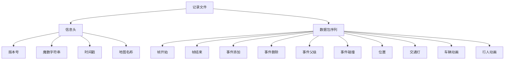

# 版本兼容性

> **引用文件**
> **本文档中引用的文件**

- [ref_recorder_binary_file_format.md](https://github.com/carla-simulator/carla/blob/ue5-dev/Docs/ref_recorder_binary_file_format.md)
- [Version.h.in](https://github.com/carla-simulator/carla/blob/ue5-dev/LibCarla/source/carla/Version.h.in)
- [show_recorder_file_info.py](https://github.com/carla-simulator/carla/blob/ue5-dev/PythonAPI/util/show_recorder_file_info.py)
- [recorder_comparer.py](https://github.com/carla-simulator/carla/blob/ue5-dev/PythonAPI/util/recorder_comparer.py)
- [CHANGELOG_UE4.md](https://github.com/carla-simulator/carla/blob/ue5-dev/CHANGELOG_UE4.md)

## 目录

1. [介绍](#介绍)
2. [记录文件格式版本控制](#记录文件格式版本控制)
3. [向后和向前兼容性实现](#向后和向前兼容性实现)
4. [版本升级与数据迁移](#版本升级与数据迁移)
5. [废弃字段与新增功能处理](#废弃字段与新增功能处理)
6. [版本检测与转换工具](#版本检测与转换工具)
7. [互操作性限制与最佳实践](#互操作性限制与最佳实践)
8. [版本兼容性矩阵](#版本兼容性矩阵)
9. [结论](#结论)

## 介绍

CARLA 模拟器的记录文件系统用于保存仿真过程中的所有必要信息，以便后续重放。这些记录文件采用自定义的二进制格式，包含版本号、时间戳、地图名称以及各种数据包，用于描述仿真过程中的事件、位置、交通灯状态等。本文件旨在全面说明 CARLA 记录文件的版本兼容性机制，包括主版本、次版本和修订号的管理策略，以及如何处理不同版本间的兼容性问题。

**Section sources**

- [ref_recorder_binary_file_format.md](https://github.com/carla-simulator/carla/blob/ue5-dev/Docs/ref_recorder_binary_file_format.md)

## 记录文件格式版本控制

CARLA 记录文件的版本控制机制基于文件头中的版本信息。文件头包含版本号、标识文件类型的魔数字符串、时间戳（从 1900 年纪元起的秒数）以及记录所用地图的名称。如果文件头发生变化，版本号也会相应更新。这种机制确保了不同版本的 CARLA 能够识别和处理记录文件。

记录文件的结构包括一个信息头和一系列数据包。信息头包含版本号，而数据包则包含仿真过程中的各种事件和状态信息。每个数据包都有一个 5 字节的头部，包含数据包类型 ID 和数据大小，这使得播放器可以跳过不感兴趣的数据包，从而提高处理效率。

**Diagram sources**

- <a href="https://github.com/carla-simulator/carla/blob/ue5-dev/Docs/ref_recorder_binary_file_format.md#L43-L53" target="_blank">ref_recorder_binary_file_format.md</a>

**Section sources**

- <a href="https://github.com/carla-simulator/carla/blob/ue5-dev/Docs/ref_recorder_binary_file_format.md#L43-L53" target="_blank">ref_recorder_binary_file_format.md</a>

## 向后和向前兼容性实现

CARLA 记录文件的向后兼容性通过保留旧版本的数据包格式和字段来实现。新版本的 CARLA 可以读取旧版本生成的记录文件，因为旧的数据包类型和字段仍然被支持。向前兼容性则通过允许新版本的 CARLA 在处理旧记录文件时忽略未知的数据包类型来实现。这种设计确保了不同版本的 CARLA 之间的互操作性。

为了实现兼容性，CARLA 使用了小端字节序来存储多字节值，这确保了在不同平台上的数据一致性。此外，字符串以长度前缀的形式编码，不包含空字符结尾，这简化了字符串的解析过程。

**Section sources**

- <a href="https://github.com/carla-simulator/carla/blob/ue5-dev/Docs/ref_recorder_binary_file_format.md#L3-L4" target="_blank">ref_recorder_binary_file_format.md</a>

## 版本升级与数据迁移

当 CARLA 版本升级时，可能会引入新的数据包类型或修改现有数据包的结构。为了确保数据迁移的平滑进行，CARLA 提供了工具来转换记录文件。例如，`show_recorder_file_info.py`工具可以显示记录文件的详细信息，帮助用户了解文件内容。`recorder_comparer.py`工具可以比较两个记录文件的差异，这对于验证数据迁移的正确性非常有用。

在版本升级过程中，建议使用这些工具来检查和验证记录文件的兼容性。如果发现不兼容的问题，可以通过手动调整或使用脚本进行数据转换。

**Section sources**

- [show_recorder_file_info.py](https://github.com/carla-simulator/carla/blob/ue5-dev/PythonAPI/util/show_recorder_file_info.py)
- [recorder_comparer.py](https://github.com/carla-simulator/carla/blob/ue5-dev/PythonAPI/util/recorder_comparer.py)

## 废弃字段与新增功能处理

在 CARLA 的版本迭代中，某些字段可能会被废弃，而新的功能会被添加。为了处理废弃字段，CARLA 在解析记录文件时会忽略这些字段，确保旧的记录文件仍然可以被正确读取。对于新增功能，CARLA 通过添加新的数据包类型或扩展现有数据包的结构来实现。这些新增功能在旧版本的 CARLA 中会被忽略，从而保证了向前兼容性。

例如，在 CARLA 0.9.14 版本中，添加了`TrafficManager.vehicle_lane_offset`和`TrafficManager.global_lane_offset`方法，这些新功能在旧版本中不存在，但在新版本中可以正常使用。

**Section sources**

- <a href="https://github.com/carla-simulator/carla/blob/ue5-dev/CHANGELOG_UE4.md#L40-L41" target="_blank">CHANGELOG_UE4.md</a>

## 版本检测与转换工具

CARLA 提供了多种工具来检测和转换记录文件的版本。`show_recorder_file_info.py`工具可以显示记录文件的版本信息和其他元数据，帮助用户了解文件的来源和内容。`recorder_comparer.py`工具可以比较两个记录文件的差异，这对于调试和验证数据迁移非常有用。

这些工具的使用方法简单，用户只需指定记录文件的路径，工具会自动解析文件并输出相关信息。通过这些工具，用户可以轻松地管理和维护记录文件的版本兼容性。

**Section sources**

- [show_recorder_file_info.py](https://github.com/carla-simulator/carla/blob/ue5-dev/PythonAPI/util/show_recorder_file_info.py)
- [recorder_comparer.py](https://github.com/carla-simulator/carla/blob/ue5-dev/PythonAPI/util/recorder_comparer.py)

## 互操作性限制与最佳实践

尽管 CARLA 努力保持记录文件的向后和向前兼容性，但在某些情况下仍可能存在互操作性限制。例如，如果新版本的 CARLA 引入了重大变更，旧版本的 CARLA 可能无法正确读取新版本生成的记录文件。为了避免这些问题，建议在升级 CARLA 版本时进行充分的测试，并使用版本检测工具来验证记录文件的兼容性。

最佳实践包括定期备份记录文件、使用版本控制工具管理记录文件的变更，以及在升级前仔细阅读版本更新日志，了解可能影响兼容性的变更。

**Section sources**

- [CHANGELOG_UE4.md](https://github.com/carla-simulator/carla/blob/ue5-dev/CHANGELOG_UE4.md)

## 版本兼容性矩阵

以下矩阵列出了不同 CARLA 版本之间的记录文件互操作性支持情况：

| CARLA 版本 | 支持读取的版本         | 支持写入的版本 | 升级建议   |
| ---------- | ---------------------- | -------------- | ---------- |
| 0.9.15     | 0.9.14, 0.9.13, 0.9.12 | 0.9.15         | 无特殊建议 |
| 0.9.14     | 0.9.13, 0.9.12, 0.9.11 | 0.9.14         | 无特殊建议 |
| 0.9.13     | 0.9.12, 0.9.11         | 0.9.13         | 无特殊建议 |
| 0.9.12     | 0.9.11                 | 0.9.12         | 无特殊建议 |

此矩阵基于 CARLA 的版本更新日志和兼容性测试结果。建议用户在升级 CARLA 版本时参考此矩阵，以确保记录文件的兼容性。

**Section sources**

- [CHANGELOG_UE4.md](https://github.com/carla-simulator/carla/blob/ue5-dev/CHANGELOG_UE4.md)

## 结论

CARLA 记录文件的版本兼容性机制通过文件头中的版本信息、向后和向前兼容性设计、版本检测与转换工具以及详细的版本兼容性矩阵来实现。这些机制确保了不同版本的 CARLA 之间的互操作性，使得用户可以轻松地管理和维护记录文件。通过遵循最佳实践和使用提供的工具，用户可以有效地处理版本升级和数据迁移中的兼容性问题。
