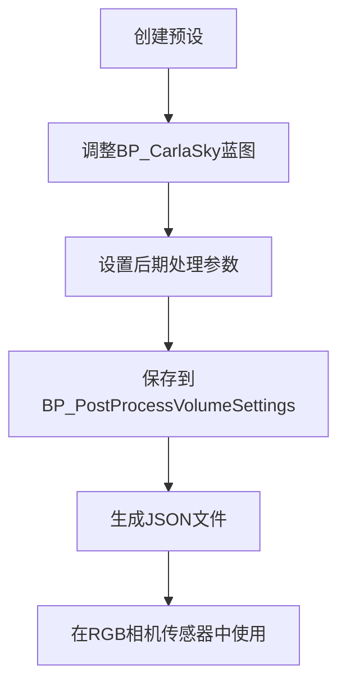

# 渲染选项


**本文档中引用的文件**   
- [adv_rendering_options.md](https://github.com/carla-simulator/carla/blob/ue5-dev/Docs/adv_rendering_options.md)
- [camera_postprocess_presets.md](https://github.com/carla-simulator/carla/blob/ue5-dev/Docs/camera_postprocess_presets.md)
- [DefaultEngine.ini](https://github.com/carla-simulator/carla/blob/ue5-dev/Unreal/CarlaUnreal/Config/DefaultEngine.ini)
- [DefaultScalability.ini](https://github.com/carla-simulator/carla/blob/ue5-dev/Unreal/CarlaUnreal/Config/DefaultScalability.ini)
- [CarlaSettingsDelegate.cpp](https://github.com/carla-simulator/carla/blob/ue5-dev/Unreal/CarlaUnreal/Plugins/Carla/Source/Carla/Settings/CarlaSettingsDelegate.cpp)
- [PostProcessConfig.cpp](https://github.com/carla-simulator/carla/blob/ue5-dev/Unreal/CarlaUnreal/Plugins/Carla/Source/Carla/Sensor/PostProcessConfig.cpp)
- [SceneCaptureSensor.cpp](https://github.com/carla-simulator/carla/blob/ue5-dev/Unreal/CarlaUnreal/Plugins/Carla/Source/Carla/Sensor/SceneCaptureSensor.cpp)
- [VegetationManager.cpp](https://github.com/carla-simulator/carla/blob/ue5-dev/Unreal/CarlaUnreal/Plugins/Carla/Source/Carla/Vegetation/VegetationManager.cpp)
- [VehicleLightStage.cpp](https://github.com/carla-simulator/carla/blob/ue5-dev/LibCarla/source/carla/trafficmanager/VehicleLightStage.cpp)


## 目录
1. [介绍](#介绍)
2. [渲染质量级别](#渲染质量级别)
3. [后期处理效果配置](#后期处理效果配置)
4. [特定渲染特性控制](#特定渲染特性控制)
5. [配置方法](#配置方法)
6. [常见问题解决](#常见问题解决)

## 介绍
CARLA模拟器提供了多种渲染选项，允许用户在视觉保真度和性能之间进行平衡。本文档详细介绍了CARLA中的渲染配置方法，包括不同质量级别、后期处理效果以及特定渲染特性的启用/禁用。通过合理配置这些选项，用户可以根据具体需求优化模拟器的性能表现，同时保持所需的视觉质量。

**Section sources**
- [adv_rendering_options.md](https://github.com/carla-simulator/carla/blob/ue5-dev/Docs/adv_rendering_options.md#L3-L14)

## 渲染质量级别
CARLA提供了两种主要的图形质量级别：Epic和Low。这两种模式在视觉效果和性能表现上有显著差异。

### Epic模式
Epic模式是CARLA的默认渲染质量级别，提供最详细的视觉效果。该模式启用了所有后期处理效果和阴影，绘制距离为无限远。Epic模式适用于需要高视觉保真度的场景，如自动驾驶算法的视觉感知测试。

```sh
./CarlaUnreal.sh -quality-level=Epic
```

### Low模式
Low模式显著降低了图形质量以提高性能。该模式禁用了所有后期处理效果和阴影，绘制距离限制为50米。在Low模式下，模拟器运行速度明显更快，适用于技术限制较多、精度要求不高或需要训练代理在简化数据条件下运行的场景。

```sh
./CarlaUnreal.sh -quality-level=Low
```

### 质量级别技术实现
在代码层面，CARLA通过执行一系列控制台命令来实现不同质量级别的设置。Low模式通过禁用多项图形特性来降低性能开销：

- 禁用运动模糊、泛光和环境光遮蔽
- 降低抗锯齿质量
- 减少屏幕空间反射质量
- 禁用景深效果
- 降低纹理质量和阴影质量
- 禁用植被和草地的细节

这些设置通过Unreal Engine的控制台命令系统应用，确保了渲染质量的快速切换。

**Section sources**
- [adv_rendering_options.md](https://github.com/carla-simulator/carla/blob/ue5-dev/Docs/adv_rendering_options.md#L16-L41)
- [CarlaSettingsDelegate.cpp](https://github.com/carla-simulator/carla/blob/ue5-dev/Unreal/CarlaUnreal/Plugins/Carla/Source/Carla/Settings/CarlaSettingsDelegate.cpp#L181-L204)

## 后期处理效果配置
CARLA支持多种后期处理效果，可以通过不同方式进行配置和调整。

### 后期处理效果类型
CARLA的后期处理效果包括：

- **动态模糊**：模拟相机或物体运动时的模糊效果
- **景深**：模拟相机焦点前后区域的模糊程度
- **镜头光晕**：模拟强光源在镜头中产生的光晕效果
- **泛光**：模拟明亮区域向周围扩散的发光效果
- **环境光遮蔽**：增强场景中角落和缝隙的阴影效果
- **自动曝光**：模拟相机根据环境光线自动调整曝光

### 后期处理预设
CARLA允许创建、加载和保存后期处理预设。这些预设可以保存在JSON文件中，并通过蓝图系统进行管理。预设文件存储在`${CARLA_ROOT}/Unreal/CarlaUnreal/Content/Carla/Config/PostProcess`目录中。



**Diagram sources**
- [camera_postprocess_presets.md](https://github.com/carla-simulator/carla/blob/ue5-dev/Docs/camera_postprocess_presets.md#L3-L29)

### Python API配置
通过CARLA的Python API，可以在运行时动态配置后期处理效果。创建相机传感器时，可以通过设置`post_process_profile`属性来应用预设：

```py
camera_bp = bp_lib.find('sensor.camera.rgb')
camera_bp.set_attribute('post_process_profile', 'GoPro')
camera = world.spawn_actor(camera_bp, carla.Transform(carla.location(0,0,1.5), carla.Rotation()))
```

**Section sources**
- [camera_postprocess_presets.md](https://github.com/carla-simulator/carla/blob/ue5-dev/Docs/camera_postprocess_presets.md#L19-L29)
- [PostProcessConfig.cpp](https://github.com/carla-simulator/carla/blob/ue5-dev/Unreal/CarlaUnreal/Plugins/Carla/Source/Carla/Sensor/PostProcessConfig.cpp#L7-L27)
- [SceneCaptureSensor.cpp](https://github.com/carla-simulator/carla/blob/ue5-dev/Unreal/CarlaUnreal/Plugins/Carla/Source/Carla/Sensor/SceneCaptureSensor.cpp#L777-L1104)

## 特定渲染特性控制
CARLA允许对特定渲染特性进行精细控制，以满足不同场景的需求。

### 植被摆动
植被摆动效果可以通过植被管理器进行控制。该特性会影响场景中植物的动态表现，但会增加CPU开销。在性能受限的场景中，可以禁用此效果以提高帧率。

### 车辆灯光
车辆灯光系统由交通管理器自动控制，根据天气条件和时间自动调整。系统会根据以下条件决定是否开启车灯：

- 日落至日出期间
- 大雨天气
- 大雾天气

这些逻辑在`VehicleLightStage.cpp`中实现，确保了车辆灯光行为的真实性和一致性。

### 天气效果
CARLA支持多种天气效果，包括降水、雾和风。这些效果不仅影响视觉表现，还会影响传感器数据。天气效果可以通过Python API动态调整，以模拟不同环境条件下的驾驶场景。

**Section sources**
- [VegetationManager.cpp](https://github.com/carla-simulator/carla/blob/ue5-dev/Unreal/CarlaUnreal/Plugins/Carla/Source/Carla/Vegetation/VegetationManager.cpp#L383-L506)
- [VehicleLightStage.cpp](https://github.com/carla-simulator/carla/blob/ue5-dev/LibCarla/source/carla/trafficmanager/VehicleLightStage.cpp#L2-L121)

## 配置方法
CARLA提供了多种配置渲染选项的方法，包括配置文件修改和Python API动态调整。

### DefaultEngine.ini配置
通过修改`DefaultEngine.ini`文件，可以永久性地更改渲染设置。该文件位于`Unreal/CarlaUnreal/Config/`目录中，包含了各种渲染相关的参数设置。

### Python API动态调整
使用Python API可以在运行时动态调整渲染设置，提供了更大的灵活性。这种方法适用于需要根据场景需求实时调整渲染参数的应用。

### 命令行参数
CARLA支持通过命令行参数快速设置渲染选项，如质量级别和离屏渲染模式。这些参数在启动模拟器时指定，适用于批量测试和自动化场景。

**Section sources**
- [DefaultEngine.ini](https://github.com/carla-simulator/carla/blob/ue5-dev/Unreal/CarlaUnreal/Config/DefaultEngine.ini#L1-L180)
- [DefaultScalability.ini](https://github.com/carla-simulator/carla/blob/ue5-dev/Unreal/CarlaUnreal/Config/DefaultScalability.ini#L1-L15)

## 常见问题解决
### 渲染卡顿
渲染卡顿通常由以下原因引起：
- 硬件性能不足
- 图形质量设置过高
- 场景复杂度过高

解决方案包括降低渲染质量、减少场景中的实体数量或升级硬件。

### 材质加载失败
材质加载失败可能由以下原因导致：
- 文件路径错误
- 材质文件损坏
- 内存不足

检查文件路径、验证文件完整性并确保有足够的系统资源可以解决此问题。

### 跨平台渲染差异
不同平台（Windows、Linux）之间可能存在渲染差异，主要由于：
- 图形驱动差异
- API实现差异
- 硬件架构差异

建议在目标平台上进行充分测试，以确保渲染效果的一致性。

**Section sources**
- [adv_rendering_options.md](https://github.com/carla-simulator/carla/blob/ue5-dev/Docs/adv_rendering_options.md#L42-L56)