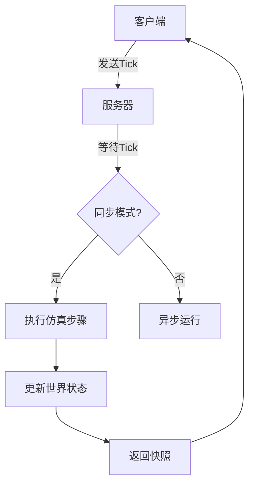
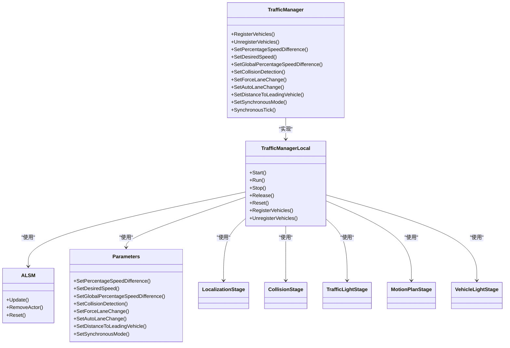
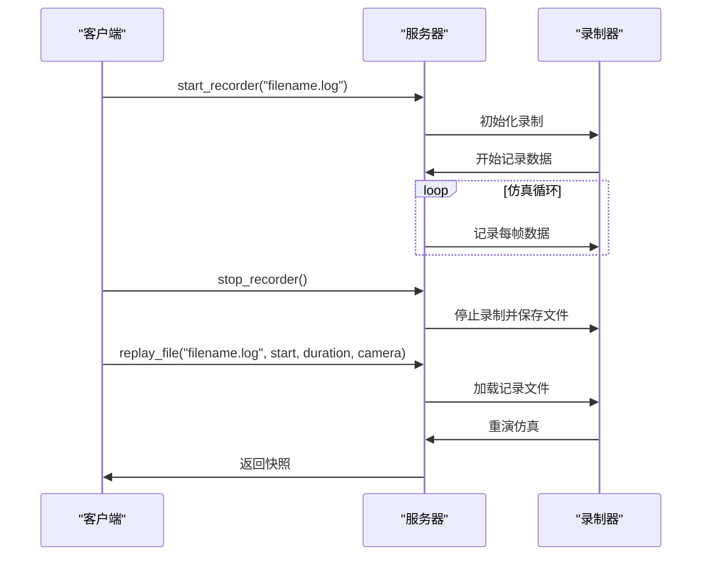
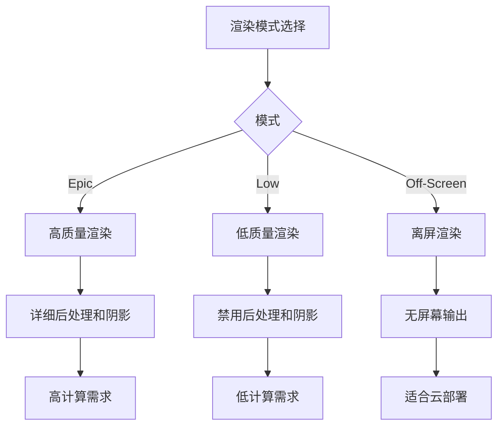

# 高级功能

> **引用文件**
> **本文档中引用的文件**

- [adv_synchrony_timestep.md](https://github.com/carla-simulator/carla/blob/ue5-dev/Docs/adv_synchrony_timestep.md)
- [adv_traffic_manager.md](https://github.com/carla-simulator/carla/blob/ue5-dev/Docs/adv_traffic_manager.md)
- [adv_recorder.md](https://github.com/carla-simulator/carla/blob/ue5-dev/Docs/adv_recorder.md)
- [adv_rendering_options.md](https://github.com/carla-simulator/carla/blob/ue5-dev/Docs/adv_rendering_options.md)
- [TrafficManager.h](https://github.com/carla-simulator/carla/blob/ue5-dev/LibCarla/source/carla/trafficmanager/TrafficManager.h)
- [TrafficManager.cpp](https://github.com/carla-simulator/carla/blob/ue5-dev/LibCarla/source/carla/trafficmanager/TrafficManager.cpp)
- [TrafficManagerLocal.h](https://github.com/carla-simulator/carla/blob/ue5-dev/LibCarla/source/carla/trafficmanager/TrafficManagerLocal.h)
- [TrafficManagerLocal.cpp](https://github.com/carla-simulator/carla/blob/ue5-dev/LibCarla/source/carla/trafficmanager/TrafficManagerLocal.cpp)
- [ALSM.h](https://github.com/carla-simulator/carla/blob/ue5-dev/LibCarla/source/carla/trafficmanager/ALSM.h)
- [ALSM.cpp](https://github.com/carla-simulator/carla/blob/ue5-dev/LibCarla/source/carla/trafficmanager/ALSM.cpp)
- [Parameters.h](https://github.com/carla-simulator/carla/blob/ue5-dev/LibCarla/source/carla/trafficmanager/Parameters.h)
- [Parameters.cpp](https://github.com/carla-simulator/carla/blob/ue5-dev/LibCarla/source/carla/trafficmanager/Parameters.cpp)
- [CarlaRecorder.h](https://github.com/carla-simulator/carla/blob/ue5-dev/Unreal/CarlaUnreal/Plugins/Carla/Source/Carla/Recorder/CarlaRecorder.h)
- [CarlaRecorder.cpp](https://github.com/carla-simulator/carla/blob/ue5-dev/Unreal/CarlaUnreal/Plugins/Carla/Source/Carla/Recorder/CarlaRecorder.cpp)

## 目录

1. [同步时间步进](#同步时间步进)
2. [交通管理器](#交通管理器)
3. [录制与回放系统](#录制与回放系统)
4. [渲染选项](#渲染选项)
5. [常见问题与解决方案](#常见问题与解决方案)
6. [性能优化技巧](#性能优化技巧)

## 同步时间步进

同步时间步进是 CARLA 仿真中确保确定性和精确时间控制的核心机制。它通过客户端-服务器架构的协同工作来实现精确的仿真控制。在同步模式下，服务器会等待客户端的"tick"信号（准备就绪消息）后才更新到下一个仿真步骤，这确保了客户端能够完全控制仿真流程。

同步模式与固定时间步长的结合是实现精确仿真的最佳配置。固定时间步长确保了每个仿真步骤之间的时间间隔是恒定的，这对于数据采集和物理模拟的可重复性至关重要。当设置为 0.05 秒的固定时间步长时，仿真器每秒将执行 20 个步骤来重现模拟世界的一秒。这种配置使得传感器数据和物理数据能够对应到仿真中易于理解的时刻。

**Diagram sources**

- [adv_synchrony_timestep.md](https://github.com/carla-simulator/carla/blob/ue5-dev/Docs/adv_synchrony_timestep.md)

**Section sources**

- [adv_synchrony_timestep.md](https://github.com/carla-simulator/carla/blob/ue5-dev/Docs/adv_synchrony_timestep.md)

## 交通管理器

交通管理器（Traffic Manager, TM）是 CARLA 中控制自动驾驶车辆的核心模块，其目标是为仿真填充逼真的城市交通状况。它采用多线程架构，将执行流程划分为多个独立的阶段，每个阶段都有独立的操作和目标，这有助于开发特定阶段的功能和数据结构，同时提高计算效率。

交通管理器的架构基于一个控制循环，包含五个主要阶段：定位、碰撞、交通灯、运动规划和车辆灯光。这些阶段通过同步消息进行通信，信息单向流动。控制循环确保所有计算同步进行，在进入下一阶段前，所有车辆的当前阶段计算必须完成。

**Diagram sources**

- [TrafficManager.h](https://github.com/carla-simulator/carla/blob/ue5-dev/LibCarla/source/carla/trafficmanager/TrafficManager.h)
- [TrafficManagerLocal.h](https://github.com/carla-simulator/carla/blob/ue5-dev/LibCarla/source/carla/trafficmanager/TrafficManagerLocal.h)
- [ALSM.h](https://github.com/carla-simulator/carla/blob/ue5-dev/LibCarla/source/carla/trafficmanager/ALSM.h)
- [Parameters.h](https://github.com/carla-simulator/carla/blob/ue5-dev/LibCarla/source/carla/trafficmanager/Parameters.h)

**Section sources**

- [adv_traffic_manager.md](https://github.com/carla-simulator/carla/blob/ue5-dev/Docs/adv_traffic_manager.md)
- [TrafficManager.h](https://github.com/carla-simulator/carla/blob/ue5-dev/LibCarla/source/carla/trafficmanager/TrafficManager.h)
- [TrafficManager.cpp](https://github.com/carla-simulator/carla/blob/ue5-dev/LibCarla/source/carla/trafficmanager/TrafficManager.cpp)
- [TrafficManagerLocal.h](https://github.com/carla-simulator/carla/blob/ue5-dev/LibCarla/source/carla/trafficmanager/TrafficManagerLocal.h)
- [TrafficManagerLocal.cpp](https://github.com/carla-simulator/carla/blob/ue5-dev/LibCarla/source/carla/trafficmanager/TrafficManagerLocal.cpp)
- [ALSM.h](https://github.com/carla-simulator/carla/blob/ue5-dev/LibCarla/source/carla/trafficmanager/ALSM.h)
- [ALSM.cpp](https://github.com/carla-simulator/carla/blob/ue5-dev/LibCarla/source/carla/trafficmanager/ALSM.cpp)
- [Parameters.h](https://github.com/carla-simulator/carla/blob/ue5-dev/LibCarla/source/carla/trafficmanager/Parameters.h)
- [Parameters.cpp](https://github.com/carla-simulator/carla/blob/ue5-dev/LibCarla/source/carla/trafficmanager/Parameters.cpp)

## 录制与回放系统

CARLA 的录制与回放系统允许记录和重演之前的仿真过程。所有事件都被记录在服务器端的二进制文件中，但通过 carla.Client 进行管理。录制文件包含了关于演员（actors）、交通灯、车辆和行人的详细信息，包括创建和销毁、位置和方向、线速度和角速度等。

录制系统支持高级查询功能，可以追踪和研究记录中的事件。例如，可以查询特定类型的碰撞或检测被卡住的车辆。回放功能允许从记录文件的任意点开始重演仿真，并可以设置播放速度因子来加快或减慢播放速度。

**Diagram sources**

- [adv_recorder.md](https://github.com/carla-simulator/carla/blob/ue5-dev/Docs/adv_recorder.md)
- [CarlaRecorder.h](https://github.com/carla-simulator/carla/blob/ue5-dev/Unreal/CarlaUnreal/Plugins/Carla/Source/Carla/Recorder/CarlaRecorder.h)
- [CarlaRecorder.cpp](https://github.com/carla-simulator/carla/blob/ue5-dev/Unreal/CarlaUnreal/Plugins/Carla/Source/Carla/Recorder/CarlaRecorder.cpp)

**Section sources**

- [adv_recorder.md](https://github.com/carla-simulator/carla/blob/ue5-dev/Docs/adv_recorder.md)
- [CarlaRecorder.h](https://github.com/carla-simulator/carla/blob/ue5-dev/Unreal/CarlaUnreal/Plugins/Carla/Source/Carla/Recorder/CarlaRecorder.h)
- [CarlaRecorder.cpp](https://github.com/carla-simulator/carla/blob/ue5-dev/Unreal/CarlaUnreal/Plugins/Carla/Source/Carla/Recorder/CarlaRecorder.cpp)

## 渲染选项

CARLA 提供了多种渲染选项来满足不同的仿真需求。图形质量有两个级别：Epic（默认，最详细）和 Low（禁用所有后处理和阴影，绘制距离设为 50 米）。在 Low 模式下，仿真运行速度显著更快，这在技术限制、精度不重要或训练代理处理简化数据时非常有用。

离屏渲染模式允许 CARLA 模拟器在没有观察者的情况下运行，这对于在云虚拟机实例等无头配置中进行渲染是合适的。在此模式下，仿真中任何摄像头和其他传感器的数据仍会被渲染到磁盘或传输到其他应用程序，但不会将渲染数据传递到屏幕。

**Diagram sources**

- [adv_rendering_options.md](https://github.com/carla-simulator/carla/blob/ue5-dev/Docs/adv_rendering_options.md)

**Section sources**

- [adv_rendering_options.md](https://github.com/carla-simulator/carla/blob/ue5-dev/Docs/adv_rendering_options.md)

## 常见问题与解决方案

在使用 CARLA 高级功能时，开发者可能会遇到一些常见问题。对于同步模式，最常见的问题是如果在异步模式下使用交通管理器，可能会导致意外和不理想的结果。解决方案是确保在启用同步模式后，交通管理器也设置为同步模式。

另一个常见问题是物理确定性。要实现物理和碰撞的确定性，必须满足几个条件：启用同步模式和固定时间步长，确保在加载或重新加载世界之前启用同步模式，每次重复仿真时重新加载世界，以及批量发送命令而不是逐个发送。

对于录制系统，当使用可变时间步长录制时，重放可能会出现精度问题。这是因为浮点算术误差和服务器运行速度的差异。解决方案是使用固定时间步长进行录制，以确保重放的精确性。

## 性能优化技巧

为了优化 CARLA 仿真的性能，开发者可以采用多种策略。首先，使用低质量渲染模式可以显著提高仿真速度，特别是在不需要高质量图形的场景中。其次，启用混合物理模式可以移除仿真中的车辆物理瓶颈，通过在英雄车辆周围特定半径内启用物理计算，而在该半径外禁用物理计算来实现。

在同步模式下，确保固定时间步长满足物理子步进的条件：`fixed_delta_seconds <= max_substep_delta_time * max_substeps`。这可以确保物理模拟的准确性。此外，批量发送命令而不是逐个发送可以提高效率并确保命令的执行。

对于大规模仿真，使用多交通管理器配置可以更好地控制不同组的车辆行为。通过在不同端口上创建多个交通管理器实例，可以实现更精细的交通控制和更复杂的仿真场景。
